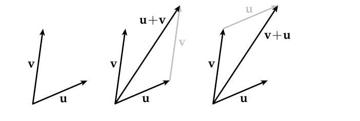
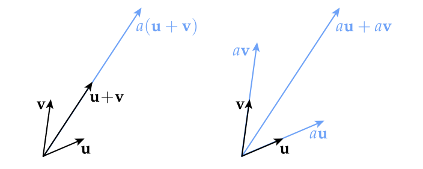
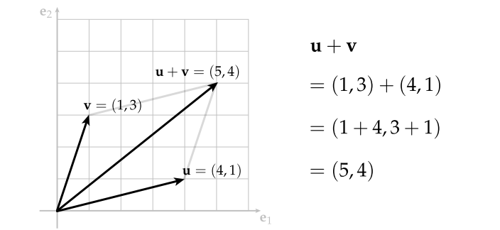
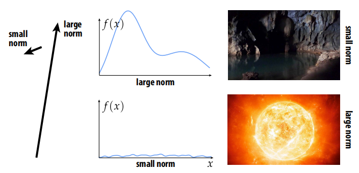
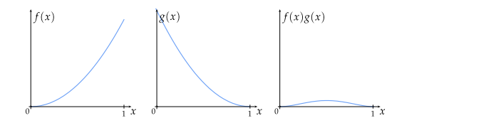
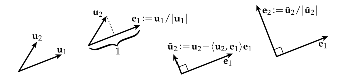
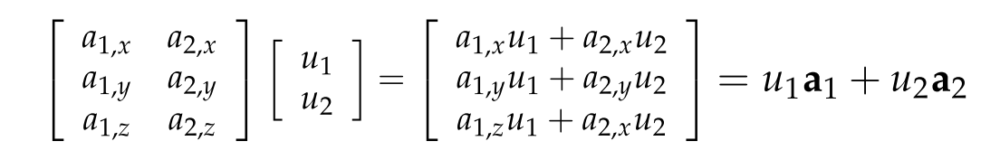

# Computer Graphic01-线性代数

线性代数是关于向量空间以及它们之线性变换的学科

## 向量空间

### 向量是什么

直觉上来说向量其实就是一个小箭头

在计算机图形学中，需要处理多种类型数据，这些数据可能看起来不像一个小箭头，比如多项式，图像，辐射亮度(radiance)等，但它们的行为表现却是和向量一致的，所以这个小箭头仍然是一个有用的思维模式。

### 向量如何表示

#### 极坐标系
一个向量需要编码哪些信息可以定义它的唯一性？

从根本上说向量就是方向和大小：

例如二维空间的一个向量可以用长度和相对于某个固定方向的角度来表达，实际上就是极坐标系。

#### 笛卡尔坐标系 
笛卡尔坐标系由法国数学家笛卡尔发明，在笛卡尔坐标系下通过测量向量在其每个轴的分量来表示：

### 向量基本操作
#### 加法
可以对向量首尾相连实现两个向量相加：

向量加法满足交换律，也就是谁在前谁在后无关紧要结果都一样

#### 缩放
通常可以将任意向量$\vec{u}$乘以一个数字或“标量”$a$来得到一个新的向量$a\vec{u}$

乘法的行为正如我们期望的，在几何意义上是基于缩放“小箭头”的行为。向量缩放满足结合律：

$a(b\vec{u}) = (ab)\vec{u}$

#### 加法和缩放结合
先对两个向量相加后缩放与先分别对两个向量缩放后相加结果是相同的

$a(\vec{u} + \vec{v}) = a\vec{u} + a\vec{v}$

### 向量空间正式定义

- $\vec{u} + \vec{v} = \vec{v} + \vec{u}$
- $\vec{u} + \vec{v} + \vec{w} = \vec{u} + (\vec{v} + \vec{w})$
- 存在一个零向量$\vec{0}$使得$\vec{v} + (-\vec{v}) = \vec{0}$
- 对于任意向量$\vec{v}$,必然存在一个向量$-\vec{v}$使得$\vec{v} + (-\vec{v}) = \vec{0}$
- $1\vec{v} = \vec{v}$
- $a(b\vec{v}) = (ab)\vec{v}$
- $a(\vec{u} + \vec{v}) = a\vec{u} + a\vec{v}$
- $(a+b)\vec{v} = a\vec{v} + b\vec{v}$

**这些规则都不是凭空捏造的，每一条背后都有相应的几何意义，尝试通过几何意义去理解这些规则！**

**任何满足这些性质的对象集合都是一个向量空间(即使它们看起来不像小箭头!)**

### 欧几里得向量空间
通常用$\mathbb{R}^n$来表示欧几里得n维向量空间，意思是包含n个实数

### 函数也是向量
在计算机图形学中向量空间的另一个非常重要的例子是函数空间

为什么?因为我们在图形学中使用的很多对象都是函数(图像，光源的辐射亮度，表面，模态振动，…)

以上所有这些同样都是向量，满足小箭头所有性质对这些向量同样也适用

#### 函数求和
假设有两个函数$f(x)，g(x)$，在值域内的每个点这些函数都会返回一个实数，实数集是向量空间，因此可以通过实数相加来定义函数的相加，将函数在每个点的返回结果理解为向量的每个分量。

#### 函数缩放
再次利用事实：实数集属于向量空间，因此可以将函数转换到向量空间

### 直角坐标系下的向量

#### 求和
分别对向量的各个分量相加即可

#### 缩放
分别对向量的各分量乘以缩放系数

#### 计算中点
把向量运算结合起来，就可以构建计算机图形学所需的各种运算，比如说计算中点，
只需要将两点相加然后除以2即可，本质是两个向量组成的平行四边形对角线的一半

### 范数
对于一个给定的向量v，我们通过给它赋予一个数字$|v|$，该数字表示了向量有多“大”。

同样向量的范数可以很自然的扩展到函数和图像.

#### 正式定义
范数是用于计算向量大小或长度的函数，以向量作为参数，返回一个标量，并且对于所有向量$\vec{u}, \vec{v}$和所有标量$a$都满足以下性质:

- 非负性：$|\vec{v}| >= 0$
- 齐次性：$|a\vec{v}| = a|\vec{v}|$
- 三角不等式： $|\vec{u}| + |\vec{v}| >= |\vec{u} + \vec{v}|$

#### 直角坐标系下的向量范数
标准范数就是所谓的n维向量的欧几里德范数：
$\vec{u} = |(u_1,...,u_n)| := \sum\limits_{i=1}^n{u_i^2}$

#### 函数的范数
和之前的向量范数相比比较陌生的概念，但基本的直觉是一样的:所谓的$L_2$范数测量了一个函数的大小.

考虑单位区间[0,1]上的实数函数并且其平方是可积分的，则L2范数定义为：

$||f|| := \sqrt{\int_{0}^{1}f(x)^2dx}$

其实和欧几里得范数区别不大：只是在这里采用积分替换了求和而已

### 内积
inner product有时候也叫做scalar product或者dot product，用符号$<\vec{u},\vec{v}>$表示，或者用$\vec{u}.\vec{v}$表示也行

#### 动机
除了大小，向量还有方向，就像范数测量长度一样，点积测量两个向量方向的一致性

向量点积满足交换律，因为点积本质上表达是两个向量方向的相似性，因此谁前谁后无关紧要.

$<\vec{u},\vec{v}> = <\vec{v},\vec{u}>$

#### 点积意义-投影和缩放
对于单位向量$|\vec{u}| = |\vec{v}| = 1$，点积可以表示为一个向量在另一个向量方向上的垂直投影:

如果对任意一个向量执行缩放操作，则点积也会按照相同的系数缩放：

#### 正式定义

点积以任意两个向量$\vec{u},\vec{v}$作为输入参数，返回一个标量$<\vec{u},\vec{v}>$，满足以下性质：

- $<\vec{u},\vec{v}> = <\vec{v},\vec{u}>$
- $<\vec{u},\vec{u}>$ >= 0
- $<\vec{u},\vec{u}>$ = 0 则 $\vec{u} = \vec{0}$
- $<\ a\vec{u},\vec{v}> = a<\vec{u},\vec{v}>$
- $<\vec{u} + \vec{v},\vec{w}>$ = $<\vec{u},\vec{w}>$ + $<\vec{v},\vec{w}>$
  
#### 笛卡尔坐标系下的点积

标准点积就是所谓的欧几里得点积，它作用于一对n维向量:

$<\vec{u},\vec{v}> = <(u_1,...,u_n),(v_1,...,v_n)> := \sum\limits_{i=1}^nu_iv_i$

#### 函数的L2点积
就像函数有范数一样，我们也可以定义一个点积来衡量两个函数“方向的一致性”

例如对于在单位区间内的任意平方可积函数$f(x)和g(x)$,两个函数的点积公式如下：

$<\ f,\ g> := \int_{0}^{1}f(x)g(x)dx$

举例说明：

假设

$f(x) := x^2$
$g(x) := (1-x)^2$

那么：

$<\ f,\ g> = \int_{0}^{1}x^2(1-x)^2dx = ... = 1/30$

#### 图像和其他信号
有多种方式测量一个信号有“多大”(norm)或者两个信号是否“一致”(dot product)
具体如何选择要根据需求来看，比如说现在有两张图片，我们要找到哪张图片更有趣一些，按照正常逻辑左侧的小狗图片norm小，右侧的蓝天更亮些显然norm大，但是基于原始图片计算的norm对我们是没什么用的，在这里我们更想要的是哪张图片包含的细节更丰富，因此需要对图片的导数求范数(边缘检测):

## 线性变换

### 对图形学的意义

- 对计算机来说线性方程组很容易求解
- 基础变换比如旋转、平移、缩放都可以通过线性变换来表达
- 所有的变换都可以在很短距离或很短时间内通过线性变换来近似表达，这种近似应用于很多领域：几何，动画，渲染，图像处理等

### 几何定义
所谓线性变换就是经过变换后的几何体要满足以下两点性质：
- 直线仍然保持直线
- 原点保持不变

### 代数定义
线性变换$f$以及对于任意向量$\vec{u}和\vec{v}$以及标量$a$需要满足：

- $f(\vec{u} + \vec{v}) = f(\vec{u}) + f(\vec{v})$
- $f(a\vec{u}) = af(\vec{u})$

换句话说无论先对两个向量相加应用线性变换还是先分别应用线性变换然后相加结果都是一样的

### 坐标下的线性变换表达
对于任何$\mathbb{R}^m$和$\mathbb{R}^n$之间的线性变换，我们可以给出显式定义：

$f(u_1,...,u_m) = \sum\limits_{i = 1}^mu_i\vec{a_i}$

### 线性变换vs仿射变换
思考以下变换是否是线性变换？

看起来貌似是线性变换，但是它违反了线性变换的两条基本原则：

1. $f(0) != 0$(违反了原点保持不变性)
2. $f(x_1 + x_2 ) = a(x_1 + x_2) + b = ax_1 + ax_2 + b\\
   f(x_1) + f(x_2) = (ax_1 + b) + (bx_2 + b) = ax_1 + ax_2 + 2b$

实际上这种变换叫做仿射变换($Affine\  Function$)

### 张成的空间(Span)

对于给定向量$\vec{u}和\vec{v}$和任意标量$a和b$，张成的空间就是可以由这两个向量的线性组合可以表示的所有向量的集合体：

$a\vec{u} + b\vec{v}$

更泛化的表示：

$span(\vec{u_1},...\vec{u_k}) = \{ \vec{x} \in V | \vec{x} = \sum\limits_{i=1}^ka_i\vec{u_i}, a_1,...,a_k \in \mathbb{R}\}$

### 张成空间和线性变换

**任何线性变换的图像就是某些向量集合张成的空间**

### 基(Basis)
张成空间和基是紧密联系在一起的

特别地，如果我们有n个向量$\vec{e_1},...\vec{e_n}$满足：

$span(\vec{e_1},...\vec{e_n}) = \mathbb{R}^n$

那么我们可以说这些向量是$\mathbb{R}^n$的基

### 正交基(Orthonormal Basis)
大多数情况下，有(i)单位长度和(ii)相互垂直的基向量是很方便的.这些基叫做正交基

换句话说如果$\vec{e_1},...\vec{e_n}$是正交基则必须满足：

$<\vec{e_i},\vec{e_j}> = \begin{cases} 1, i = j \\ 0, otherwise. \end{cases}$ 

为什么要用正交基，有以下几个原因：

1. $u_1^2 + ... + u_n^2$是有几何意义的，它代表了向量$\vec{u}$长度的平方
2. 使操作方便
   
**常见bug：将一个向量映射到一个非正交基的向量空间，然后用标准的范数和点积对其操作**

### 格拉姆--施密特(Gram-Schmidt)正交化

如果基向量不是正交基，我们如何将其转换为正交基呢？可以通过格拉姆--施密特(Gram-Schmidt)正交化方法：

假设有两个非正交的基向量$\vec{u_1}和\vec{u_2}$

- 首先对任意一个向量比如说$\vec{u_1}做归一化,也就是向量除以自身的长度得到\vec{e_1}$
- 然后用另外一个向量$\vec{u_2}$减去$\vec{u_2}在\vec{e_1}$上的投影向量得到与$\vec{e_1}$垂直的向量$\hat{u_2}$
- 对向量$\hat{u_2}$做归一化操作得到$\vec{e_2}$
- 如果有$n$个基向量，重复以上步骤

**注：对于很大的数组成的向量或者接近平行的向量，该方法可能不是最好的**

### 傅里叶变换(Fourier Transform)
对于$\mathbb{R}^n$空间的基我们已经很熟悉了，但是对于更泛化意义上的向量比如说：函数，信号，音频等，这些向量空间是否存在正交基呢？函数的范数前文已经讲过了，所以对函数归一化其实不是问题，但是两个函数彼此正交意味着什么？

这些正是傅里叶变换的背后思想

考虑周期函数($2\pi$)，函数图像如下:

可以将该函数表示为一系列基础“基函数”的线性组合：$\cos(nx),\sin(nx),m,n \in \mathbb{N}$

基于此我们很自然的想到可以将一个原始信号分界为一系列不同频率的基础信号：

**本质上傅里叶变换就是从一个基到另一个基的线性映射**

### 信号的频率分解
更一般地说，这种将信号投射到不同“频率”的过程被称为傅里叶分解.被广泛应用于各种信号处理例如图像处理，渲染，集合，物理模拟等等

## 线性方程组

线性方程组就像它名字所暗示的:一堆方程，左边是线性函数，右边是常数，例如：

$x + 2y = 3$

$4x + 5y = 6$

$xy$未知数被称为自由度($DOFs$)，方程被称为约束条件，解线性方程组的过程实际上就是求解同时满足约束条件的自由度.

### 线性方程组可视化
当然，线性系统可以用来表示许多不同的实际任务(模拟、处理等),但是对于任意线性系统，都有一些很好的思维模型进行可视化，帮助我们理解：

### 解的存在性，唯一性

当然，不是所有的线性系统都存在解!即使存在解也不一定唯一.

## 矩阵和线性变换
如何将线性变换通过矩阵的形式来表达.假设有一个线性变换：

$f(\vec{u}) = u_1\vec{a}_1 + u_2\vec{a}_2$

首先先从几何视角理解该线变换：
平面上有一个向量，其坐标为$u_1和u_2$,先沿着$\vec{a}_1$方向行走$u_1$距离，然后沿着$\vec{a}_2$方向行走$u_2$距离，我们想做的是定义一个矩阵，如果将该矩阵乘以由$u_1和u_2$定义的向量，则可以完成这样的几何操作。

回忆下矩阵向量乘法，考虑矩阵向量乘法的最简单方法就是矩阵有一组列当我用一个矩阵乘以一个向量时，用所乘的向量的各个分量取这些列的线性组合，从这个角度来看，每一个"$\vec{a}$"向量最终成为了矩阵的一个列：

现在矩阵向量乘法就可以推导出原始的线性变换了：

