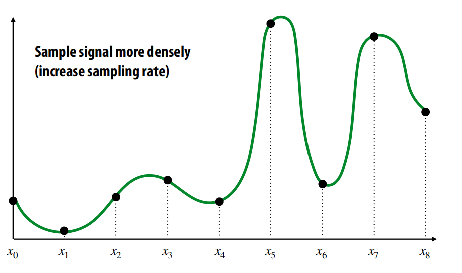

本系列文章将一步步深入介绍计算机在渲染输出呈现一张图片经历的各种步骤细节以及涉及到的相关其他领域的知识串联,例如:几何,渲染方程, 采样, 蒙特卡洛积分,重要性采样, 辐射度量学, 光照计算, 基于物理的渲染等等.本系列文章不涉及API(openGL directX vulkan 等),皆在带你理解这些API背后的图形学原理,理解图形API函数调用的背后到底在做些什么,有了这些知识做铺垫,可以快速上手API的学习,并且发现bug后也可以快速定位问题所在,而不会被GPU的黑盒搞得一头雾水,因为不同的API虽然架构不同,实现不一,但背后的底层逻辑都是一致的。

## 光栅化(Rasterization) vs 光追(Ray tracing)
在本节中，我们将看看渲染到底意味着什么，我们需要解决什么样的问题来将一个三维场景渲染成一张二维图片，以及快速回顾为解决这些问题而实现的种种技术;**本质上渲染需要解决两个问题,1. 可见性, 2.着色.** 我们将集中光线追踪和光栅化两种方法，这两种常用的算法用于解决可见性问题(找到哪些物体在相机视角下的视口(viewport)中是可见的).

### 光栅化

**光栅化本质上是一种基于图元解决可见性问题的一种算法**,所谓基于图元,是指对于每一个图元我们会计算屏幕上哪些像素被该图元覆盖,**光栅化的外层循环为图元集合,内层循环为像素.**
- 对于每一个图元,屏幕中的哪些像素会被点亮?
- 相较于光线追踪,光栅化计算效率很高
- 生成照片级图片比较困难(很难处理全局光照问题,但是可以通过其他方式近似模拟, shadow Maps , SSAO IBL SSR等)
### 光线追踪

和光栅化从图元出发不同,光线追踪是基于屏幕像素的,从摄像机位置出发，往每个像素方向发射光线($Ray$),计算光线与场景(boundingBox/mesh/primitives)求交,找到最近相交的图元,递归计算光照信息的过程.因此我们可以说**光线追踪是基于屏幕空间像素解决可见性问题的一种算法**
- 对于每一个像素,能看到哪些图元?
- 利用光线追踪算法生成照片级图片很容易,因为它可以通过"追踪光线"递归计算光照轻易解决全局光照问题
- 速度要比光栅化要慢

## 渲染管线(pipeLine)
我们把输入的数据通过一系列步骤最终生成图片的过程称为渲染管线(pipeLine):
1. $inputs$: 由顶点构成的3D图元(primitives本质上几乎都是三角形图元, 顶点数据通常包含顶点位置,法线,切线,纹理坐标等等)
2. $stages$: 接受渲染管线前一阶段的输出作为输入,加工处理后生成新的数据,做为管线下一阶段的输入
3. $outputs$: 位图

在工业界,光栅化渲染管线通常都是由硬件GPU来执行的,GPU相比CPU有更多的处理单元,并发能力更强,可以同时处理更多像素;另外GPU对光栅化中的很多计算(例如重心坐标插值)做了很多优化处理,计算速度非常快,这也是为什么GPU可以很轻松的每秒生成60张图片的一个重要原因.

 
### 为什么图元几乎都是三角形?
光栅化渲染管线会把所有图元转换成三角形,即使是点和线也不例外.

为什么这样做呢?有以下几点原因:
1. 三角形能近似表达所有形状,只要三角形数量够多,近似描述任何形状都不成问题.
 

1. 三角形构成的图元永远都是一个平面, 利于法线计算(法线即为三角形平面的法线)和着色
2. 光栅化的过程中,容易对三角形的三个顶点进行插值(重心坐标插值/barycentric coordinates)得到像素着色参数

这样做还有一个很重要的原因就是,一旦所有的图元都转换为三角形,GPU可以只处理三角形,只需要做好这一件事,可以把更多的硬件资源用于优化三角形的绘制($triangle pipeline$)

### 光栅化渲染管线

### Coverage & Occlusion
当需要在屏幕上绘制一些三角形时,需要首先考虑的两个问题是,屏幕空间中的哪些像素会被三角形所覆盖?当两个三角形叠加时,屏幕空间的每个像素应该采样哪个三角形的颜色?

### 可见性问题
其实这两个问题最终解决的都是可见性问题,之前的章节提到渲染本质上需要解决两个问题,一个是可见性,另一个是着色.

举例1:回顾小孔相机原理, 从小孔朝每个像素的方向看去,我们能看到什么?

举例2: 从光线的角度理解可见性问题
- $Coverage$: 从相机位置出发,向每个像素方向发射一条光线,场景中的哪些三角形会被光线击中,这其实间接的给了我们三角形会覆盖哪些像素的信息.
- $Occlusion$: 沿着光线行进的方向,哪个三角形是第一个被击中的,解决了三角形相互遮挡的问题

### Q1:Coverage(哪些像素会被三角形覆盖?)
光栅化阶段的输入是投影到二维屏幕空间的三角形顶点($P_{0},P_{1},P_{2}$),输出为被三角形所覆盖的像素的集合(二值, 1表示被覆盖,0表示未被覆盖,没有中间地带)

但是使用二值的方式来表示像素是否被三角形所覆盖会产生很多问题,如下图:

上图的像素被四个三角形中的哪一个所覆盖?使用二值的方式很难精确的回答这个问题,我们不妨改进下像素是否被覆盖的表述方式:**计算像素被三角形覆盖区域占比**,像素着色亮度依照百分比调整.

但是这也是一种理想主义.现实中,当我们考虑三角形叠加覆盖穿插,其实很难实时计算像素被三角形覆盖的占比,如下图所示:
 

所以与其精确计算三角形覆盖了像素多少,我们能否粗略的对其进行估算呢?
答案就是采样(sampling).比如一个像素内均匀划分25个采样点,计算这些采样点哪些被三角形所覆盖是很容易的,然后将被三角形覆盖的采样点数量除以总采样个数,就得到了像素被三角形所覆盖的占比(估算).

总结:
1. 现实的场景是非常复杂的,存在三角形相互遮挡,半透明等等问题...
2. 因此计算精确的覆盖占比是很理想化的
3. 取而代之,我们可以采用近似的方式,将计算覆盖率的问题转换为采样的问题
4. 采样不会计算精确的覆盖率,它会测试一系列的采样点,这样在拥有足够多的采样点后,可以达到非常好的近似效果.

## 采样理论
本小节,将简单介绍广泛意义上的采样理论,涉及音频,图片,视频等信号处理,会着重介绍采样与重构,香农定理等等,下边我们从最简单的一维信号采样开始.

## 采样(Sampling)
### 1D singal Sampling
一维信号可以理解为一个函数$f$,参数为$x$

对一维信号采样的过程可以理解为:在函数$f$定义域内取不同的$x$值,计算对应的函数返回值,**采样是对原始连续信号离散化的过程.**

$x_{0}$,$x_{1}$,$x_{2}$,$x_{3}$是函数$f$的一组采样点.

举一个实际生活中的例子来说明,日常生活中的音频文件(.mp3等),存储的其实就是一维原始信号的离散采样点.$f$是振幅,$x$是时间,音频文件是对时间的离散采样:

## 重建(Reconstruction)
当我们得到一系列的采样点后,最终我们输出的其实是连续信号,如何将这些采样点重建为原始的连续信号$f(x)$?如何填补采样点之间的间隙?  我们先看看最简单的两种方式.

1. 分段常数近似(piecewise constant approximation)：寻找与当前点最近的采样点,直接使用采样点的值

2. 线性插值：与当前点$x$最近的两个采样点之间做线性插值

但是以上两种方式效果并不好,和原始信号相比差太远,重建后的信号相比原始信号丢失了很多细节,如何提高重建质量?最简单的方式就是提高采样率,这样就会很大程度上减少丢失原始信号细节的风险:

### 二维信号的采样与重建
和一维信号一样,图片也是一种信号(二维的),也需要经过采样和重建的过程.如下图所示:左侧图片为原始信号,中间图片为采样/重建(piecewise const)后的信号,右侧图片为采样/重建(peicewise bi-linear)后的信号表示.

## 总结
**采样**-是一种测量信号的方法,输入原始连续信号,输出离散的采样点.
1. 将信号编码为一组离散采样点
2. 原则上，应该表示特定点的值(特征值)(尽管在现实中很难测量)

**重建**-和采样相反,重建是将一组离散采样点通过重建函数(各种滤波器)生成连续信号的过程.
1. 构造一个重建函数,通过插值或近似的方式生成函数值,将采样点转换为连续信号.
2. 不管一维信号, 二维信号 三维信号的采样值,都可以做信号重建.下图分别对一维 二维 三维信号做采样/重建.

那么重新回到主线,对于光栅化,我们是对什么方法做了采样?光栅化为什么可以做为一个采样问题来处理?

答案是覆盖率函数:

$coverage(x, y) = \begin{cases} 
  1, triangle\ contains\ point(x, y)\\
  0, otherwise 
\end{cases}$

对屏幕空间任意一个点做采样(不一定是像素中心点,可以是任意的点),用覆盖率函数判断当前三角形是否覆盖该采样点,如果覆盖则返回1,否则返回0.当然二维平面有无数个点构成(连续信号),而覆盖率函数通过屏幕空间的采样点来近似/逼近三角形对像素的覆盖情况,因此我们说**光栅化本质是一个采样问题.**

## 边界判定
假设有一个采样点,正好落在三角形的公共边上,那么覆盖率函数在做采样测试时,该采样点被哪个三角形覆盖了呢?

Opengl/directX定义了一些规则用于解决采样点正好落在三角形边上判定是否被包含的问题,规则如下:
当采样点落在三角形边上时,并且该边是三角形的上边或左边时,则判定该采样点被三角形所覆盖.

## 走样(Aliasing)
光栅化过程中,我们首先对屏幕空间做采样

假设每个像素会发射均匀强度的光,则通过采样重建后,在屏幕上我们会看到这样的图片

而实际的原始图片却是这样的

### 回顾采样和重建
采样是将自然界 现实中的连续信号离散化为一组采样点,这些采样点其实就是一组数据,拿音频信号举例,在音乐录制时,连续的声音信号被采样录制为音频文件(离散采样点),可以被存储在电脑中,在网络中传输,当需要播放该音频时,播放设备会将采样点重建为连续信号,即我们听到的音乐.

**采样和重建的最终目标是尽可能的还原/逼近原始信号.**

但是如上图所示,重建后的信号丢失了原始信号的很多细节表现.

那么我们应该通过什么样的角度来理解这种误差呢?
前边的文章中我们提到过一个重要的观点,信号是一系列拥有不同频率的信号的线性组合[(傅里叶变换)](https://juejin.cn/post/7247342069618049061):

**当我们对一个原始信号做采样时,特别是高频信号,有限的采样点无法表现高频信号的所有细节,这就是造成走样问题的本质.换句话说采样频率低于原始信号频率,丢失了原始信号的细节表现,产生走样.**

> aliasing: high frequencies in original signal masquerade as low frequencies after reconstruction(due to undersampling)

### 车轮效应
相机采样频率(对时间的采样)低于轮子旋转的频率(欠采样),造成轮子倒转的视觉效果:

我们将一维信号延伸到二维空间(image),图片也可以被分解为不同频率信号的线性组合(时域->频域)

## 香农定理(Nyquist-Shannon theorem)
考虑一个频带受限的信号，没有高于某个阈值$w_{0}$的频率
- 一维信号:低通滤波过滤后的信号
- 二维信号:模糊的图片
  
信号可以被完美重建:
1.**当采样周期 $T = 1/2w_{0}$**
2.**重建函数采用sinc滤波器(sincFilter)**
 

## 反走样
采样在图形学中面临的挑战:
1. 图形学中信号往往是非频带受限的
2. sinc滤波器是一种理想的滤波器,但是由于其昂贵耗时的操作,在实时渲染中往往无法使用

图片走样(Aliasing artifacts) = 不完美的采样+不完美的重建

那么我们该如何做,才能减少图片走样现象呢?首先需要认识到一个现实,无论我们怎么做,走样现象都会存在,或多或少的问题,因为采样意味着失真,任何采样都无法捕获高频信号的所有细节.
但是我们仍然可以尽力匹配采样频率和重建函数,逼近模拟原始信号.

### 超采样(superSampling)
之前对每个像素点只采样一次:

现在我们提高采样频率,假设每个像素做四次采样

接下来我们需要将超采样转换为最终的采样(匹配屏幕空间像素),用于重建:

## 实现coverage函数
### 如何判断一个点是否在三角形内部?
通过向量叉乘可以轻易计算一个点是否在三角形内,分别对每条边组成的向量和顶点与当前采样点构成的向量叉乘,如果结果一致(都为正 或 都为负),则采样点在三角形内部.

### 三角形包围盒
显然对屏幕空间的每一个像素做三角形inSide判断是非常耗时低效的,因此我们可以先计算三角形包围盒,包围盒外部的像素肯定在三角形外,仅需要对三角形内部的像素做循环判断即可.

当然对于某些极端情况采用三角形包围盒遍历像素仍然很低效:

针对这种极端情况,我们可以把屏幕空间划分为不同的区块:
1. 首先判断大的区块是否和三角形相交,如果未相交,则区块包含的所有像素均可以排除.
2. 如果区块完整的在三角形内部,则其内部的所有像素均在三角形内.
3. 此外,再遍历区块所包含的像素,分别与三角形求交.

