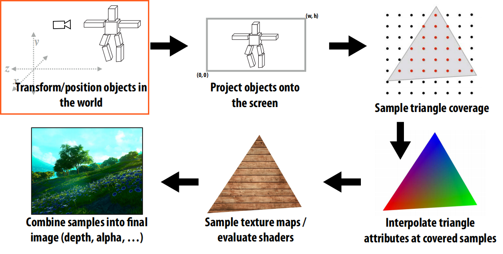
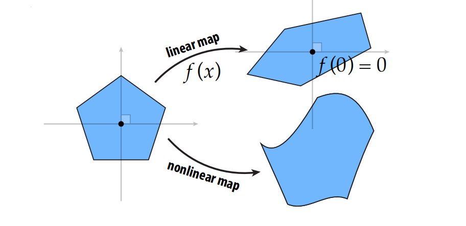
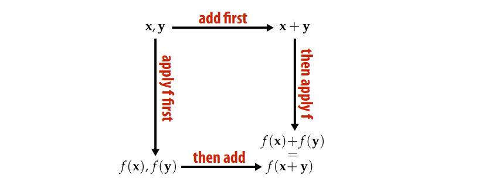
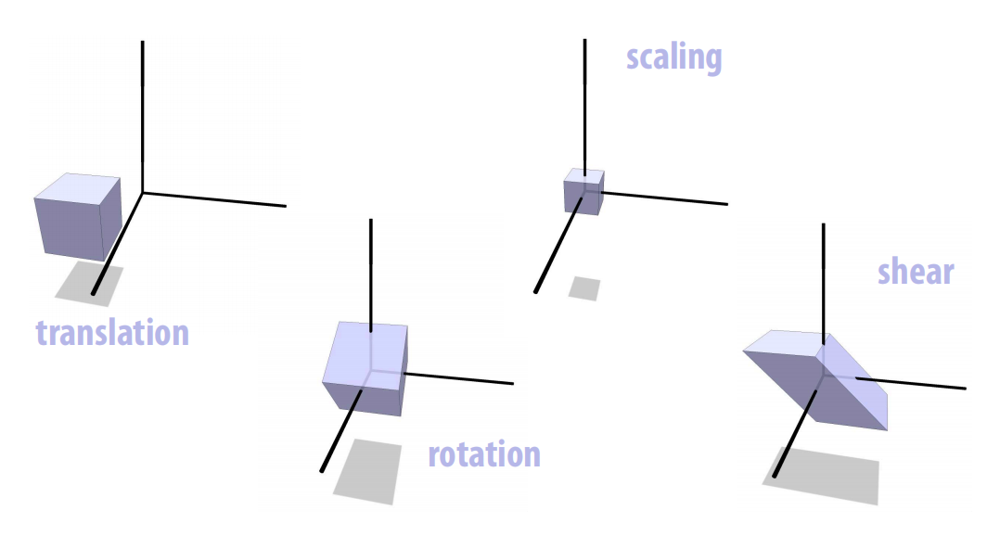
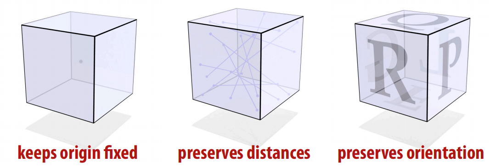
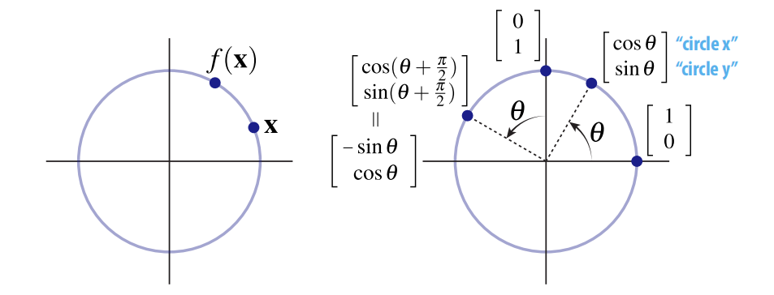
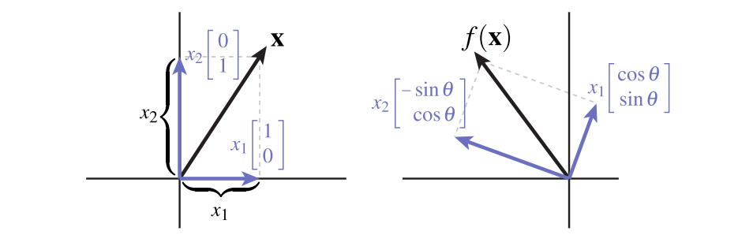
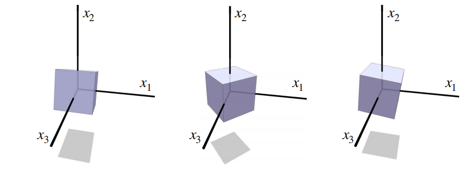
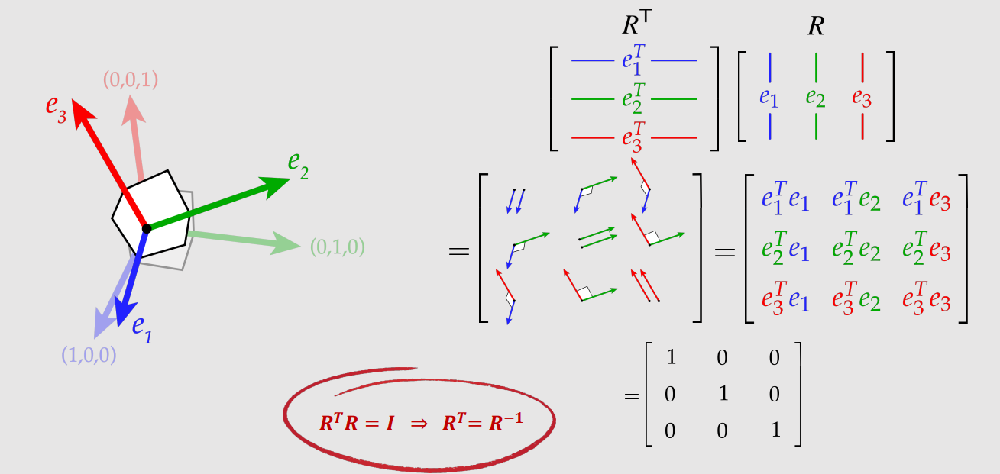
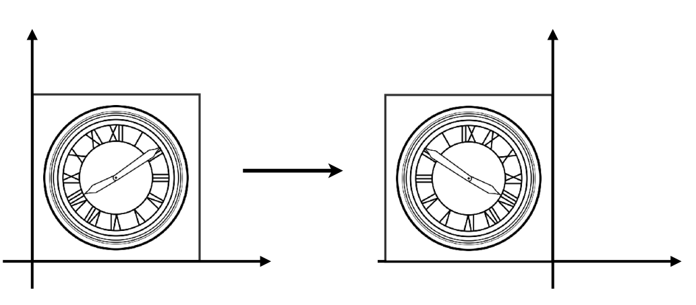

# Computer-Graphic03-空间变换-上(Spatial Transformation)
本章将开始学习空间变换,空间变换在图形学中有非常广泛的应用,对于深入了解图形学底层有重要意义,特别在光栅化渲染管线中, 我们知道最初输入的顶点坐标都是在对象局部空间的($Local Space$), 需要经过一系列的变换将对象从局部空间变换到世界空间(物体摆放在场景的哪里,物体的相对位置关系),接下来再变换到相机空间(即我们观看的视角,就像拿个相机拍照一样,我们是从哪个角度对场景进行观察的),即$mvp$矩阵中的"$m(model Matrix)$和$v(view Matrix)$".这一系列操作即光栅化渲染管线的第一个阶段,也是理解光栅化背后原理的基础.本章将介绍涉及图形学的基础变换。

任何将一个点变换到新位置的函数都可以被认为是空间变换
$f: R^n \to  R^n$
今天我们将重点学习几种基础变换:
- 旋转($Rotation$)
- 缩放($Scaling$)
- 平移($Translation$)(仿射变换)
- 错切($Shearing$)
- 镜像($Reflect$)

重点讲解：
1. 空间几何表示 
2. 矩阵表示 
3. 齐次坐标 
4. 如何用齐次坐标解决仿射变换和线性变换统一问题

## 线性变换回顾
前几章详细阐述了[线性变换](https://kenshin.tech/2024/03/23/%E8%AE%A1%E7%AE%97%E6%9C%BA%E5%9B%BE%E5%BD%A2%E5%AD%A6-%E4%B8%80-%E7%BA%BF%E6%80%A7%E4%BB%A3%E6%95%B0/#more)的定义,并从几何上和代数上分别对其做了解释:
1. 从几何的角度,线性变换会保持直线变换后仍然为直线,并保持原点不变

2. 从代数角度: 

$f(\vec{u} + \vec{v}) = f(\vec{u}) + f(\vec{v})$

$f(a\vec{u}) = af(\vec{u})$

## 为什么我们要关注线性变换?

1. 计算效率高
2. 容易求解
3. 多个线性变换的符合构造仍然是线性的
4. 多个线性变换的乘积可以用单个矩阵来表达
5. 对各种变换提供了统一的表达方式

## 变换的种类

### 各种变换的特征(经过变换后哪些保持不变)

| 变换 | 不变性 | 代数描述 |
| --- | --- | --- |
| 线性 | 直线保持直线 原点不变性 | $f(ax + y) = af(x) + f(y)$, $f(0) = 0$ |
| 平移 | 两点之间相对位置不变 |  $f(x-y) = x- y$ |
| 缩放 | 直线经过原点 任意一点的方向不变 | $f(x)/\|f(x)\| = x/\|x\|$ |
| 旋转 | 原点保持不变,两点之间距离不变,面的朝向不变 | $\|f(x) - f(y)\| = \|x-y\|,def(f) > 0$ |

### 旋转($Rotation$)

旋转有三个特征,保持原点不变,保持两点之间距离不变,保持面的朝向不变,前两个特征意味着**旋转是一个线性变换**

#### 二维旋转
我们知道旋转保持距离和原点不变,因此,二维旋转(旋转角度$\theta$)会将点$x$映射到同一半径的圆上的一点$f_{\theta}(x)$

那么当点$x$位于$(1, 0)处时$,逆时针旋转$\theta$,点会被映射到哪里呢?

根据三角函数可知,该点的坐标被旋转后为$(\cos(\theta), sin(\theta))$.

同理当点位于$(0, 1)$时,被旋转$\theta$角后为$(-\sin(\theta), \cos(\theta))$

那么对于任意一个点$(x,y)$,该怎么办呢?
我们可以将任意向量分解为两个基向量的线性组合:

$x = \begin{bmatrix}
 x1\\
x2
\end{bmatrix} = x_{1}\begin{bmatrix}
 1\\
0
\end{bmatrix} + x_{2}\begin{bmatrix}
 0\\
1
\end{bmatrix}$

通过上边的推导(特殊的两个点/basis),我们知道二维空间下基向量是如何旋转的,**因此只需要简单的应用基向量的线性组合.**

$f(x) = x_{1}\begin{bmatrix}
 \cos(\theta)\\
\sin(\theta)
\end{bmatrix} + x_{2}\begin{bmatrix}
 -\sin(\theta)\\
\cos(\theta)
\end{bmatrix}$

**二维旋转的矩阵表示:**

$f_{\theta}(x) = \begin{bmatrix}
 \cos(\theta)&-\sin(\theta)\\
\sin(\theta)&\cos(\theta)
\end{bmatrix}$

#### 三维旋转
在三维空间,如何围绕基向量$Z$旋转?只需要保持该基向量不变,其他应用二维变换即可:

$\begin{bmatrix}
  \cos(\theta)&-\sin(\theta) & 0 \\
  \sin(\theta)&\cos(\theta) & 0 \\
   0 & 0  & 1
\end{bmatrix}$

围绕$X$旋转:

$\begin{bmatrix}
  1 & 0 & 0\\
  0 & \cos(\theta)&-\sin(\theta)\\
  0 & \sin(\theta)&\cos(\theta) 
\end{bmatrix}$

围绕$Y$旋转:

$\begin{bmatrix}
  \cos(\theta) & 0 & \sin(\theta)\\
  0 & 1& 0\\
  -\sin(\theta) & 0&\cos(\theta) 
\end{bmatrix}$

#### 旋转矩阵: 矩阵的转置 = 矩阵的逆
旋转会将标准正交基变换为另外一个正交基$e_{1},e_{2},e_{3}$,旋转矩阵可以用正交基$e_{1},e_{2},e_{3}$来表示,其中每个基向量做为旋转矩阵的一列,而矩阵的转置是将矩阵的每一列放到对应的行，有趣的地方来了，将两个矩阵相乘，用前一个矩阵的当一行点乘后一个矩阵的当前列做为结果矩阵的当前元素，我们知道变换后的基向量是正交基(根据旋转矩阵的性质),根据正交基的定义,基向量相互垂直,向量均为单位向量,长度为1，因此：

**重要结论**

$R^TR = I$

$R^{-1}R = I$

$R^TR = R^{-1}R$

$\Longrightarrow  R^T = R^{-1}$

**旋转矩阵的转置等于它的逆矩阵**,这个结论为什么很有用呢,因为矩阵的逆比较难计算,而矩阵的转置计算相对简单,因此我们可以利用旋转矩阵的这一特殊性质求它的逆矩阵:转置即可.

### 反射矩阵($Relection$)
那么,任何满足$Q^TQ = I$的矩阵都是旋转矩阵吗?
考虑下边的矩阵:

$Q = \begin{bmatrix}
  -1&0 \\
  0&1
\end{bmatrix}$   $Q^TQ = \begin{bmatrix}
  (-1)^2&0 \\
  0&1
\end{bmatrix} = I$

那么$Q$是旋转矩阵吗?显然不是的,该矩阵描述了水平方向上的镜像变换,违反了旋转矩阵的面朝向不变性,本质上它是一个反射矩阵($Reflections$)

### 正交矩阵($Orthogonal Transformations$)
我们将这种类型的矩阵(保持距离和原点不变)称之为正交矩阵,旋转矩阵和反射矩阵都是正交矩阵的子集,代数表示:

$Q^TQ = I$

旋转矩阵: 除了保持距离和原点不变以外,还会保持朝向不变: $det(Q) >0$

反射矩阵: 反转朝向:$det(Q) < 0$

本章我们深入了解了其中两种变换,旋转和反射,并将其推广到了更泛化的定义:正交矩阵,下一章我们将深入探讨缩放/错切/平移变换。
