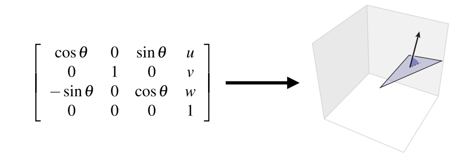

# Computer Graphic04-空间变换-下
上一篇文章中介绍了旋转和反射变换,这章我们开始介绍剩下几种变换:缩放/平移/错切。

## 缩放
### 均匀缩放
每一个向量被映射到自身与缩放因子的乘积。

$f(\mathbf{u}) = a\mathbf{u} \ \ \ \ a \in R$

旋转变换保持向量大小不变,缩放保持方向不变:

$\frac{\mathbf{u}}{|\mathbf{u}|}  = \frac{a\mathbf{u}}{|a\mathbf{u}|}$

缩放是线性变换吗?可以用线性变化的代数定义来证明:

**缩放是线性变换!**

矩阵表示:

假如用因数$a$缩放向量$\mathbf{u} = (u_{1},u_{2},u_{3})$，如何用矩阵来表示该变换?

用缩放因子$a$构造一个对角矩阵($diagonal \ matrix \ D$)即可:

$\begin{bmatrix}
 a & 0 & 0 \\
 0 & a & 0 \\
 0 & 0 & a
\end{bmatrix}\begin{bmatrix}
 u_{1}\\
 u_{2}\\
 u_{3}
\end{bmatrix} = \begin{bmatrix}
 au_{1}\\
 au_{2}\\
 au_{3}
\end{bmatrix}$

### 负数缩放

如果缩放因子为负,假设$a = -1$,可以把缩放分解为一系列的反射变换.负因子缩放的这种性质在二维和三维中的表现是不同的,因为二维缩放分解为两个反射矩阵的乘积,而三维缩放分解为三个反射矩阵的乘积:

$\begin{bmatrix}
 -1 & 0\\
 0 & -1
\end{bmatrix} = \begin{bmatrix}
 -1 & 0\\
 0 & 1
\end{bmatrix}\begin{bmatrix}
 1 & 0\\
 0 & -1
\end{bmatrix}$

对于二维负数缩放,可以将其分解为沿$Y$轴和$X$轴做两次镜像,两次朝向反转相互抵消,最终面朝向保持不变,本质上这是一次180°的旋转变换.

对于三维负数缩放,可以分解为沿$Y$轴$X$和$Z$轴做三次镜像,两次抵消一次反转,最终面朝向是反转的:

$\begin{bmatrix}
 -1 & 0 & 0 \\
 0 & -1 & 0 \\
 0 & 0 & -1
\end{bmatrix} = \begin{bmatrix}
 -1 & 0 & 0\\
 0 & 1 & 0\\
 0 & 0 & 1
\end{bmatrix}\begin{bmatrix}
 1 & 0 & 0\\
 0 & -1 & 0\\
 0 & 0 & 1
\end{bmatrix}\begin{bmatrix}
 1 & 0 & 0\\
 0 & 1 & 0\\
 0 & 0 & -1
\end{bmatrix}$

### 非均匀缩放(轴向)
上边介绍的几种缩放缩放因子都是统一的,每个轴的缩放系数保持一致,如果每个轴按照不同的因子缩放,该如何去表达呢?

$f(\mathbf{u_{1}}, \mathbf{u_{2}}, \mathbf{u_{3}}) = (a\mathbf{u_{1}}, b\mathbf{u_{2}}, c\mathbf{u_{3}})$

$a,b,c \in R$

和均匀缩放矩阵表示一样,只不过在对角线上替换成不同的缩放因子即可:

$\begin{bmatrix}
 a & 0 & 0 \\
 0 & b & 0 \\
 0 & 0 & c
\end{bmatrix}\begin{bmatrix}
 \mathbf{u_{1}}\\
 \mathbf{u_{2}}\\
\mathbf{u_{3}}
\end{bmatrix}=\begin{bmatrix}
 a\mathbf{u_{1}}\\
 b\mathbf{u_{2}}\\
c\mathbf{u_{3}}
\end{bmatrix}$

### 非轴向缩放
非轴向缩放即未按照当前标准基进行缩放,因此无法直接写出这样的矩阵,但是可以换个角度,可以先将其转换(旋转)到新的坐标空间,应用轴向缩放,再转换回原始的坐标空间,基本步骤分解如下:

1. 应用旋转矩阵转换到新的坐标系空间($R$)
2. 应用轴向缩放矩阵($D$)
3. 旋转回原始的坐标空间($R^T$)

**注:旋转矩阵的逆等于其转置,因此可以用其转置来表示逆变换**

可以将非轴向缩放用对称矩阵($Symmetric \ matrix$)来表示:

$A = R^TDR$

$A^T = (R^TDR)^T = R^TD^T(R^T)^T = R^TDR$

**对称矩阵:对称矩阵的转置等于其自身:$A = A^T$**

那么所有的对阵矩阵都表示了非均匀缩放吗?答案是肯定的.下一小节我们根据谱定理来推导为什么所有的对称矩阵都代表了非均匀缩放?

### 谱定理($Spectral \ theorem$)
谱定理告诉我们对于任意一个对称矩阵$A = A^T$包含:
- 正交特征向量:  $e_{1},...,e_{n} \in R^n$
- 特征值: $\lambda_{1},...,\lambda_{n} \in R$

根据特征向量和特征值的定义可以得到:

$Ae_{i} = \lambda_{i}e_{i}$

也可以换一种表述方式:

$AR = RD$

$R = [e_{1}...e_{n}]$

$D = \begin{bmatrix}
 \lambda_{1} &  & \\
  & \cdot \cdot \cdot  & \\
  &  & \lambda_{n}
\end{bmatrix}$

$\Rightarrow$

$A = RDR^T$

因此得出结论,**所有的对称矩阵都代表了沿某一方向的非均匀缩放**,这也给对称矩阵提供了一种几何视角,当我们看到一个对称矩阵,就明白它代表了某个方向上的非均匀缩放.

## 切变($Shear$)
先从简单的二维切变着手,如下图表示了一种切变变换过程:

通过观察发现,变换后点的$y$不变,$x$的变化和$y$成一定的比例关系,取一个特殊点,$(0, 1)$在转换后变成$(a, 1)$,中间的任一点转换满足这种线性关系即:

$(x,y) \longrightarrow \ (x + ay, y)$

用矩阵表示:

$\begin{bmatrix}
x^丶 \\
y^丶
\end{bmatrix} = \begin{bmatrix}
 1 & a\\
0 & 1
\end{bmatrix}\begin{bmatrix}
x\\
y
\end{bmatrix}$

切变严格定义: 切变使每个点$x$向u方向位移,移动距离和点$x$在$v$方向上的投影长度成正比:

$f_{u,v}(\mathbf{x}) = \mathbf{x} + <\mathbf{v},\mathbf{x}>\mathbf{u}$
 
切变的矩阵表示：

$A_{u,v} = I + \mathbf{u}\mathbf{v^T}$

举例:

$\mathbf{u} = (\cos(t), 0, 0)$

$\mathbf{v} = (0 , 1, 0)$

$A_{u,v} = \begin{bmatrix}
 1 & \cos(t) &0 \\
 0 & 1 & 0\\
 0 & 0 & 1
\end{bmatrix}$

## 组合变换
通过这些基本变换(旋转,反射,缩放,切变)的组合,我们可以构建一个复合变换,只需要将这些矩阵相乘即可:

**应用变换的顺序:从右到左**

假设现在有一个代表变换的矩阵,如何将其分解为这些基础的变换呢?

## 线性变换的分解
有许多线性变换分解的方法:
1. 奇异值分解($Singular \ value \ decomposition$) (信号处理领域)
2. LU分解($LU factorization$)(解线性方程组)
3. 极分解($Polar \ decomposition$)(空间变换)
4. ...

对于本章主题,着重介绍奇异值分解和极分解.

考虑如下变换:

### 极分解 & 奇异值分解
极分解将任意矩阵$A$分解为一个正交矩阵$Q$和对阵矩阵$P$(缩放因子非负):

$A = QP$

$QP$被称为矩阵$A$的极分解.

由于$P$是对称矩阵,根据谱分解定理,可以将$P$继续分解为:$P = VDV^T$(V是正交矩阵,D是对角矩阵),因此:

$A = QVDV^T$

将QV合成一个旋转矩阵:

$A = QVDV^T = UDV^T$

$UDV^T$被称为矩阵$A$的奇异值分解.

### 线性变换分解的意义
这些线性变换的分解方法有什么作用,具体在图形学中有什么重要意义呢?

考虑在两个线性变换$A_{0},A_{1}$之间做插值:

最简单的做法就是在两个矩阵之间根据时间($t \in [0, 1]$)做线性插值:

$A(t) = (1- t)A_{0} + tA_{1}$

我们发现在开始和结束时,变换是正确的,但是中间的插值过程看起来却很奇怪,这正是矩阵分解的用武之地,其基本思想为分别对极分解生成的两个矩阵做插值而非原始矩阵自身.

我们先将$A_{0}和A_{1}$分别分解为$Q_{0}P_{0}和Q_{1}P_{1}$:

$A_{0} = Q_{0}P_{0}$
 
$A_{1} = Q_{1}P_{1}$

接下来我们不对矩阵本身做插值,而是对分解后的$QP$做插值:

## 平移(Translations)
截止到现在我们介绍了旋转/反射/缩放/错切变换,却忽略了一种最基础的变换:平移,平移用代数很好表达:

$f_{u}(\mathbf{X}) = \mathbf{X} + \mathbf{U}$

平移变换是线性的吗?让我们用线性变换的两条规则验证下:

**显然平移变换不满足线性变换的加性法则和乘性法则,因此平移变换不是线性变换,相反它是仿射变换.**

回忆前边说过的复合线性变换可以用矩阵乘法来表示:

$A_{3}(A_{2}(A_{1}\mathbf{X})) = A_{3}A_{2}A_{1}\mathbf{X}$

同样复合平移变换可以用向量的加法来表示:

$f_{u3}(f_{u2}{f_{u1}(\mathbf{X})}) = f_{u1+u2+u3}(\mathbf{X})$

但是如果一个变换中既包含线性变换又包含平移变换:

$A_{2}(A_{1}\mathbf{X} + \mathbf{b_{1}}) + \mathbf{b_{2}} = (A_{2}A{1})\mathbf{X} + (A_{2}\mathbf{b_{1}} + \mathbf{b_{2}})$

既要处理矩阵计算又要处理向量计算,有没有什么方法统一二者,用简单明了的方式来表达?

**或许可以通过提高维度的方式将平移变换转换为线性变换...**.这就是齐次坐标的基本思想.

### 齐次坐标($Homogeneous \ Coordinates$)
齐次坐标的概念起源于绘画中的透视法,由$Möbius$引入(为直线分配坐标):

是一个很重要的概念,广泛应用在图形学的方方面面:

- 3D变换
- 透视投影
- 曲面简化
- 预乘计算透明度
- 阴影生成
- ....

### 基本思想
想象三维空间中任意二维平面(与原点不相交),每一条穿过三维空间原点的直线$L$都会在二维平面上找到相应唯一的点$P$:

因此,在直线$L$上的任意一点$\hat{P}$可以被用来"表示"点$P$

#### 投影矩阵
回顾下小孔成像原理，所有沿着一条直线的点最终会被投影到成像平面上的同一个点，这就是齐次坐标的最初想法。

### 二维空间下的齐次坐标
先从二维空间来解释,假设二维平面上的任意一点$P = (x, y)$,二维平面在三维空间中的$Z$值为1.

任何满足$(a/c, b/c) = (x,y)$的点$\hat{P} = (a, b, c)$即为点$P$的齐次坐标.例如:

- $(x, y, 1)$
- $(cx,cy,c) \ for \ c != 0$

 
因此可以得出结论,两个点$\hat{p},\hat{q} \in R^3$描述的是二维空间中相同的点,只要满足 $\hat{p} = \lambda\hat{q}$并且$\lambda \ != 0$,同样我们可以说**齐次坐标是低维空间坐标的高维度空间表示.**

### 齐次坐标下的二维平移变换
想象一下在齐次坐标空间下应用二维平移变换会发生什么:

这种变换和三维空间下的切变很像，其实它就是三维空间上的切变($Z$不变)

让我们尝试证明齐次坐标下的平移变换是一个仿射变换:

假设将一个二维点 $\mathbf{p} = (p_{1}, p_{2})$平移$\mathbf{u} = (u_{1}, u_{2})$得到$p^丶 = (p_{1} + u_{1}, p_{2} + u_{2})$

在齐次坐标空间下用$\hat{p}$来表示$p$:

$\hat{p} = (cp_{1}, cp_{2}, c) \ \ \ \Rightarrow \ \ \ \hat{p^丶} = (cp_{1} + cu_{1}, cp_{2} + cu{2}, c)$

**注意我们将点$\hat{p}$沿着$u$方向位移,位移距离c和与第三个轴的距离成正比,这正是切变的定义.**

> *重要结论:利用齐次坐标,可以用三维空间的线性变换(切变)来表示二维空间的仿射变换(平移)*

### 齐次坐标下二维平移变换的矩阵表示
既然用三维空间的切变来表示二维空间的平移,根据前文所述切变的代数定义可知:

$f_{u,v}(\mathbf{x}) = \mathbf{x} + <\mathbf{v}, \mathbf{x}>\mathbf{u}$

矩阵形式:

$f_{u,v}(\mathbf{x}) = (\mathbf{I} +\mathbf{u}\mathbf{v}^T)\mathbf{x}$

在我们表达平移这种情况下 $\mathbf{v} = (0, 0, 1)$,因此我们得到矩阵:

$\begin{bmatrix}
 1 & 0 & u_{1}\\
 0 & 1 & u_{2}\\
 0 & 0 & 1
\end{bmatrix}$

### 齐次坐标空间下的其他变换
二维空间下的原始形状在三维齐次坐标空间下可以被表示为很多份均匀沿着$x_{3}$方向缩放的拷贝.

**以上我们就将几种基本变换完美的统一了起来,在齐次坐标空间下计算变换矩阵,将平移转换为切变,这样就可以用矩阵乘法来表示所有的变换组合,用一个矩阵表示任意的变换.**

### 三维空间平移的齐次坐标表示
和二维空间一样,三维空间下的齐次坐标用四维空间表示:
 

### 点 vs 向量
齐次坐标有另外一个有用的特性:区分空间中的点和向量

假设三维空间下一个三角形,由三个顶点组成, $a,b,c \in \mathbb{R}^3$,法线为$\mathbf{n} \in \mathbb{R}^3$:

假设我们对三个顶点和法线应用同样的变换:

我们发现在变换后,法线不再垂直于三角形平面,为什么?我们来看下当对法线做变换时发生了什么

但是当我们旋转 & 平移一个三角形时,它的法线不应该被平移,因为法线是一个向量,代表空间中的一个方向,它没有自己的起点($Base Point$),空间中任意两个向量方向相同长度相同,则它们应该是相等的,因此平移变换对于向量不应该起作用,有什么办法能避免法线被平移呢?我们只需要将向量的$w$分量设置为0即可:

$\begin{bmatrix}
n_{1}\\
n_{2}\\
n_{3}\\
0
\end{bmatrix}$

这样经过变换后,我们得到的三角形法线是垂直于其表面的:

**因此,齐次坐标下的点和向量表示是不同的,向量应该忽略平移变换,其$w$分量应该被设置为0,点的$w$分量为1**

但是最终齐次坐标需要除以$w$得到原空间的坐标,但是对于向量$w$分量为0的情况,这意味着什么?

假设我们不断缩小除数$c$,当$c$无限趋近于0时,可以认为向量是在无限远处的一个点:

## 齐次坐标空间下的投影矩阵
用齐次坐标如何表达一个投影矩阵呢,根据小孔相机模型的定义:

$(x,y,z) \Rightarrow (x/z, y/z, 1)$

因此我们可以构建一个矩阵:把z坐标赋值给齐次坐标分量$w$,除以齐次坐标分量$w$会得到在z平面上的投影:

$\begin{bmatrix}
1  & 0 & 0 & 0\\
0  & 1 & 0 & 0\\
0  & 0 & 1 & 0\\
0  & 0 & 1 & 0
\end{bmatrix}\begin{bmatrix}
 x\\
 y\\
 z\\
 1
\end{bmatrix} = \begin{bmatrix}
 x\\
 y\\
 z\\
 z
\end{bmatrix} \Rightarrow \begin{bmatrix}
 x/z\\
 y/z\\
 1
\end{bmatrix}$

## NDC To ScreenSpace
经过mvp变换后,原始的顶点被转换为$[-1,1]^3$的标准立方体中(NDC Space),接下来我们需要将顶点从$NDC空间转换到屏幕空间(多种不同的叫法:$ScreenSpace/PixelSpace/ImageSpace$),即我们常常看到视口变换($viewport$):

### 屏幕空间
什么是屏幕空间?顾名思义就是我们的显示器,由像素数组构成,数组的大小被我们称为分辨率.

- 像素由$(x,y)$的形式来表示,$x和y$均为整数,假设像素是一个小方块,$(x,y)$为该小方块左下角的坐标
- 坐标范围从 $(0,0) -(width-1,height-1) $
- 像素$(x,y)$的中心点位于$(x+0.5, y+0.5)$
- 屏幕空间覆盖范围:$(0,0) - (width, height)$

### $viewport矩阵$
先对$NDC$应用缩放矩阵,由于$NDC$空间是$[-1,1]$,所以缩放矩阵应该是屏幕w和h各除以2,然后应用平移变换,将原点从中心移到左下角,平移的量正好是宽高的一半$(width/2, height/2)$,矩阵形式表示如下:

$M_{viewport} = \begin{bmatrix}
 width/2 & 0 & 0 & width/2\\
 0 & height/2 & 0 & height/2\\
 0 & 0 & 1 & 0\\
 0 & 0 & 0 & 1
\end{bmatrix}$

## 在组合转换时，顺序很重要!

### 实现基于自身旋转

如果对空间中的一个物体直接应用旋转矩阵,物体将围绕原点做旋转而非自身.
物体实现自身旋转的一个常用技巧就是,先将物体平移到原点,应用旋转变换,然后再将其移动到原位置:

## 总结

让我们总结下在光栅化管线中,从顶点到屏幕坐标一系列的变换过程:

1. 首先，我们使用场景图对立方体的多个副本应用变换($ModelSpace->WorldSpace$)

2. 然后应用相机变换,即我们观看场景的视角($WorldSpace->ViewSpace$)

3. 应用投影变换(perspective)($ViewSpace->NdcSpace$)

4. 最后将ndc标准立方体转换到屏幕空间($NdcSpace->ScreenSpace$)

经过以上四个步骤,我们将顶点转换为了屏幕上的像素点,接下来就是光栅化着色的过程.