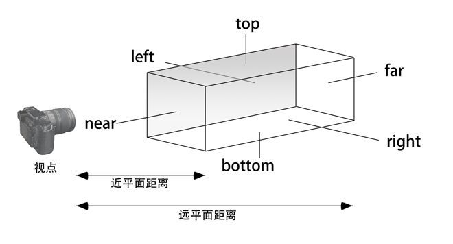

# Computer-Graphic05-mvp变换
透视投影是我们在日常生活中很常见的一种现象，远处的物体看着会更小，近处的物体看着会变大，也就是近大远小效果，另外一点就是平行线在地平线的远方会相交于某一点。

我们会从数学视角刨析这种现象出现的原因。但先让我们回顾下历史，看在早期绘画中人们是如何在图像生成中处理透视投影的。纵观绘画史，人们逐渐掌握并理解了这种空间中的透视关系，并在绘画中体现出来。

熟练掌握了透视投影后，人们开始想着如何来打破它。

## 空间变换：从对象到屏幕
首先让我们再次回顾下一个对象从输入的几何图元到绘制在屏幕上的像素点的一系列变换过程。

### 相机观察空间
考虑一个位于$(4, 2, 0)$看向$x$轴方向，对象在世界空间摆放：

什么样的空间变换会把物体放置在一个相机位于原点看向$-z$的坐标系中？

思考这个问题的一种方法是，从相机视角来看，它位于世界空间的中心，因此其他物体都应该相对于相机的位置来表示，从描述物体的坐标中减去相机的位置，换句话说就是将对象顶点位置平移$(-4, -2, 0)$。然后处理观测方向，相机现在的观察方向是$x$轴与我们光栅化的规范不同，我们始终希望看向$-z$方向，当然在这里可以通过简单的绕$y$轴旋转$\pi/2$来实现。但是如果相机看向其他任意方向呢？

假如有一个观测方向等于$w \in \mathbb{R}^3$的相机，如何来构造旋转矩阵？

- 首先构造正交于$w$的$u和v$向量，定义相机的上轴$"\vec{v}"$，通过两次叉乘构造相机的旋转基向量:
  
  $\ vec{w} = normalize(\vec{v})$

  $\vec{u} = normalize(\vec{w} x \vec{v})$

  $\vec{v} = \vec{w} x \vec{v}$

  基于此构造旋转矩阵，每个轴做为矩阵的一个列：

  $R =\begin{bmatrix}
   u_x & v_x & -w_x \\
   u_y & v_y & -w_y \\
   u_z & v_z & -w_z
   \end{bmatrix}$
   
   该矩阵表示了世界空间中相机的旋转变换，为了对空间中的物体做相应变换，我们需要应用相机矩阵的逆矩阵，相对于相机视角做运动。由于旋转矩阵是正交矩阵，而正交矩阵的逆等于其转置，因此：

   $R^{-1} = R^T$

   $\begin{bmatrix}
   u_x & u_y & u_z \\
   v_x & v_y & v_z \\
   w_x & -w_y & -w_z
   \end{bmatrix}$

#### 视锥体($View frustum$)
$View frustum$是相机的可视区域：

为了简化操作，约定俗成会把相机放置在世界空间原点，看向$-z$方向，这也就是为什么需要构造相机矩阵，将物体做相应的偏移。本质上$View frustum$由6个面构成:$Top/Bottom/Left/Right/Near/Far$决定了相机的可视空间。

#### 裁剪($Clipping$)
裁剪是丢弃不在视锥体内的三角形的过程，如果三角形在视锥体内，正常绘制，如果三角形在视锥体外，直接丢弃，为什么要浪费时间处理这个裁剪过程？

1. 不想浪费没必要的光栅化操作，回想下绘制三角形算法，它实际上需要相当多的计算，必须测试每个像素是否在三角形内部。
2. 当然也也可以通过丢弃片段、但这需要大量的工作，丢弃当个片段是以非常细的力度进行裁剪的过程。
3. 因此在进入光栅化之前丢弃整个三角形更有意义，所以需要对三角形的可见性做粗粒度测试。
4. 但是这其实也并不简单，因为有些三角形是部分落在视锥体内部的，这样就形成了多边形，需要对多 边形做进一步拆分生成更多的小三角形，为什么不直接绘制多边形而要做进一步拆分呢？原因可以追溯到光栅化管线中讨论过的很重要的一点，显卡是专门用以处理三角形光栅化的，因为这样可以将所有资源集中在处理一件事上，做到很高效。

#### 近平面/远平面
为什么要构造近平面和远平面？有以下两个主要原因：

1. 一些图元可能在相机的前边和后边都有顶点，会对后续的光栅化造成很大麻烦，
需要检查片元是否出现在了相机后边，如果是，则需要丢弃该片元。

1. 对于处理深度缓冲区的有限精度很重要。

**对数距离**
当物体远离相机时，其距离会按照对数衰减，意味着当物体离相机越来越远时衰减速度也会越来越慢。

在计算机图形学中，我们会对一切表示做量化处理，例如：
- 颜色
- 形状
- 距离
- ...

为深度提供固定精度(通常为32位)意味着距离很远的物体可能共享相同的深度数据。

因此为可能的深度值设置一个较小的范围，MinDepth代表近平面，maxDepth代表远平面，因为对数曲线不会给远处物体提供足够精度。

浮点数在接近0处有更高的“分辨率”，因此可以给图元的相交测试提供更精确的表示。

### 投影变换
#### 正交投影（$Orthographic projection$）
正交投影会保持几何图元相对位置关系不变，平行的线永远平行。不满足透视关系。又叫做平行投影。
正交投影的视锥体是一个长方形，由top bottom left right near far6个参数定义。如下图所示：

如何将该长方体映射到$[-1,1]^3$呢?和$\textbf{M}_{view}$类似,我们先将立方体中心移动到原地,然后根据每个方向的长度,缩放到[-1,1]之间.即$\textbf{M}_{scale}$$\textbf{M}_{translate}$.需要一次平移变换 + 一次缩放变换.

##### $\textbf{M}_{translate}$平移矩阵

根据正交投影视锥体的6个参数,可以计算出它的中心位置.即:

$\textbf{center} = \begin{bmatrix}
    \dfrac{r+l}{2}\\ 
    \dfrac{t+b}{2}\\ 
    \dfrac{n+f}{2}\\
\end{bmatrix}$

$\textbf{M}_{translate} = \begin{bmatrix}
    1&0&0&-\dfrac{r+l}{2}\\ 
    0&1&0&-\dfrac{t+b}{2}\\ 
    0&0&1&-\dfrac{n+f}{2}\\
    0&0&0&1\\ 
\end{bmatrix}$

##### $\textbf{M}_{scale}$缩放矩阵
同样根据视锥体6个参数,可以计算出立方体的长宽高(假设z方向的边为长,y方向的边为高)分别为:
$n-f, r-l, t-b$.

根据缩放矩阵的定义可知:

$\textbf{M}_{scale} = \begin{bmatrix}
    \dfrac{2}{r-l}&0&0&0\\ 
    0&\dfrac{2}{t-b}&0&0\\ 
    0&0&\dfrac{2}{n-f}&0\\
    0&0&0&1\\ 
\end{bmatrix}$

##### 正交投影矩阵
$\textbf{M}_{orthographic} = \textbf{M}_{scale}$$\textbf{M}_{translate} = \begin{bmatrix}
    \dfrac{2}{r-l}&0&0&0\\ 
    0&\dfrac{2}{t-b}&0&0\\ 
    0&0&\dfrac{2}{n-f}&0\\
    0&0&0&1\\ 
\end{bmatrix}\begin{bmatrix}
    1&0&0&-\dfrac{r+l}{2}\\ 
    0&1&0&-\dfrac{t+b}{2}\\ 
    0&0&1&-\dfrac{n+f}{2}\\
    0&0&0&1\\ 
\end{bmatrix} = \begin{bmatrix}
    \dfrac{2}{r-l}&0&0&\dfrac{l+r}{l-r}\\ 
    0&\dfrac{2}{t-b}&0&\dfrac{b+t}{b-t}\\ 
    0&0&\dfrac{2}{n-f}&\dfrac{f+n}{f-n}\\
    0&0&0&1\\ 
\end{bmatrix}$

#### 透视投影
 $aspectRatio（长宽比）$：定义近平面的宽高比
- $n（近平面距离）$：近平面距离原点距离

由视锥体的参数可以推导出$l,r,b,t$：

$\tan\dfrac{fov}{2} = \dfrac{t}{|n|}$

$aspectRatio = \dfrac{r}{t}$

##### 推导
观察上图我们发现,透视投影远平面比近平面要大些,除了这些两个视锥体几乎是一样的。所以在我们做透视投影变换时，不妨先将其转换为右侧的长方体，然后再做一次正交投影变换即可：

$\textbf{M}_{perspective} = \textbf{M}_{orthographic}\textbf{M}_{persp->ortho}$

##### “挤压变换”

任选一点P，如果将其“挤压”至P1点，我们观察$\triangle{OPR}和\triangle{NPP1}$,不难发现两个三角形是相似三角形，根据相似三角形定律: $y^丶 = \dfrac{ny}{z}$,同理 $x^丶 = \dfrac{nx}{z}$.

在齐次坐标下：

$\textbf{M}_{persp->ortho}\begin{bmatrix}
    x\\ y\\ z\\ 1\\ 
\end{bmatrix} = \begin{bmatrix}\dfrac{nx}{z}\\ \dfrac{ny}{z}\\ unknown \\1 \end{bmatrix} = \begin{bmatrix}nx\\ ny\\ unknown \\z \end{bmatrix}$

$\textbf{M}_{persp->ortho} = \begin{bmatrix}
    n&0&0&0\\ 
    0&n&0&0\\ 
    ?&?&?&?\\ 
    0&0&1&0\\ 
\end{bmatrix}$

近平面的任意一点在挤压后的z值不会改变：

$\begin{bmatrix}\dfrac{nx}{n}\\ \dfrac{ny}{n}\\ n \\1 \end{bmatrix} = \begin{bmatrix}nx\\ ny\\ n^2  \\n\end{bmatrix}$

$\begin{bmatrix}
    0&0&A&B
\end{bmatrix}\begin{bmatrix}x\\ y\\ n\\ 1\\ \end{bmatrix} = n^2$

$An + B = n^2$

远平面的任意一点挤压后z值不会改变,更特殊的是，远平面的中心点（0，0，f）在挤压后仍然在（0，0，f），根据这一特性我们能够得到：

$\begin{bmatrix}0\\ 0\\ f \\1 \end{bmatrix} = \begin{bmatrix}0\\ 0\\ f^2  \\f\end{bmatrix}$

$Af + B = f^2$

解二元一次方程组：

$An + B = n^2$

$Af + B = f^2$

$A = n+f$  

$B = -nf$

$\textbf{M}_{persp->ortho} = \begin{bmatrix}
    n&0&0&0\\ 
    0&n&0&0\\ 
    ?&?&?&?\\ 
    0&0&1&0\\ 
\end{bmatrix} \begin{bmatrix}
    n&0&0&0\\ 
    0&n&0&0\\ 
    0&0&A&B\\ 
    0&0&1&0\\ 
\end{bmatrix} = \begin{bmatrix}
    n&0&0&0\\ 
    0&n&0&0\\ 
    0&0&n+f&-nf\\ 
    0&0&1&0\\ 
\end{bmatrix}$

$\textbf{M}_{perspective} = \textbf{M}_{orthographic}\textbf{M}_{persp->ortho} = \begin{bmatrix}
    \dfrac{2}{r-l}&0&0&0\\ 
    0&\dfrac{2}{t-b}&0&0\\ 
    0&0&\dfrac{2}{n-f}&0\\
    0&0&0&1\\ 
\end{bmatrix}\begin{bmatrix}
    1&0&0&-\dfrac{r+l}{2}\\ 
    0&1&0&-\dfrac{t+b}{2}\\ 
    0&0&1&-\dfrac{n+f}{2}\\
    0&0&0&1\\ 
\end{bmatrix}\begin{bmatrix}
    n&0&0&0\\ 
    0&n&0&0\\ 
    0&0&n+f&-nf\\ 
    0&0&1&0\\ 
\end{bmatrix}$

### 屏幕空间变换
接下来就进入了光栅化管线的最后一个变换阶段，从$NDC$到屏幕空间，也就是将顶点从$[-1,1]^2$及z=1的$NDC$空间转换到具有实际宽高的屏幕空间。假设该屏幕空间的y轴是朝下的：

首先将图像沿着$x$轴翻转，然后平移$(1,1)$,将原点固定到左上角，最后放大图像，放大比率为$(W/2, H/2)$.
 
### 回顾变换过程

## 重心坐标($Barycentric Coordinates$)
对于空间内的任意三角形$\triangle{v_1v_2v_3}$和任意一点$\textbf{p}$，必定唯一存在三个数$b_1,b_2,b_3$,满足：

$b_1+b_2+b_3 = 1$

$\textbf{p} = b_1\textbf{v}_1 + b_2\textbf{v}_2+ b_3\textbf{v}_3$

则$b_1,b_2,b_3$就称为$\textbf{p}$点在此三角形$\triangle{v_1v_2v_3}$上的重心坐标。

重心坐标表示了三角形每个顶点对该点的权重（贡献），重心坐标可以用来对三角形顶点的属性进行线性插值，比如说uv 颜色 法线的线性插值。

### 高度比
重心坐标可以看作采样点到对边高度与顶点到对边高度的比值。

$\hat{f}(x) = f_i\phi_i + f_j\phi_j + f_k\phi_k$

### 三角形面积比：
重心坐标同样也可以认为是采样点与对边围成的小三角形与大三角形的面积比：

- 无论通过哪种方式来计算，这三个函数的值$\phi_i{x},\phi_j{x},\phi_k{x}$被称为点$x$的重心坐标。
- 可以用于对顶点属性插值(颜色，纹理坐标...等)
- 重要的是重心坐标在三角形光栅化半平面测试阶段可以免费获得(叉积本质上计算的是梯形面积，而小三角形面积是梯形面积的一半)

### 透视矫正插值
**由于透视投影（透视除法），拥有不同顶点深度的三角形重心坐标插值不是屏幕xy空间的仿射变换函数。**
如果将三角形投影到了二维平面，尝试用二维三角形的重心坐标对顶点插值，那么结果必然是不正确的，误差取决于是直接看三角形还是以掠射角看它，因为受到了透视除法的影响。

这里举一个例子，假如在屏幕上绘制一个矩形，该矩形由棋盘格纹理填充，矩形本质上是由两个三角形组成的，如果使用2d空间计算的中心坐标直接对三维空间的顶点插值，那么两个三角形相接的边缘部分将会出现不连续性，如下中间所示：

那么我们如何修复这个问题，可以进行透视矫正插值,假设要插值的属性为$\phi$:

- 计算每个顶点的深度值$z$
- 计算每个顶点的$Z = 1/z, P = \phi/z$
- 对于每一个片元，用标准的二维空间的重心坐标对$Z和P$插值
- 对于每一个片元，将插值过的$P$除以插值过的$Z$得到最终结果

