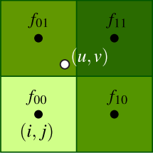
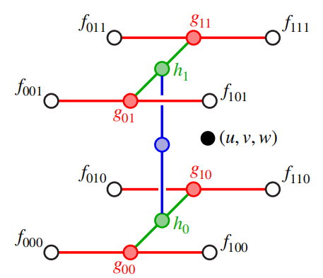

# Computer-Graphic05-纹理采样
顶点插值属性不仅仅是颜色值，而是某种可以进行纹理映射的纹理坐标，那么什么是纹理映射？纹理映射一个很好的类比就是包装一份礼物，我有一些彩纸，上面绘制了一些有趣的图案，还有一个平平无奇的立方体，只是一个扁平的盒子，我想把这个有趣的图案放在盒子上，该怎么做呢？把纸包裹在盒子上就行了，这本质上就是纹理映射，将二维图像包裹在三维表面上的方法。

## 纹理贴图应用场景
纹理映射有很多用途，不仅仅是改变表面的颜色，我们可以描述颜色之外的表面属性，例如我们可能有一个纹理贴图，它描述了表面哪里是湿的，哪里是干的，湿与干属性随后会影响如何对表面进行着色，我们还可以使用多个纹理贴图来构建表面的不同属性，它在哪里被划伤，它的颜色是什么以及表面粗糙度等等。

### 法线/位移贴图($Normal/Displace\ Mapping$)
纹理贴图还可以用于改变表面着色信息和物体实际的几何形状。一种常见的技术叫做法线贴图，纹理值不是用于描述颜色的，而是表面法线，采样法线贴图的值做为片元法线，参与光照计算，使物体表面看起来有凹凸和褶皱的效果。但是仔细看你会法线左边这幅图（由法线贴图生成）实际上有两个很大的问题：1. 物体的轮廓是完全光滑的；2. 阴影也是完全光滑的。这正是法线贴图的弊端，它实际上没有真正改变几何体的顶点数据，而是通过扰乱法线影响光照实现的。而位移贴图正好相反，它实际上是会改变顶点位置的，因此边缘轮廓有很好的锯齿状，阴影也有体现，这是一种为物体添加细节的简单方法。

### 环境光遮蔽($Ambient Occlusion$)
纹理映射还可以用于获得真实的阴影，一种常见的技术就是环境光遮蔽，环境光遮蔽用于表现物体和物体相交或靠近的时候遮挡周围漫反射光线的效果，可以解决或改善漏光、飘和阴影不实等问题，解决或改善场景中缝隙、褶皱与墙角、角线以及细小物体等的表现不清晰问题，综合改善细节尤其是暗部阴影，增强空间的层次感、真实感，同时加强和改善画面明暗对比，增强画面的艺术性。使用预计算的$AO$贴图，随后在光照计算中采样纹理获取遮蔽因子，大幅提高场景画质表现。

### 环境光贴图($Environment\ Map$)
纹理贴图出现的另一个地方不是向表面添加细节，实际上是描述环境中的光照信息，因此这里我们有一个描述所有可能方向上的光照的图像，当我们对场景中的表面进行着色时，我们会对该纹理贴图采样，但不使用表面的位置，而是使用视线的反射向量对环境光贴图进行采样。

## 纹理坐标($UV$)
如果我们想要将纹理映射到物体表面，需要描述图像的哪一部分被映射到表面的那一部分，而纹理坐标正是用于建立从表面到纹理空间这种映射关系的。通常通过三角形顶点重心坐标插值获取到。

假设现在我们要对这个立方体贴图，立方体每个面由8个三角形组成，二维空间的纹理贴图右下角有一个虚线边框的红色三角形，分辨率为$2048 * 2048$:

### 纹理坐标可视化
一种将纹理坐标可视化的方式是将$uv$通过颜色来表达，假设将u做为颜色的r通道，v做为g通道，则三角形的uv坐标可视化如下所示：

一个更复杂的将uv可视化的例子：

### 周期性重复纹理坐标
某些时候我们希望纹理坐标在$[0,1]$之间周期性重复，实现重复贴图：

比如说一个常见的应用场景就是铺地砖墙砖等等，我们不希望用一张很大的纹理贴图覆盖整个场景，相反周期性重复纹理坐标，对一个纹理多次采样实现平铺效果：

## 纹理采样101
接下来就需要研究纹理采样映射的工作原理了，也就是实际上是如何将纹理映射到三角形图元上的，这里提供了一个基本的算法：

- 对于屏幕上的每个像素
  - 通过三角形重心坐标插值得到$(u, v)$
  - 基于插值得到的片元$(u, v)$对纹理采样
  - 将纹理采样结果赋给当前片元颜色值

但是事情远没有这么简单，纹理采样中涉及到很多细节问题需要逐个解决。

### 回顾：锯齿
锯齿就是对一个高频信号下采样的过程中产生的。下图中绿色曲线是原始信号，而黑色是我们的采样点，由于欠采样，当通过线性插值连接每两个相邻采样点时，重建的信号和原始信号相差甚远，这时就产生了锯齿。

在音频，光栅化，视频，图像中都会出现这种现象：

### 可视化纹理采样
回到主题，在纹理采样中锯齿是如何形成的呢？**本质上是由于三维空间的三角形投影到了二维平面，屏幕空间的像素会对应纹理空间不同位置和大小的区域。**

**这种不规则的采样模式会造成难以避免的锯齿。**

#### 放大和缩小($Magnification vs Minification$)
这种不规则采样模式可以分为两类来看待：放大和缩小,这里的放大和缩小指的是纹理相对于屏幕来说的。

首先对于放大来说：

- 实际例子就是当相机距离物体很近的时候
- 屏幕单个像素映射到了纹理空间纹素的一小块区域
- 对屏幕像素中心做插值即可(双线性插值)

对于缩小来说比较麻烦了：

- 场景中距离很远的物体
- 屏幕上单个像素对应了纹理一大片区域
- 需要计算像素覆盖纹理区域的平均值来避免锯齿出现

##### 纹理放大($Magnification$)
首先来看纹理放大的情况，对于放大的纹理，一个像素只覆盖了一个纹素的小部分区域，因此其$uv$必然不是整数，没有落在纹素中心点，针对这种非整数的$uv$，如何对纹理采样？

第一种也是最简单粗暴的方法就是，查询距离采样点最近的纹素，直接获取它的值做为采样结果：

但是当我们离物体越来越近时，由于临近采样，图像会变得越来越块状，呈现大的色块，效果不是很好。

一个通用的方案是采用双线性插值。通过双线性插值可以更明确地方式来混合周围纹素的颜色值。
1.首先对采样点的$uv$各减去0.5向下取整，获取周围四个纹素左下角纹素中心的uv值，进而得到周围四个纹素全部的uv值：

2.同样有了左下角纹素的$uv$值，我们可以进一步获取当前采样点距离左下角的距离：

3. 对每一行即$f_{01}f_{11}$和$f_{00}f_{10}$基于$s$做水平方向线性插值，然后对得到的两个结果再基于$t$做垂直方向线性插值：

**注：先垂直方向做两次线性插值，水平方向上对插值结果再做一次插值结果是一样的**

##### 纹理缩小($Minification$)
当远距离的物体出现在屏幕上时，单个像素可能覆盖了一大片纹素区域，图像上会出现锯齿状线条或锯齿状边缘，针对这个问题需要用到一种被称为预过滤的技术($pre-filtering$)

###### 纹理预过滤
纹理采样锯齿发生在屏幕上的单个像素覆盖了纹理空间的大片纹素。
如果通过最近邻采样获取最近的纹素中心，那么采样点将会获取随机的颜色值，因为像素覆盖了大片纹素，对于最近的纹素中心有很多不确定性，会随机抓取其中一个纹素的颜色值，这就造成了闪烁锯齿等问题，特别对于运动中的物体而言尤其明显。

理想情况下，我们需要像素覆盖纹素的范围平均值，但是对于实时计算来说开销太大了。
取而代之，我们可以采用预计算的方式，预先计算一次范围平均值，后续采样中对该纹理采样即可。

###### $Mipmap(L.Williams 83)$
这就引出了$Mipmap$的想法，$Mipmap$本质上做的就是预先计算一系列不同等级原始图片的平均值样本。每提升一个等级将图片宽高缩小一半，高等级图片纹素存储上一级图片范围纹素的平均值(下采样)。这样在做纹理查询时，只需要查询$Mipmap$链合适等级图片的单个纹素即可。

$Mipmap$不会占用太多额外的存储空间，大概占到原始图片的1/3左右：

那么如何根据当前采样点的$uv$计算对应的$Mipmap$等级呢？位于同一个三角形内部的不同采样点也可能对应不同的$Mipmap$等级。

上图中的红色采样点覆盖的纹素面积比蓝色采样点显然更大，所以需要在更高的$Mipmap$等级采样。

通常计算遵循以下步骤：

1. 首先找到采样点右侧像素对应纹素，计算$x$的微小变化引起的$u$和$v$的微小变化,即$du/dx和dv/dx$，然后根据毕达哥拉斯定理可以近似得出两个纹素之间的距离即$L_x^2$
2. 对采样点上方的最近像素做同样处理计算$du/dy和dv/dy$,拿到$L_y^2$
3. 然后取$L_x^2$和$L_y^2$两者中的最大值得到$L$
4. 最后计算$Mipmap$等级 $d = log_2L$

由于计算得到的d值是个浮点数，首先找到离d最近的$Mipmap$层级，然后采样，会生成这样的画面：

如果只是用最近的$Mipmap$层级，在不同层级之间，从精细纹理到模糊纹理会出现明显的跳跃不连续现象。

理想情况下，我们需要采用原始的d值，但是我们只预计算了固定整数层级的$Mipmap$链，如何对不同层级之间进行插值呢？这就需要三线性插值了。

###### 三线性插值($Trilinear Filter$)
对于二维数据我们采样了双线性插值，水平方向两次，垂直方向一次。对于三维数据我们可以采用三线性插值。

对于给定三维空间的采样点$(u, v, w) \in [0, 1]^3$,以及临近的8个顶点$f_{ijk}$：

- 首先沿着$u$方向做四次线性插值
- 然后沿着$v$方向做两次线性插值
- 最后沿着$w$方向(层级之间)做一次线性插值

$Mipmap$查询和三线性插值类似，下边我们总结下$Mipmap$查询的大体流程：

- 计算当前采样点的$Mipmap$层级$d \in \mathbb{R}$
- 找到离$d$最近的上下两个层级($ceil和floor$)
- 分别对两个层级做双线性插值采样
- 在层与层之间再做一次线性插值，插值系数$w = d - \lfloor d\rfloor$

###### 各向异性过滤
但是如果相机以掠射角渲染场景，那么远处采样点计算得到的两个临近采样点的长度差异将会很大，导致近似的方形变成了长方形，由于在$Mipmap$算法中我们取两者中得最大值，最终导致采样点会在很高层级$Mipmap$中去采样，造成远处物体得纹理采样糊成一片。

这时候就需要用到各向异性过滤了，基本思路就是组合参考多个$Mipmap$样本，这里细节不再赘述。

### 纹理采样管线总结
- 通过三角形重心坐标插值获取当前片元得$uv$值
- 近似估算$du/dx,dy/dy,dv/dx,dv/dy$，计算采样点到相邻纹素的距离
- 通过两个距离取最大值，计算$Mipmap$等级$d$: $d = log_2{L_{max}}$
- 将标准化的位于$[0, 1]$范围内的$uv$坐标转换为实际的纹理空间的像素坐标:$(U,V) \in [W, H]$
- 计算需要被过滤的纹理坐标（对于三线性过滤来说是8个点）
- 将纹素加载到本地寄存器
- 依赖$(U,V,d)$执行三线性插值
- 各向异性过滤等等...
