# Computer Graphic07-深度缓冲和透明度

## 回顾光栅化管线
光栅化渲染管线以一些三角形顶点做为输入，将这些数据发送到渲染管线(显卡硬件)，经过一系列处理过程，最终绘制生成一张图片的过程。

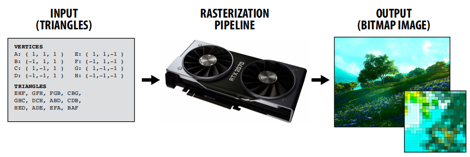

截止到目前我们学习了如何将物体拜访到世界空间，如何将三维空间物体投影到二维屏幕上，以及对三角形光栅化，判断哪些像素被三角形所覆盖，接着基于重心坐标对三角形三个顶点插值得到采样点属性，拿到采样点片元的$uv$后可以对纹理采样, 这个过程涉及纹理过滤(双线性插值，最临近采样...)及$Mipmap$等，最后通过深度及透明度将这些片元混合输出到帧缓冲($FrameBuffer$)

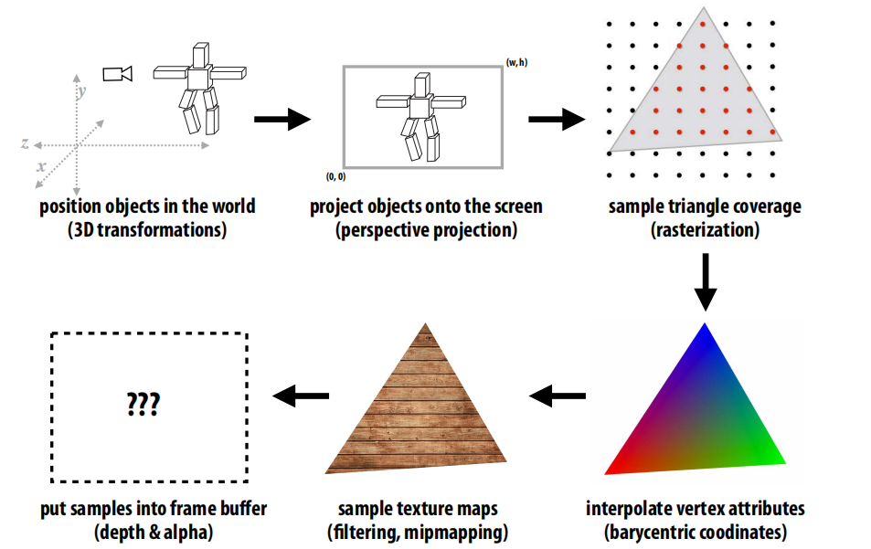

## 遮挡性问题
首先让我们看下遮挡性问题，它本质上阐述的是我们会将很多三角形绘制到屏幕上，这些三角形有些彼此覆盖重叠，那么这些三角形所覆盖的片元中的哪个三角形对我们是可见的？这个问题又可以分成两类来看待，一种是不透明物体，另一种是半透明物体，针对这两种情况处理策略是不同的。先说下不透明物体的解决方案。

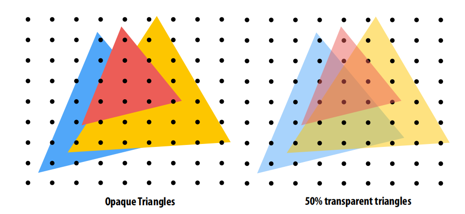

### 深度采样($Sampling Depth$)
假设这里有一个三角形：
 - 投影到二维屏幕上的顶点坐标分别为$(x_i, y_i)$，$(x_j, y_j)$，$(x_k, y_k)$
 - 每个顶点的深度分别为$d_i,d_j,d_k$


通过三角形重心坐标插值，可以得到当前片元的深度,接下来面临的挑战就是如何判断对于每个采样点哪个三角形应该显示？我们期望的是采样点拥有最小深度，也就是离相机最近。我们知道对于光栅化渲染管线，一次只处理一个三角形，输入三角形顶点信息，空间变换，投影映射，光栅化等等，然后处理下一个三角形，本质上没有记录上个三角形的任何信息，三角形之间是不知道彼此存在的，在渲染管线中我们并没有存储一系列三角形的列表，那么在仅知道当前三角形信息的前提下，如何判断哪个三角形里屏幕最近，哪个三角形被遮挡？解决方案就是深度缓冲。

### 深度缓冲($depthBuffer/zBuffer$)
对于每一个采样点，不只记录它的颜色信息，需要额外一张表记录当前采样点离屏幕的最小深度。

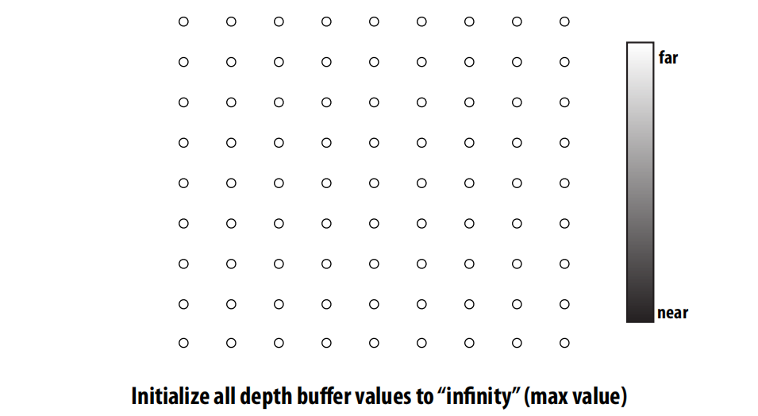

这里是一张实际场景的深度图，黑色建筑距离我们较近，远处的山峦丛林距离我们较远，颜色较浅(深度值大)

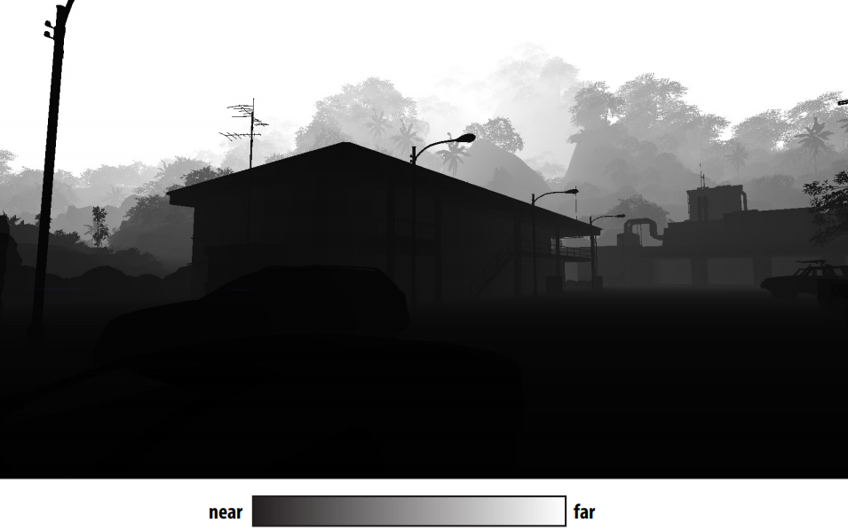

那么如何将深度缓冲应用于光栅化渲染管线中？让我们从一个简单的例子开始，绘制三个相互遮挡的不透明三角形：

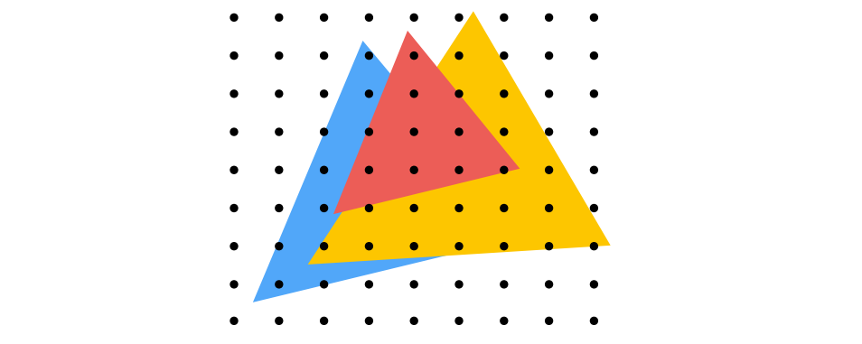

首先任意选一个三角形，通过光栅化将其绘制到屏幕上，对于每个采样点判断是否位于三角形内部，但是在将颜色输出到颜色缓冲前，需要额外执行一项操作：深度测试，判断当前采样点深度是否小于存储于深度缓冲的值，由于深度缓冲初始值为最大值，所以第一个三角形的采样点全部通过：

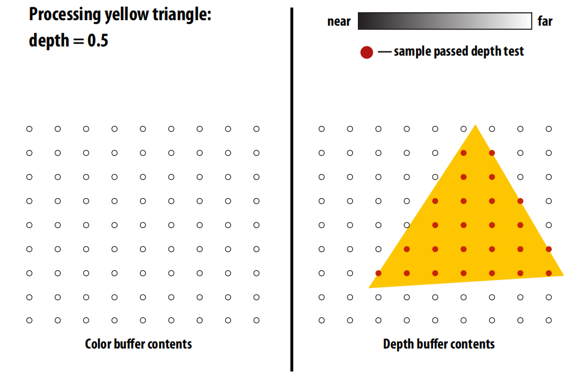

第一个三角形处理完后，更新颜色缓冲对应像素的颜色值，同时更新深度缓冲相应的深度值：

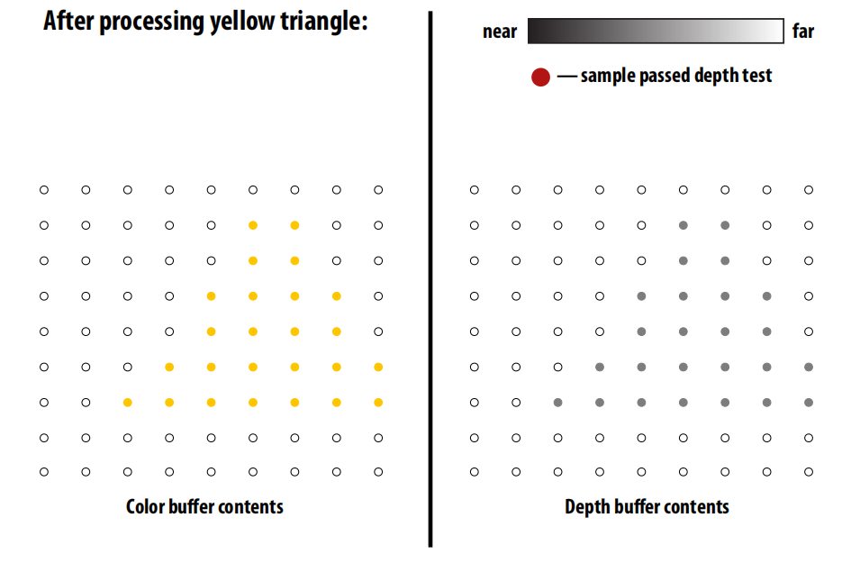

接下来处理第二个三角形，一部分被第一个三角形遮挡，和第一个三角形处理过程一样，首先判断采样点是否在三角形内部，然后获取采样点深度和深度缓冲中的值比较，如果小于深度缓冲的值，更新颜色缓冲和更新深度缓冲，如果大于深度缓冲中的值，则保持不变：

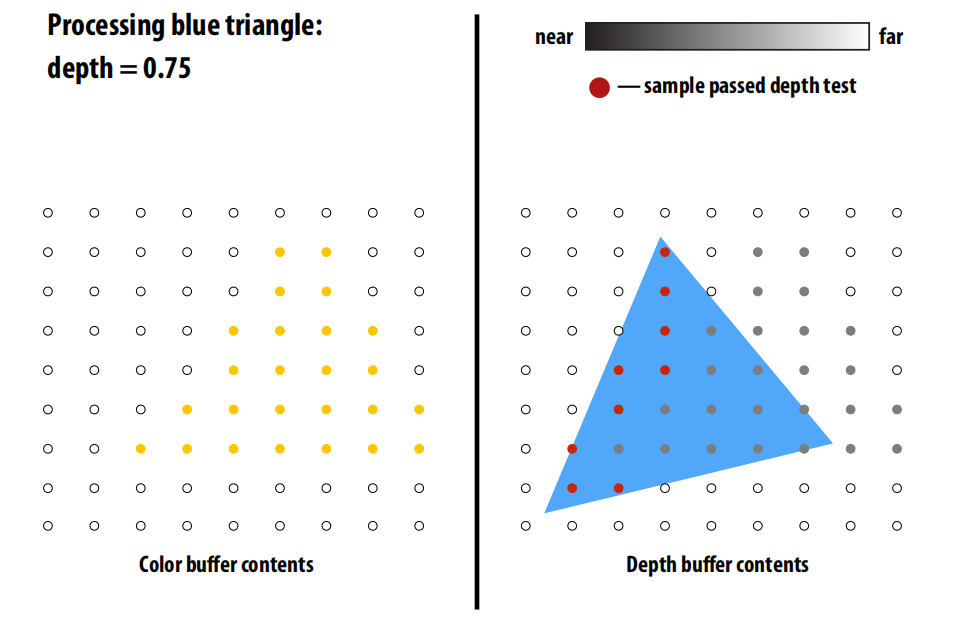

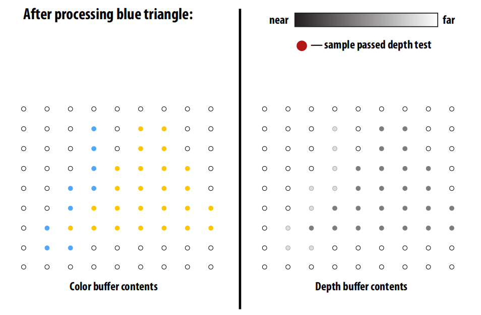

同样对于第三个三角形：

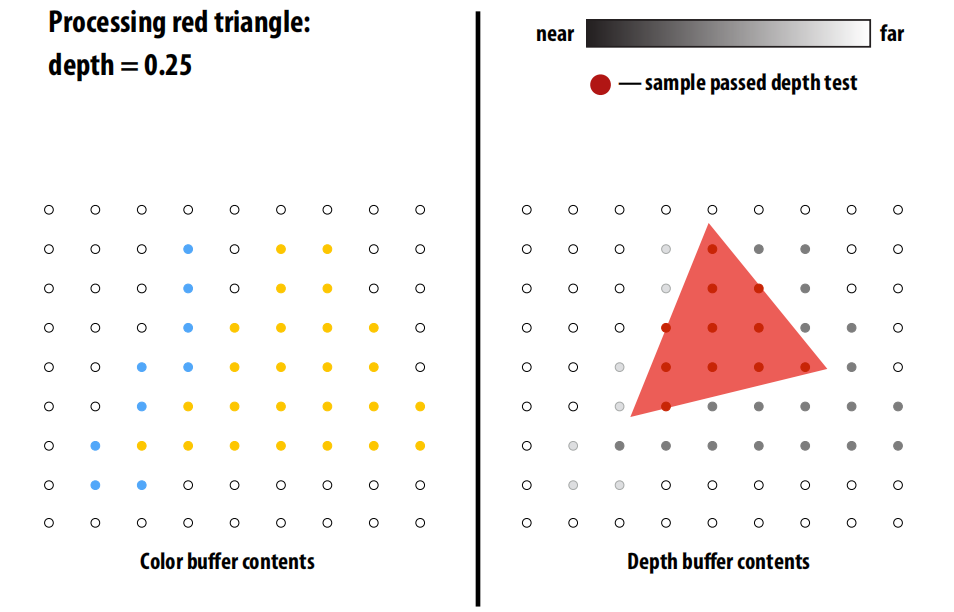


#### 深度缓冲算法伪代码
```typescript
bool pass_depth_test(d1, d2)
{
    return d1 < d2;
}

/**
 * x: 当前采样点的x坐标
 * y: 当前采样点的y坐标
 * d: 当前采样点的深度
 * c: 当前采样点的颜色
 */
draw_sample(x, y, d, c)
{
    //如果通过深度测试，则当前采样点离我们更近，同时更新深度缓冲和颜色缓冲
    if(pass_depth_test(d, zbuffer[x][y]))
    {
        zbuffer[x][y] = d;
        color[x][y] = d;
    }
    //否则在深度缓冲中已存在的片元离我们更近，保持不变
}
```

#### 深度缓冲+相交三角形
深度缓冲算法能否处理三角形相互穿插覆盖的情况呢？

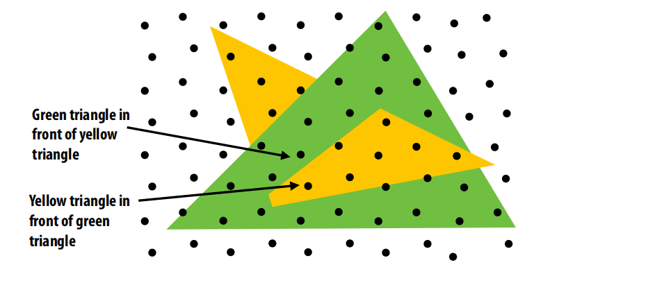

答案是肯定的，因为遮挡性测试是基于三角形片元层面进行操作的，而每个三角形内部片元的深度都是不同的，所以处理穿插三角形也完全没有问题：


#### 深度缓冲+超采样
那么深度缓冲和超采样在一起能否正常工作呢？答案也是肯定的，因为只要在超采样的每个采样点做深度测试即可：

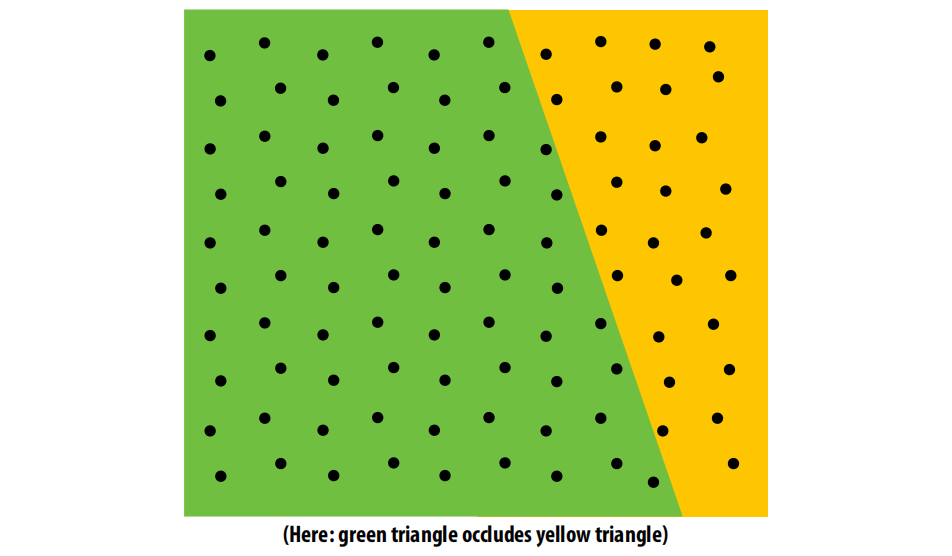

经过深度缓冲处理后的超采样颜色缓冲：

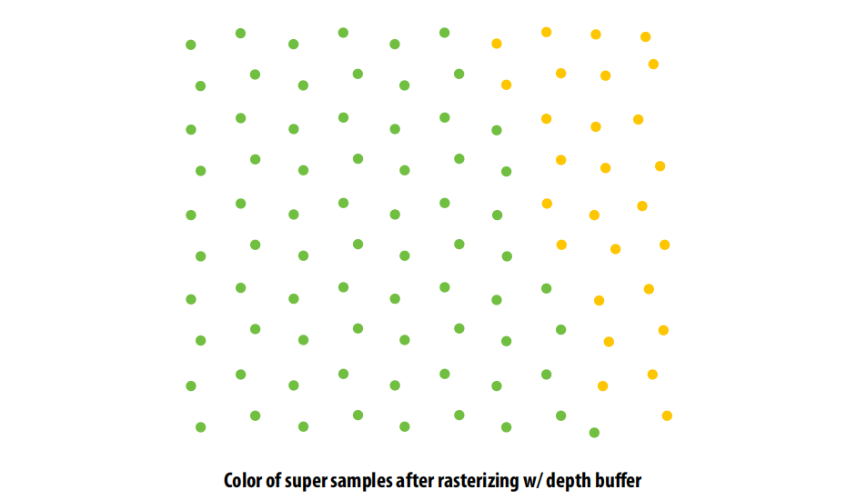

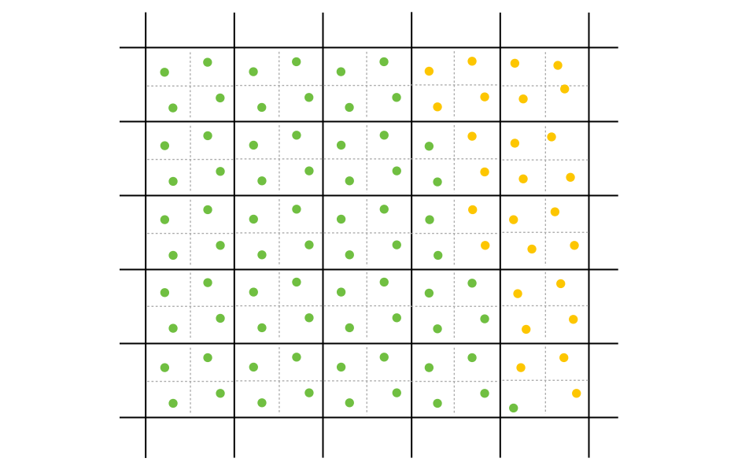

最终输出到帧缓冲的颜色只需要对每像素的四个采样点颜色做加权平均处理即可：

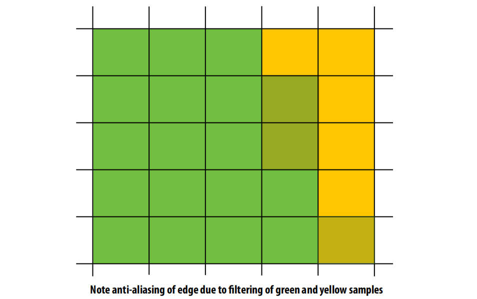

#### 深度缓冲遮挡性判断算法总结：
- 每个采样点(超采样点)存储深度信息-注意不是每个像素！
  - 深度缓冲需要常数的存储空间
  - 额外的存储空间不依赖于遮挡片元的数量
- 对于每个覆盖的采样点需要常数时间的深度测试
  - 如果通过深度测试需要一次读取一次写入
  - 否则只需要一次读取操作
- 不仅适用于三角形：只要能够计算当前屏幕上采样点的当前深度即可

### 半透明物体混合
那么如果模型是半透明的，相互遮挡关系如何处理呢？基本思路是通过$alpha$来表达当前物体的不透明度：

$alpha$值位于0到1之间，描述了物体的不透明度，$alpha$为1表示物体是不透明的，$alpha$值越低，透明度越高，衰减为0表示完全透明：

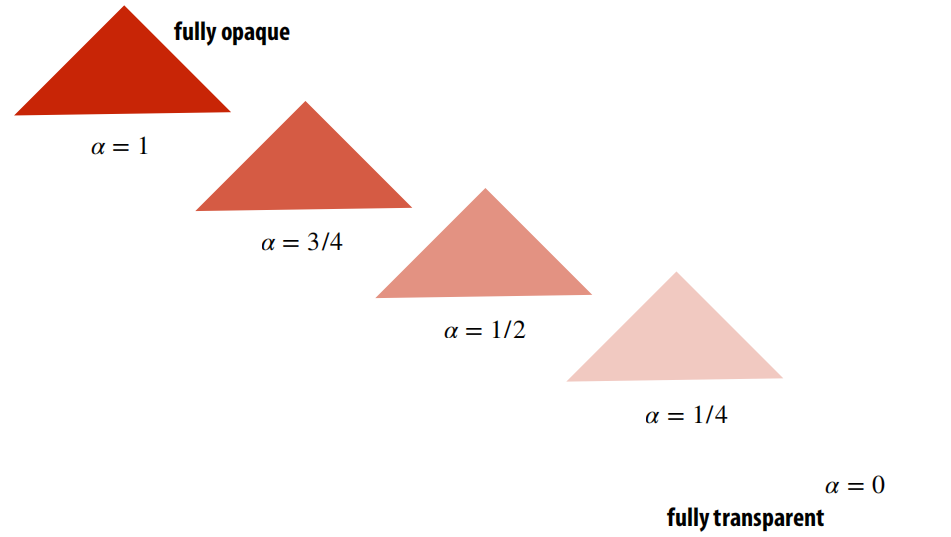

除了对真个物体应用一个透明度外，还可以逐像素应用透明度，也就是常说的透明度通道，可以使用透明度通道将两张图片合成一张：

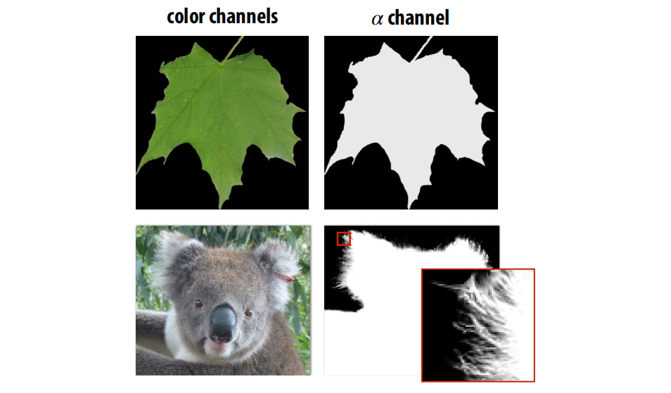

当初次进行这种图片合成时，利用$alpha$通道将背景和前景色混合，可能会出现一些意想不到的情况，物体的边缘会出现一些黑色轮廓($fringing$):

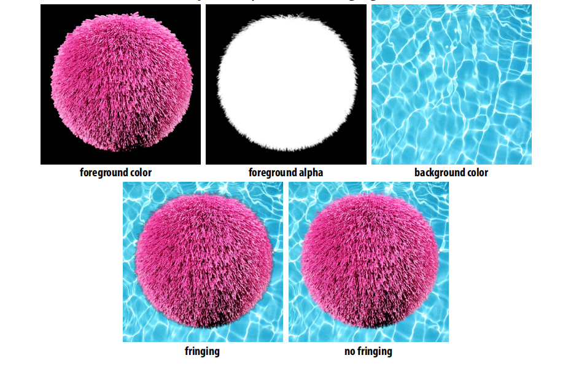

接下来我们从数学层面深度分析下这种现象出现的原因，以及如何避免该问题。

#### $over$操作符($alpha$合成)
$over$操作符所要作的就是将透明度为$a_{B}$的图片$B$合成混合到透明度为$a_{A}$的图片$A$上。

这里拿有色玻璃来举例说明，有两块有色玻璃，B是偏红色，A是偏黄色的，如果将B放在A上，呈现效果如左图所示，如果将A放在B上，呈现效果如右图，显而易见，这两者得到的结果是不一样的，也就是说$over$操作是不可交换的：

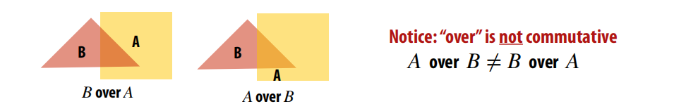

如果对图片采用相同的操作，效果也一样，左边是一张考拉的图片和它的$alpha$通道，中间这张是纽约市图片，将两个图片合成混合后结果如右侧图片所示：

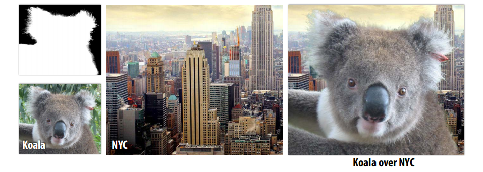

那么问题来了,$over$操作符到底是如何运作的，如何将两个像素的颜色值混合？

##### $over$操作符:非预乘
假设我们想要将透明度为$a_{B}$的图片$B$合成到透明度为$a_{A}$的图片$A$上，我们可以尝试这样做：

首先图片$A和B$的颜色均有三个通道组成$rgb$：

$A = (A_r,A_g,A_b)$

$B = (B_r,B_g,B_b)$

第一步对颜色合成：

$C = a_{B}B + (1-a_{B})a_{A}A$

第二步单独对$alpha$通道合成：

$a_{C} = a_{B} + (1-a_{B})a_{A}$

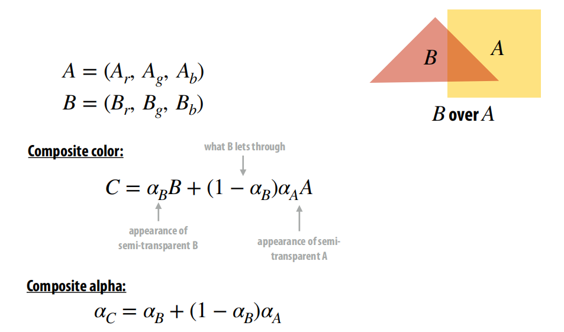

这种想法感觉很自然很合理，但是通过这种方式合成的图片在物体边缘处会形成暗色轮廓($fringing$)，取而代之我们可以采用预乘$alpha$的方式。

##### $over$操作符:预乘
与非预乘的方式不同，不会对颜色通道和$alpha$通道单独做处理，预乘方式会首先将各图片的颜色乘以对应的$alpha$通道(预乘),然后再对图片合成：

首先将图片$A$的颜色与其$alpha$通道相乘：

$A^丶 = (a_{A}A_{r},a_{A}A_{g},a_{A}A_{b},a_{A})$

然后将图片$B$的颜色与其$alpha$通道相乘：

$B^丶 = (a_{B}B_{r},a_{B}B_{g},a_{B}B_{b},a_{B})$

基于$a_{B}$混合$A^丶和B^丶$:

$C^丶 = B^丶 + (1-a_{B})A^丶$

最后通过将$C^丶$除以$a_{C}$“取消预乘”:

$(C_r,C_g,C_b,a_C)  => (C_r/a_C,C_g/a_C,C_b/a_C)$

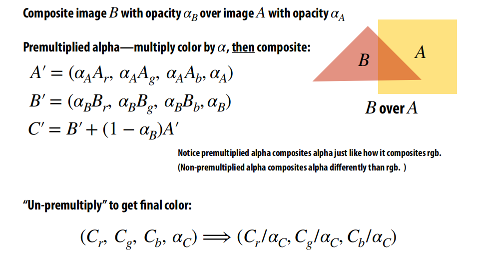

本质上，$A^丶和B^丶$存储记录的是比原始原色更暗的版本，以及颜色衰减系数(相应的$alpha$值)，合成的颜色$C^丶$是基于原始的$over$操作符实现的，也就是$B^丶$(已经预乘过,所以不需要乘以$a_{B}$),加上$B$允许通过的颜色即$1-a_{B}$，乘以$A^丶$(已经预乘过,所以不需要乘以$a_{A}$),这里合成颜色和$alpha$采用一致的策略，并没有单独处理$alpha$通道，最后通过将$C^丶$除以$a_{C}$“取消预乘”。

这里为什么要将最后的颜色通道除以$a_{C}$呢？因为最开始由于预乘操作，$A^丶和B^丶$都是原始像素颜色的衰减变暗版本，所以这里需要除以最后的$alpha$值，$a_{C}$来恢复原始原色。这个除法操作和齐次坐标很像，可以把不同的颜色比做空间中不同的方向，而颜色的不同$alpha$值可以认为是沿着该方向上不同的点。通过预乘的方式可以显著改善图片合成的行为。下边就举几个例子来说明：

##### 上采样(非预乘/预乘)
假设我们要对一张透明度为$a$的图片上采样，然后将其贴到一张背景图片上，图片$B$背景为绿色，中间有一个蓝色小方块。

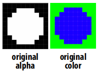

首先使用非预乘方式：

分别对$alpha$和颜色上采样(双线性插值)，但是这时问题就来了，由于原始图片有一个绿色背景，对颜色上采样后，方块边缘会出现绿色和蓝色的混合色，基于这个结果执行$over$操作符，会在合成后的图片方块边缘形成明显的暗绿色边缘。

如果使用预乘方式：
首先对原始图片预乘$alpha$，对预乘后的图片上采样，这样就可以消除原始图片绿色背景的暗影，因为经过预乘后背景的绿色就已经被完全消除掉了，最后再执行$over$操作符，结果就自然多了。

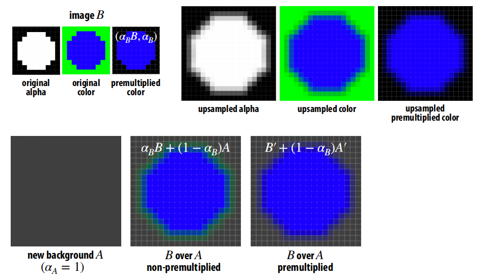

##### 下采样(非预乘/预乘)
考虑对一张有$alpha$通道的纹理做预过滤，生成$Mipmap$：

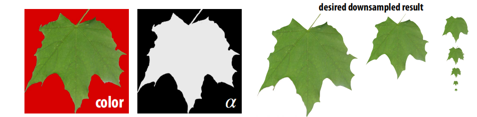

首先考虑非预乘的方式，放大纹理到树叶边缘，左侧两个像素是绿色的，右侧两个像素的红色的，透明度通道左侧是完全不透明，右侧是完全透明的，如果采用原始方式直接处理，会对四个像素加权平均，过滤后的颜色值是类似于棕色的，透明度通道是0.5的灰度值，基于这个结果将图片合成到白色背景上，会得到类似于淡黄色的叶子颜色：


而采用预乘的方式，过滤后的颜色会变成暗绿色(绿色和黑色的混合)，$alpha$仍然为0.5的灰度值，最后通过取消预乘将颜色除以$alpha$，结果就得到了更明亮的绿色了：

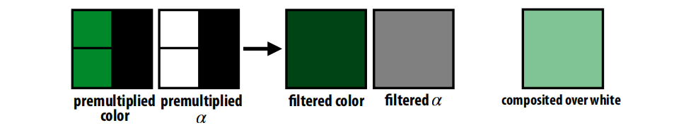

##### 合成多张图片
假设现在要合成多张图片，将透明度为$a_{C}$的图片$C$合成到透明度为$a_{B}$的图片$B$上，然后合成到透明度为$a_{A}$的图片A上：

预乘$alpha$在多次合成后是闭合的(closed)，而非预乘则不会。

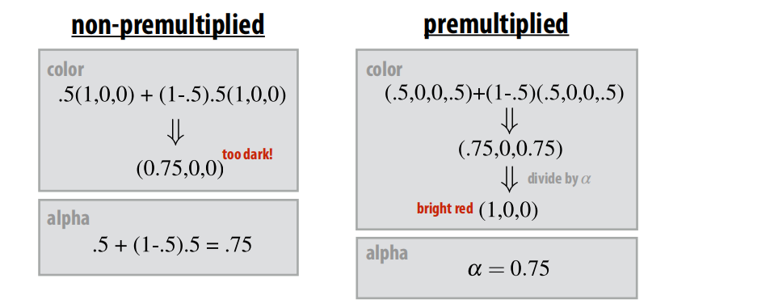

##### 总结预乘$alpha$的优势

- 合成操作对所有通道(颜色通道和$alpha$通道)行为都是一致的
- 对于$over$操作符来说所需的算术运算更少
- 多次合成操作后是闭合的
- 对有$alpha$通道的图片上采样/下采样有更准确更好的表达
- 先天适合光栅化管线(齐次坐标的齐次除法/取消预乘的除法操作)

#### 单独绘制半透明物体策略
假设所有图元都是半透明的，并且图片的颜色也都是经过$alpha$预乘的，这里是光栅化一张图片的常用策略，伪代码如下：

```typescript
over(c1, c2)
{
    return c1.rgba + (1-c1.a) * c2.rgba;
}

update_color_buffer(x, y, sample_color, sample_depth)
{
    if(pass_depth_test(sample_depth, zbuffer[x][y]))
    {
        color[x][y] = over(sample_color, color[x][y]);
    }
}
```

**注：这里有一个前提假设：即半透明三角形必须经过事先排序的，必须从后往前绘制，应为$over$操作符是不可交换的。**

但是在光栅化管线中对三角形排序是一件很麻烦的事，除此之外如果两个三角形彼此相互遮挡该如何排序呢？光栅化管线中渲染半透明物体是一件很痛苦的事：）
- $alpha\ Buffer$
- $order\ Independent\ Transparency(OIT)$

#### 绘制不透明物体和半透明物体
如果场景中包含有不透明三角形和半透明三角形，如何对其进行混合呢?

- 首先基于深度缓冲策略以任何顺序绘制不透明物体，如果通过深度测试，更新颜色缓冲和深度缓冲
- 禁用深度缓冲写入，从后向前渲染半透明物体，如果通过深度测试，将半透明片元通过$over$操作符写入相应采样点的颜色缓冲。注意这一步不只执行深度测试，不做深度写入。并且渲染的半透明三角形首先是需要排序的。


## 总结光栅化渲染管线(完结)
光栅化管线的最终目的是将一些输入最终转换成一张图片。输入包含有以下几块内容：

首先是三角形顶点属性，例如位置，纹理坐标等，当然还有需要采样的纹理：

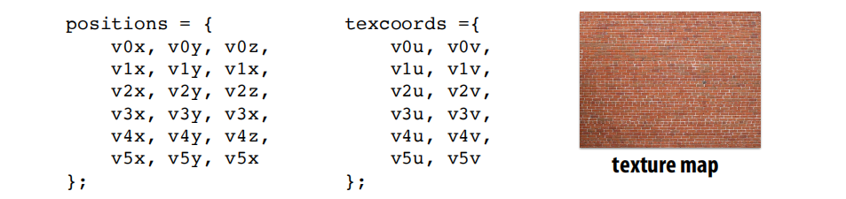

其实是矩阵信息：
1. 对象到相机空间的变换矩阵，本质上就是需要对物体应用什么样的变换来造成移动相机的错觉，使用$4X4$相机矩阵的逆矩阵即可
2. 投影变换：从三维空间到二维空间的投影矩阵，可以是正交投影或者透视投影
3. 输出图片的宽高$(W,H)$
   
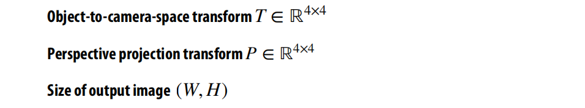

### 变换到相机空间
光栅化管线每次处理一个三角形，有了三角形的三个顶点属性，相机矩阵和投影矩阵后，对于每个三角形，首先将其从世界空间变换到相机空间，只需要对三角形三个顶点应用相机矩阵的逆矩阵即可：

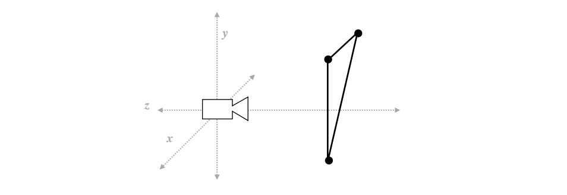

### 从相机空间到$NDC$空间
对三角形顶点应用投影矩阵将其从转换到$NDC$空间，也就是将顶点从$frustum$变换到$[-1,1]^3$的单位立方体中

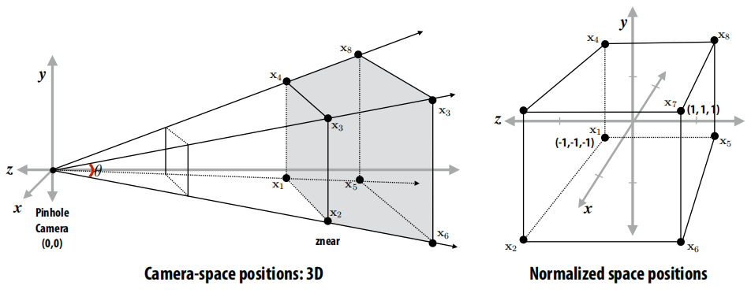

### 裁剪
- 丢弃完全位于$NDC$外部的三角形，已经完全在屏幕范围外，不需要进一步处理
- 完全位于内部的三角形保留
- 裁剪部分位于$NDC$内部的三角形，这一步会生成新的三角形
经过这一步处理，就有所有位于$NDC$内部的三角形了

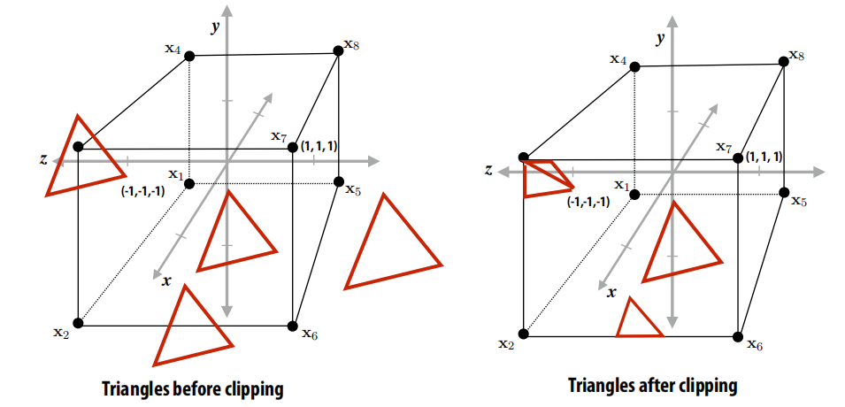

### 从$NDC$到屏幕空间
接下来执行透视除法，将顶点的$xy$从$NDC$空间变换到屏幕空间。基于事先定义的图片宽高$(W,H)$

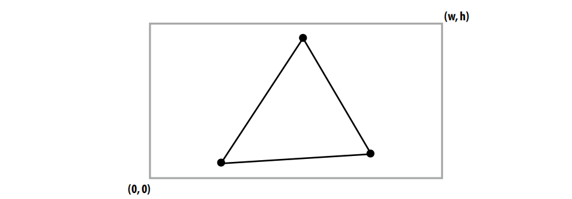

### 初始化三角形(三角形预处理)
在对三角形光栅化处理前，需要预计算很多数据用于后续的片元例如：

- 三角形边方程
- 属性方程
- 等等

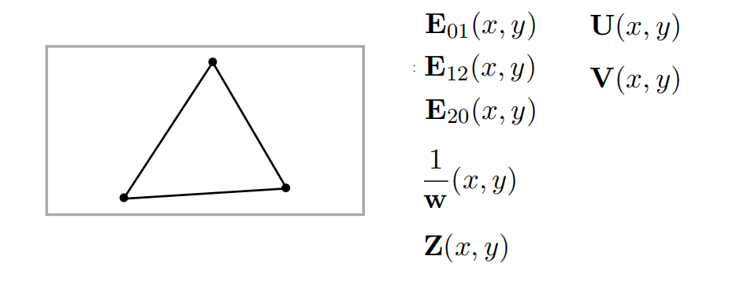

### 采样覆盖率计算
依据上一步提供的预计算结果，测试每个采样点，是否被三角形所覆盖，如果在三角形内部，则基于重心坐标插值来计算采样点的属性($uv$等)

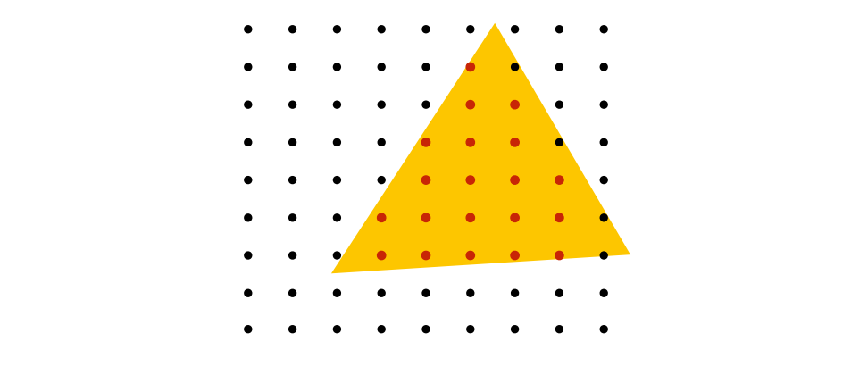

### 纹理采样
基于插值得到的采样点$uv$，对纹理采样，这个过程可能涉及到双线性插值，$Mipmap$三线性插值等，无论如何这一步获取到了像素的颜色：

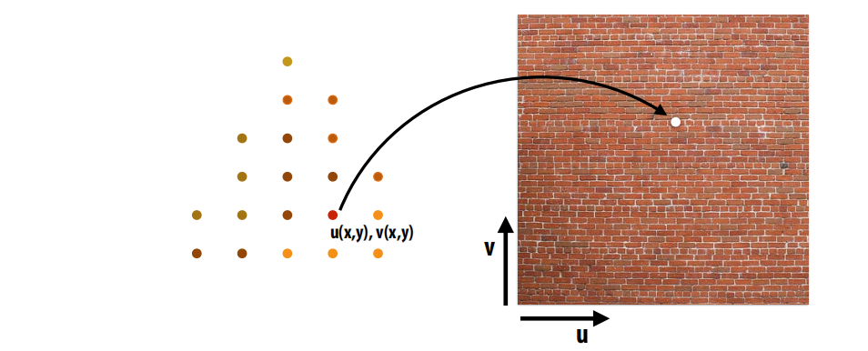

### 深度缓冲
有了像素颜色后，需要判断是否将颜色写入颜色缓冲中，因此需要执行深度测试，如果当前片元离我们更近，将该片元的深度值写入深度缓冲，同时将采样得到的颜色只写入颜色缓冲：

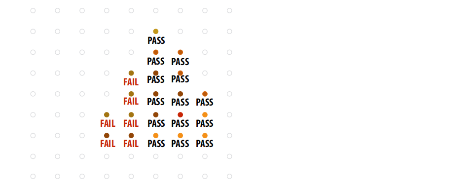

## 现代图形渲染管线
现代图形渲染API例如openGL和Direct3D等，和我们之前讨论过的渲染管线没有本质区别，其核心框架也遵循以上几个步骤：

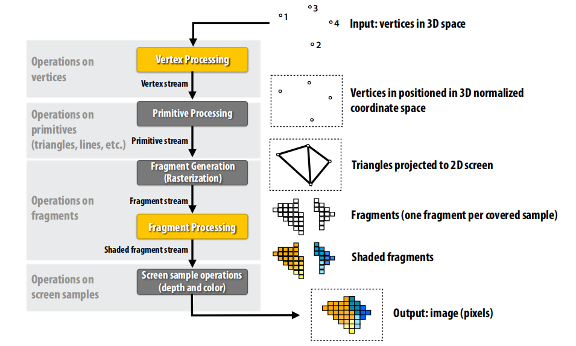