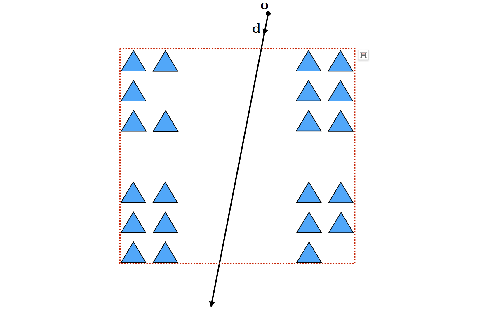
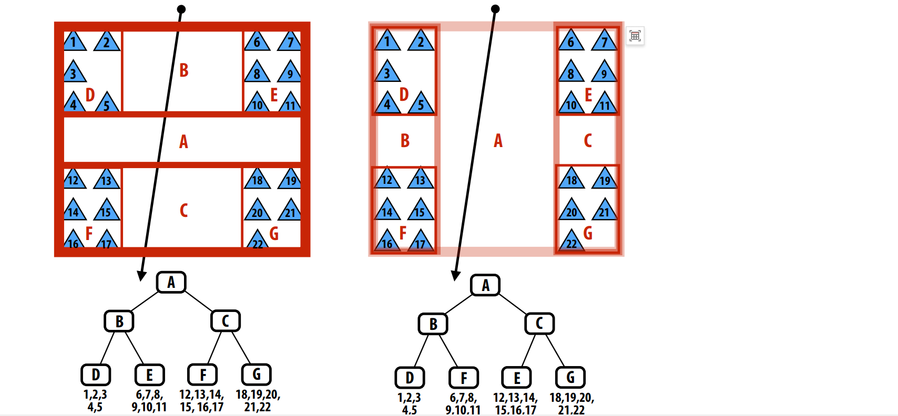

# Computer-Graphic08-空间数据结构

本篇文章我们讨论当场景复杂度大幅增加时，如何进行高效的几何查询。现实世界中的真实场景极其复杂，那么从计算的角度我们如何处理这些复杂的场景呢？其中很重要的一个用例就是光线追踪：用于光线和场景求交。


## 光线三角形求交
声明一个三角形，三个顶点分别是$p_0,p_1,p_2$, 定义一条光线，从$o$出发，沿着$d$方向行进，光线的参数化方程可以定义如下：

$\mathbf{r}(t) = \mathbf{o} + t\mathbf{d}$

这里需要解决两个问题，第一个光线是否与三角形相交，第二个如果相交那么交点在哪里？


首先将光线的参数化方程代入平面的隐式方程可得：

$N^Tx = c$

$N^T(\mathbf{o} + t\mathbf{d}) = c$

解方程得到$t$等于：

$t = (c - N^T\mathbf{0})/N^T\mathbf{d}$

将$t$代入光线的参数方程即可得到光线和三角形所在平面的交点。这一步仅仅判断了光线和平面是否相交以及交点在哪，下一步还需要判断交点是否在三角形内部。

我们换种思路，采用第二种方式，首先用三角形的三个顶点和重心坐标写出三角形的参数化方程：

$f(u, v) = (1- u - v)\mathbf{p}_0 + u\mathbf{p}_1 + v\mathbf{p}_2$

满足条件的$uv$首先都需要大于等于0，其次$uvw$相加等于1.

可以从另一个角度来考虑这个参数化方程，我们可以认为$f(u,v)$将一个单位直角三角形转换成了我们需要的三角形，这真是该参数方程所做的事情：


将该三角形的参数方程代入光线方程可得：

$p_{0} + u(p_{1} - p_{0}) + v(p_{2} - p_{0}) = \mathbf{o} + t\mathbf{d}$

现在有三个未知数，时间$t$以及重心坐标$uv$, 但由于$p_{0},p_{1},p_{2},\mathbf{o},\mathbf{d}$都是三维向量，因此上述公式实际上是三个方程组，因此可以通过解线性方程组通过矩阵的方式来求解$u,v,t$,将以上公式变形可得：


矩阵$M$由三列构成$p_{1}-p_{0}, p_{2}-p_{0}, -\mathbf{d}$，求解得到$u, v, t$后，只需要判断$t >= 0$并且$uv$满足三角形内部重心坐标大于0三者相加等于1即可。

从几何视角来看，$M^{-1}$将三角形还原为了单位直角三角形，并且光线正交于三角形所在平面：


## 求解首次交点问题
给定一个由$N$个图元组成的场景以及一条光线$r$，找到光线$r$与场景的最近交点：


最简单原始的方法是，循环计算光线与所有三角形的交点，比较判断最近的交点是哪一个。但对于有$N$个图元构成的场景来说，时间复杂度达到了$O(N)$，这样显然不够好，时间复杂度太高了。取而代之我们可以先判断光线是否与整个模型相交，如果没有相交则模型的所有图元就都不用判断了, 这就引入包围盒的概念。

### 包围盒($BoundingBox$)
包围盒即将模型包裹的最小矩形盒子,遍历所有图片顶点，找到$max/min(x, y, z)$即可：


有了包围盒就可以先判断光线是否与包围盒相交，如果不相交，那么就省去了内部所有图元与光线的相交判断测试；如果光线与包围盒相交，那么仍然需要遍历所有图元，做图元和光线的相交测试，所以对于最差的情况时间复杂度仍然为$O(N)$，但是在继续之前，先让我们看下光线与$AABB$包围盒是如何进行求交测试的。

#### 光线$AABB$求交测试

可以把AABB想象成由3对平面组成的,所以光线与$AABB$的求交就可以转换为光线与这些平面求交,那么如何计算光线与平面求交呢?根据平面方程定义可知:

$\mathbf{N^T}(\mathbf{x}) = c$


其中$\mathbf{N}$为平面法线,c为平面距原点距离.将光线方程带入可得:

$\mathbf{N^T}(\mathbf{0} + t\mathbf{d}) = c$

由于包围盒是轴对齐的($AABB$),假设现在构造的是$x = x_{0}的平面$可以将方程简化如下:

$\mathbf{N^T} = [1\ \ 0]^T$

$c = x_{0}$

$t = \frac{x_{0} - \mathbf{o_{x}}}{\mathbf{d_{x}}}$


按照上述步骤求解光线和所有平面的交点,然后取$[t_{min} \ t_{max}]$区间的交集即可.如果交集为空,则光线与盒子不相交,如果交集不为空,则交集的$[t_{min} \ t_{max}]$区间即光线在盒子内部停留的时间.


## 从一个简单的小问题开始

假设有一个整数集合$S$, 给定任意一个整数$k$, 假设$k$等于18,找到集合$S$中离$k$最近的元素:

最简单粗暴的方式遍历集合$S$,但是这样对于包含$N$个元素的集合来说,时间复杂度会变为$O(N)$


有没有更好的方法呢?

答案是肯定的, 我们可以对数组先排序,然后二分查找即可.


但是此时时间复杂度就要考虑上排列所消耗的时间,对于一次查找来说时间复杂度变成了$0(N\log_{N})$
但是对于多次查找的平均时间复杂度降低为了$O(\log_{N})$

## 回到三维场景

那么有没有可能将场景中的图元按照排序数组的方式重新组织加速光线与场景的求交查询呢?


### 从一个简单的场景开始

考虑如下场景: 场景有一些四处散列的三角形片元, 那么按照我们之前的策略, 先构造场景的$AABB$包围盒,先判断光线是否与包围盒相交,  在本例中光线与包围盒不相交:

那么构造包围盒本身的时间复杂度为: $O(N)$

光线与包围盒求教测试的时间复杂度为:$O(1)$

平均复杂度为: $O(N)$


也就是说光线与包围盒不相交的时间复杂度降低到了常数时间,这很棒.

但是换另外一个场景,加入光线与包围盒相交:



此时构造包围盒本身的时间复杂度仍然为: $O(N)$

光线与包围盒求教测试的时间复杂度为:$O(1)$

光线与三角形求交的时间复杂度为: $O(N)$

平均复杂度仍然为$O(N)$

显然比之前的方式并没有好到哪里去. 因为仍然无法避免光线与每个三角形的求交测试.

有没有可能做的更好呢?

可以把之前解决数字序列问题的思路带入带这里: 不仅仅构造一层包围盒, 而是嵌套构造很多层, 这就引入层次包围盒的概念了($BVH$).

## 层次包围盒($BVH$)

在层次包围盒中,只有在叶子节点才会存储真正的图元集合, 包含有图元实体, 其他节点存储的仅仅是它所包含节点的包围盒而已. 从某种程度上来说代表了更大的图元集合, 基于包围盒的方式.



$BVH$的思想和对数组排序二分查找思想很相似, 如果与某个节点相交, 则继续递归该节点包含的子节点, 如果不相交则跳过.
 
上图中展示了两种构造$BVH$的方式, 可见构造$BVH$的方式有多种不是固定的, 对于图上场景来说,显然右侧的构造方式对于求交测试更友好些, 因为只有三次求交判断, $B和C$两个节点都未与光线相交, 节省了内部节点的相交测试过程.

### $BVH$划分图元的方式

$BVH$将每个图元划分到不同的离散集合内. 图元要么属于A集合要么属于B集合, 不存在一个图元同时位于两个集合空间的情况.但是正是由于这种特性造成了$BVH$的中间节点包围盒可能出现相互重叠的现象,如下图所示:


因此一条光线有可能穿过两个包围盒相交的部分, 这样以来包围盒相交部分越多, 则求交效率越低, 当两个包围盒完全重叠, 则退化为$O(N)$的情况.

## 光线与场景求交算法和数据结构

首先定义$BVH$节点结构体:

```cpp
struct BVHNode
{
    bool leaf;
    BBox bbox;
    BVHNode* left;
    BVHNode* right;
    Primitive* primList;
}
```

然后定义当光线与$BVH \ Node$相交是存储的交点信息:

```cpp
struct HitInfo
{
    Primitive* prim;
    float t;
}
```

最后实现光线与$BVH$求交算法:

```cpp
void find_closest_hit(Ray* ray, BVHNode* node, HitInfo* info)
{
    HitInfo hit = intersect(ray, node->bbox);
    if(hit.prim == nullptr || hit.t > closest.t)
    {
        return;
    }

    if(node->leaf)
    {
        for(each primitive p in node->primList)
        {
            hit = intersect(ray, p);
            if(hit.prim != nullptr && hit.t < closest.t)
            {
                closest.prim = p;
                closest.t = t;
            }
        }
    }
    else
    {
        find_closest_hit(ray, node->left, closest);
        find_closest_hit(ray, node->right, closest);
    }
}
```

### 提高求交效率的策略

#### front-to-back traversal

```cpp
void find_closest_hit(Ray* ray, BVHNode* node, HitInfo* closest)
{
    if(node->leaf)
    {
        for(each primitive p in node->primList)
        {
            hit = intersect(ray, p);
            if(hit.prim != nullptr && hit.t < closest.t)
            {
                closest.prim = p;
                closest.t = t;
            }
        }
    }
    else
    {
        HitInfo hit1 = intersect(ray, node->left->bbox);
        HitInfo hit2 = intersect(ray, node->right->bbox);
        BVHNode* first = (hit1.t <= hit2.t)? node->left : node->right;
        BVHNode* second = (hit2.t <= hit1.t)? node->right : node->left;

        find_closest_hit(ray, first, closest);
        if(hit2.t < closest.t)
        {
            find_closest_hit(ray, second, closest);
        }
    }
}
```

#### 构造更好的$BVH$
对于给定的图元集合,有很多种构造$BVH$的方式, $2^N/2$种方式将N个图元分成两组.那么问题是我们如何快速构造一个高性能的$BVH$呢?


对于这种场景,我们可以按照图元数量线性划分:

但是对于这种分布的三角形呢?


如果还按照图元数量线性划分的话,会呈现这样的结果:


左侧的包围盒有很大的空间浪费,造成即使光线命中包围盒也无法与图元相交, 同时两个包围盒之间有重叠.

更好的划分方式是这样的:


****intuition: 最小化包围盒,减少包围盒之间的叠加.****

## 图元划分 VS 空间划分

截止到目前我们所介绍的策略是按照图元划分的,将图元划分到不同的空间,递归执行此过程构建树结构.
空间划分的方式完全不同, 它将空间划分为两个区域,同一个图元可能会被包含进多个空间中.


### $KD-Tree$

空间划分策略的典型代表就是$KD-Tree$.它采用与轴对齐的分区平面递归划分子空间.每次划分将空间一分为二
- 中间节点代表了空间划分
- 叶子节点代表了图元集合
- 和$BVH$不同, 当找到第一个交点后可以提前终止递归


#### $KD-Tree$的问题

$KD-Tree$希望节点遍历以从前到后的顺序进行，以便遍历可以在找到第一个命中后终止搜索.

但是由于$KD-Tree$按照空间划分的特性会导致同一个图元被包含进不同的节点中.

如下图所示,三角形1同时被包含进多个节点中.光线在高亮区域节点命中三角形1, 会导致递归提前终止, 而显然从图中可以看到, 三角形2离光线更近.但是由于递归提前终止, 导致无法遍历三角形2了.

解决方案: 需要光线与图元的交点位于当前子节点内部.

这样就会造成另外一个问题,光线与同一个三角形求交会计算多次.

****可以通过caching或者mailBoxing解决光线与三角形多次求交问题.****


### $Uniform Grid$
另外一种常见的空间划分方式为$Uniform Grid$, 它将空间划分为均等的体积(体积元素或者称为体素($voxels$)),每个单元格会包含覆盖在其上的图元(构造加速结构非常简单高效).


优势:
- 可以按顺序遍历网格
- 实现非常高效(类似三位空间的线条光栅化)
- 只考虑与射线相交的体素中的图元

劣势:
- 需要考虑划分网格的数量, 太少的网格会退化为一开始暴力循环的情景, 太多的网格会造成光线遍历过程中有很多空的节点, 性能会受到显著影响.


#### 空间划分常用策略

****划分体素的数量约等于图元的数量****

假设图元是均匀分布的, 那么每个体素内部的图元数量就基本一样, 这是种很理想的情况.


#### $Uniform Grid$应用

$Uniform Grid$适用于图元均匀分布的空间,例如山地/草地, 在这种场景下
$Uniform Grid$工作的很好


 
$Uniform Grid$不适用于空间中图元分布不均匀的场景, 和$KD-Tree$不同, $Uniform Grid$的空间划分是不依赖于场景的.

一个比较极端的例子: Teapot in a stadium problem
场景空间很大, 但是三角形片元高度集中在很狭小的区域内:


### $Quad-Tree/ocTree$

也是一种层次包围盒结构, 和$Uniform Grid$类似,很容易构建, 不用选择切分平面, 但是和将空间二分($KD-Tree$)不同的是, 二维空间会均等的切分成四份(四叉树),三维空间均等的切分为8份(八叉树), 另外比$Uniform Grid$好的一点是, $Quad-Tree/ocTree$会根据场景复杂度, 层层递进拆分空间,直到子节点包含的图元满足设定的要求.


## 空间加速结构总结

### 图元划分 vs  空间划分

 图元划分: 
 - 基于对象图元集合的划分方式, 有限数量的$BVH \ Node$节点数量, 节点总数量和图元在空间中的分布无关.
 - 场景中图元改变位置后$BVH$更新操作很简单,只需要从图元开始更新包围盒,递归更新父节点包围盒即可.对于运动的场景来说$BVH$有很大优势.

 空间划分:
 - 可以按照顺序遍历空间(第一次计算得到的交点即最近的交点, 可以提前退出循环)
 - 会出现和同一个图元多次求交的情况(因为一个图元可能会被划分到不同的节点内)

### 自适应结构($BVH$ & $KDTree$)

构造阶段比较复杂, 需要考虑每次拆分的合适位置, 好处是自适应结构通常比非自适应结构求交效率要高得多.

### 非自适应结构($Uniform grid$)

不需要花费太多精力去构造, 并且如果空间的图元分布是均匀的, 求交效率也不错, 但是通常情况下求教效率比较低, 因为大多数情况下空间中的图元是非均匀分布的.

### 混合使用各种策略
每种加速结构不是单一使用的, 可以将他们搭配在一起组合使用,比如$Uniform grid$中的每个单元格可以继续拆分为$KD-Tree$等等.

### 空间加速在图形学中的应用

几何领域:

- 内部外部测试($Inside-outside tests$)
- 最近点测试 ($closest point tests$)

动画/模拟:

- 粒子系统
- N体问题, 流体模拟
- barnes-hut算法
- 快速多极子算法($fast multipole method$)

渲染领域:

- 可见性
- 基于物理的光线追踪


