# 颜色

## 颜色是什么

****光线就是震荡的电磁场, 颜色就是频率****

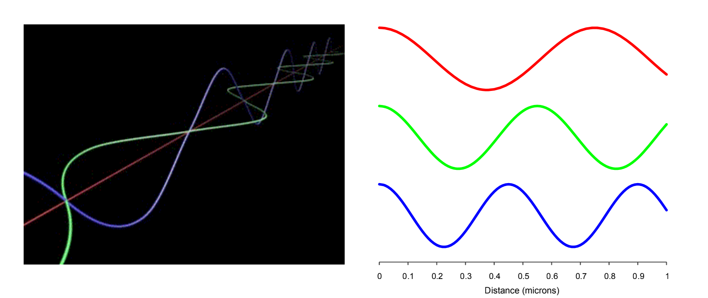

电磁场震荡的频率决定了光线的颜色.

那么光线的波长和频率之间有什么关系呢?

波长和频率其实本质上表征的是一件事情, 但是使用了不同的方式来表达而已.

$wavelength = 1 / frequency$

$frequency = 1 / wavelength$

思考一个生活中常见的现象, 为什么炉子加热会变红?

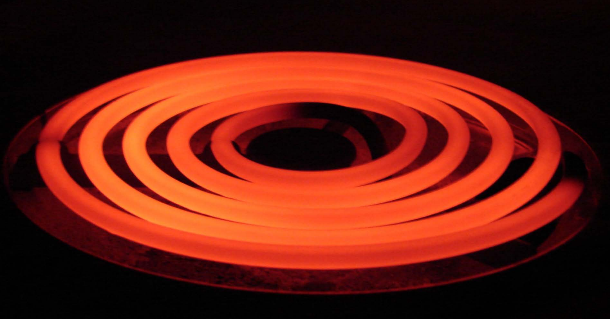

根本原因就是.热量会产生光

- 光产生的多种方式之一:
- maxwell: 带电粒子的运动会产生电磁场
- 热力学: 粒子会无处不在
- 总之,任何东西的运动都会产生光
- 换句话说:
  - 你周围的每个物体都会产生颜色
  - 频率取决于温度

### 大多数光是不可见的

人类肉眼可见的频率被称为可见光谱, 这些频率通常被称为"颜色"

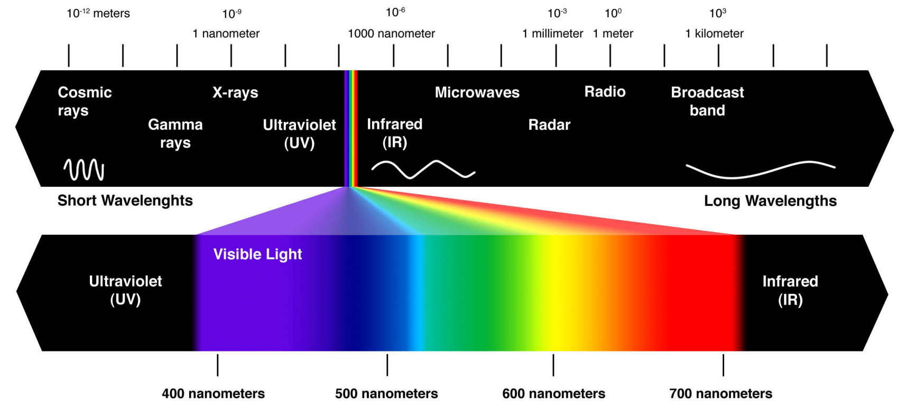

自然光通常是各种频率光的混合叠加

"白色"的光实际上是各种可见光频率的叠加, 例如来自太阳的光:

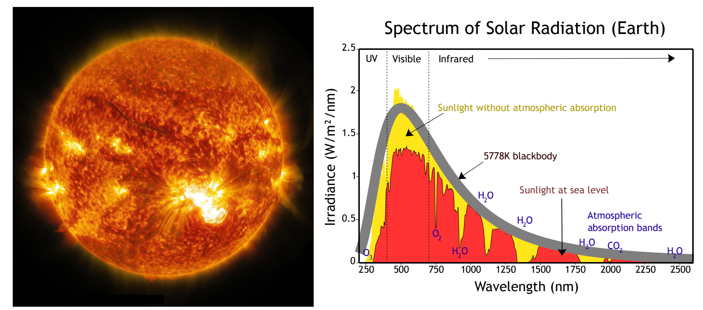

### 光的加性和减性模型

刚才我们看到的太阳频谱属于放射频谱($emission spectrum$), 它表示了在不同的波长内有多少光被产生, 产生光的源头可能是热量或者核聚变等等. 放射频谱对于现实中特定任务很有用,例如说来描述灯泡的亮度.

另外一种有用的频谱被称为吸收频谱($absorbtion spectrum$).例如颜料,它本身不产生光,而是会吸收光.吸收频谱所描述的是当用一盏白光照射物体时, 各个波长有多少百分比是被吸收的.

#### 放射频谱

将光的强度描述为频率的函数(以频率作为输入, 输出光的强度):

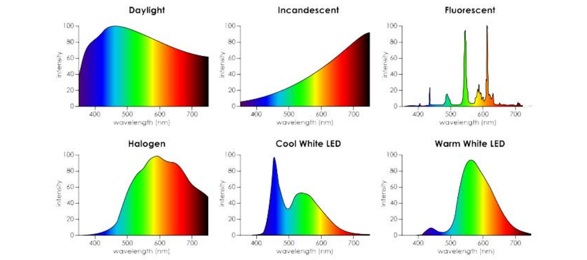

#### 吸收频谱

将光的吸收百分比描述为频率的函数(以频率作为输入, 输出光的吸收百分比):

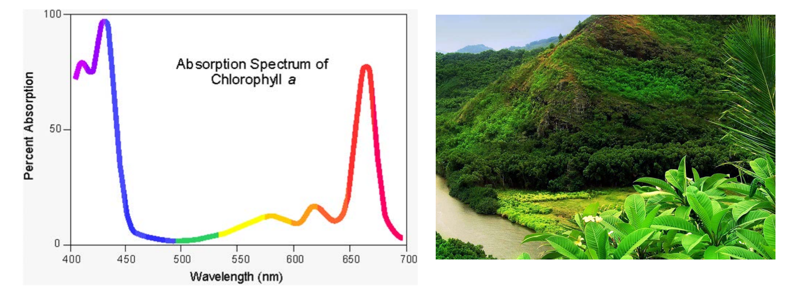

上图左侧是绿色山地的吸收频谱,可见它将红色和蓝色部分频谱的光线都吸收掉了, 将绿色和偏黄色部分频谱的光线反射, 因此我们看到的才是绿色的.

总结: 频谱就是对颜色最本质的描述:

****作为频率函数的光的强度或者吸收****

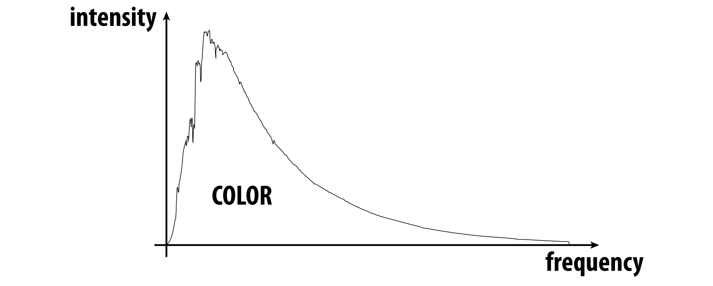

其他一切关于颜色的描述建模及编码都是对它的一个近似.

如果从光谱作为出发点来描述颜色，围绕色彩理论/实践的问题将会更有意义!

另一方面如果你认为关于颜色的数字编码例如($RGB$ $CMYK$)就是颜色的全部,那么很多现象将无法解释和理解.其实这些数字编码背后的本质是光的频谱.

### 发射和反射的相互作用
假设场景中间有一个模型, 频率记为$\nu$, 光源的发射频谱为$f(\nu)$, 模型表面的反射频谱为$g(\nu)$,:

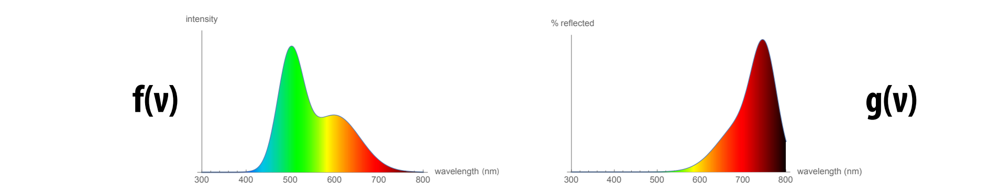

最终我们看的结果即为$f(\nu)$和$g(\nu)$的点乘, ${f(\nu)}\cdot{g(\nu)}$

因此色彩重现是一项困难艰巨的任务,因为我们要同时考虑光的发射频率和物体的吸收频率, 这对于现实世界来说是一项巨大的挑战.

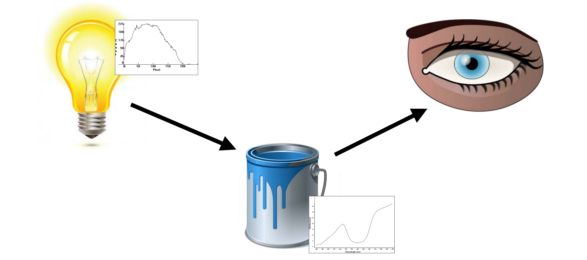

我们真正所看到的颜色不仅仅取决于光源的发射频谱和物体材质的吸收频谱, 同样还取决于另一个重要因素, 对色彩的感知,即我们的眼睛在看到颜色后如何加工处理.

这就引出了另外一个问题, 有特定频谱的电磁波在被人眼接收后, 如何感知为特定的颜色呢?

### 人眼视觉系统

人眼的构造和小孔相机类似, 光线穿过瞳孔抵达眼睛后方的中央凹(fovea centralis). 有趣的是和小孔相机类似, 人眼接收到的信号和实际场景呈现的正好也是相反的!
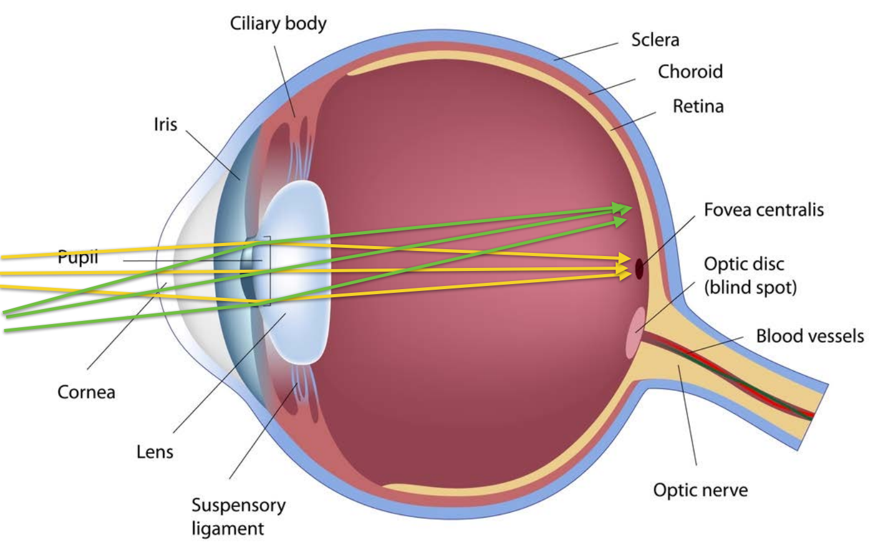

#### 感光器的响应
但是我们真正关注的是眼睛是如何接收颜色,并对颜色做出响应的, 这就要提到感光器, 当然这里的感光器是泛指,可能是人眼也可能是摄像机等等.

感光器以进入其内部的光线频谱作为输入, 也就是以波长为参数的电磁功率分布:
$\phi(\lambda)$

另外感光器对不同的波长的电磁波敏感程度是不一样的, 因此有这样一个响应函数代表了感光器对不同波长的敏感性:  $f(\lambda)$

$f(\lambda)$输出较大表示了感光器在$\lambda$波长较敏感,少量波长的光将触发较大的传感器响应.

最后,传感器的总输出可以表示为在不同波长$f(\lambda)$上输入频谱$\phi$和响应频谱$f$的积分:

$R =\int_{\lambda}\phi({\lambda})  f({\lambda}) \,d\lambda$

#### 眼睛的感光细胞:视杆细胞(rods)和视锥细胞(cones)

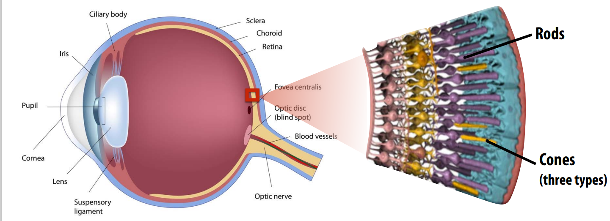

人眼的感光细胞主要分为两大类: 视杆细胞(rods)和视锥细胞(cones), 其中视杆细胞主要在昏暗的环境下发挥主要作用, 它对光线的强度很敏感, 可以在微弱的光线环境下捕捉光线, 但是对于光线的色彩感知力很差, 不关心是红色 黄色 蓝色等等. 人眼种大约有120百万个视杆细胞.

视锥细胞是高光条件下的主要感光器(如日光),人眼种大约有6,7百万个视锥细胞, 有三种不同类型的视锥细胞, 分别响应三种不同波长范围的光线(RGB).

从视杆细胞和视锥细胞在人眼种分布的数量可以发现, 人眼很擅长区分明暗或者说亮度, 但是对于不同色彩的感知就没那么强了.

视网膜上视杆细胞和视锥细胞的密度分布:
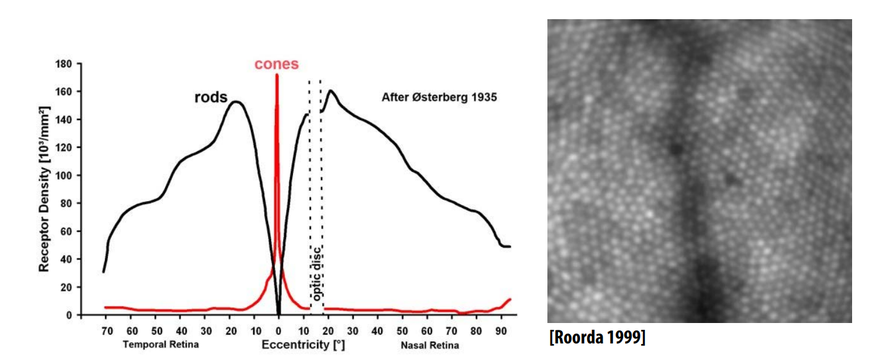

从图中可以看到, 越接近视网膜中心, 视锥细胞分布密度越高, 因此对于不同色彩的感知也越敏感, 进入视网膜中心的光线会获得更好的色彩感知.

另外注意图片右侧的optic disc区域, 该区域被称为视盘：位于视网膜后部的一个小圆形区域，视神经从这里进入眼球，该区域没有视杆细胞和视锥细胞，对光不敏感。俗称视野盲区.

#### 视锥细胞的感光响应

三种视锥细胞:S、M和L视锥细胞(对应于短波、中波和长波的峰值响应)

#### 总结:人眼视觉系统
人眼不能直接测量入射光的光谱, 也就是说，大脑并没有从眼睛接收到“光谱”. 眼睛测量三个响应值= (S, M, L)。将输入光谱与S, M, L-cone的响应函数积分的结果.
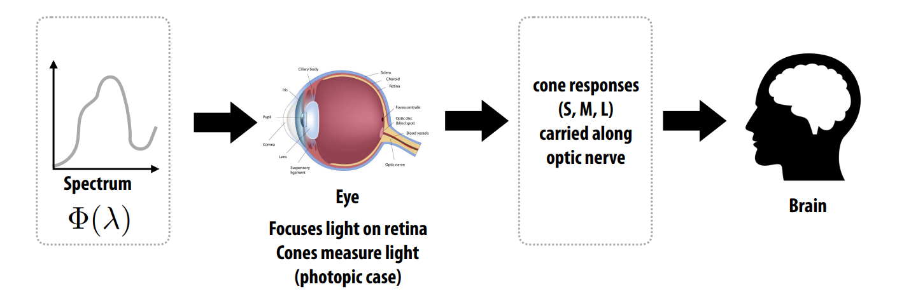

### Metamers(位变异构)
先问一个简单的问题, 两个不同函数的积分结果会一样吗? 两条不同曲线围成的面积可能相等吗?答案是肯定的. 同样类比可知, 很多不同的光谱可以积分成相同的SM和L响应. 这种现象就叫做"位变异构".

位变异构即不同的光线输入频谱最终在人眼上返回相同的输出响应.

位变异构的存在对色彩再现至关重要:为了在显示器(或一张纸，或墙上的油漆)再现感知到的颜色, 我们不需要重现真实世界场景中一模一样的光线频谱.

另一方面，光与油漆的结合也会带来麻烦——不同的物体在不同的光照条件下看起来可能“完全不一样”, 因为不同光照条件下实际上通过不同的频谱过滤掉了不同波长的光线.

那么问题来了, 在计算机图形学中, 我们如何用一种简单的方式编码颜色呢? 这就不得不提色彩空间和色彩模型了.

## 色彩空间和色彩模型
有多种表达颜色的方式, 有很多需要关心的点来权衡不同的表达方式, 比如存储容量, 便利性等等, 但总的来****说我们需要在一个颜色空间中用一种颜色模型来表达色彩****

- 色彩空间就像艺术家的调色板: 它代表了我们可以选择的颜色范围.
- 颜色模型是指在色彩空间中表达某种颜色的方式:

比如说对于画家调色板来说, 可能会用黄赭色来代表颜色模型, 对于RGB颜色模型来说会用204, 119, 34三个数字表示.

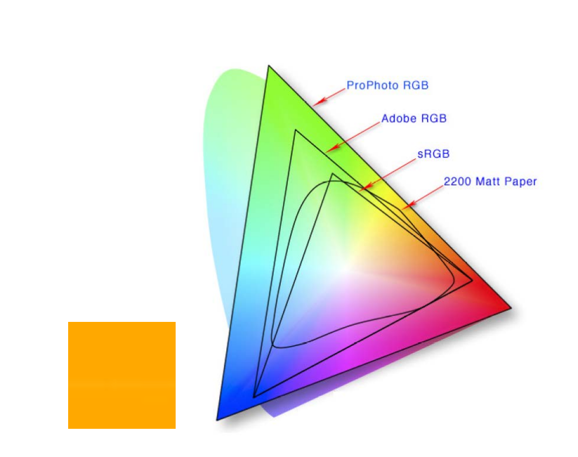

总之颜色模型指定了我们表达特定颜色的方式, 而色彩空间指定了我们从哪里取的颜色, 表示了颜色的范围.

### 加性 vs 减性颜色模型
根据任务的不同, 可以将颜色模型分为两大类, 加性颜色模型和减性颜色模型.

