# 辐射度量学

上一章文章我们讨论了颜色, 一个重要结论就是光的颜色和其波长有关, 也就是电磁场的震动频率. 对于人眼的视觉系统来说, 只有很窄范围的波长是可见的, 被称为可见频谱.

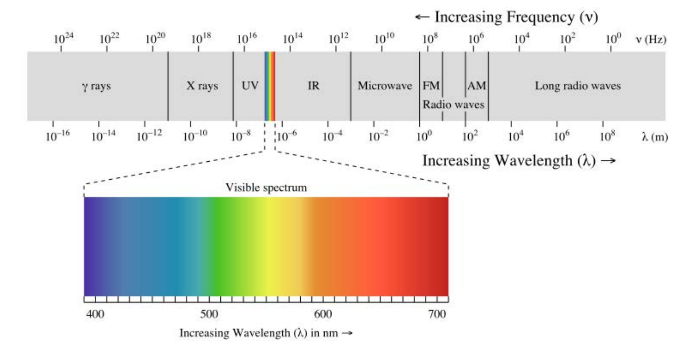

但是渲染不仅仅只是关于颜色, 如果我们只知道一张图片上每个点的波长, 那么呈现的图片将是不完整的, 我们还需要知道多少光命中了该点, 或者说场景中有多少光量进入了摄像机. 从某种意义上说，这两个组件一起构成了我们最终的图像. 每个像素点的颜色是什么,以及强度是多少. 

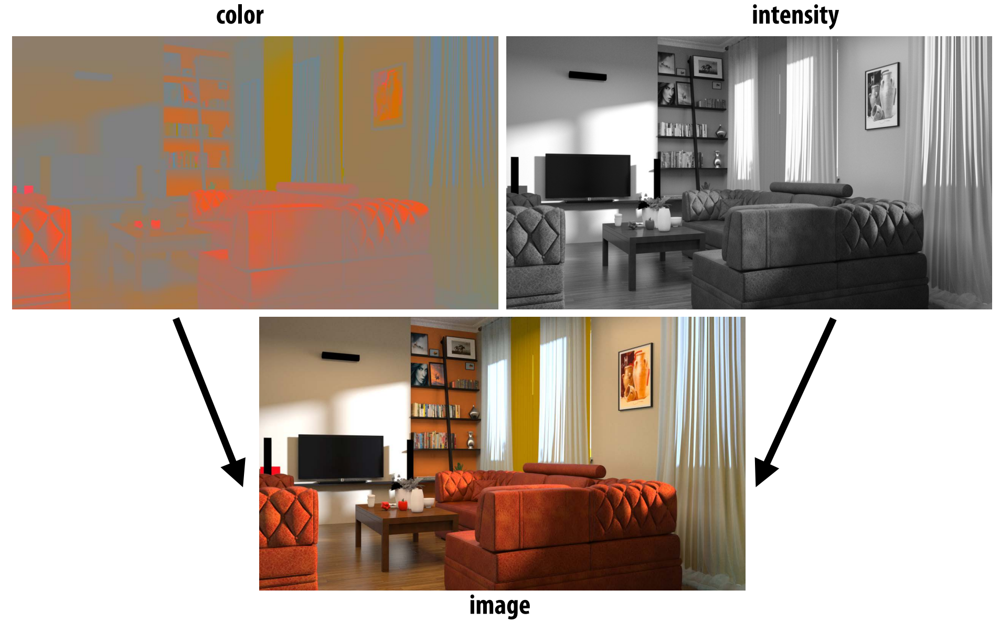

这就引出了一个问题, 我们如何量化光的测量?

## $Radiometry$
$Radiometry$是关于电磁辐射(光)的测量单位和测量体系.其中涉及到了大量的术语,如果从微观角度来看的话, 需要深入掌握大量概念, 但是对于生成图像来说, 我们只需要一个宏观模型, 一个经过调整或建模的适合人类感知的模型. 

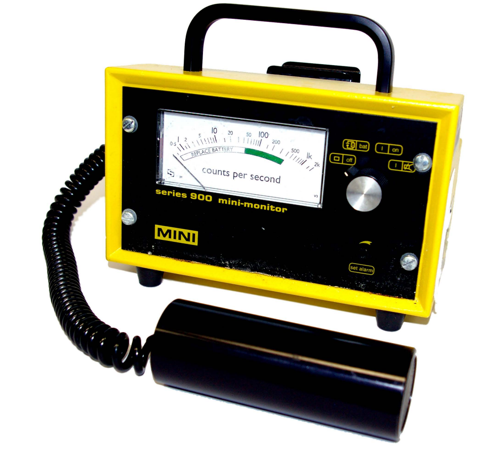

这就是常说的几何光学模型($Geometric optics model$), 它有以下几个特点:

- 光子沿直线传播
- 可以通过光线表达
- 波长远小于场景中的对象尺度,因此可以忽略很多微观下的现象, 比如说光的衍射/干涉行为

## 光的度量

那么对于光来说,我们需要测量什么, 需要度量光的哪些属性,以及为什么需要这些测量?

我们知道许多物理过程将能量转换为光子:

- 例如，白炽灯泡把热变成光(黑体辐射)
- 恒星(太阳!)的核聚变会产生光子
- ...

还有很多产生光子的方式, 但最后本质上是一样的, 它们都会携带少量的能量, 我们想要做的是我们想要用某种方法记录我们总共有多少能量.

对于生成图像来说,携带能量的光子击中物体代表了"亮度/强度":

- 胶片、眼睛、CCD传感器、日灼、太阳能电池板……
- 对于生成准确的图像来说这些信息很有必要

并且学习辐射度量学有助于我们了解很多其他的物理现象, 而不仅仅是生成图像.

简化假设:光线传播是一个稳态过程

### $Raidiant energy$
辐射能量指的就是所有时间内所有的光子命中总数量.

一个想法就是在整个场景持续时间内只存储场景中任何地方发生的“命中”总数

这个量捕获了所有到达场景的光子的总能量*

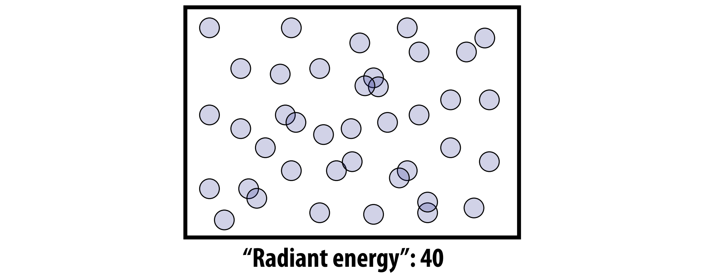

### $Radiant flux$
$Radiant flux$表示每秒光子的击中数量.因为我们只关心光在到达平衡状态下的分布情况, 如果我们想要生成一张精确描述场景中发生了什么的图像, 只需要知道每秒光子的击中数量,即辐射通量($Radiant flux$), 对于人类的感知水平, 可以安全大胆的假设光可以立即达到平衡, 每时每刻都有相同的辐射通量.

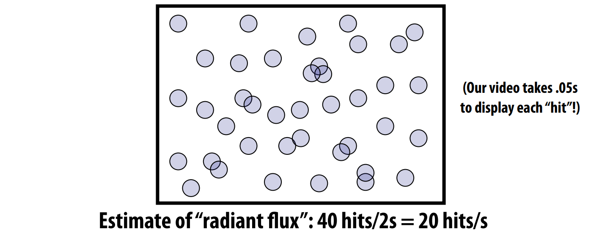

### $Irradiance$
$Radiant flux$是基于时间对$Raidiant energy$的分解, 我们也可以从空间上对$Raidiant energy$进行分解.这就是$Irradiance$所描述的.
$Irradiance$代表了了每单位时间每单位面积的光子击中数量.一般来说，相对于每单位时间击中的总数量, 我们更希望知道特定区域的击中数量,为了生成图像, 还需要知道的是击中发生在哪里.

所以，在一些“非常小”的区域内计算每秒的命中数就很有必要性了.

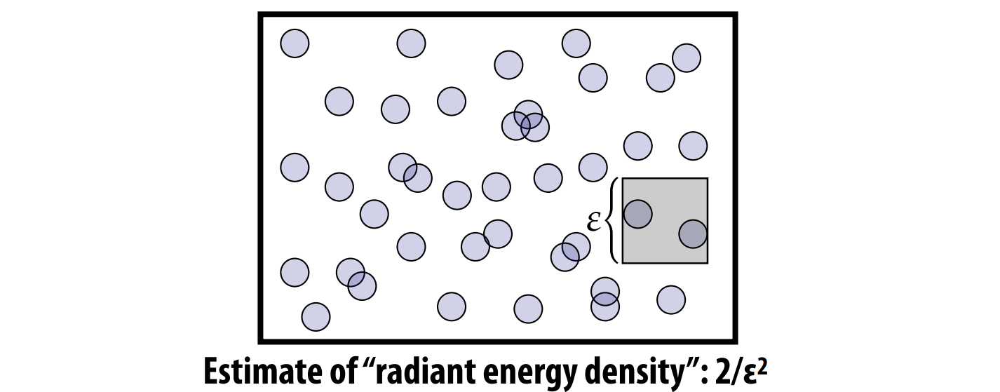

#### 图像生成 vs $Irradiance$估算
其实本质上我们最终想要做的就是生成图像, 从这个角度来看，图像生成中的目标就是估计图像中每个点的辐照度(或者实际上:每像素的总辐射通量…):

可以想象左侧图像是场景中所有击中摄像机感光器的光子, 中间的图像是光子覆盖了哪些像素, 右侧是实际我们记录的信息, 在每个像素内部每单位时间内有多少光子命中该像素.

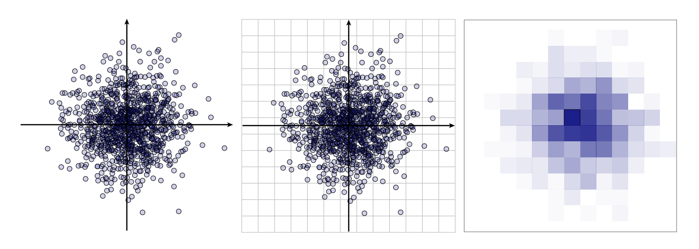

### 简单总结

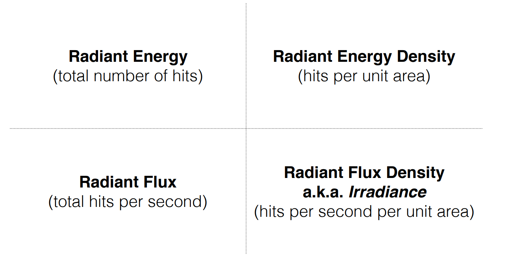

但是这些测量数值的单位是什么呢?

### 测量光照

#### 辐射能量

首先让我们看下辐射能量的单位, 我们如何来精确表达辐射能量的总量有多少呢?之前我们统计了光子的击中数量,但是问题来了, 所有的光子都会携带/贡献相同的能量吗?
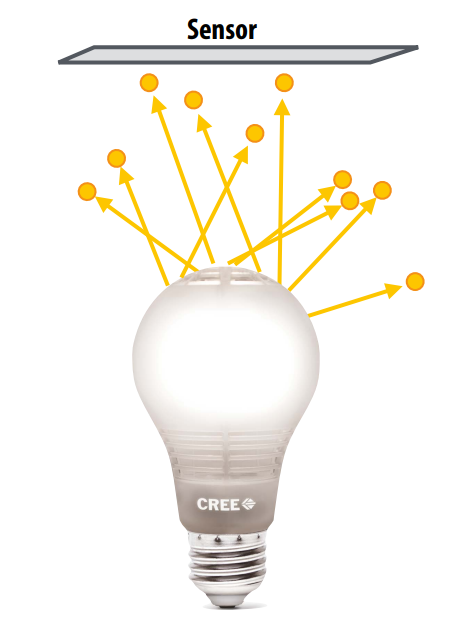

这里是单个光子的能量计算公式:

$Q = \frac{hc}{\lambda}$

单个光子携带的能量等于波长的倒数乘以某个常数, 也就是普朗克常数乘以光速

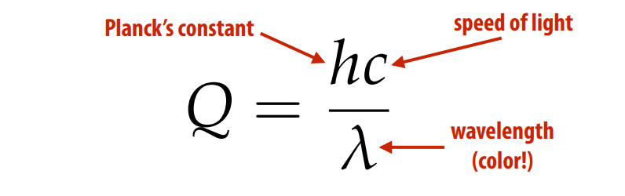

对于任意光子$hc$项都是相同的,而波长$\lambda$对于每个光子来说是不一样的, 因此每个光子携带的能量也是不同的. 比如说蓝色的光子波长短, 会比红色光子(波长长)携带更多的能量.

****如果你想要得到撞击传感器的总辐射能量，你需要对每个波长的光子数量进行加权求和****

有了公式接下来我们看下单位, 普朗克常数$h$的单位是$j.s$,焦耳乘以秒, 光速的单位是$m/s$, 可见光的波长单位是$m$, 因此一个光子携带能量的单位就是:

$\frac{j * s * m/s}{m} = j$

#### 辐射通量
$Flux$: 无论是被传感器接收到的能量或者是被光源发射的能量, 辐射通量表示每单位时间的辐射能量, 通常用$\phi$来表示:

辐射通量表示在时间的微小变化引起的能量微小变化, 可以用极限来定义:

$\phi = \lim_{\triangle \rightarrow 0}\frac{\triangle Q}{\triangle t} = \frac{\delta Q}{\delta t} = \frac{J}{s}$

当极限趋近于零时, 辐射通量即等于微分$\frac{\delta Q}{\delta t}$, 单位是$J/s$(焦耳每秒)

也可以从另外一个视角来看待这些, 辐射通量$flux$对时间的积分等于总的辐射能量.

$Q = \int_{t_{0}}^{t_{1}} \phi(t)dt$

#### $Irradiance$
那么$Irradiance$的单位是什么呢?我们知道辐射通量是能量密度的时间分布函数, 而$Irradiance$是辐射通量的面积密度函数, 也就是单位面积的辐射通量, 或者说单位时间单位面积的辐射能量.

给定一个面积为$A$的传感器，我们可以认为整个传感器面积上的平均通量是:

$\frac{\phi}{A}$

 $Irradiance$辐照度(E)由传感器上单点的面积极限给出:

 $E(p) = \lim_{\triangle \rightarrow 0}\frac{\triangle \phi(p)}{\triangle A} = \frac{\delta \phi(p)}{\delta A} = \frac{W}{m^2}$

 辐照度的单位是$\frac{W}{m^2}$

 #### 简单总结

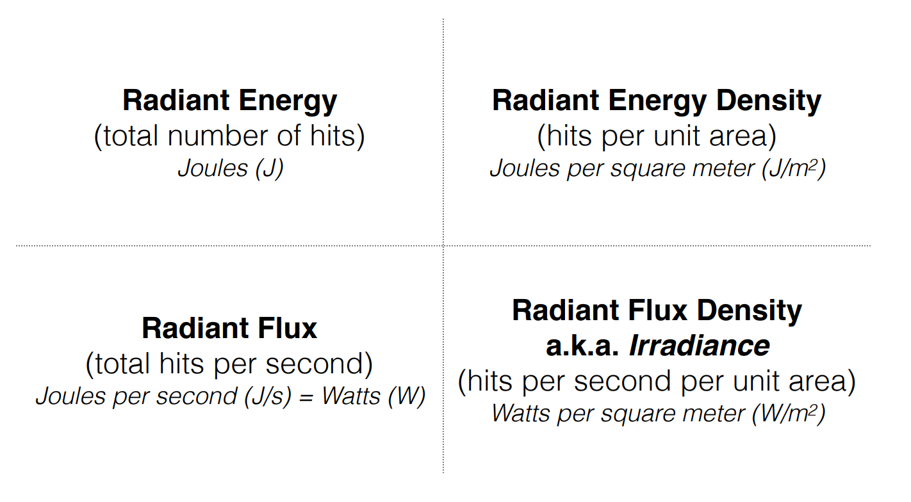

 #### 光谱功率分布
 我们可以从时间的角度对能量分布做计算, 也可以通过面积的角度衡量能量分布, 同样我们也能够通过波长对能量密度做衡量.
 
 光谱功率分布描述了每单位波长的$Irradiance$

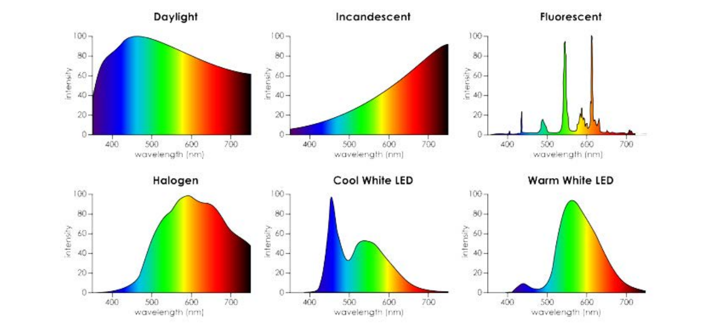

光谱功率分布本质上是单位时间单位面积单位波长上的能量, 因此它的单位是:

$\frac{W}{m^3}$

 

