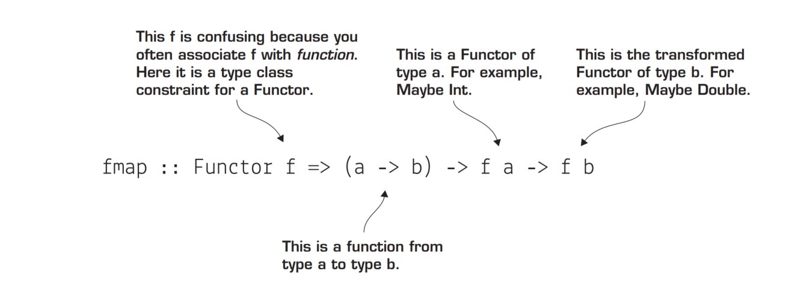
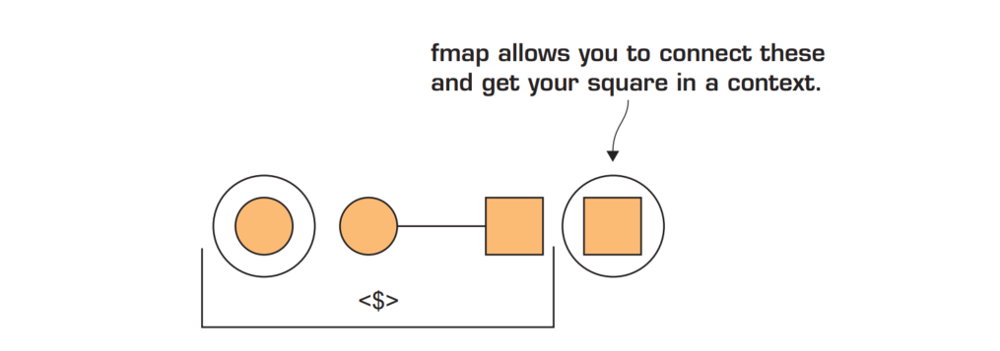
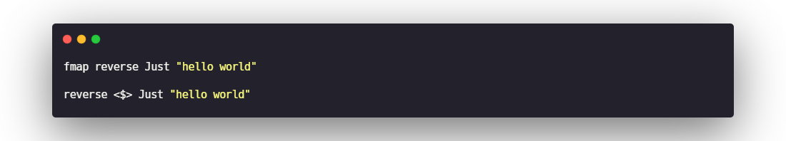
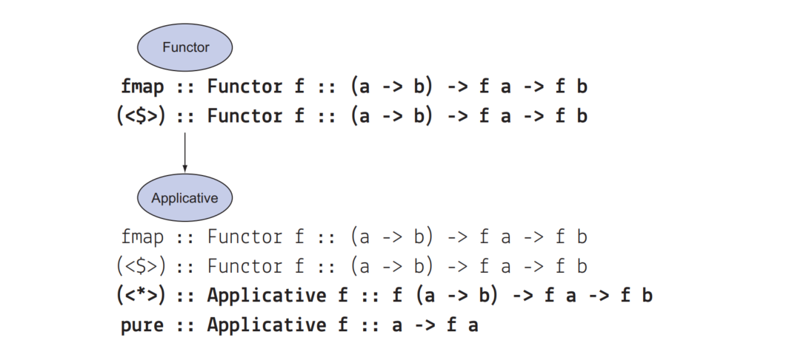
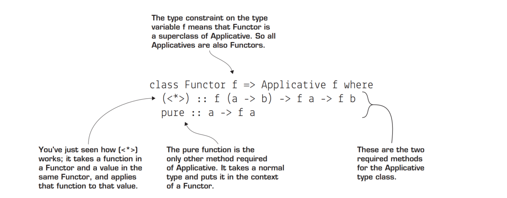
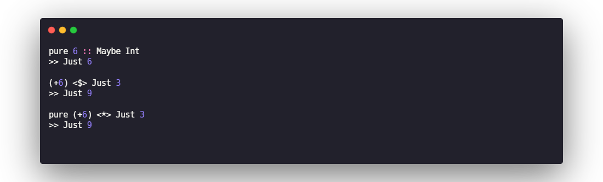
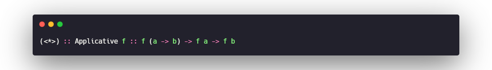
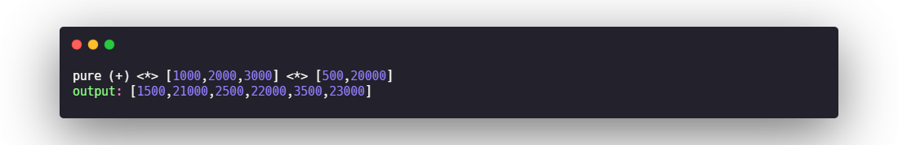

# Functor

## problem
This solution means that you’d have to rewrite a special version of every existing function you want to use in a Maybe! This greatly limits the usefulness of tools such as Maybe. It turns out Haskell has a type class that solves this problem, called Functor.

## definition
Maybe is a member of the Functor type class. The Functor type class requires only one definition: fmap.

_**fmap provides an adapter**_, Notice that we’re using <$>, which is a synonym for fmap (except it’s a binary operator rather than a function._**This ability to transform the types of values inside a Maybe is the true power of the Functor type class.**_

Though fmap is the official function name, in practice the binary operator <$> is used much more frequently

# Applicative
_**the Applicative type class allows you to use functions that are inside a context, such as Maybe or IO, Functor is a superclass of Applicative.**_

## The pure method
The pure method is a useful helper function for taking an ordinary value(also function) or function and putting it into a context.

## <*>

## Containers vs. contexts
1. Parameterized types that represent a container are types that represent a data structure.
2. When a type is a context, extra information is implied about the type, beyond its structure.

## List as a context
The List type is both a container and a context.List as a container is easy to understand. List is basically a chain of buckets of whatever type of data you want to hold. But List is a member of Applicative,so there must be a way to view List as a context.
_**List as a context is that it describes nondeterministic computation.**_
when you add values in the context of a list,you’re adding together all possible values from the two contexts.
