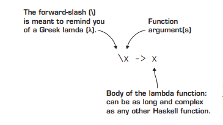

# 01. Functions
All functions in Haskell follow three rules that force them to behave like functions in
math:
   * All functions must take an argument.
   * All functions must return a value.
   * Anytime a function is called with the same argument, it must return the same
value

The third rule is part of the basic mathematical definition of a function. When the rule
that the same argument must always produce the same result is applied to function in a
programming language, it’s called referential transparency.

# 02. LAMBDA FUNCTIONS AND LEXICAL SCOPE

## Lambda functions
One of the most foundational concepts in functional programming is a function without
a name, called a lambda function (hence lambda calculus). Lambda functions are often
referred to using the lowercase Greek letter λ. Another common name for a lambda
function is an anonymous function.

## Practical lambda functions and lexical scope
IIFE works on exactly the same principles as our example of replacing a where statement. Whenever you create a new function, named or not, you
create a new scope, which is the context in which a variable is defined. When a variable is
used, the program looks at the nearest scope; if the definition of the variable isn’t there,
it goes to the next one up. This particular type of variable lookup is called lexical scope.
Both Haskell and JavaScript use lexical scoping, which is why IIFE and your lambda function variables behave in a similar fashion.

# 03. FIRST-CLASS FUNCTIONS
The concept of first-class functions is that functions are no different from any other data
used in a program. Functions can be used as arguments and returned as values from
other functions. This is a deceptively powerful feature for a programming language to
have. It allows you to abstract out any repetitive computation from your code, and ultimately allows you to write functions that write other functions.