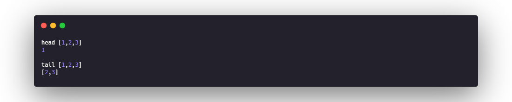
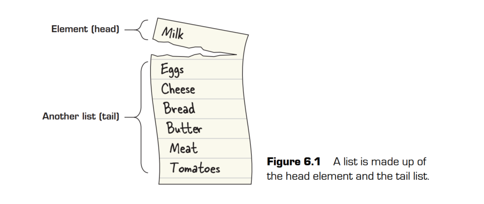
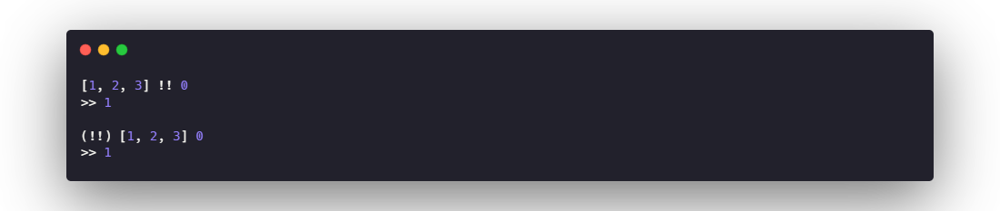

# 01. Functions
All functions in Haskell follow three rules that force them to behave like functions in
math:
   * All functions must take an argument.
   * All functions must return a value.
   * Anytime a function is called with the same argument, it must return the same
value

The third rule is part of the basic mathematical definition of a function. When the rule
that the same argument must always produce the same result is applied to function in a
programming language, it’s called referential transparency.

# 02. LAMBDA FUNCTIONS AND LEXICAL SCOPE

## Lambda functions
One of the most foundational concepts in functional programming is a function without
a name, called a lambda function (hence lambda calculus). Lambda functions are often
referred to using the lowercase Greek letter λ. Another common name for a lambda
function is an anonymous function.

## Practical lambda functions and lexical scope
IIFE works on exactly the same principles as our example of replacing a where statement. Whenever you create a new function, named or not, you
create a new scope, which is the context in which a variable is defined. When a variable is
used, the program looks at the nearest scope; if the definition of the variable isn’t there,
it goes to the next one up. This particular type of variable lookup is called lexical scope.
Both Haskell and JavaScript use lexical scoping, which is why IIFE and your lambda function variables behave in a similar fashion.

# 03. FIRST-CLASS FUNCTIONS
The concept of first-class functions is that functions are no different from any other data
used in a program. Functions can be used as arguments and returned as values from
other functions. This is a deceptively powerful feature for a programming language to
have. It allows you to abstract out any repetitive computation from your code, and ultimately allows you to write functions that write other functions.

# 04 LISTS
Lists are the single most important data structure in functional programming. One of
the key reasons is that lists are inherently recursive. A list is either an empty list or an
element followed by another list

## head tail
When taking apart a list, the main pieces are the head, the tail.The head is just the first element in a list.The tail is the rest of the list left over, after the head

## cons(:)
To build a list, you need just one function and the infix operator (:),
which is called cons. you need to take a value and cons it with another list. The simplest way
to make a list is to cons a value with the empty list. _**By definition, a list is always a
value consed with another list (which can also be an empty list)**_
If you do want to combine two lists, you need to concatenate them by using ++

## lazy evaluation
Haskell uses a special form of evaluation called lazy evaluation. In lazy evaluation,
no code is evaluated until it’s needed.

## Common functions on lists

### The !! operator
If you want to access a particular element of a list by its index, you can use the !! operator. The !! operator takes a list and a number, returning the element at that location in
the list. _**any infix operator (an operator that’s placed between two values, such as +) can also be used like a prefix function by wrapping it in parentheses**_

#### partial application
_**Using prefix notation can often make things such as partial application easier. Prefix
notation is also useful for using operators as arguments to other functions. You can still
use partial application with an infix operator; you just need to wrap the expression in
parentheses**_

### length
give the length of the list

### reverse
reverse the list

### elem
The elem function takes a value and a list and checks whether the value is in the list.elem is a function that you may want to treat as an infix operator for readability. _**Any
binary function can be treated as an infix operator by wrapping it in back-quotes (`)**_

### take and drop
The take function takes a number and a list as arguments and then returns the first n elements of the list. f you ask for more values then a list has, take gives you what it can, with no error.

### zip 
You use zip when you want to combine two lists into tuple pairs. The arguments to zip
are two lists. If one list happens to be longer, zip will stop whenever one of the two lists
is empty.

### cycle

