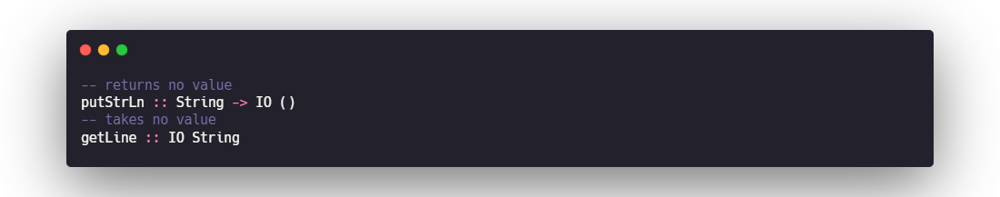
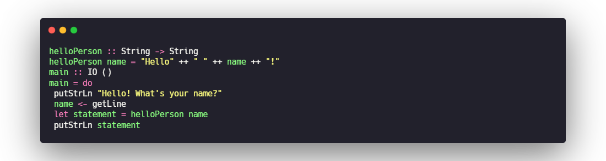

# IO TYPES
Haskell has a special parameterized type called IO. Any value in an IO context must stay in this context. This prevents code that’s pure (meaning it upholds referential transparency and doesn’t change state) and code that’s necessarily impure from mixing.

## IO types—dealing with an impure world
IO in Haskell is a parameterized type that’s similar to Maybe.The first thing they share in common is that they’re parameterized types of the same kind.The other thing that Maybe and IO have in common is that (unlike List or Map) they describe a context for their parameters rather than a container. The context for the IO type is that the value has come from an input/output operation.To keep Haskell code pure and predictable, you use the IO type to provide a context for data that may not behave the way all of the rest of your Haskell code does. IO actions aren’t functions.

## Examples of IO actions
main doesn’t return any meaningful value; it simply performs an action. It turns out that main isn’t a function, because it breaks one of the fundamental rules of functions: it doesn’t return a value. Because of this, we refer to main as an IO action. IO actions work much like functions except they violate at least one of the three rules we established for functions early in the book. Some IO actions return no value, some take no input, and others don’t always return the same value given the same input.

## Do-notation
This do-notation allows you to treat IO types as if they were regular types. This also explains why some variables use let and others use <-. Variables assigned with <- allow you to act as though a type IO a is just of type a. You use let statements whenever you create variables that aren’t IO types.

### <-
Donotation allows you to assign an IO String variable by using <-, to act like it’s an ordinary String, and then to pass it to functions that work with only regular Strings

### do-notation in Maybe
IO can use do-notation because it’s a member of a powerful type class called Monad. We discuss Monad much more in unit 5. Do-notation has nothing to do with IO in particular and can be used by any member of Monad to perform computation in a context. 