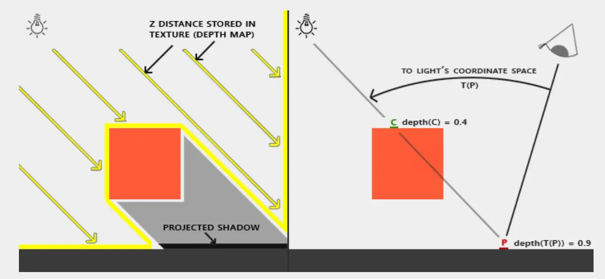
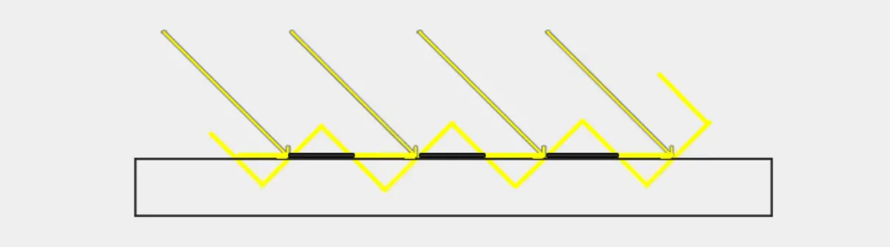
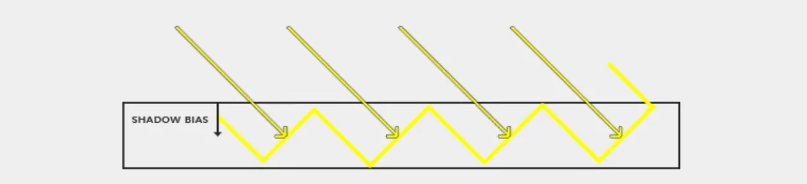

# Shadow Mapping

## Basis

- 第一个pass从光源位置和方向构造相机的viewProjectionMatrix，渲染深度图
- 第二个pass将采样点转换到光照空间，比较深度判定遮挡性, 以下为shadowMap第二个pass计算阴影的关键代码：

**VertexShader**
```c++
#version 460 core

layout(location = 0) in vec3 aPos;
layout(location = 1) in vec3 aNormal;
layout(location = 2) in vec2 aTexCoords;

out vsOut
{
  vec3 FragPos;
  vec3 Normal;
  vec3 TexCoords;
  vec3 FragPosLightSpace;
} vs_out;

uniform mat4 projection;
uniform mat4 view;
uniform mat4 model;
uniform mat4 lightSpaceMatrix;

void main()
{
  vs_out.FragPos = model * vec4(aPos, 1.0);
  vs_out.Normal = transpose(inverse(mat3(model))) * aNormal;
  vs_out.TexCoords = aTexCoords;
  vs_out.FragPosLightSpace = lightSpaceMatrix * vec4(vs_out.FragPos, 1.0);
  gl_Position = projection * view * vec4(vs_out.FragPos, 1.0);
}
```

**FragmentShader**
```c++
#version 460 core

in vsOut
{
  vec3 FragPos;
  vec3 Normal;
  vec3 TexCoords;
  vec3 FragPosLightSpace;
} fs_in;

float shadowCalculation(vec4 fragPosLightSpace)
{
  vec3 projCoords = fragPoslightSpace.xyz / fragPoslightSpace.w;
  projCoords = projCoords * 0.5 + 0.5;
  float closestDepth = texture(shadowMap, projCoords.xy).r;
  float currentDepth = projCoords.z;
  float shadow = currentDepth > closestDepth? 1.0 : 0.0;
  return shadow;
}
```

## Shadow acne
Shadow Acne是实时渲染中常见的阴影走样瑕疵，表现为阴影表面出现的条纹状或摩尔纹图案.
### 产生原因
1. 阴影贴图的分辨率限制
- 阴影贴图（Shadow Map）是从光源视角渲染的深度图，分辨率有限
- 当物体距离光源较远时，多个屏幕像素（fragments）会采样到阴影贴图中的同一个纹素（texel）
2. 倾斜角度原因
- 当光源以倾斜角度照射表面时，阴影贴图的纹素也是倾斜的
- 当物体距离光源较远时，多个屏幕像素（fragments）会采样到阴影贴图中的同一个纹素（texel）
- 由于数值精度问题，有些片段被认为在表面之上（受光），有些被认为在表面之下（阴影）



### 解决方案
Shadow Bias（阴影偏移）：在将深度写入阴影贴图时，减去一个小的偏移量（bias），或者在进行阴影测试时，给当前片段的深度加上一个偏移，这样确保表面片段不会被错误地判定为在阴影中。


常量形式的bias:
```c++
float bias = 0.005;
float shadow = currentDepth - bias > closestDepth  ? 1.0 : 0.0;  
```

固定偏移虽然能解决场景部分问题，但仍然存在缺陷：
- 表面与光源夹角很大（接近平行）：固定bias不够，仍然会出现Shadow Acne
- 表面正对光源（垂直）：固定bias可能过大，导致Peter Panning
引入动态计算bias可以解决这个问题，根据光源方向与表面法线的夹角， 动态调整bias大小，光源与表面夹角越大，越平行，一个纹素会对应更多的像素，需要更大的bias避免shadowAcne：

```glsl
float bias = max(0.05 * (1.0 - dot(normal, lightDir)), 0.005);  
```

但是shadowBias过大会引入另外一个新的问题，物体和阴影会明显分离， 解决这个问题的办法是在生成阴影贴图时渲染背面剔除正面，存储较大的深度值, 这样就可以避免设置过大的bias造成阴影分离现象, 可以理解为生成的阴影图中已经隐形的引入了一个bias:

```c++
glCullFace(GL_FRONT);
RenderSceneToDepthMap();
glCullFace(GL_BACK); 
```

## PCF
```glsl
float shadow = 0.0;
vec2 texelSize = 1.0 / textureSize(shadowMap, 0);
for(int x = -1; x <= 1; ++x)
{
  for(int y = -1; y <= 1; ++y)
  {
    float pcfDepth = texture(shadowMap, projCoords.xy + vec2(x, y) * texelSize).r;
    shadow += currentDepth - bias > pcfDepth? 1.0 : 0.0;
  }
}
shadow /= 9.0;
```


