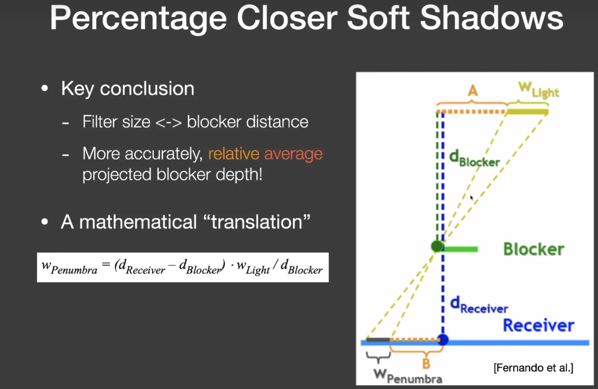
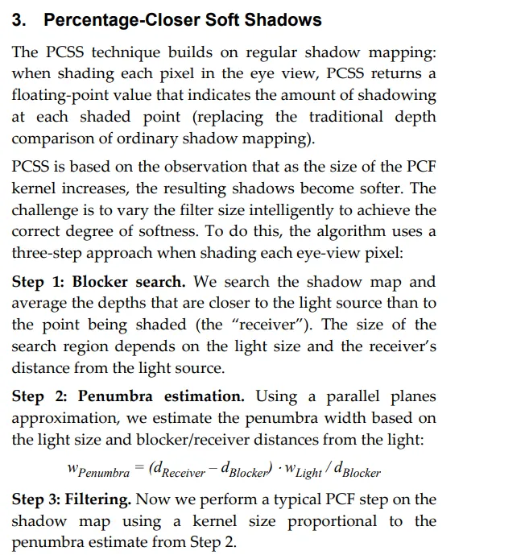
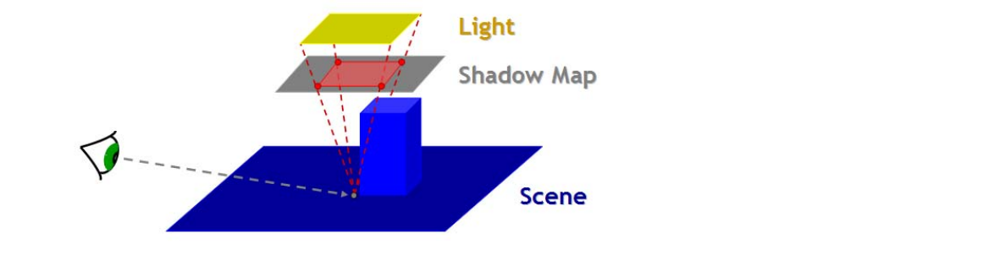
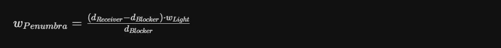
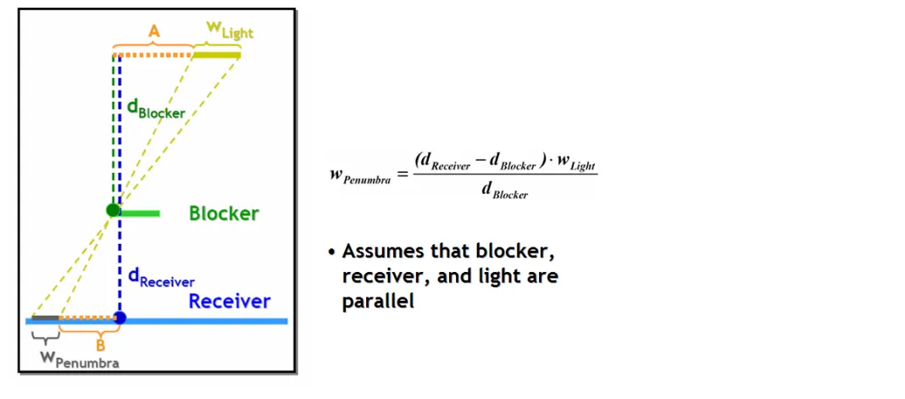
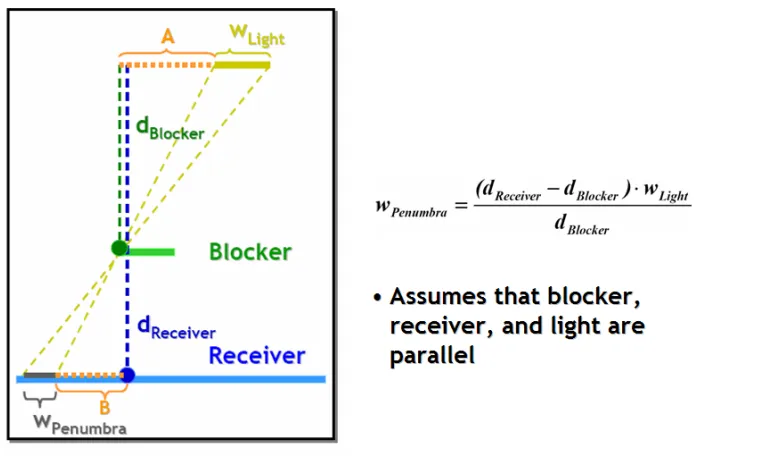

# PCSS





## 核心思想

PCSS 基于两个经典技术：
1. Shadow Mapping（阴影贴图） [Williams 1978]：从光源视角生成深度图
2. Percentage-Closer Filtering（PCF，百分比渐近过滤） [Reeves et al. 1987]：在阴影边缘进行多重采样模糊
关键洞察：PCF 核（kernel）越大，阴影越软。PCSS 的核心就是动态调整 PCF 核的大小来模拟物理正确的软阴影。

## 算法拆解
PCSS 在着色每个像素时执行以下三个步骤：

### Blocker Search(遮挡物查询)
对着色点附近某一区域范围的阴影贴图进行采样，查询距离光源更近的深度值, 将这些深度值取平均, 得到遮挡物的平均深度。深度图采样区域的大小取决于光源的大小以及着色点与光源之间的距离。采样范围与光源大小和着色点与光源距离成正比:



### Penumbra Estimation（半影区估算）
基于平行平面近似（Parallel Planes Approximation），估算半影区宽度：




### Percentage Closer Filter
使用传统的 PCF 步骤,PCF采样核半径和上一步估算的半影区大小成正比.核越大，采样越分散，阴影越柔和


## Code
```glsl
float shadowOcclusion()
{
    vec3 projCoords = lightClipSpacePos.xyz / lightClipSpacePos.w;
    
    // transform to [0,1] range
    projCoords = projCoords * 0.5 + 0.5;

    if (projCoords.z > 1.0) return 1.0;

    // get depth of current fragment from light's perspective
    float currentDepth = projCoords.z;

    // check whether current frag pos is in shadow
    float bias = max(0.0001 * (1.0 - dot(normalize(normal), lightDirection)), 0.000001);
    
    vec4 posVs = lightViewSpacePos;
    posVs.xyz /= posVs.w;

    return shadowPCSS(projCoords.xy, currentDepth, bias, -(posVs.z));
}
```

```glsl
float shadowPCSS(vec2 uv, float clipSpaceZ, float bias, float viewSpaceZ)
{
    // ------------------------
    // STEP 1: blocker search
    // ------------------------
    float accumBlockerDepth, numBlockers;
    float searchRadius = searchRegionRadiusUV(viewSpaceZ);
    findBlocker(accumBlockerDepth, numBlockers, uv, clipSpaceZ, bias, searchRadius);

    if (num_blockers == 0.0)
    {
        return 1.0;
    }

    // ------------------------
    // STEP 2: penumbra size
    // ------------------------
    float avgBlockerDepth      = accumBlockerDepth / numBlockers;
    float avgBlockerDepthVs    = linearizeDepth(avgBlockerDepth);
    float penumbraRadius       = penumbraRadiusUV(viewSpaceZ, avgBlockerDepthVs);
    float filterRadius         = projectToLightUV(penumbraRadius, viewSpaceZ);

    // ------------------------
    // STEP 3: filtering
    // ------------------------
    return shadowPCF(uv, z, bias, filterRadius);
}
```

### searchRegionRadius
首先需要计算用于计算平均遮挡物深度的查询范围.基于从采样点到面光源的相似三角形近似计算:


```glsl
float searchRegionRadiusUV(float viewSpaceZ)
{
    return lightAreaRadius * (viewSpaceZ - lightNearPlane) / viewSpaceZ;
}
```

### findBlocker
接下来根据上一步近似得到的查询范围, 计算平均遮挡物的深度:

```c++
void findBlocker(out float accumBlockerDepth,
                  out float numBlockers,
                  vec2      uv,
                  float     z0,
                  float     bias,
                  float     searchRegionRadiusUV)
{
    vec2 random_rotation = texture(s_random_angles, in_world_pos * correction_factor).rg;
    
    accum_blocker_depth = 0.0;
    num_blockers        = 0.0;
    float biased_depth  = z0 - bias;

    for (int i = 0; i < u_blocker_search_samples; ++i)
    {
        vec2 offset;

        if (u_blocker_search_samples == 25)
            offset = Poisson25[i];
        else if (u_blocker_search_samples == 32)
            offset = Poisson32[i];
        else if (u_blocker_search_samples == 64)
            offset = Poisson64[i];
        else if (u_blocker_search_samples == 100)
            offset = Poisson100[i];
        else if (u_blocker_search_samples == 128)
            offset = Poisson128[i];

        // Add random rotation to the offset 
        offset = vec2(random_rotation.x * offset.x - random_rotation.y * offset.y,
                      random_rotation.y * offset.x + random_rotation.x * offset.y);

        // Here use sampler without HW PCF filtering
        offset *= searchRegionRadiusUV;

        float shadow_map_depth = texture(s_shadow_map, uv + offset).r;

        if (shadow_map_depth < biased_depth)
        {
            accum_blocker_depth += shadow_map_depth;
            num_blockers++;
        }
    }
}
```
这里采用了泊松盘进行稀疏采样.收集累计的遮挡物深度以及遮挡物数量, 用遮挡物深度除以数量得到平均遮挡物深度. 然后将这个平均深度转换成线性深度:

```glsl
float linearizeDepth(float depth)
{
  float linearDepth = nearPlane * farPlane / (farPlane - z * (farPlane - nearPlane));
}
```

### penumbraRadiusUV
用面光源 遮挡物 着色点构成的相似三角形近似半影区大小:



```glsl
float penumbraRadiusUV(float zReceiver, float zBlocker)
{
    return lightAreaRadius * (zReceiver - zBlocker) / zBlocker;
}
```

### calc pcf radius
将半影区半径投影到光照空间的近平面,得到pcf采样半径:
```glsl
float projectToLightUV(float penumbraRadius, float viewSpaceZ)
{
    return penumbraRadius * lightNearPlane / viewSpaceZ;
}
```

### percentage Closer Filter
```glsl
float shadowPCF(vec2 uv, float z0, float bias, float pcfRadius)
{
    vec2 random_rotation = texture(s_random_angles, in_world_pos * correction_factor).rg;

    float sum = 0.0;

    for (int i = 0; i < u_pcf_samples; ++i)
    {
        vec2 offset;

        if (u_pcf_samples == 25)
            offset = Poisson25[i];
        else if (u_pcf_samples == 32)
            offset = Poisson32[i];
        else if (u_pcf_samples == 64)
            offset = Poisson64[i];
        else if (u_pcf_samples == 100)
            offset = Poisson100[i];
        else if (u_pcf_samples == 128)
            offset = Poisson128[i];

        // Add random rotation to the offset 
        offset = vec2(random_rotation.x * offset.x - random_rotation.y * offset.y,
                      random_rotation.y * offset.x + random_rotation.x * offset.y);
        offset *= pcfRadius;
        float depth = texture(shadowMap, uv+offset).r;
        sum += depth < z0 - bias? 1.0 : 0.0;
    }

    return sum / float(u_pcf_samples);
}
```