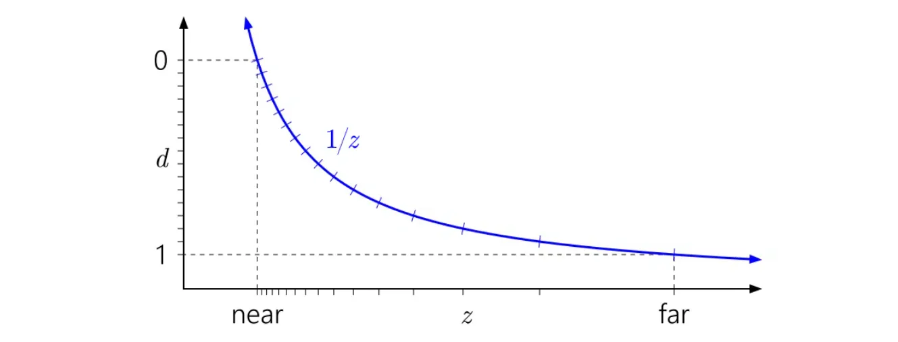
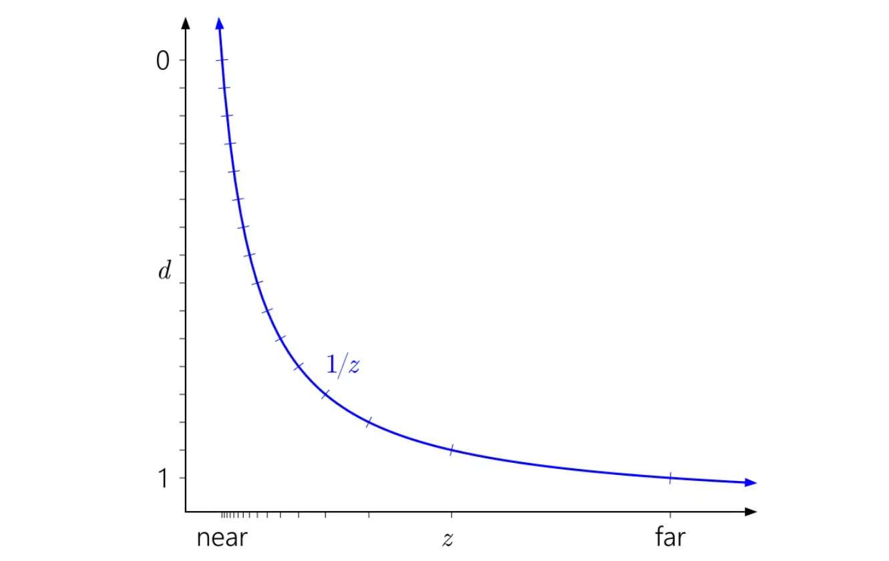
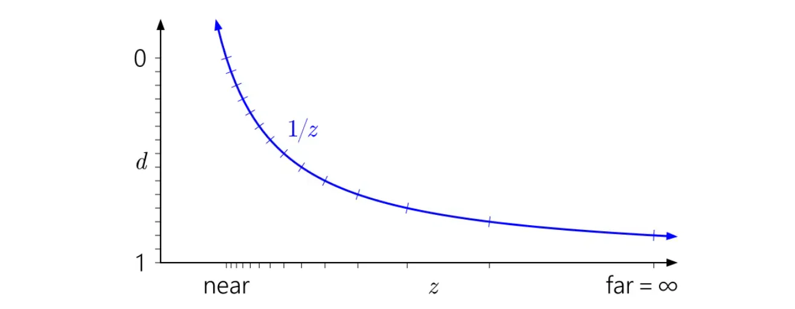
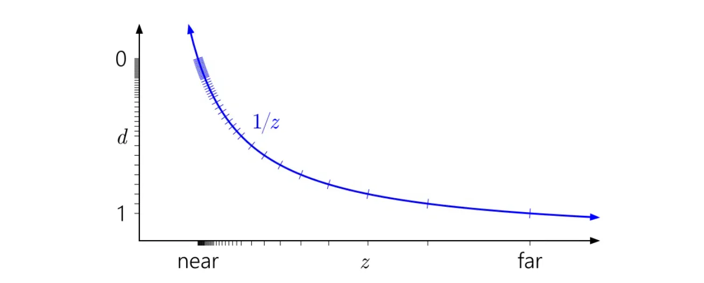
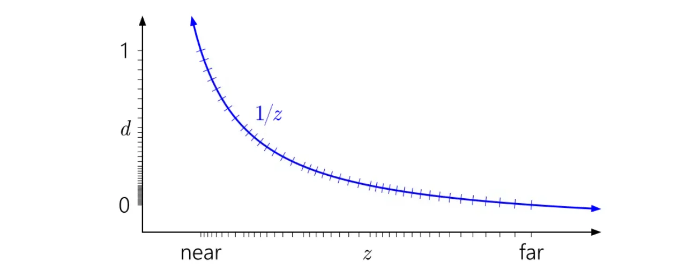

# ZFighting

## 为什么是 1/z
GPU 硬件深度缓冲区通常不会存储物体在相机前距离的线性表示。相反，深度缓冲区存储的值与世界空间深度的倒数成正比。
在本文中，用 d 表示存储在深度缓冲区中的值（ [0, 1] 范围内），用 z 表示世界空间深度，即相机viewSpace下lookAt方向的实际距离，以世界单位（如米）表示。一般来说，它们之间的关系具有以下形式：

实际上准确的表示应该是这样：

那么为什么要选择这种特定的形式呢？主要有两个原因。
1. 这是由透视投影矩阵造成的

2. 1/z 在屏幕空间中是线性的。因此在光栅化时很容易在三角形上插值 d，而且在HiZ、earlyZ和zBuffer中压缩都更容易实现。

## 深度图可视化

垂直轴d表示裁剪空间也就是存储在zBuffer中的非线性深度值，范围从[0， 1], 水平轴是viewSpace下的线性深度值，d和z呈倒数关系。刻度标记表示不同的深度缓冲区值。为了直观说明问题，我模拟了一个 4 位规范化整数深度缓冲区，因此有 16 个均匀分布的刻度标记。
将刻度标记水平追踪到它们与 1/z曲线相交的地方，然后向下到底部轴。这就是不同值在世界空间深度范围内的分布位置。
上图显示了 D3D 和类似 API 中使用的"标准"、普通的深度映射。可以观察到1/z曲线如何导致值在近平面附近聚集，而靠近远平面的值则分布得相当散。
也很容易看出为什么近平面对深度精度有如此深远的影响。拉近近平面会使 d 范围急剧上升向1/z曲线的渐近线，导致值的分布更加不均衡：

同样，在这种背景下很容易看出为什么将远平面一直推到无穷远并没有太大影响。这只是意味着将 d 范围稍微向下延伸到 1/z=0

那浮点深度表现会如何呢？下图添加了对应于模拟浮点格式的刻度标记，该格式有3位指数和3位尾数：
现在在 [0, 1] 范围内有 40 个不同的值——比以前多得多，但它们中的大多数都无用地在近平面附近聚集，而实际上并不需要在那里有更多的精度。

## ReverseZ
一个现在广为人知的技巧是反转深度范围，将近平面映射到 d=1，将远平面映射到 d=0：

好多了！现在浮点数的准对数分布在某种程度上抵消了1/z的非线性，在近平面给你与整数深度缓冲区相似的精度，而在其他地方则大大提高了精度。只有当你向外移动时，精度才会缓慢下降。
所有之前的图表都假设 [0, 1] 作为投影后的深度范围，这是 D3D 的惯例。那 OpenGL 呢？
OpenGL 默认假设 [-1, 1] 的投影后深度范围。这对整数格式没有影响，但对于浮点数，所有精度都无用卡在了中间。（该值稍后被映射到 [0, 1] 以存储在深度缓冲区中，但这没有帮助，因为最初映射到 [-1, 1] 已经破坏了远半范围的所有精度。）而且根据对称性，ReverseZ技巧在这里不起作用。
幸运的是，在OpenGL 中，可以通过广泛支持的 ARB_clip_control 扩展（现在在 OpenGL 4.5 中也是核心功能 glClipControl）来修复这个问题。

## Prevent z-fighting
第一个也是最重要的技巧是：**永远不要让物体以某些三角形紧密重叠的方式放置得过于靠近**。 通过在两个物体之间创建一个小偏移，你可以完全消除这两个物体之间的 Z-fighting。对于容器和平面的情况，我们可以轻松地将容器稍微向正 Y 方向（向上）移动。容器位置的微小变化可能根本不会引起注意，却能完全减少 Z-fighting。然而，这需要对每个物体进行手动干预，并进行彻底测试，以确保场景中的任何物体都不会产生 Z-fighting。

**第二个技巧是尽可能将近平面设置得远一些**。 在之前的章节中，我们已经讨论过，当靠近近平面时精度非常大，因此如果我们把近平面从观察者处移远，我们在整个视锥体范围内都将获得显著更高的精度。然而，将近平面设置得太远可能会导致近处物体被裁剪，因此通常需要通过调整和实验来找出场景的最佳近平面距离。

**另一个以一些性能为代价的好技巧是使用更高精度的深度缓冲区**。 大多数深度缓冲区的精度为 24 位，但现在大多数 GPU 都支持 32 位深度缓冲区，显著提高了精度。因此，以一些性能为代价，你将获得深度测试的更高精度，从而减少 Z-fighting。

**最后一个即上文提到过的reverseZ**。通过反转z值，将近平面映射到 d=1，将远平面映射到 d=0，从而抵消1/z的非线性。