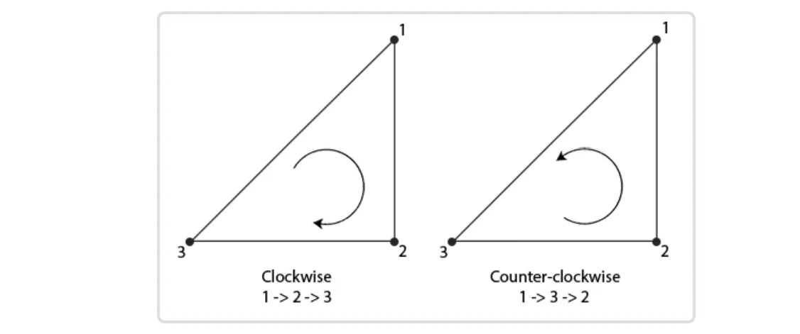
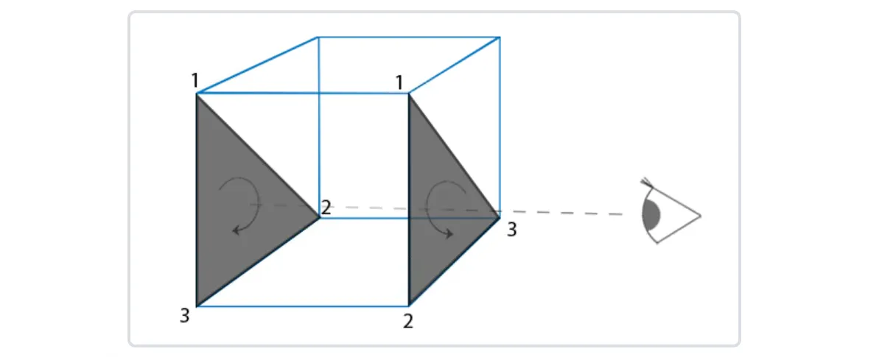

# Face Culling

## Face Culling
试着在脑海中想象一个 3D 立方体，数一数从任何方向你最多能看到多少个面。如果你的想象力不是太过丰富，你可能得出的最大数字是 3。你可以从任何位置和/或方向观察立方体，但你永远看不到超过 3 个面。那么我们为什么要浪费精力去绘制那些我们根本看不到的另外 3 个面呢？如果我们能以某种方式丢弃它们，我们就能节省这个立方体总片元着色器运行次数的 50% 以上！
我们说超过 50% 而不是 50%，是因为从某些角度可能只能看到 2 个甚至 1 个面。在这种情况下我们会节省更多。
这确实是一个很棒的想法，但有一个问题需要解决：我们如何知道物体的某个面从观察者的视角是否不可见？ 如果我们想象任何封闭形状，它的每个面都有两侧。每一侧要么面向用户，要么背对用户。如果我们只渲染面向观察者的面会怎样？
这正是面剔除所做的。OpenGL 检查所有朝向观察者的正面，并渲染这些面，同时丢弃所有背向观察者的背面，为我们节省大量的片元着色器调用。我们确实需要告诉 OpenGL 我们使用的哪些面实际上是正面，哪些面是背面。OpenGL 通过分析顶点数据的环绕顺序（winding order）来使用一个巧妙的技巧解决这个问题。

## Winding order
当我们定义一组三角形顶点时，我们以特定的环绕顺序定义它们，这个顺序要么是顺时针，要么是逆时针。每个三角形由 3 个顶点组成，我们从三角形的中心视角以环绕顺序指定这 3 个顶点。

组组成三角形图元的三个顶点就包含了一个环绕顺序。OpenGL在渲染图元的时候将使用这个信息来决定一个三角形是一个正向三角形还是背向三角形。默认情况下，逆时针顶点所定义的三角形将会被处理为正向三角形。
当你定义顶点顺序的时候，你应该想象对应的三角形是面向你的，所以你定义的三角形从正面看去应该是逆时针的。这样定义顶点很棒的一点是，实际的环绕顺序是在光栅化阶段进行的，也就是顶点着色器运行之后。这些顶点就是从观察者视角所见的了。
观察者所面向的所有三角形顶点就是我们所指定的正确环绕顺序了，而立方体另一面的三角形顶点则是以相反的环绕顺序所渲染的。这样的结果就是，我们所面向的三角形将会是正向三角形，而背面的三角形则是背向三角形。下面这张图显示了这个效果：

在顶点数据中，我们将两个三角形都以逆时针顺序定义（正面的三角形是1、2、3，背面的三角形也是1、2、3（如果我们从正面看这个三角形的话））。然而，如果从观察者当前视角使用1、2、3的顺序来绘制的话，从观察者的方向来看，背面的三角形将会是以顺时针顺序渲染的。虽然背面的三角形是以逆时针定义的，它现在是以顺时针顺序渲染的了。这正是我们想要剔除（Cull，丢弃）的不可见面.

