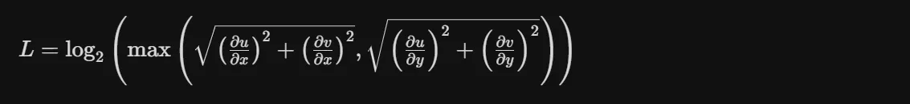
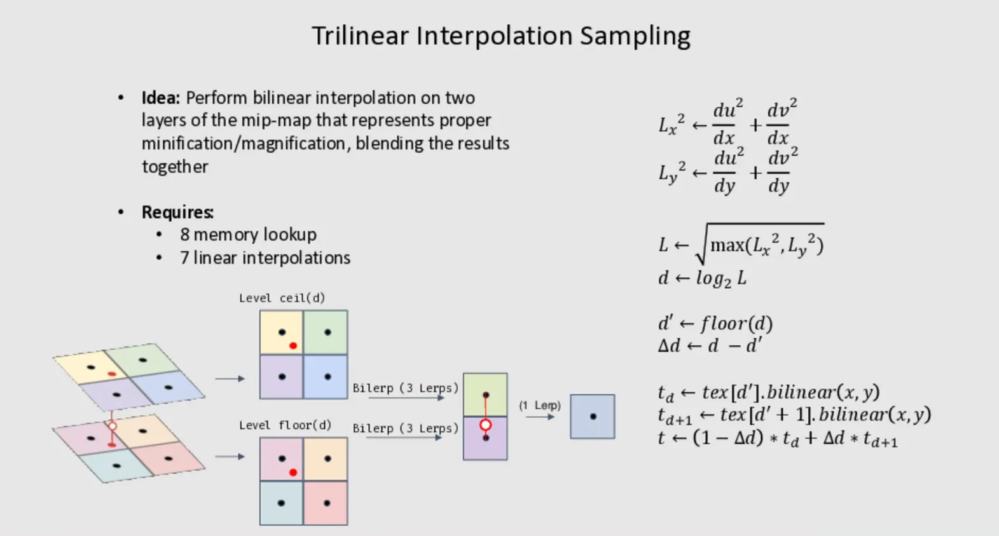
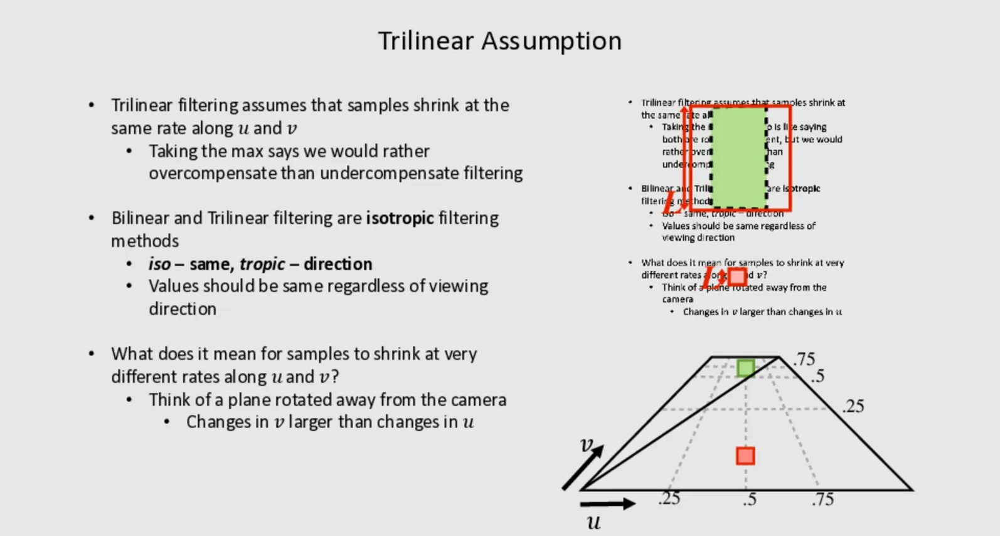
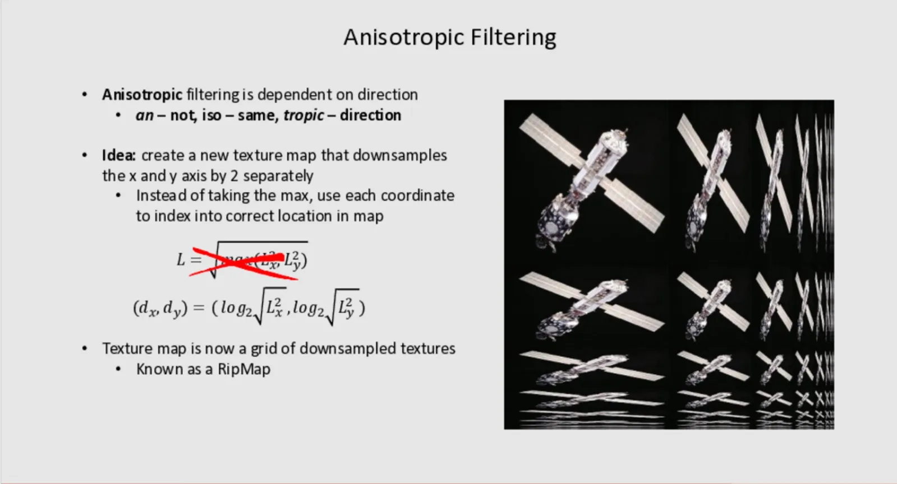
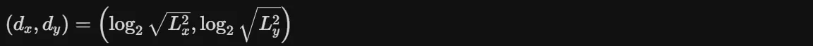
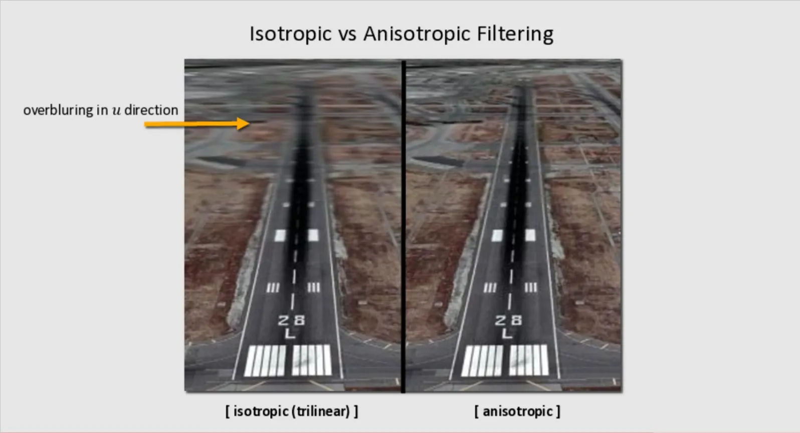
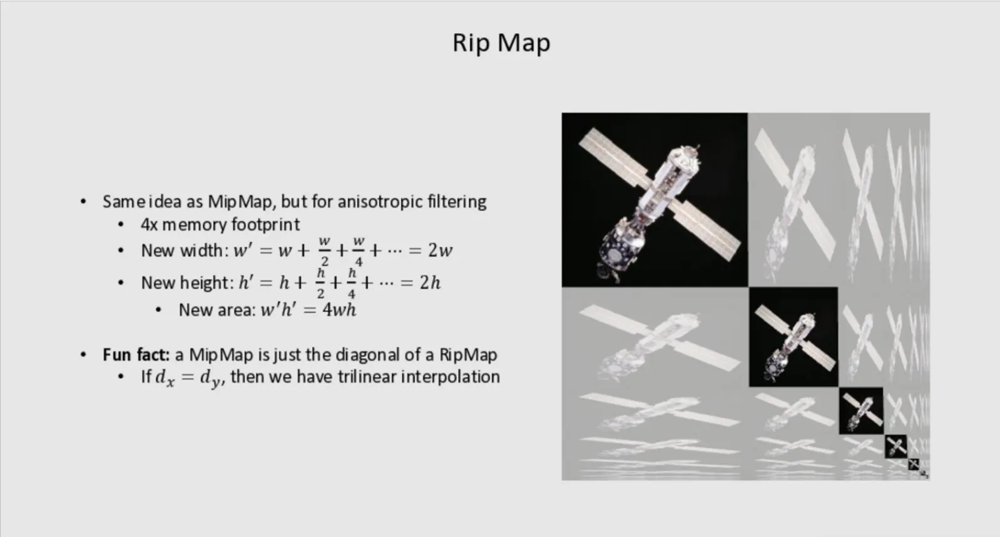

# MipMap

## MipMap
Mipmap（多级渐远纹理）是一种预先计算并存储的纹理图像序列，其中每个后续图像的分辨率都是前一个的一半。Mipmap一一种快速, 近似 方形的过滤
为什么需要 Mipmap？
当纹理在远处被渲染时，多个纹素（texel）会映射到单个像素上。如果直接使用原始高分辨率纹理：
- 像素只采样纹理中的一个点
- 忽略了该像素覆盖的纹理区域
- 导致摩尔纹（Moiré patterns）和闪烁

| 特性      | 说明 |
| ----------- | ----------- |
| 存储开销     | 比原始纹理多约 33% 的内存（1 + 1/4 + 1/16 + ... ≈ 1.33）     |
| 采样方式   | 根据像素在纹理空间的投影大小，选择合适的 Mipmap 层级     |
| 插值   |可在相邻层级间进行三线性插值（Trilinear Filtering）      |

### Mipmap 层级选择
通过计算纹理坐标在屏幕空间的导数（ddx, ddy）来确定：





### mipmap存在的问题
三线性过滤假设纹理在 u 和 v 两个方向上以相同的速率收缩, 取u,v的最大值意味着宁肯过渡模糊也不要因过滤不足导致出现摩尔纹及闪烁.
双线性插值及三线性插值是各向同性过滤, 这里的"向"指的是观察方向的意思.也就是说无论观察方向怎么变化, 过滤结果应该是一样的.
但是当采样点的uv变化速率差异很大时会出现什么情况呢?
- 如果 dv 很大（收缩快），即使 du 很小，因为L取的是最大值, 仍然会选择高 Mipmap 层级,Mipmap层级越高就越糊
- 结果是过度模糊（over-blur）



## 各向异性过滤



### 核心思想
传统的Mipmap使用正方形区域进行采样，而各向异性过滤的关键创新是：
分别对 X 轴和 Y 轴进行独立的2倍下采样，而不是简单地取最大值。

### 数学表达
各向异性方法使用坐标对来索引： 



- Lx 和 Ly 分别表示在X和Y方向的纹理梯度/变化率
- 根据观察角度，两个方向的缩放级别可以独立变化


| 位置        | 含义         |
| ----------- | ----------- |
| 左上角      | 原始纹理（1:1比例）     |
| 向右   | X轴方向逐渐压缩（水平拉伸视角）     |
| 向下   |Y轴方向逐渐压缩（垂直拉伸视角）      |
| 右下角   |两个方向都高度压缩      |

每个格子代表特定各向异性比例的预过滤纹理，渲染时根据视角倾斜程度选择合适的组合进行插值。
想象你看向远方的地面：
- 远处地面在屏幕垂直方向被压缩得很厉害（需要高模糊）
- 但在水平方向压缩很少（保持清晰）
- 传统Mipmap只能选最保守的（最模糊）的级别，导致远处地面过度模糊
- 各向异性过滤允许两个方向使用不同的采样率，保持横向清晰度





|特性 |MipMap | RapMap|
|-----|-----|-----|
|  采样形状   |  正方形   |  矩形（可拉伸）   |
|  方向性   |  各向同性   |  各向异性   |
|  内存开销   |  1.33x   |  4x（存储所有方向组合）   |
|  视觉效果   |  倾斜时远处过度模糊   |  倾斜时保持清晰   |

## glsl中手动计算mipmap等级

```glsl
float calculateMipLevel(vec2 texCoord, vec2 textureSize) {
    // 计算纹理坐标在屏幕空间的导数
    vec2 dx = dFdx(texCoord * textureSize);
    vec2 dy = dFdy(texCoord * textureSize);
    
    // 计算最大变化率
    float deltaMaxX = max(dot(dx, dx), dot(dy, dy));
    
    // 计算mipmap层级：log2(delta)
    float mipLevel = log2(deltaMaxX);
    
    return mipLevel;
}
```

