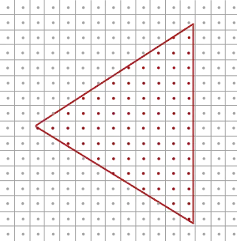
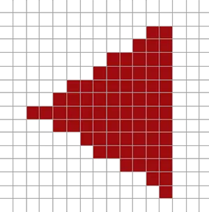
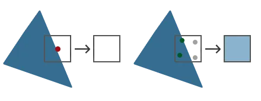
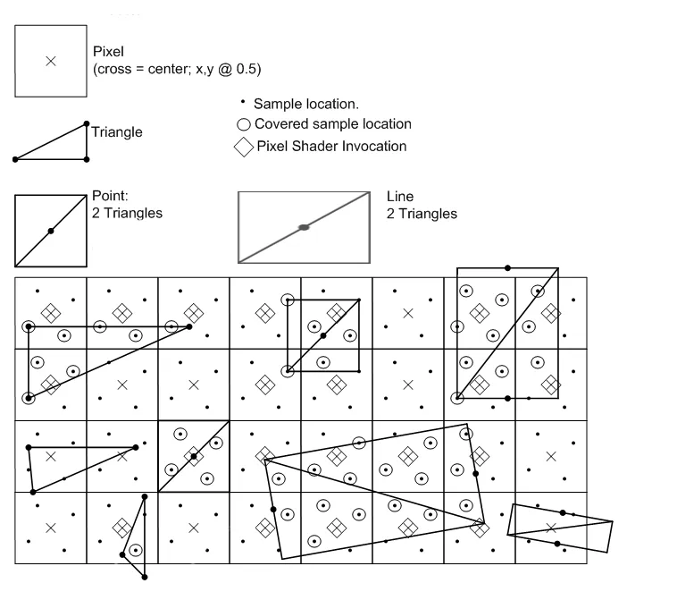
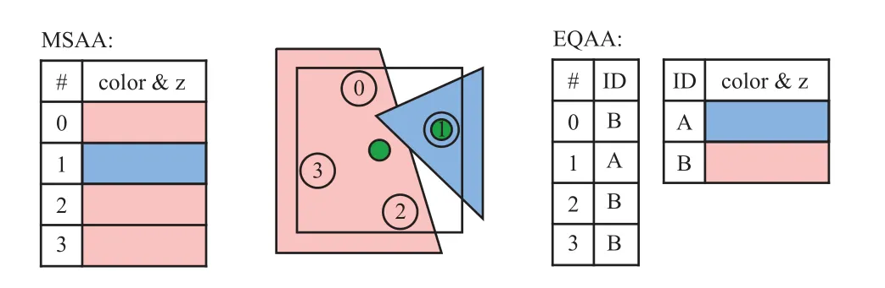
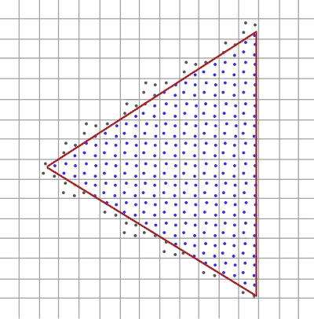
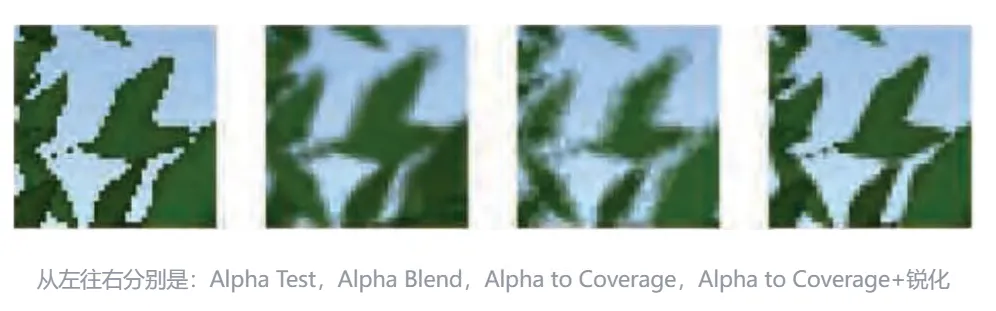
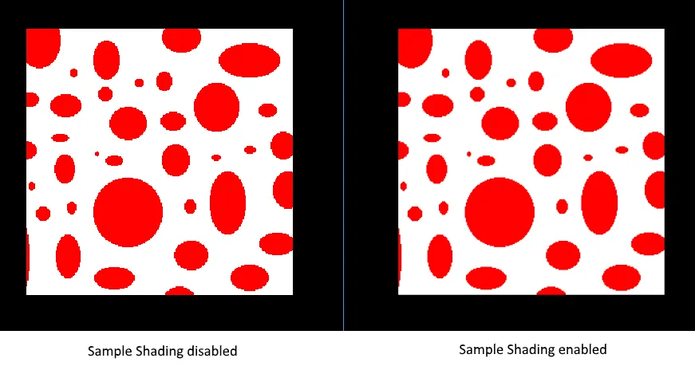

# MSAA
现代GPU具备通过光栅化硬件渲染点、线和三角形图元的能力。GPU上的光栅化管线以被渲染图元的顶点作为输入，其中顶点位置由某个投影矩阵变换后产生的齐次裁剪空间坐标提供。这些位置用于确定当前渲染目标中三角形可见的像素集合。这个可见集合由两个因素决定：覆盖（coverage）和遮挡（occlusion）。覆盖通过执行某种测试来确定图元是否与给定像素重叠。在GPU中，覆盖率的计算是通过测试图元是否与位于每个像素精确中心的单个采样点重叠来实现的。
遮挡（Occlusion）用于判断被某个图元覆盖的像素是否同时被其他三角形覆盖，在GPU中通过ZBuffer来处理。ZBuffer存储了每个像素位置上相对于摄像机最近的图元深度值。当图元被光栅化时，其插值后的深度值会与深度缓冲中的数值进行比较，以确定该像素是否被遮挡。如果深度测试通过，深度缓冲中对应像素的值就会更新为新的最近深度值。关于深度测试需要注意的一点是，虽然它通常被描述为发生在像素着色之后，但几乎所有现代硬件都支持在着色之前执行某种形式的深度测试。这是一种优化手段，使得被遮挡的像素可以跳过像素着色。GPU仍然支持在像素着色之后执行深度测试，以便处理某些提前深度测试会产生错误结果的情况。其中一种情况是像素着色器手动指定深度值，因为此时图元的深度在像素着色器运行之前是未知的。
覆盖和遮挡共同决定了图元的可见性。由于可见性可以定义为X和Y的二维函数，我们可以将其视为一种信号，并使用信号处理领域的概念来描述其行为。例如，由于覆盖测试和深度测试是在渲染目标的每个像素位置上执行的，因此可见性的采样率由该渲染目标的X和Y分辨率决定。我们还应注意到，三角形和线具有不连续性，这意味着该信号不是带限的，因此在一般情况下，任何采样率都不足以完全避免混叠（aliasing）。
根本原因：像素是离散的，而几何边缘是连续的。当三角形边缘穿过像素时，像素要么完全着色，要么完全不着色，导致阶梯状锯齿（Jaggies）。几何边缘产生的锯齿状本质原因是采样率不足导致的.

## 光栅化
是位于管线中最终处理过顶点的着色器之后到片段着色器之前所经过的所有的算法与过程的总和。光栅化会将一个图元的所有顶点作为输入，并将它转换为一系列的片段。顶点坐标理论上可以取任意值，但片段不行，因为它们受限于你窗口的分辨率。顶点坐标与片段之间几乎永远也不会有一对一的映射，所以光栅化必须以某种方式来决定每个顶点最终所在的片段/屏幕坐标。



这里我们可以看到一个屏幕像素的网格，每个像素的中心包含有一个采样点(Sample Point)，它会被用来决定这个三角形是否遮盖了某个像素。图中红色的采样点被三角形所遮盖，在每一个遮住的像素处都会生成一个片段。虽然三角形边缘的一些部分也遮住了某些屏幕像素，但是这些像素的采样点并没有被三角形内部所遮盖，所以它们不会受到片段着色器的影响。
你现在可能已经清楚走样的原因了。完整渲染后的三角形在屏幕上会是这样的：



由于屏幕像素总量的限制，有些边缘的像素能够被渲染出来，而有些则不会。结果就是我们使用了不光滑的边缘来渲染图元，导致之前讨论到的锯齿边缘。

## Basis
MSAA所做的正是将单一的采样点变为多个采样点（这也是它名称的由来）。我们不再使用像素中心的单一采样点，取而代之的是以特定图案排列的多个子采样点(subSample)。我们将用这些子采样点来决定像素的遮盖度。



对于每个子采样点(下图中黑色点位置)，会先进行 coverage test(覆盖率测试)，覆盖测试即测试该次子采样点是否在三角形内部，如果在三角形内部，说明需要采样(执行一次pixel shader)。出于性能考虑，同一个像素上的多个子采样点不会每个都进行一次像素着色计算，而是共享像素中心点的像素计算结果。对于每个像素点，如果上面对应的子采样点至少有一个通过了覆盖测试(下图中圆圈位置)，就会进行一次采样，计算的插值采样位置是像素的中心位置(下面图中的菱形块)。一次采样的结果，会用于多个子采样点中。
计算完成后，每个通过覆盖测试的子采样点还需要进行 depth/stencil test，这个测试和普通的单个像素的depth/stencil test是一样的，只是现在发生在子采样点而已。当深度/模板测试通过后，在像素中心位置采样的结果值就会写入到对应的子采样点。
下图是DX11的光栅化说明文档中的MSAA示意图，非常详细地展示了MSAA的应用原理。



在这里，我们实际采样的位置是像素的中心点位置。有的时候，三角形可能没有覆盖到像素的中心位置，这时候如果再使用像素中心点采样，就可能得到错误的渲染效果。GPU 硬件会使用**Centroid Sampling**来调整采样点的位置，当像素中心点被覆盖时，是正常的像素中心点的采样，而当像素中心点未被三角形覆盖时，GPU就会挑选最近的通过覆盖测试的子采样点作为采样点。
如下图中间所示，每个像素点对应四个子采样点，当前需要着色的像素点被两个物体覆盖。红色的物体覆盖了像素中心的点，蓝色的物体没有覆盖像素中心点。因为红色物体覆盖了像素的中心点，所以采样时是直接在像素中心点采样。而蓝色物体的采样点，设置在了1号这个子采样点位置。



如上图左边所示，对于MSAA，每个像素上的子采样点，都会单独存储颜色值。一种优化的方案是使用 NVIDIA 的 CSAA(coverage sampling antialiasing)或者 AMD 的 EQAA(enhanced quality antialiasing)。如上图右边所示，这种方式下每个次像素点不会记录颜色，而是记录颜色列表的索引，这样可以减少内存的消耗。

总结MSAA真正的工作方式: 无论三角形遮盖了多少个子采样点，每个像素只运行一次片段着色器。片段着色器使用插值到像素中心的顶点数据（如果启用了CentroidSampling则着色器使用的是就近的子采样点位置），然后，MSAA使用更大的深度/模板缓冲区来确定子采样点的覆盖率。被覆盖的子采样点数量将决定了像素颜色对帧缓冲的影响程度。因为上图的4个采样点中只有2个被遮盖住了，所以三角形的颜色会有一半与帧缓冲区的颜色（在这里是无色）进行混合，最终形成一种淡蓝色。
这样子做之后，颜色缓冲中所有的图元边缘将会产生一种更平滑的图形:



深度值和模板值会按各子采样点存储，并且当多个三角形重叠单个像素时，即使我们只运行一次片段着色器，颜色值也依然会按子采样点存储。对深度测试来说，在运行深度测试之前，每个顶点的深度值会被插值到各个子采样点。而对模板测试来说，我们会为每个子样本存储模板值，这意味着缓冲区的大小会根据每个像素的子采样点数量而相应增加。

|特性 | MSAA | TAA|
|-----|-----|-----|
|  空间采样   |  每像素多样本   |  每像素 1 样本，跨时间累积   |
|  鬼影问题   |   无  |  可能有（运动物体）   |
|  锐度   |   高  |   可能略模糊  |
|  延迟渲染   |   不支持  |  支持   |
|  显存带宽  |  高   |  低   |

## Alpha-To-Coverage
Alpha-to-Coverage是一种用于多重采样抗锯齿（MSAA）的扩展技术，主要用来改善具有透明度或镂空效果（如树叶、栅栏、草地）的物体边缘的锯齿问题。
简单来说，它能把**片元的透明度（Alpha值）转化为该片元在像素内的覆盖率（Coverage）**，从而让那些原本因为Alpha测试而完全丢弃的像素边缘，也能参与多重采样抗锯齿，使边缘过渡更平滑。
使用Alpha-to-Coverage时（假设已开启 4x MSAA）：
1. 每个像素内包含多个子样本（如 4 个）。
2. 片元的Alpha值（比如 0.75）被用来决定该片元覆盖像素内多少个子样本。覆盖的样本数 ≈ Alpha × 总样本数（例如 0.75 × 4 = 3 个样本被覆盖）。
3. 该片元只在它覆盖的那些子样本中写入颜色/深度，其余子样本保持原样（或由其他几何覆盖）。
4. 最终，像素颜色是这4个子样本颜色的平均。因为只有部分子样本被覆盖，边缘会产生柔和的过渡，而不是生硬的切换。

**MSAA自身的覆盖率测试（几何光栅化）始终是第一步，Alpha to Coverage是在此基础上的一个后处理过滤**，两者通过按位与操作共同决定最终样本的写入。 因此启用Alpha to Coverage并没有让MSAA的原始覆盖率失效，而是提供了一种利用Alpha值精细化控制样本覆盖的机制。



## Sample Shading
MSAA实现存在一些局限性，这可能会在更复杂的场景中影响输出图像的质量。例如目前尚未解决由于着色器混叠可能导致的问题，即MSAA只能平滑几何体的边缘，而无法填充内部区域。这可能会导致这样一种情况：屏幕上显示的是一个平滑的多边形，但如果所应用的纹理包含高频的颜色，它仍然会看起来有锯齿状。解决这个问题的一种方法是启用Sample Shading，这将进一步提高图像质量，但会带来额外的性能开销：
传统MSAA只对像素着色器执行一次，然后复制到所有子样本,Sample Shading允许对每个子采样点单独执行像素着色，从而获得更高的渲染质量。



## offScreen MSAA

### MSAA纹理

```c++
glBindTexture(GL_TEXTURE_2D_MULTISAMPLE, tex);
glTexImage2DMultisample(GL_TEXTURE_2D_MULTISAMPLE, samples, GL_RGB, width, height, GL_TRUE);
glBindTexture(GL_TEXTURE_2D_MULTISAMPLE, 0);
```
第二个参数设置的是纹理所拥有的子样本数量。如果最后一个参数为GL_TRUE，图像将会对每个纹素使用相同的样本位置以及相同数量的子采样点个数。
使用glFramebufferTexture2D将多重采样纹理附加到帧缓冲上，但是要注意这里使用的纹理类型使用是GL_TEXTURE_2D_MULTISAMPLE。

```c++
glFramebufferTexture2D(GL_FRAMEBUFFER, GL_COLOR_ATTACHMENT0, GL_TEXTURE_2D_MULTISAMPLE, tex, 0);
```

### 渲染到多重采样帧缓冲
渲染到多重采样帧缓冲对象的过程非常简单。只要在多重采样帧缓冲绑定时绘制任何东西，光栅化程序就会负责所有的多重采样运算。最终会得到一个多重采样颜色缓冲以及/或深度和模板缓冲。但是多重采样缓冲有一点特别的是，不能直接将它们的缓冲图像用于其他运算，比如在着色器中对它们进行采样。

### Resolve
一个多重采样的图像包含比普通图像更多的信息，我们所要做的是缩小或者还原(Resolve)图像。多重采样帧缓冲的还原通常是通过glBlitFramebuffer来完成，它能够将一个帧缓冲中的某个区域复制到另一个帧缓冲中，并且将多重采样缓冲还原。
glBlitFramebuffer会将一个用4个屏幕空间坐标所定义的源区域复制到一个同样用4个屏幕空间坐标所定义的目标区域中。你可能记得在帧缓冲教程中，当我们绑定到GL_FRAMEBUFFER时，我们是同时绑定了读取和绘制的帧缓冲目标。我们也可以将帧缓冲分开绑定至GL_READ_FRAMEBUFFER与GL_DRAW_FRAMEBUFFER。glBlitFramebuffer函数会根据这两个目标，决定哪个是源帧缓冲，哪个是目标帧缓冲。接下来，我们可以将图像位块传送(Blit)到默认的帧缓冲中，将多重采样的帧缓冲传送到屏幕上。
但如果想要使用多重采样帧缓冲的纹理做后期处理该怎么办？不能直接在片段着色器中使用多重采样的纹理。但能做的是将多重采样FBO Blit到一个没有使用多重采样纹理附件的FBO中。然后用这个普通的颜色附件来做后期处理，从而达到我们的目的。然而，这也意味着我们需要生成一个新的FBO，作为中介帧缓冲对象，将多重采样缓冲还原为一个能在着色器中使用的普通2D纹理。这个过程的伪代码是这样的：

```c++
unsigned int msFBO = CreateFBOWithMultiSampledAttachments();
// 使用普通的纹理颜色附件创建一个新的FBO
...
glFramebufferTexture2D(GL_FRAMEBUFFER, GL_COLOR_ATTACHMENT0, GL_TEXTURE_2D, screenTexture, 0);
...
while(!glfwWindowShouldClose(window))
{
    ...

    glBindFramebuffer(msFBO);
    ClearFrameBuffer();
    DrawScene();
    // 将多重采样缓冲还原到中介FBO上
    glBindFramebuffer(GL_READ_FRAMEBUFFER, msFBO);
    glBindFramebuffer(GL_DRAW_FRAMEBUFFER, intermediateFBO);
    glBlitFramebuffer(0, 0, width, height, 0, 0, width, height, GL_COLOR_BUFFER_BIT, GL_NEAREST);
    // 现在场景是一个2D纹理缓冲，可以将这个图像用来后期处理
    glBindFramebuffer(GL_FRAMEBUFFER, 0);
    ClearFramebuffer();
    glBindTexture(GL_TEXTURE_2D, screenTexture);
    DrawPostProcessingQuad();  

    ... 
}
```

### shader中读取MSAA纹理
```glsl
uniform sampler2DMS screenTextureMS;

vec4 colorSample = texelFetch(screenTextureMS, TexCoords, 3);  // 第4个子样本
```

**texelFetch有一个重载版本, 第三个参数表示采样第几个子样本.**

