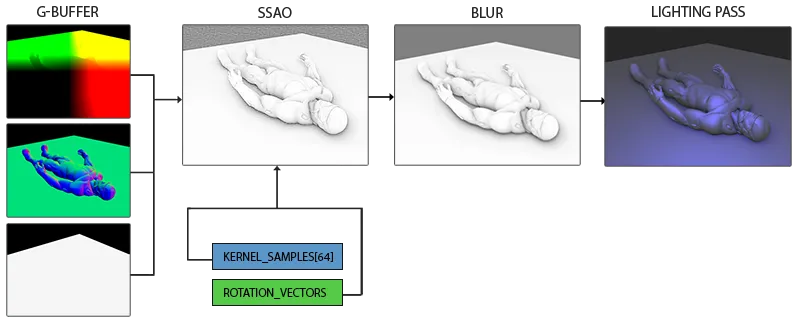
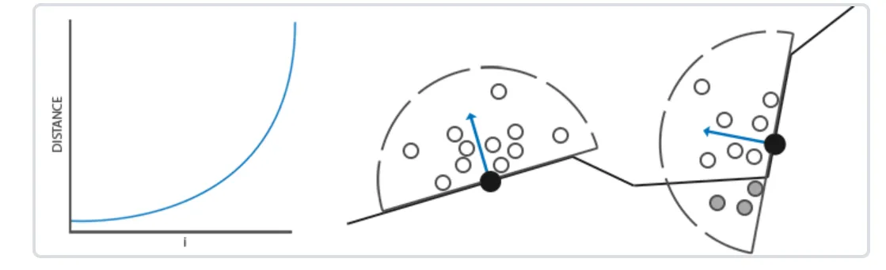
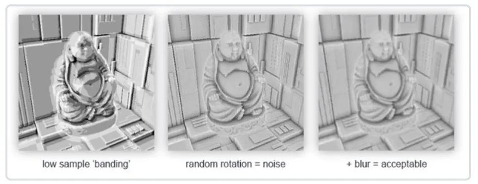
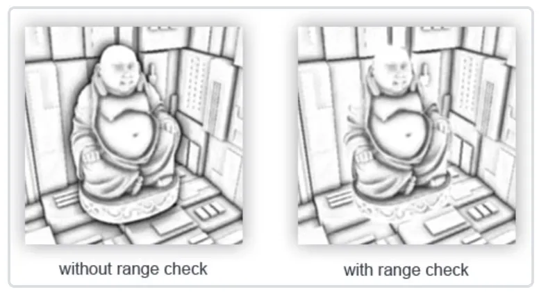

# SSAO

## G-Buffer



## Normal-oriented Hemisphere
我们需要沿着表面法线方向生成大量的样本。由于对每个表面法线方向生成采样核心非常困难，也不合实际，一个可行的方案是先在切线空间(Tangent Space)内生成采样核心，法向量将指向正z方向。然后在采样时通过TBN矩阵将样本转换到世界空间。

```c++
std::uniform_real_distribution<GLfloat> randomFloats(0.0, 1.0); // 随机浮点数，范围0.0 - 1.0
std::default_random_engine generator;
std::vector<glm::vec3> ssaoKernel;
for (GLuint i = 0; i < 64; ++i)
{
    glm::vec3 sample(
        randomFloats(generator) * 2.0 - 1.0, 
        randomFloats(generator) * 2.0 - 1.0, 
        randomFloats(generator)
    );
    sample = glm::normalize(sample);
    sample *= randomFloats(generator);
    GLfloat scale = GLfloat(i) / 64.0; 
    ssaoKernel.push_back(sample);  
}
```

在切线空间中以-1.0到1.0为范围变换x和y方向，并以0.0和1.0为范围变换样本的z方向(如果以-1.0到1.0为范围，采样核心就变成球型了)。由于采样核心将会沿着表面法线对齐，所得的样本矢量将会在半球里。
目前，所有的样本都是平均分布在采样核心里的，但是我们更希望将更多的采样放在靠近真正片段的遮蔽上，也就是将核心样本靠近原点分布。我们可以用一个加速插值函数实现它：

```c++
   scale = lerp(0.1f, 1.0f, scale * scale);
   sample *= scale;
   ssaoKernel.push_back(sample);  
```



## Random rotate Kernel
很明显，渲染效果的质量和精度与采样的样本数量有直接关系。如果样本数量太低，渲染的精度会急剧减少,会得到一种叫做波纹(Banding)的效果；如果太高，反而会影响性能。可以通过引入随机性到采样核心(Sample Kernel)的采样中从而减少样本的数目。通过随机旋转采样核心，能在有限样本数量中得到高质量的结果。然而这仍然会有一些问题，因为随机性引入了一个很明显的噪声图案，最后我们需要通过模糊结果来修复这一问题.



我们可以对场景中每一个片段创建一个随机旋转向量，但这种做法内存开销太大。更好的方法是创建一个小的随机旋转向量纹理重复平铺在整个屏幕上。
假设创建一个4x4朝向切线空间平面法线的随机旋转向量数组：

```c++
std::vector<glm::vec3> ssaoNoise;
for (GLuint i = 0; i < 16; i++)
{
    glm::vec3 noise(
        randomFloats(generator) * 2.0 - 1.0, 
        randomFloats(generator) * 2.0 - 1.0, 
        0.0f); 
    ssaoNoise.push_back(noise);
}
```

接下来创建一个包含随机旋转向量的4x4纹理环绕模式GL_REPEAT，从而保证它合适地平铺在整个屏幕上。

```c++
GLuint noiseTexture; 
glGenTextures(1, &noiseTexture);
glBindTexture(GL_TEXTURE_2D, noiseTexture);
glTexImage2D(GL_TEXTURE_2D, 0, GL_RGB16F, 4, 4, 0, GL_RGB, GL_FLOAT, &ssaoNoise[0]);
glTexParameteri(GL_TEXTURE_2D, GL_TEXTURE_MIN_FILTER, GL_NEAREST);
glTexParameteri(GL_TEXTURE_2D, GL_TEXTURE_MAG_FILTER, GL_NEAREST);
glTexParameteri(GL_TEXTURE_2D, GL_TEXTURE_WRAP_S, GL_REPEAT);
glTexParameteri(GL_TEXTURE_2D, GL_TEXTURE_WRAP_T, GL_REPEAT);
```

## SSAO Shader

```c++
#version 460 core
out float FragColor;
in vec2 TexCoords;

uniform sampler2D gPositionDepth;
uniform sampler2D gNormal;
uniform sampler2D texNoise;

uniform vec3 samples[64];

// parameters (you'd probably want to use them as uniforms to more easily tweak the effect)
int kernelSize = 64;
float radius = 1.0;

// tile noise texture over screen based on screen dimensions divided by noise size
const vec2 noiseScale = vec2(800.0f/4.0f, 600.0f/4.0f); 

uniform mat4 projection;

void main()
{
    // Get input for SSAO algorithm
    vec3 fragPos = texture(gPositionDepth, TexCoords).xyz;
    vec3 normal = texture(gNormal, TexCoords).rgb;
    vec3 randomVec = texture(texNoise, TexCoords * noiseScale).xyz;
    // Create TBN change-of-basis matrix: from tangent-space to view-space
    vec3 tangent = normalize(randomVec - normal * dot(randomVec, normal));
    vec3 bitangent = cross(normal, tangent);
    mat3 TBN = mat3(tangent, bitangent, normal);
    // Iterate over the sample kernel and calculate occlusion factor
    float occlusion = 0.0;
    for(int i = 0; i < kernelSize; ++i)
    {
        // get sample position
        vec3 sample = TBN * samples[i]; // From tangent to view-space
        sample = fragPos + sample * radius; 
        
        // project sample position (to sample texture) (to get position on screen/texture)
        vec4 offset = vec4(sample, 1.0);
        offset = projection * offset; // from view to clip-space
        offset.xyz /= offset.w; // perspective divide
        offset.xyz = offset.xyz * 0.5 + 0.5; // transform to range 0.0 - 1.0
        
        // get sample depth
        float sampleDepth = -texture(gPositionDepth, offset.xy).w; // Get depth value of kernel sample
        
        // range check & accumulate
        float rangeCheck = smoothstep(0.0, 1.0, radius / abs(fragPos.z - sampleDepth ));
        occlusion += (sampleDepth >= sample.z ? 1.0 : 0.0) * rangeCheck;           
    }
    occlusion = 1.0 - (occlusion / kernelSize);
    
    FragColor = occlusion;
}
```

1. 从G-Buffer中读取位置,法线信息
2. 采样噪声纹理获取随机旋转向量
3. 得到法线和随机旋转向量通过施密特正交化计算切线空间->相机观察空间的TBN矩阵
4. 循环法线半球的采样点, 对每个采样点做空间变换, 将采样点从切线空间变换到相机观察空间
5. 加上当前片元的位置以及半径获取真实采样点位置
6. 将采样点位置乘以投影矩阵,投影到屏幕
7. 透视除法 + 转换到[0, 1]得到offset
8. 通过offset的xy采样G-Buffer的线性深度
9. 判断观察空间中当前采样点的深度(线性的)和G-Buffer中存储的实际深度, 如果实际深度 >= 采样点深度, 说明采样点被遮挡, 贡献+1遮蔽因子.

### rangeCheck

当检测一个靠近表面边缘的片段时，它将会考虑测试表面之下的表面的深度值；这些值将会(不正确地)影响遮蔽因子。我们可以通过引入一个范围检测从而解决这个问题，正如下图所示:



```glsl
float rangeCheck = smoothstep(0.0, 1.0, radius / abs(fragPos.z - sampleDepth));
occlusion += (sampleDepth >= sample.z ? 1.0 : 0.0) * rangeCheck;    
```

## Blur
现在的效果仍然看起来不是很完美，由于重复的噪声纹理在图中清晰可见。为了创建一个光滑的环境遮蔽结果，我们需要模糊环境遮蔽纹理。

## Conclussion
SSAO完整的执行流程:
1. G-Buffer, 需要注意的是记得要存储观测空间的线性深度信息, 另外G-Buffer中的信息都在相机的观察空间内
2. 生成SSAO纹理
3. 模糊SSAO纹理
4. 计算光照