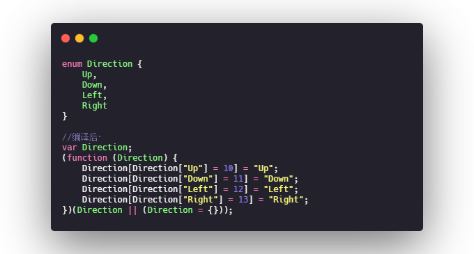
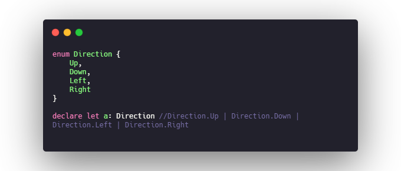
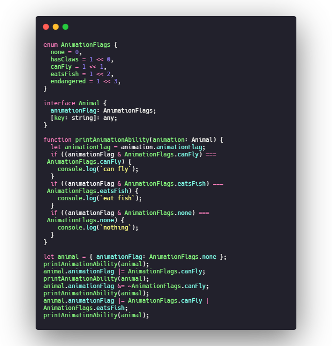
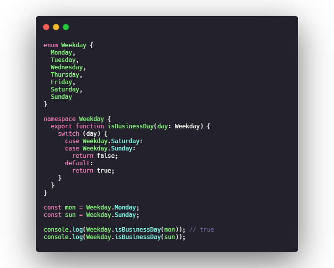

# 枚举(enum)
当一个变量有几种可能的取值时,可以将它定义为枚举类型，
1. 当我们声明一个枚举类型是,虽然没有给它们赋值,但是它们的值其实是默认的数字类型,而且默认从0开始依次累加
2. 因此当我们把第一个值赋值后,后面也会根据第一个值进行累加
3. 枚举类型的值其实也可以是字符串类型
4. 字符串枚举可以和数字枚举混合使用

## 枚举的本质 & 双向映射
枚举具有双向映射的特性，所谓双向映射指的是通过key可以索引到value,同时通过value也可以索引到key.
原因就在编译后的 JavaScript把枚举类型构造成为了一个对象，而由于其特殊的构造，导致其拥有正反向同时映射的特性

## 常量枚举
枚举可以被 const 声明为常量,这样做的好处是，编译后的js代码中实际上是不存在枚举和枚举对象的，使用的是枚举的值，这是性能提升的一个方案。
>如果你非要 TypeScript 保留对象 Direction ,那么可以添加编译选项 --preserveConstEnums

## 联合枚举类型
将一个变量声明为枚举类型，可以认为声明了一个联合类型，联合类型的值对应枚举的值。

## 使用数字类型作为标志

## 为枚举添加静态方法
可以使用enum + namespace 的声明方式向枚举类型添加静态方法.如下例所示，我们将静态成员 isBusinessDay 添加到枚举上

