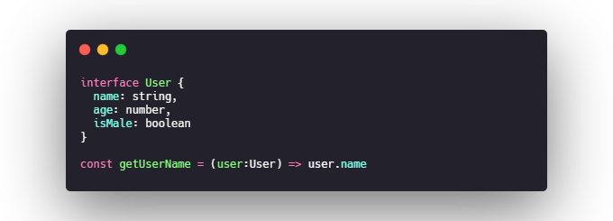
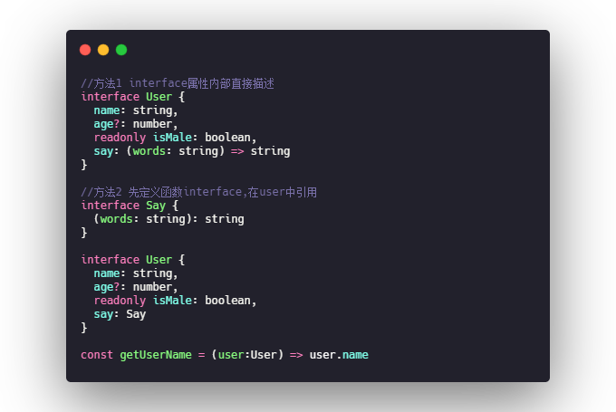
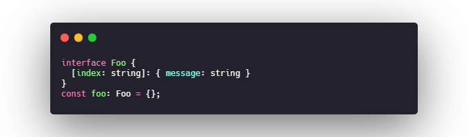
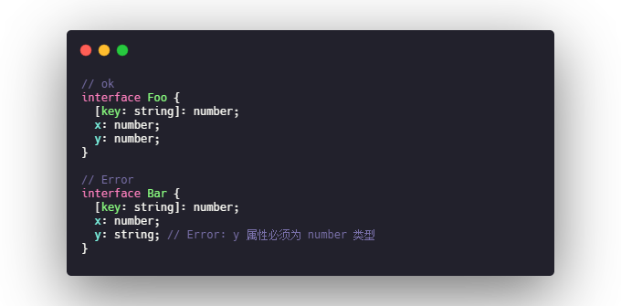
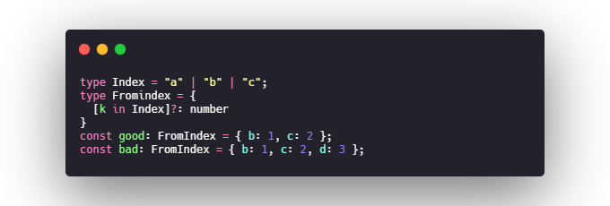
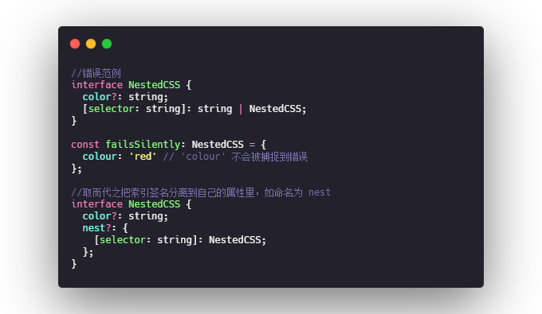
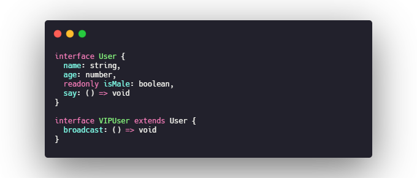

# interface

## 概述
TypeScript的核心原则之一是对值所具有的结构进行类型检查,它有时被称做"鸭式辩型法"或"结构型子类型化".
TypeScript里接口的作用就是为这些类型命名和为你的代码和第三方代码定义契约.

## 可选属性 & 只读属性

## 函数类型

## 索引签名
通过定义key和value的类型宽泛的描述接口"形状".

#### 所有成员都必须符合字符串的索引签名

#### 使用一组有限的字符串字面量
一个索引签名可以通过映射类型来使索引字符串为联合类型中的一员

#### 索引签名的嵌套
尽量不要使用这种把字符串索引签名与有效变量混合使用。如果属性名称中有拼写错误，这个错误不会被捕获到

## 继承接口
基于现有接口实现一个新接口,添加部分额外属性,可以通过接口继承的方式,实现代码重用.

