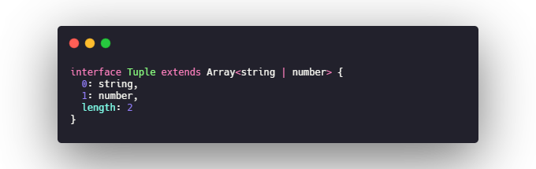

# typeScript类型系统

## 类型注解
基本注解采用 **:TypeAnnotation**语法,在类型声明空间中可用的任何内容都可以用作类型注解
### 原始类型
JavaScript 原始类型也同样适应于 TypeScript 的类型系统，因此 string、number、boolean 也可以被用作类型注解.

### 数组
针对数组的类型注解有两种方式 **:TypeAnnotation[]** 或者 **Array\<TypeAnnotation>**,这两种方式是等价的

### 接口
typeScript核心特性,合并众多类型声明至一个类型声明

### 内联类型注解
内联类型能快速提供一个类型注解,不必为类型起单独的名称,然而,如果你发现需要多次使用相同的内联注解,应该把它重构为一个接口

### 联合类型 & 交叉类型

#### 联合类型(|)
所期望的属性是众多类型之一,如字符串或字符串数组,本质上是类型的并集操作,这正是typeScript中联合类型的用途,使用 | 作标记.

#### 交叉类型(&)
在 JavaScript 中， extend 是一种非常常见的模式，在这种模式中，你可以从两个对象中创建一个新对象，新对象拥有着两个对象所有的功能。交叉类型可以让你安全的使用此种模式

### 元组
元组类型和数组很相似,表示一个已知元素数量和类型的数组,各元素的类型不必相同.可以把元组看成严格版型的数组

### 类型别名
TypeScript 提供了为类型注解设置别名的便捷语法，你可以使用 **type SomeName = someValidTypeAnnotation** 来创建别名：

