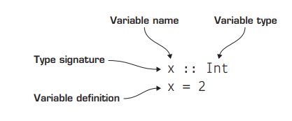
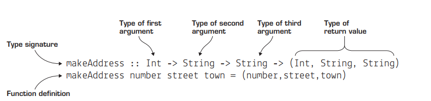
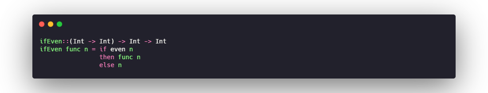
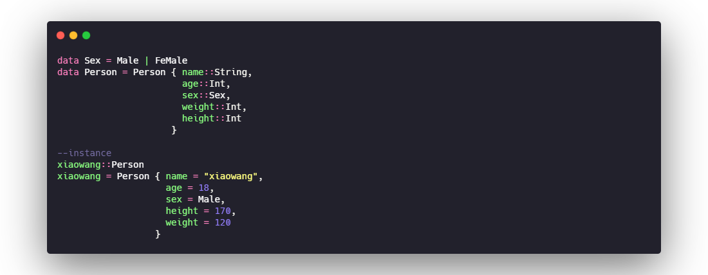

# TYPE BASICS
in Haskell, you haven’t had to write down any information about the
type you’re using for any of your values. It turns out this is because Haskell has done it
for you! Haskell uses type inference to automatically determine the types of all values at
compile time based on the way they’re used! You don’t have to rely on Haskell to determine your types for you.

## list  tuple  function 

### Functions with multiple arguments
why are type signatures this way? The reason is that behind the scenes in Haskell, all functions take only one argument. By rewriting makeAddress by using a series of nested lambda functions.

### Types for first-class functions
functions can take functions as arguments and return
functions as values. To write these type signatures, you write the individual function
values in parentheses.

## Type variables
 Haskell has type variables. Any lowercase letter in a type signature indicates that any type can be used in that place.
 Type variables are literally variables for types. Type variables work exactly like regular
variables, but instead of representing a value, they represent a type. When you use a
function that has a type variable in its signature, you can imagine Haskell substituting
the variable that’s needed.

# CREATING YOUR OWN TYPES
## type synonyms
When you have two names for the same type, it’s referred to as a type synonym. Type synonyms are extremely useful, because they make reading type signatures much easier. 
_**In Haskell, you can create new type synonyms by using the type keyword.**_

## Creating new types

## record syntax
You can define data types such as Patient by using record syntax. Defining a new data type by using record syntax makes it much easier to understand which types represent
which properties of the data type.
