# 01. TYPE BASICS
in Haskell, you haven’t had to write down any information about the
type you’re using for any of your values. It turns out this is because Haskell has done it
for you! Haskell uses type inference to automatically determine the types of all values at
compile time based on the way they’re used! You don’t have to rely on Haskell to determine your types for you.

## list  tuple  function 

### Functions with multiple arguments
why are type signatures this way? The reason is that behind the scenes in Haskell, all functions take only one argument. By rewriting makeAddress by using a series of nested lambda functions.

### Types for first-class functions
functions can take functions as arguments and return
functions as values. To write these type signatures, you write the individual function
values in parentheses.

## Type variables
 Haskell has type variables. Any lowercase letter in a type signature indicates that any type can be used in that place.
 Type variables are literally variables for types. Type variables work exactly like regular
variables, but instead of representing a value, they represent a type. When you use a
function that has a type variable in its signature, you can imagine Haskell substituting
the variable that’s needed.

# 02. CREATING YOUR OWN TYPES
## type synonyms
When you have two names for the same type, it’s referred to as a type synonym. Type synonyms are extremely useful, because they make reading type signatures much easier. 
_**In Haskell, you can create new type synonyms by using the type keyword.**_

## Creating new types

## record syntax
You can define data types such as Patient by using record syntax. Defining a new data type by using record syntax makes it much easier to understand which types represent
which properties of the data type.

### automatically getters and setters
you don’t have to write your getters; each field in the record syntax automatically creates a function to access that value from the record.You can also set values in record syntax by passing the new value in curly brackets to
your data.
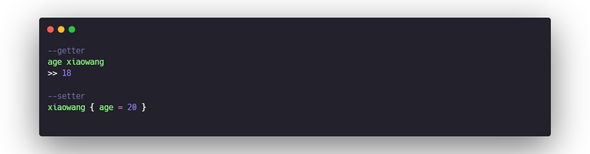

# 03. TYPE CLASSES
Type classes in Haskell are a way of describing groups of types that all behave in the same way. If you’re familiar with
Java or C#, type classes may remind you of interfaces.

## definition
definition of the type class is a list of functions that all members of the class must implement, along with the type signatures of
those functions. The family of functions that describe a number is +, -, *, negate, abs, and
signum (gives the sign of a number)
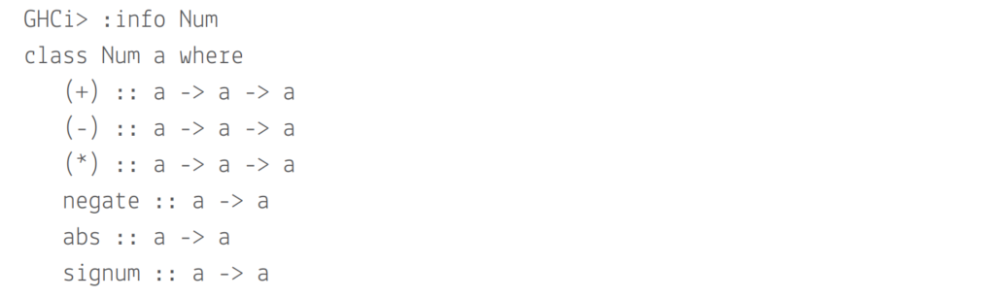

## The benefits of type classes
So far in Haskell, each function you’ve defined works for only one specific set of types. Without type classes, you’d need a different name for each function that adds a different type of value. You do have type variables, but they’re too flexible.
_**Type classes also allow you to define functions on a variety of types that you can’t even
think of**_

## Defining a type class
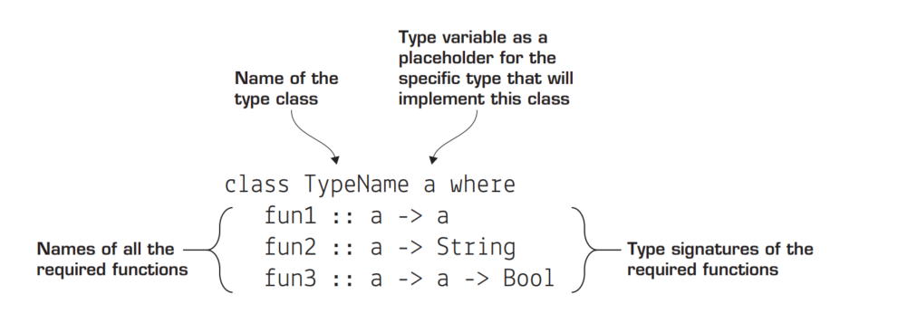

## Deriving type classes
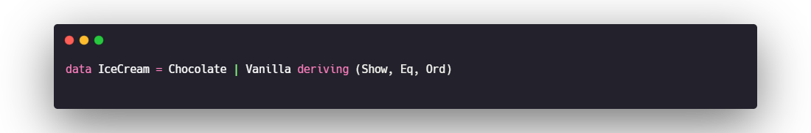

## implement type class 
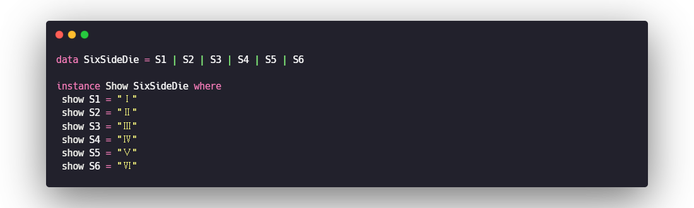

## Creating types with newtype
When looking at our type definition for Name, you find an interesting case in which you’d like to use a type synonym, but need to define a data type in order to make your type an instance of a type class. Haskell has a preferred method of doing this: _**using the newtype keyword.**_ Here’s an example of the definition of Name using newtype.
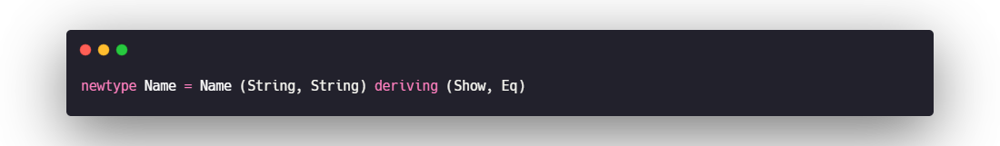

# 04. AlGEBRAIC DATA TYPES
Algebraic data types are any types that can be made by combining other types. The key to understanding algebraic data types is knowing exactly how to combine other types. Thankfully, there are only two ways. You can combine multiple types with an and (for example, a name is a String and another String), or you can combine types with an or (for example, a Bool is a True data constructor or a False data constructor). Types that are made by combining other types with an and are called product types. Types combined using or are called sum types.

## product type
Product types are created by combining two or more existing types with and, bundling two or more types together to define a new type. Nearly every programming language supports product types, even if not by that name.
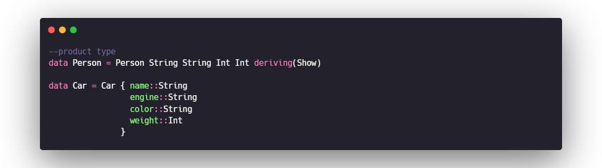

## sum type
Sum types are a surprisingly powerful tool, given that they provide only the capability to combine two types with or. 

# 05. DESIGN BY COMPOSITION—SEMIGROUPS AND MONOIDS

## combining functions
combining functions:A special higher-order function that’s just a period (called compose) takes two functions as arguments.
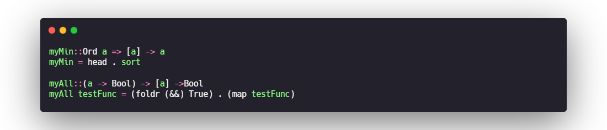

## Combining like types: Semigroups
The Semigroup class has only one important method you need, the <> operator. You can think of <> as an operator for combining instances of the same type. 
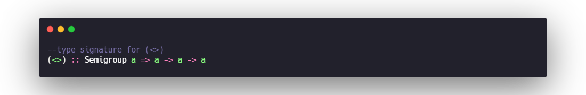
_**This simple signature is the heart of the idea of composability; you can take two like
things and combine them to get a new thing of the same type.**_

## Composing with identity: Monoids
Another type class that’s similar to Semigroup is Monoid. The only major difference between Semigroup and Monoid is that Monoid requires an identity element for the type. An identity element means that x <> id = x (and id <> x = x). _**Having an identity element might seem like a small detail, but it greatly increases the power of a type by allowing you to use a fold function to easily combine lists of the same type.**_
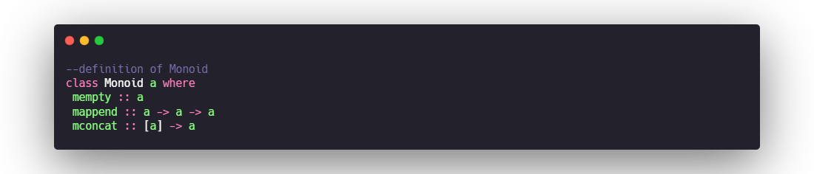

### mconcat
_**The mconcat method takes a list of Monoids and combines them, returning a single Monoid.**_
The easiest way to see how powerful identity is, is to explore the final method in the definition of Monoid: mconcat. The only required definitions in Monoid are mempty and mappend. If you implement these two, you get mconcat for free.This is because the definition of mconcat relies only on foldr, mappend, and mempty. Here’s the definition of mconcat: 
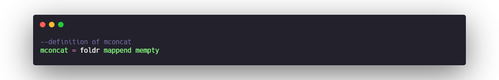

### Monoid laws
1. mappend mempty x is x
2. mappend x mempty is x
3. mappend x (mappend y z) = mappend (mappend x y) z
4. mconcat = foldr mappend mempty

# 06. PARAMETERIZED TYPES
If you’re familiar with type generics in languages such as C# and Java, parameterized types will initially seem similar. Like generics in C# and Java, parameterized types allow you to create “containers” that can hold other types.

## definition
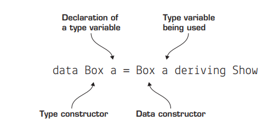

## Lists
A list of type a is either Empty or the consing of the value a with another     list of type a.
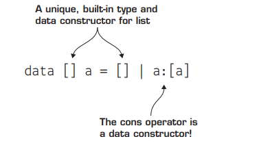

## Types with more than one parameter
Just like functions, types can also take more than one argument. The important thing to remember is that more than one type parameter means the type can be a container for more than one type.

### Tuples
Tuples are the most ubiquitous multiparameter type in Haskell. tuples use a built-in type constructor, ().you have to use () with one comma inside for every n – 1 items in the tuple. For example, if you want the definition of a 2-tuple, you’d type :info
(,) into GHCi. Here’s the built-in definition.
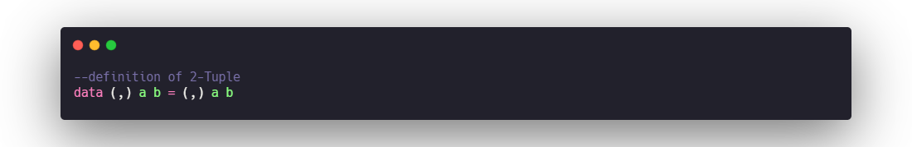
### Data.Map
Map allows you to look up values by using keys. In many other languages, this data type is called Dictionary. The type parameters of Map are the types of the keys and values. The most common way to build a Map is with the fromList function. 
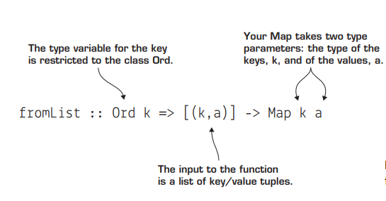
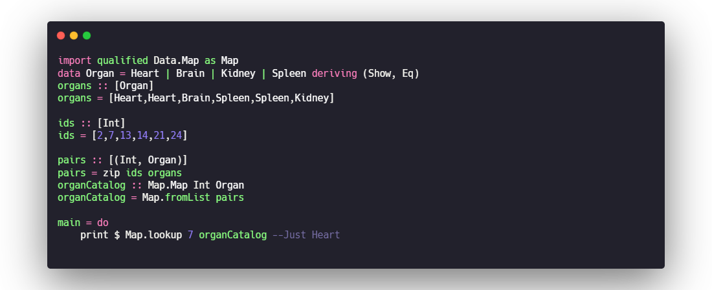

## Kinds: types of types
The type of a type is called its kind. _**The kind of a type indicates the number of parameters the type takes, which are expressed using an asterisk (*). Types that take no parameters have a kind of *, types that take one parameter have the kind * -> *, types with two parameters have the kind * -> * -> *, and so forth.**_

# 07. Maybe
## solving missing values with types
Maybe is a simple but powerful type. So far, all of our parameterized types have been viewed as containers. Maybe is different. _**Maybe is best understood as a type in a context.The context in this case is that the type contained might be missing. Here’s its definition.**_
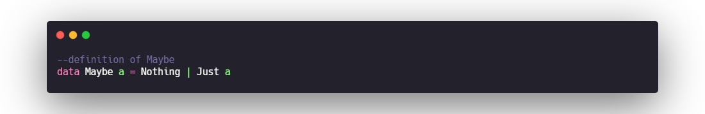
When a function returns a value of the Maybe type, the program can’t use that value without dealing with the fact that the value
is wrapped in a Maybe. Missing values can never cause an error in Haskell because Maybe makes it impossible to forget that a value might be null. At the same time, the programmer never has to worry about this until absolutely necessary. 

_**The interesting thing here is that you didn’t even have to remove the organ from the Maybe context. Maybe implements Eq, so you can just compare two Maybe Organs.**_

## isJust and isNothing
The Data.Maybe module contains two functions, isJust and isNothing, that solve the general case of handling Just values. 