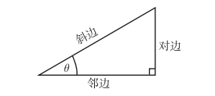
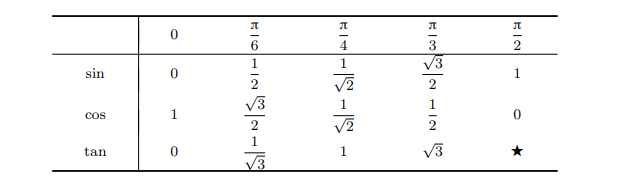
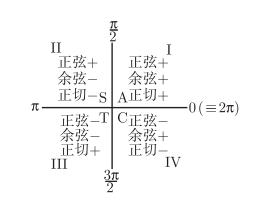

# 基础知识
## 角度弧度换算
> 用弧度度量的角 = π/180 × 用度度量的角
> 
> 用角度度量的角 = 180/π × 用弧度度量的角

## sin cos tan csc sec cot

> sin(θ) = 对边/斜边 
> 
> cos(θ) = 临边/斜边
> 
> tan(θ) = 对边/临边 = sin(θ)/cos(θ)
> 
> csc(θ) = 1/sin(θ)
> 
> sec(θ) = 1/cos(θ)
> 
> cot(θ) = 1/tan(θ)

## 常用三角函数速记表

## 计算三角函数

### 参考角

> θ 的参考角是在表示角 θ 的射线和 x 轴之间的最小的角, 它必定介于 0 到 π/2之间

### ASTC表示法

## 三角恒等式
> $sin(θ)^2 + cos(θ)^2 = 1$
> 
> $1 + tan(θ)^2 = sec(θ)^2$
> 
> $cot(θ)^2 + 1 = csc(θ)^2$
 
> $sin(A + B) = sinAcosB + cosAsinB$
>
> $cos(A + B) = cosAcosB - sinAsinB$
> 
> $sin(A - B) = sinAcosB - cosAsinB$
>
> $cos(A - B) = cosAcosB + sinAsinB$

> $sin(2x) = 2sinxcosx$
>
>$cos(2x) = 2(cosx)^2 - 1 = 1 - 2(sinx)^2$

## 正弦定理
***在任意一个平面三角形中，各边和它所对角的正弦值的比相等且等于外接圆的直径***
> $a/sinA = b/sinB = c/sinC = 2R$

## 余弦定理
***在任意一个平面三角形中，任何一边的平方等于其他两边平方的和减去这两边与它们夹角的余弦的积的两倍。***
> $a^2 = b^2 + c^2 -2bccosA$
> 
> $b^2 = a^2 + c^2 -2accosB$
> 
> $c^2 = a^2 + b^2 -2abcosC$

## 海伦公式
设三角形的三条边为abc.则面积s
> $p = (a + b + c) / 2$
> 
> $s = \sqrt[2]{p(p-a)(p-b)(p-c)}$