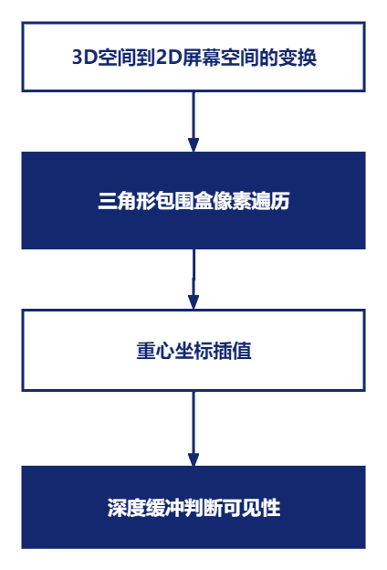
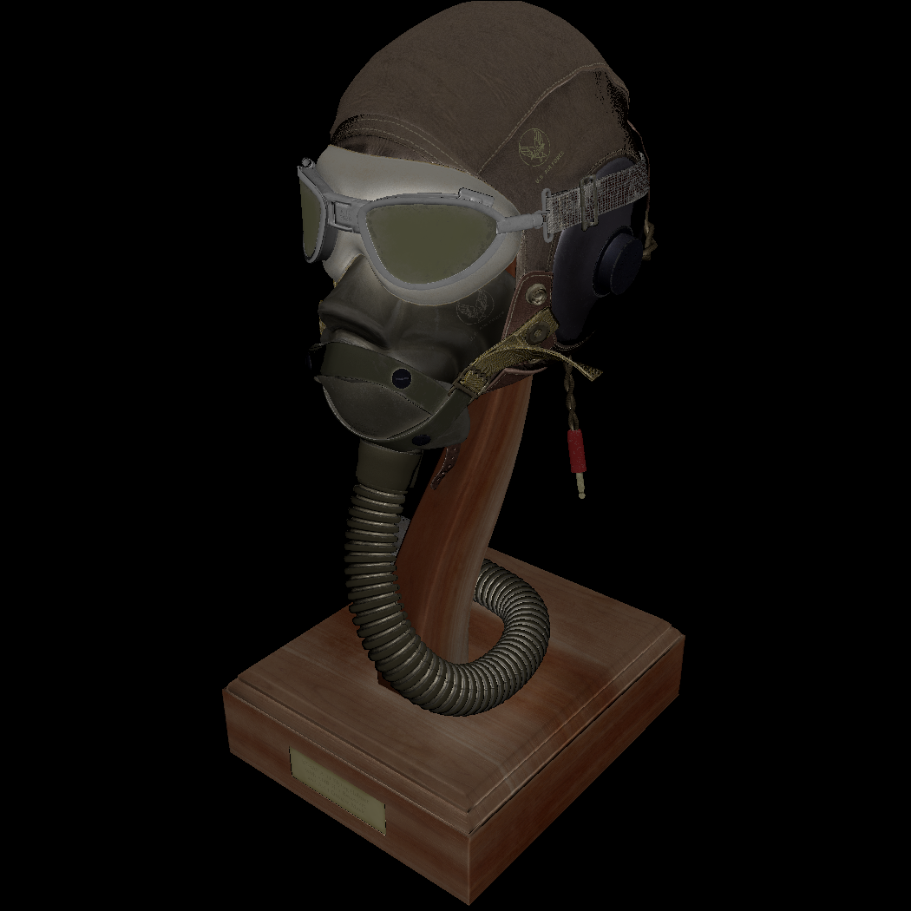
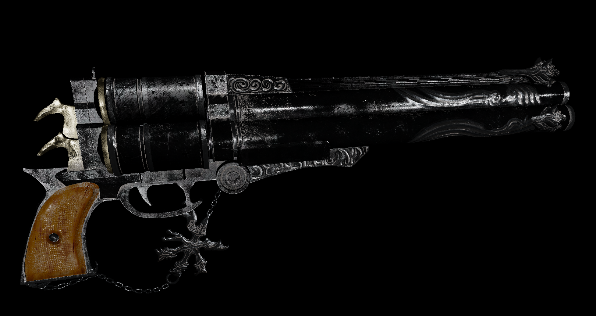
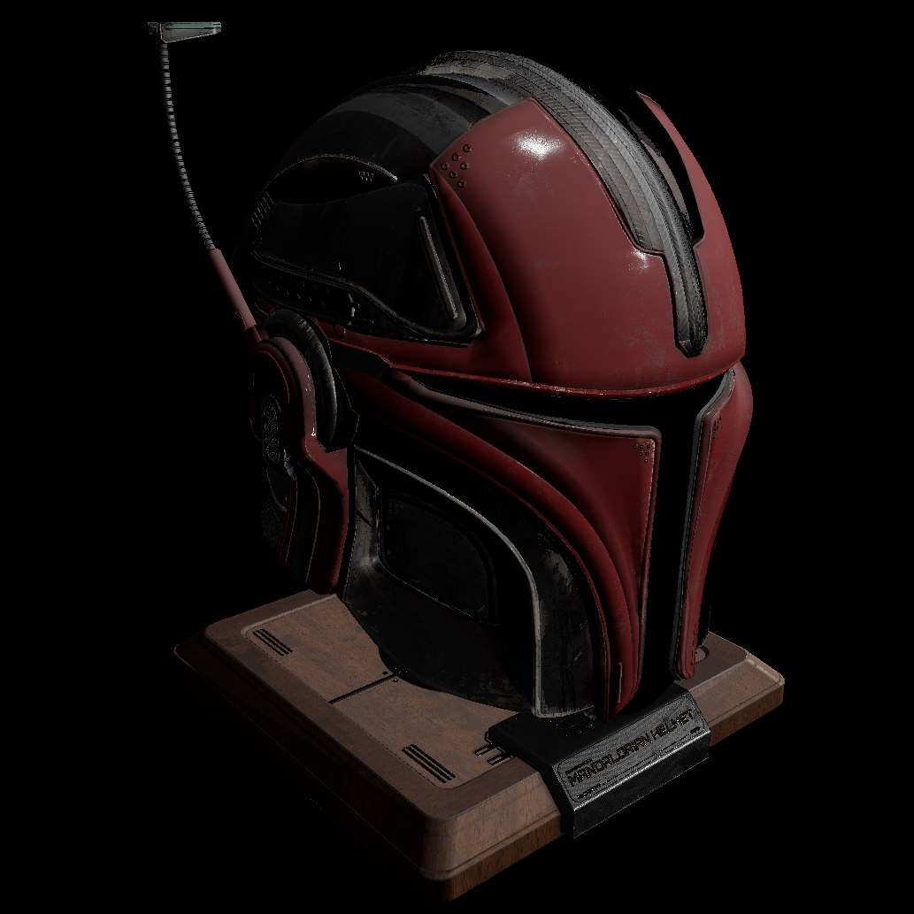
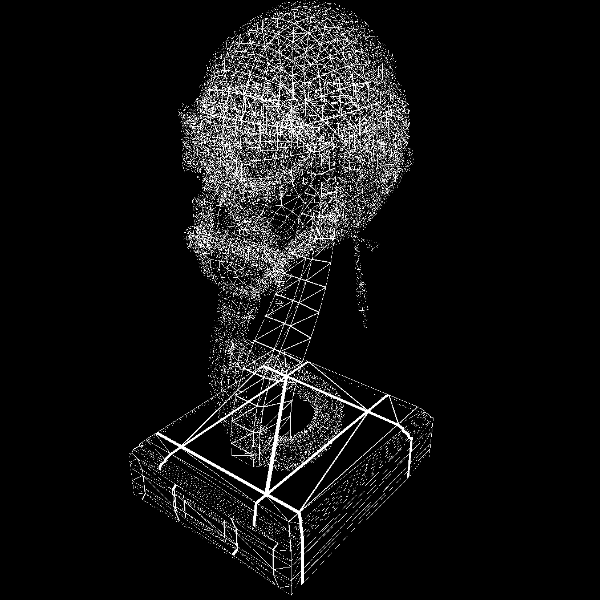
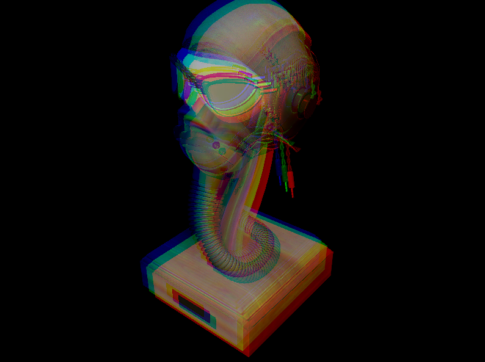
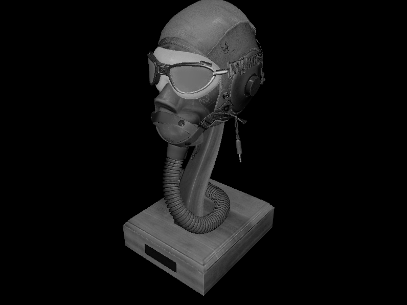
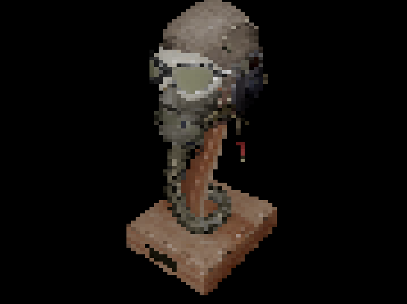

# 何为软渲染,为什么要学习它
本系列文章将会从零手实现一个mini软渲染器(光栅化), 何谓软渲染? 我们为什么需要学习它? 我们知道复杂的图形渲染一般都是由GPU来处理的,所谓软渲染就是用CPU来模拟GPU的行为,在CPU端完全实现图形的绘制, 这其中包含一系列复杂微妙的过程,但整体上可以将其划分为两个大的模块: **可见性和着色**,这其中又包含若干细节:
  
**可见性:**
- 模型变换
- 视图变换
- 投影变换
- 透视除法
- 视口变换
- 计算三角形包围盒
- 三角形光栅化
- 重心坐标插值
- 视图变换
- 深度缓冲
- 相机模型构建

**可见性解决的问题是,对于屏幕上的任意一个像素,场景模型中的哪个片元对它是可见的.** 主要通过以下几个步骤完成:
<!--more-->

**着色:**
- 着色频率
- BlinnPhong光照模型
- PBR光照模型
- 线框渲染
- 平行光/点光源/聚光灯
- TBN矩阵的手动推导
- TBN矩阵与TBN空间
- 纹理采样/纹理应用
- 色调映射
- Gamma矫正

着色主要在fragmentShader中完成, 涉及到光照计算和纹理采样方面的知识.

随着本系列文章的不断深入,以上所有涉及的子主题都会循序渐进逐渐展开, 带你深入理解图形渲染的底层原理. 学习软渲染可以让你拨开纷繁复杂的图形API(OpenGL/WebGL/Vulkan/DirectX)的云雾, 明白图形API背后在做些什么, 只有这样在以后工作中遇到bug或者实现各种需求时, 才能站在更高的角度看待问题.

# 语言和第三方依赖库
本系列代码采用C++实现, 使用的第三方库基本都是头文件形式include即可, 原则上尽量减少第三方库的使用, 但是基于篇幅及主题相关性, 使用了如下第三方库:  

| 名称 | 作用 |  使用方式 | 地址 |
| --- | --- | --- | --- |
| glm | 矩阵和向量计算 | 头文件  |[glm](https://github.com/g-truc/glm)|
| sdl | 窗口系统/屏幕像素点绘制 | 静态库引入 |[sdl](https://www.libsdl.org/)|
| stbimage | 图片读取 | 头文件  |[stb](https://github.com/nothings/stb/)|
| tinyobjloader | obj模型加载 | 头文件  |[tinyobjloader](https://github.com/tinyobjloader/tinyobjloader)|

**注:因为mvp变换对于光栅化渲染是至关重要的主题,因此相机矩阵和投影矩阵采用手工推导的方式,未使用glm提供函数.另外:sdl库仅使用了其窗口系统和绘制像素点的方法,其他图形接口均手工推导实现.**

# 代码风格和结构

麻雀虽小五脏俱全, 本项目会完整实现一个渲染器包含的所有基础组件:

- 相机(透视投影/正交投影) 
- 光照(平行光/点光源/聚光灯)
- 材质
- 模型解析加载
- 纹理及采样
- 场景(包含模型 相机 光照)
- 窗口事件系统
- 核心渲染器
- pass
- shader
- frameBuffer

另外为了尽量模拟GPU在渲染一张图片的整个过程, 抽象Shader接口, shader中变量也尽可能按照glsl中定义的方式，并模拟各种Shader实现及常见的postProcess，例如:
- ShadowMap
- FlatShader
- GouraudShader
- PixelShader
- BlinnPhong
- ToonShader
- PBR

# 部分渲染效果展示

## ToonShading

## PixelShading

## BlinnPhongShading

## PBR

## WireFrame

## postProcess - RGBSplitGlitch

## postProcess - GrayScale

## postProcess - Mosaic

