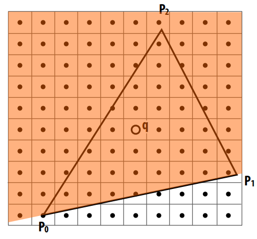

# 从零实现软渲染(三)：Rasterize/绘制三角形
在上一篇文章《窗口系统/viewport》中，通过SDL库我们搭建了一个简易的窗口系统，并通过SDL内置API在屏幕中心绘制了一个矩形来测试RenderLoop。
本章我们将实现自己的渲染器，用它绘制一个三角形。但在开始前，让我们先回顾下渲染的核心概念。

渲染器有两个核心任务：解决***可见性***和***着色***。解决可见性通常有两种方式：***光栅化***和***光追***。这两种常用的算法用于解决渲染中的可见性问题, 即找到哪些物体在相机下的视口是可见的.
<!--more-->

## 光栅化概览


光栅化本质上是一种基于图元(Triangle Line Point...)解决可见性问题的一种算法, 所谓基于图元,是指对于每一个图元我们会计算屏幕上哪些像素被该图元覆盖,***光栅化算法的外层循环为图元集合,内循环为屏幕像素***,伪代码如下:

```c++
for(const Model& model: models)
{
    for(const Triangle& triangle: model.getTriangles())
    {
        BoundingBox bbox = CalcBoundingBox(triangle);
        for(size_t y = bbox.min.y; y <= bbox.max.y; y++)
        {
            for(size_t x = bbox.min.x; x <= bbox.max.x; x++)
            {
                Point p { x + 0.5f, y + 0.5f };
                bool inside = isInsideTriangle(triangle, p);
                if(inside && zValue > zBuffer[currentValue])
                {           
                    shading(p);
                }
            }
        }     
    }
}
```

通过以上伪代码我们不难发现,光栅化是如何基于图元进行操作的,它会遍历每一个图元, 根据图元生成包围盒, 遍历包围盒内部的像素, 通过inSide(是否在三角形内部)判断当前像素点是否被图元所覆盖,如果在三角形内部并且当前片元的z值大于zbuffer所存储的z值,则执行着色逻辑.

光栅化的优缺点:
- 相较于光线追踪,光栅化计算速度快
- 难以处理全局光照问题,但是可以通过其他方式模拟近似,例如 shadowMaps SSAO IBL等;
- 
## 光线追踪概览


和光栅化从图元出发不同,光线追踪是从屏幕像素出发,从摄像机位置出发,往每个像素方向发射光线(RayRayRay),计算光线与场景(boundingBox/mesh/primitives)求交,找到最近相交的图元,递归计算光照的过程.因此我们可以说**光线追踪是基于屏幕空间像素解决可见性问题的一种算法**.

***光线追踪和光栅化相反,光线追踪外层循环为屏幕像素,内层循环为图元.***,同样我们用伪代码简单描述光线追踪的运行逻辑:

```c++
Viewport viewpot{ width, height };
Camera camera;
//遍历屏幕二维空间
for(size_t y = 0; y <= viewport.height; y++)
{
    for(size_t x = 0; x <= viewport.widht; x++)
    {
        Ray ray = camera.castRay(x, y);
        for(size_t i = 0; i <= modelsOrBvhs; i++)
        {
            RayIntersection(modelsOrBvhs[i], ray);
            //recursive calc shading...            
        }
    }
}
```
***光线追踪是向屏幕空间每个像素发射一条光线, 计算光线与场景(Bvhs)最近的交点,递归计算光照的过程.***

# 光栅化
本章我们着重讲解光栅化的实现。光栅化即将图元信息离散化到屏幕像素的过程。 这其中涉及一系列的步骤：

1.首先我们知道原始顶点经过$Model/View/Projection$变换及透视除法后,顶点坐标处于NDC空间中，而光栅化实际上是对屏幕上的像素做处理，因此第一步首先需要将NDC空间中的顶点变换到屏幕空间，而这一切需要通过构建viewport矩阵来完成。

2.到达屏幕空间的顶点每三个一组构成一个三角形图元，这也是光栅化的最小处理单元（对每个三角形图元进行光栅化/triangle Pipeline）。

3.经过上一步的坐标系转换，我们可以拿到屏幕空间三角形的三个顶点坐标，这里我们可以遍历屏幕上的所有像素点，进行inSide判定，但是这样做有个问题，每次光栅化三角形遍历屏幕上所有像素，效率太低，解决这个问题的其中一种方式就是，可以先计算三角形的包围盒，将遍历的范围缩小至包围盒范围内。


4.那么如何判定一个点是否在三角形内部呢？

## InSide判定
这里给出两种方式：

### CrossProduct
***分别判断当前像素点是否包含在与边相关的三个半平面中***




算法很简单，只需要用当前点和三角形其中一边的顶点组成的向量和边向量叉乘即可。

### BaryCentric
通过重心坐标判断，首先计算当前像素点的三角形重心坐标，我们知道顶点重心坐标是顶点对面小三角形和大三角形的面积比，如果点在三角形内部，则重心坐标的三个分量必须同时满足(假设重心坐标的三个分量为$uvw$)：

$u \geq 0 \ \ \ and \ \ \ u \leq 1$

$v \geq 0 \ \ \ and \ \ \ v \leq 1$

$w \geq 0 \ \ \ and \ \ \ w \leq 1$


## Triangle Pipeline
多数Mesh都是由三角形图元组成，这主要有以下几点原因：
-  三角形能近似表达所有的形状，只要三角形的数量够多，近似描述任何形状都不成问题。


- 另外一个采用三角形做为基本图元的理由是可以利用三角形的重心坐标对顶点插值
- 最关键的一个因素是，一旦所有的图元都转换为三角形,GPU可以只处理三角形,只需要做好这一件事,可以把更多的硬件资源用于优化三角形的绘制(triangle pipeline)

## NdcSpace → ScreenSpace
光栅化的第一步步骤是坐标空间的转换，经过图形管线处理过的顶点位于$[-1, 1]^3$的NDC空间中，而屏幕空间是由实际的宽高组成的（width∗heightwidth * heightwidth∗height个像素点）,因此需要矩阵将元素从NDCSpace转换到ScreenSpace，这个任务交由Viewport来完成。

### Viewport
Viewport矩阵在上一章已经做过详细推导，这里再复述一遍。
用struct封装Viewport类：

```c++
struct Viewport
{
	Viewport() = default;
	Viewport(uint32_t x, uint32_t y, uint32_t width, uint32_t height):width(width), height(height)
	{
		transform =
		{
			{ width / 2,     0,              0, 0 },
			{ 0,             height / 2,     0, 0 },
			{ 0,             0,              1, 0 },
			{ width / 2 + x, height / 2 + y, 0, 1 }
		};
	}
	uint32_t width = 0;
	uint32_t height = 0;
	glm::mat4 transform = glm::identity<glm::mat4>();
};
```

需要注意的是viewport transform矩阵的构造过程，用一张图来说明：


1. 对$x$轴和$y$轴进行 $width/2$,$height/2$的缩放
2. 平移（$width/2 + x$,$height/2 + y$）,$x,y$分别为传入的相对于坐标原点的偏移量

***注：由于NDCSpace在三维空间，以上推导涉及平移变换，三维空间的平移变换需要通过四维其次空间的仿射变换来表示，因此构造的变换矩阵如上述代码所示（mat4x4）。***

## 三角形包围盒
计算三角形包围盒很简单，只需要遍历三角形三个顶点，找到最小和最大的xy即可。首先声明一个BoundingBox struct：

```c++
struct BoundingBox
{
    BoundingBox() = default;
    BoundingBox(const glm::vec2& min, const glm::vec2& max) :min(min), max(max) {}

    glm::vec2 min;
    glm::vec2 max;
};
```

计算三角形包围盒代码实现：

```c++
CalcBoundingBox(glm::vec4* triangleVertices)
{
	BoundingBox bbox;
	glm::vec2 min { 0, 0 };
	glm::vec2 max { viewport.width - 1, viewport.height - 1 };
	bbox.min = max;
	bbox.max = min;
	
	for (size_t i = 0; i < 3; i++)
	{
		bbox.min.x = glm::min(bbox.min.x, triangleVertices[i].x);
		bbox.min.y = glm::min(bbox.min.y, triangleVertices[i].y);
		bbox.max.x = glm::max(bbox.max.x, triangleVertices[i].x);
		bbox.max.y = glm::max(bbox.max.y, triangleVertices[i].y);
	}

	bbox.min.x = glm::max(min.x, bbox.min.x);
	bbox.min.y = glm::max(min.y, bbox.min.y);
	bbox.max.x = glm::min(max.x, bbox.max.x);
	bbox.max.y = glm::min(max.y, bbox.max.y);
	return bbox;
}
```

## 重心坐标

### 定义


对于同一空间内的三角形$\bigtriangleup V0V1V2$和任意一点$P$,必定存在三个数$uvw$,满足：

$u + v + w = 1$

$P = u * V0 + v * V1 + w * V2$;

则$(u, v, w)$就称为此三角形上$P$点的**重心坐标**。下边我们从几个不同的角度理解重心坐标的几何意义。

### 高度比

重心坐标可以看作$P$点到对面距离和三角形高度比：


### 面积比
重心坐标同样可以理解为$P$点拆分的三个小三角形和大三角形的面积比：


### 线性组合
根据重心坐标的定义：
$P = u * V0 + v * V1 + w * V2$

我们将该公式做下变形：

$P = (1 - v - w) * V0 + v * V1 + w * V2$

$P = V0 - v * V0 - w * V0 + v * V1 + w * V2$

$P = V0 + v(V1 - V0) + w(V2 - V0)$

$P = V0 + v\overrightarrow{V01} + w \overrightarrow{V02}$

通过以上推导,我们得出结论：**重心坐标$(v,w)$可以看作以$V0$为原点，$\overrightarrow{V01}$和$\overrightarrow{V02}$为轴构成坐标系的$P$点坐标**


### 计算重心坐标
三角形重心坐标的计算很简单,只需要对上述推导做简单变形即可,以下是详细的推导步骤:

已知:

$u + v + w = 1$

$P = u * V0 + v * V1 + w * V2$

推导:

$\Rightarrow \ \ \ \ P = (1 - v - w) * V0 + v * V1 + w * V2$

$\Rightarrow \ \ \ \ P = V0 - v * V0 - w * V0 + v * V1 + w * V2$

$\Rightarrow \ \ \ \ P = V0 + v(V1 - V0) + w(V2 - V0)$

$\Rightarrow \ \ \ \ 1 * (V0 - P) + v(V1 - V0) + w(V2 - V0) = 0$

$\Rightarrow \ \ \ \ 1 * \overrightarrow{V0P} + v * \overrightarrow{V10} + w * \overrightarrow{V20} = 0$

$\Rightarrow \ \ \ \ \overrightarrow{x} = (1, v, w)$

$\Rightarrow \ \ \ \ \overrightarrow{y} = (\overrightarrow{V0P}.x, \overrightarrow{V10}.x, \overrightarrow{V20}.x)$

$\Rightarrow \ \ \ \ \overrightarrow{z} = (\overrightarrow{V0P}.y, \overrightarrow{V10}.y, \overrightarrow{V20}.y)$

$\Rightarrow \ \ \ \ \overrightarrow{x} = \overrightarrow{y} \times \overrightarrow{z}$

以下是c++代码实现部分:

```c++
BaryCentric(const glm::vec4* triangleVertices, const glm::vec2& p)
{
    glm::vec2 v0 { triangleVertices[0] };
    glm::vec2 v1 { triangleVertices[1] };
    glm::vec2 v2 { triangleVertices[2] };

    glm::vec2 v01 = v1 - v0;
    glm::vec2 v02 = v2 - v0;
    glm::vec2 vp0 = v0 - p;
    glm::vec3 vwz = glm::cross(glm::vec3(v01.x, v02.x, vp0.x), glm::vec3(v01.y, v02.y, vp0.y));
    if (vwz.z < 1e-2)
    {
        return { -1, 1, 1 };
    }
    float v = vwz.x / vwz.z;
    float w = vwz.y / vwz.z;
    float u = 1.0 - (v + w);
    return { u, v, w };
}
```
## 绘制
通过上一步计算得到重心坐标后,就可以分别对其三个分量进行判断,如果任意一个分量小于0,则当前像素点在三角形外,跳过继续.

```c++
glm::vec3 baryCentric = BaryCentric(screenSpaceVertices.data(), p);
if (baryCentric.x <0 || baryCentric.y < 0 || baryCentric.z < 0)
{
    continue;
}
winHandle->DrawPoint(p.x, p.y, drawColor);
```

# Renderer
把以上步骤串联起来,我们可以构造简化版本的Renderer:

```c++
//Renderer.h
class Renderer
{
public:
    Renderer() = default;
    ~Renderer() = default;
    void SetDrawHandle(Window* win);
    void Draw();
    void Rasterize();
    BoundingBox CalcBoundingBox(glm::vec4* triangleVertices);
    glm::vec3 BaryCentric(const glm::vec4* triangleVertices, const glm::vec2& p);
    void SetViewport(uint32_t x, uint32_t y, uint32_t w, uint32_t h);
private:
    Viewport viewport{};
    Window* winHandle = nullptr;
    std::array<glm::vec4, 3> triangleVertices = { 
            glm::vec4( -0.5f, -0.5f, 0.0f, 1.0f),
            glm::vec4(  0.5f, -0.5f, 0.0f, 1.0f),
            glm::vec4(  0.0f,  0.5f, 0.0f, 1.0f)
    };
    glm::vec3 drawColor { 230, 80, 50 };
};
```


```c++
//Renderer.cpp
void Renderer::SetDrawHandle(Window* win)
{
    winHandle = win;
}

void Renderer::Draw()
{
    Rasterize();
}

void Renderer::Rasterize()
{
    std::array<glm::vec4, 4> screenSpaceVertices;
    for (size_t i = 0; i < 3; i++)
    {
        screenSpaceVertices[i] = viewport.transform * triangleVertices[i];
    }
    BoundingBox bbox = CalcBoundingBox(screenSpaceVertices.data());
    for (size_t y = bbox.min.y; y <= bbox.max.y; y++)
    {
        for (size_t x = bbox.min.x; x <= bbox.max.x; x++)
        {
            glm::vec2 p { x + 0.5f, y + 0.5f };
            glm::vec3 baryCentric = BaryCentric(screenSpaceVertices.data(), p);
            if (baryCentric.x <0 || baryCentric.y < 0 || baryCentric.z < 0)
            {
                    continue;
            }
            winHandle->DrawPoint(p.x, p.y, drawColor);
        }
    }
}

BoundingBox Renderer::CalcBoundingBox(glm::vec4* triangleVertices)
{
    BoundingBox bbox;
    glm::vec2 min { 0, 0 };
    glm::vec2 max { viewport.width - 1, viewport.height - 1 };
    bbox.min = min;
    bbox.max = max;

    for (size_t i = 0; i < 3; i++)
    {
        bbox.min.x = glm::min(bbox.min.x, triangleVertices[i].x);
        bbox.min.y = glm::min(bbox.min.y, triangleVertices[i].y);
        bbox.max.x = glm::max(bbox.max.x, triangleVertices[i].x);
        bbox.max.y = glm::max(bbox.max.y, triangleVertices[i].y);
    }

    bbox.min.x = glm::max(min.x, bbox.min.x);
    bbox.min.y = glm::max(min.y, bbox.min.y);
    bbox.max.x = glm::min(max.x, bbox.max.x);
    bbox.max.y = glm::min(max.y, bbox.max.y);
    return bbox;
}

glm::vec3 Renderer::BaryCentric(const glm::vec4* triangleVertices, const glm::vec2& p)
{
    glm::vec2 v0 { triangleVertices[0] };
    glm::vec2 v1 { triangleVertices[1] };
    glm::vec2 v2 { triangleVertices[2] };

    glm::vec2 v01 = v1 - v0;
    glm::vec2 v02 = v2 - v0;
    glm::vec2 vp0 = v0 - p;
    glm::vec3 vwz = glm::cross(glm::vec3(v01.x, v02.x, vp0.x), glm::vec3(v01.y, v02.y, vp0.y));
    if (vwz.z < 1e-2)
    {
        return { -1, 1, 1 };
    }
    float v = vwz.x / vwz.z;
    float w = vwz.y / vwz.z;
    float u = 1.0 - (v + w);
    return { u, v, w };
}

void Renderer::SetViewport(uint32_t x, uint32_t y, uint32_t w, uint32_t h)
{
    viewport.Set(x, y, w, h);
}
```
***在光栅化函数里,首先我们通过Viewport矩阵将NDCSpace的顶点信息转换到ScreenSpace,然后计算三角形包围盒,遍历包围盒的二维空间像素点,对每一个像素点计算重心坐标,判断重心坐标是否小于0来判断当前像素点是否在三角形内部,如果在三角形内部,处理着色逻辑.***

在RenderLoop代码中，调用softRenderer的draw函数。

```c++
void Window::Run()
{
    while (!shouldClosed)
    {
        SDL_Event event;
        SDL_PollEvent(&event);
        if (event.type == SDL_QUIT)
        {
                shouldClosed = true;
                return;
        }
        Clear();
        softRenderer->Draw();
        SDL_RenderPresent(drawHandle);
    }
}
```
运行程序，如果一切正常，你将在屏幕中心看到一个橙色的三角形：


## 绘制彩色三角形
让我们再进一步，画一个彩色三角形，基本思路是读取三角形三个顶点属性的颜色值，通过光栅化得到的重心坐标对属性进行插值，对当前像素点着色。
首先改造下代码，由于现在顶点不仅仅有Position一个属性，多了一个Color，用简单的struct对其封装：


```c++
struct Vertex
{
    Vertex() = default;
    Vertex(const glm::vec4& p, const glm::vec3& c) :Position(p), Color(c) {}
    glm::vec4 Position;
    glm::vec3 Color;
};
```

在Renderer临时声明的三角形顶点数组添加Color属性：


```c++
std::array<Vertex, 3> triangleVertices = { 
    Vertex(glm::vec4(-0.5f, -0.5f, 0.0f, 1.0f), glm::vec3(0.0f, 255.0f, 0.0f)),
    Vertex(glm::vec4(  0.5f, -0.5f, 0.0f, 1.0f), glm::vec3(255.0f, 0.0f, 0.0f)),
    Vertex(glm::vec4(  0.0f,  0.5f, 0.0f, 1.0f), glm::vec3(0.0f, 0.0f, 255.0f))
};
```

在光栅化函数中，读取三角形三个顶点的Color值，通过重心坐标插值计算得到当前像素点的颜色值：


```c++
void Renderer::Rasterize()
{
    std::array<glm::vec4, 4> screenSpaceVertices;
    for (size_t i = 0; i < 3; i++)
    {
        screenSpaceVertices[i] = viewport.transform * triangleVertices[i].Position;
    }
    BoundingBox bbox = CalcBoundingBox(screenSpaceVertices.data());
    for (size_t y = bbox.min.y; y <= bbox.max.y; y++)
    {
        for (size_t x = bbox.min.x; x <= bbox.max.x; x++)
        {
            glm::vec2 p { x + 0.5f, y + 0.5f };
            glm::vec3 baryCentric = BaryCentric(screenSpaceVertices.data(), p);
            if (baryCentric.x <0 || baryCentric.y < 0 || baryCentric.z < 0)
            {
                continue;
            }
            //重心坐标插值属性值（线性组合）
            glm::vec3 drawColor = { 
                baryCentric.x * triangleVertices[0].Color + 
                baryCentric.y * triangleVertices[1].Color + 
                baryCentric.z * triangleVertices[2].Color 
            };
            winHandle->DrawPoint(p.x, p.y, drawColor);
        }
    }
}
```


# 结语
本章我们实现了一个基础版光栅化器，通过计算重心坐标，对属性插值，绘制了一个彩色三角形。完成了光栅化器基本结构的搭建，后续我们会在此基础上不断完善填充细节，在进入三维空间后，通过zBuffer解决遮挡问题，以及透视除法形成的非线性空间插值如何进行矫正等等。

