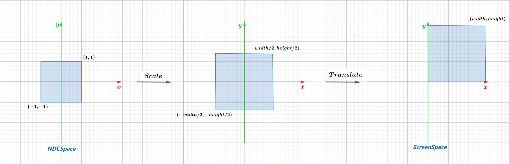

# 后续文章发布计划
在正式开始本章内容之前，我对专栏后续的更新计划/大纲做了详细梳理，大家可以对整体框架结构及涉及到的知识点有个初步的认识。

在后续的文章更新过程中会基本按照上图框架的内容和顺序逐步展开深入，每一个大的分类代表了渲染系统中的一个组件，正常情况下会做为一篇单独的文章出现，内容过多会拆分为上下两篇（PBR...），另外相对较难或者比较重要的知识点会单独拉出来做为一个专项，预计总共会更新25篇文章左右，从易到难，由浅入深实现整个渲染系统。本系列不涉及图形API，但是shader抽象类会模仿GLSL语言规范的写法和命名方式，使大家有更强的代入感。那么废话不多说，接下来我们正式开始本篇文章的第一个主题：窗口系统的构建。
<!--more-->


# SDL窗口系统
本系列使用SDL库来搭建窗口系统，[Simple DirectMedia Layer](https://www.libsdl.org/)是一个跨平台开发库，它本身提供了对openGL/directX的封装，但是由于我们要自己实现渲染器，所以仅使用了SDL的创建窗口/绘制像素点API.窗口系统会做为渲染输出最终呈现的载体，主要负责RenderLoop的运行，这样我们就能够通过自己的渲染器在每次渲染循环中调用自己的绘制方法。构建渲染循环非常简单，伪代码如下：

```c++
 while(!shouldClosed)
 {
     SDL_Event event;
     SDL_PollEvent(&event);
     if(event.type == SDL_QUIT)
     {
         shouldClosed = true;
         return;
     }
     Clear();
     Renderer->Clear();
     Renderer->Draw();
     //sdl每次执行drawPoint函数不会立即绘制到屏幕上
     //而是会将其缓冲到backBuffer
     //只有在执行SDL_RenderPresent后，才会将缓冲区的所有绘制内容更新到屏幕上
     SDL_RenderPresent(drawHandle);
 }
```

## 头文件声明
基于以上需求，我们对于一个窗口系统实现无非就是几个方法：
1. 窗口初始化
2. 构建RenderLoop
3. Clear函数：在每次渲染循环绘制前清理当前屏幕内容
4. DrawPoint：后续提供给Renderer使用（单个像素点的绘制）
5. 窗口关闭后资源清理

头文件代码如下所示：

```c++
#pragma once
#include <glm/glm.hpp>
#include <SDL.h>

class Window
{
public:
	Window(const char* title, uint32_t w, uint32_t h);
	~Window();
	void ShutDowm();
	void DrawPoint(int x, int y, const glm::vec3& color, bool flip = true);
	void Clear();
	void Run();
private:
	SDL_Window* windowHandle = nullptr;
	SDL_Renderer* drawHandle = nullptr;
	Renderer* softRenderer = nullptr;
	bool shouldClosed = false;
	glm::vec3 clearColor = { 10/255, 10/255, 10/255 };
	glm::mat3 sdlTransform;
        uint32_t width;
        uint32_t height;
};

```

## 窗口初始化
在Window构造函数中，会进行一系列SDL的初始化操作，整体逻辑非常简单，这里直接贴代码：

```c++
Window::Window(const char* title, uint32_t w, uint32_t h):width(w),height(h)
{
	if (SDL_Init(SDL_INIT_VIDEO) != 0)
	{
		std::cout << "SDL init failed!" << std::endl;
	}
	windowHandle = SDL_CreateWindow(title, SDL_WINDOWPOS_CENTERED, SDL_WINDOWPOS_CENTERED, width, height, 0);
	drawHandle = SDL_CreateRenderer(windowHandle, -1, 0);
	glm::mat3 yInverse =
	{
		{ 1, 0,  0 },
		{ 0, -1, 0 },
		{ 0, 0,  1 }
	};
	glm::mat3 translateH =
	{
		{ 1, 0,      0 },
		{ 0, 1,      0 },
		{ 0, height, 1 }
	};
	sdlTransform = translateH * yInverse;
}
```
需要额外留意的是，在开始所有初始化动作之前，需要首先调用SDL_Init完成SDL基础组件的初始化，该方法接受一组标志位，每个标志位代表了SDL的一个基础组件（video/audio/event...），由于我们目前只涉及绘图操作，因此参数只需要传入SDL_INIT_VIDEO就好，如果需要初始化多个组件，只需要按位或将多个标志位合并就好（SDL_INIT_VIDEO | SDL_INIT_AUDIO）。
另外一点就是，SDL的窗口系统坐标系原点在屏幕左上角，Y轴向下，X轴向右：


而我们定义的viewport原点在屏幕左下角，Y轴是向上的：


因此在这里需要构造一个转换矩阵，用于两个坐标系之间的转换，转换矩阵的构建不复杂，只需要一次Y轴翻转+平移即可：


```c++
glm::mat3 yInverse =
{
        { 1, 0,  0 },
        { 0, -1, 0 },
        { 0, 0,  1 }
};
glm::mat3 translateH =
{
        { 1, 0,      0 },
        { 0, 1,      0 },
        { 0, height, 1 }
};
//1.由于涉及到平移矩阵，屏幕空间是二维的，需要通过三维仿射变换来构造矩阵：
//2.先Y轴镜像 然后向上平移viewport高度的距离
//3.由于glm采用列矩阵形式，因此对以上两个矩阵左乘即可（从右往左计算）
sdlTransform = translateH * yInverse;
```

## RenderLoop
RenderLoop的每一次循环代表了每一帧，在循环体中，需要处理四件事：
1. 事件监听（目前仅监听窗口关闭事件）
2. 清空当前屏幕，也就是上一帧绘制的内容
3. 将当前帧需要绘制的内容依次写入backBuffer
4. 将buffer中的内容绘制到屏幕


```c++
void Window::Run()
{
    while (!shouldClosed)
    {
        SDL_Event event;
        SDL_PollEvent(&event);
        if (event.type == SDL_QUIT)
        {
                shouldClosed = true;
                return;
        }
        Clear();
        //draw someting...
        SDL_RenderPresent(drawHandle);
    }
}
```

## Clear
Clear函数很简单，调用SDL接口即可，首先设置清屏的颜色，然后调用SDL_RenderClear函数：

```c++
void Window::Clear()
{
	SDL_SetRenderDrawColor(drawHandle, clearColor.r, clearColor.b, clearColor.g, SDL_ALPHA_OPAQUE);
	SDL_RenderClear(drawHandle);
}
```

# 入口文件main.cpp
添加程序入口文件main.cpp，初始化并且运行window：

```c++
#include "src/window/Window.h"
#include <glm/gtc/type_ptr.hpp>

int main(int argc, char* argv[])
{
    uint32_t width  = 800;
    uint32_t height = 600;
    Renderer renderer;
    renderer.SetViewport(0, 0, width, height);

    Window win{ "SoftRenderer", width, height };
    win.SetRenderer(&renderer);
    renderer.SetDrawHandle(&win);
    win.Run();
    win.ShutDowm();
    return 0;
}
```


此时运行程序，如果一切正常，将会出现一个蓝色的窗口（只填充了clearColor的颜色）：


# Viewport类
经过图形管线处理过的顶点位于$[-1,1]^3$的NDC空间中，而屏幕空间是由实际的宽高组成的（$width * height$个像素点）,因此需要矩阵将元素从NDCSpace转换到ScreenSpace，这也是Viewport的主要作用。

用struct封装Viewport类：

```c++
struct Viewport
{
	Viewport() = default;
	Viewport(uint32_t x, uint32_t y, uint32_t width, uint32_t height):width(width), height(height)
	{
		transform =
		{
			{ width / 2,     0,              0, 0 },
			{ 0,             height / 2,     0, 0 },
			{ 0,             0,              1, 0 },
			{ width / 2 + x, height / 2 + y, 0, 1 }
		};
	}
	uint32_t width = 0;
	uint32_t height = 0;
	glm::mat4 transform = glm::identity<glm::mat4>();
};
```

需要注意的是viewport transform矩阵的构造过程，用一张图来说明：



1. 对$x$轴和$y$轴进行 $width/2$,$height/2$的缩放
2. 平移（$width/2 + x$,$height/2 + y$）,$x,y$分别为传入的相对于坐标原点的偏移量

***注：由于NDCSpace在三维空间，以上推导涉及平移变换，三维空间的平移变换需要通过四维其次空间的仿射变换来表示，因此构造的变换矩阵如上述代码所示（mat4x4）。***

至此窗口系统的构建全部完成，后续随着不断深入，会继续添加该类的功能（例如监听鼠标键盘事件等），最后让我们来绘制一个矩形来结束本篇文章。

# 绘制简单矩形
```c++
void Window::Run()
{
    while (!shouldClosed)
    {
        SDL_Event event;
        SDL_PollEvent(&event);
        if (event.type == SDL_QUIT)
        {
                shouldClosed = true;
                return;
        }
        Clear();
        //定义矩形原点（左上角顶点）位置和长宽
        SDL_Rect rect;
        float w = width / 2.0f;
        float h = height / 2.0f;
        float x = width / 2.0f - w / 2.0f;
        float y = height / 2.0f - h / 2.0f;
        rect.x = x;
        rect.y = y;
        rect.w = w;
        rect.h = h;
        
        //设置绘制颜色
        SDL_SetRenderDrawColor(drawHandle, 250,100,30, SDL_ALPHA_OPAQUE);
        //绘制矩形->backBuffer
        SDL_RenderFillRect(drawHandle, &rect);
        //Flush buffer -> screen
        SDL_RenderPresent(drawHandle);
    }
}
```


