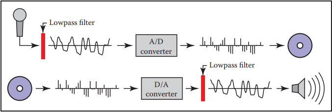
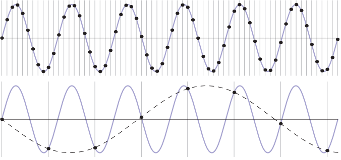

# 信号处理
在图形学中,通常要处理些连续变量的函数:图片是你见过的第一个例子，但是当你继续探索图形学的时候，你会遇到很多类似的情况.就其本质而言,计算机无法直接表达连续的函数,必须使用有限的位数表达他们- **采样(将函数的值离散的存储起来,在需要时进行重建).**
本章首先用数字音频的具体一维例子来总结采样和重构。然后，我们继续介绍在一维和二维的采样和重构基础上的基本数学和算法。最后，我们深入频域观点的细节，它为这些算法的行为提供了许多见解。

## 数字音频: 一维采样
尽管采样在电信领域已经应用了很多年,但随着数字音频的使用增加，1982年cd的推出是采样在消费者中的第一次大规模应用.

在录音过程中，麦克风将空气中以压力波形式存在的声音转换成时变的电压，这相当于在麦克风所在的位置测量空气压力的变化。这种电信号需要以某种方式储存起来，以便在以后的某个时间播放，并发送到扬声器中，通过与电压同步移动膜片，将电压转换回压力波.
录制音频的过程中使用了采样技术, 模数转换器 analog-to-digital converter (A/D converter, or ADC)每秒钟数千次测量电压,生成容易被存储下来的数据流(例如记录在计算机硬盘中).
在回放时,数据流以适当的速率被读取,并被发送到数模转换器 digital-to-analog converter (D/A converter, or DAC),DAC根据它接收到的数字产生一个电压，并且如果我们取足够多的样本来表示电压的变化，所得到的电信号，都是相同的输入信号.
事实证明，每秒钟需要多少样本来完成一次良好的录制，取决于我们试图记录的声音有多高。一个可以很好录制弦乐低音或者鼓的采样率，应用于录制短笛或铙钹，就会产生奇怪的结果;但这些声音在较高的采样率下被录制得很好。为了避免这些采样不足的影响，数字音频记录器对ADC的输入进行滤波，去除可能导致问题的高频。
另一种问题出现在输出端。DAC产生的电压在新采样进入时发生变化，但在下一个采样进入前保持不变，产生阶梯型的波形。这些楼梯就像噪音一样，增加了一种高频的、依赖于信号的嗡嗡声。为了消除这种重建带来的问题，数字音频播放器过滤DAC的输出以平滑波形.

## 采样偏差与失真
数字音频记录链可以作为采样和重建过程的具体模型，发生在图形中。同样的欠采样和重构伪影也会发生在图像或图形中的其他采样信号上，解决方法是一样的:采样前进行滤波，重构时再进行滤波.

上图显示了一个由过低的采样频率导致的走样具体例子。在这里，我们用两种不同的采样频率对一个简单的正弦波进行采样:顶部的高频采样和底部的低频采样。高频采样显然能够更好的还原信号,但是由低采样率产生的样本与低频正弦波的样本是无法区分的.
一旦采样完成，就无法区分两个信号——快正弦波和慢正弦波——哪个是原始信号，因此没有单一的方法可以在这两种情况下正确地重建信号。因为高频信号可以“假装”成低频信号，这种现象被称为失真。
在图形领域,失真经常表现为: 
- 摩尔纹(moire patterns)  
- 边缘锯齿

采样和重构的基本问题可以简单地根据特征太小或太大来理解，但一些更定量的问题很难回答:
- 多高的采样率能够还原重建结果?
- 什么样的滤波器适合于采样和重建?
- 为了避免失真,需要多大程度的平滑过渡?

## 卷积(Convolution)
在讨论采样和重建相关算法之前,首先需要明确相关的基础数学概念-**卷积**.卷积是一个简单的数学概念，它构建了采样、滤波和重构的算法基础.卷积是对函数的一种操作:它接受两个函数作为参数,生成一个新的函数.本书中采用星号(★)作为标记.对函数f和g应用卷积的结果为 f★g.
卷积即可以应用于连续函数,也可以应用于离散序列的函数. 它可以应用于定义在一维、二维或高维域上的函数(即具有一个、两个或多个参数的函数)。

### 移动的平均数(平滑处理)
为了对卷积有一个基本概念上的认识，考虑使用移动平均来平滑一维函数的例子。为了得到任意点的平滑值，我们在每个方向上扩展距离r的范围内计算函数的平均值。距离r称为平滑操作的半径，是一个参数，控制平滑计算的采样范围.

对于离散函数或连续函数，我们可以用数学方法来表述这个概念。
- 如果我们平滑一个连续函数g(x)，平均意味着在一个区间上对g积分，然后除以区间的长度:

- 另一方面,如果要平滑处理一个离散函数a[i],平均意味着将一系列的a相加，然后除以数值的个数:

**移动平均线的概念是卷积的本质;唯一的区别是在卷积中移动平均是一个加权平均。**

  
