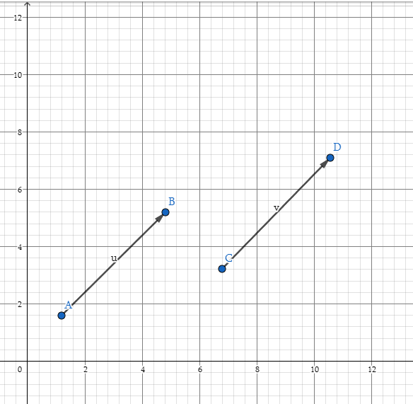
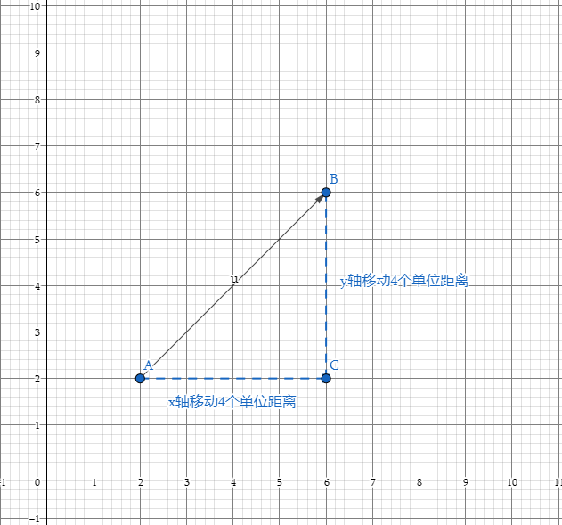
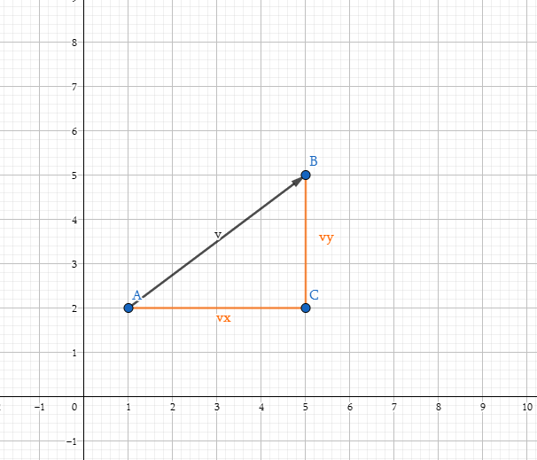
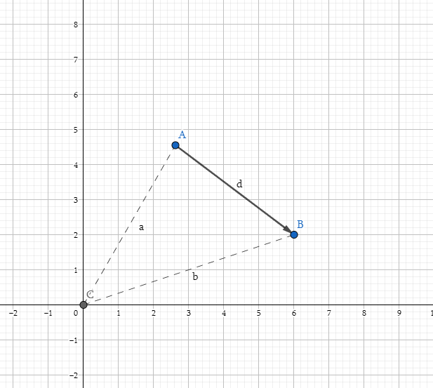
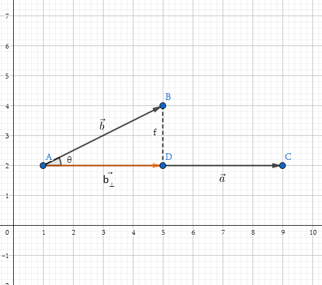
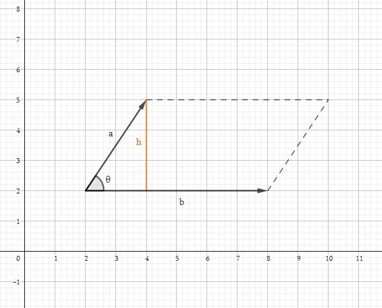
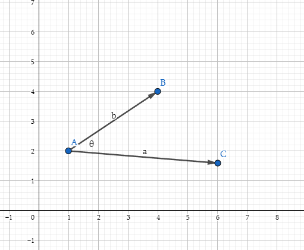

# 图形学的数学基础(一)：向量

## 前边的话
本系列是阅读《3D数学基础： 图形和游戏开发（第二版）》整理汇总的学习笔记，整个系列的结构排布基于原书的章节安排，针对其中的每个知识点做了适当的补充和拓展，其中不免有遗漏和错误之处，望各位读者批评指正。本篇文章做为该系列的第一章，主要介绍向量相关内容，涉及空间中向量的几何意义，各种运算，重点介绍点乘和叉乘的几何解释及在图形学中的应用场景。

## 数学定义
对于数学家来说向量是一个数组，数组的长度代表向量所在的空间维度。程序中表示向量通常有两种方式，行向量（$Row Vector$）和列向量（$Column Vector$）,至于为什么要区分两种书写方式,我们放到矩阵章节再详细说明.

$V_{column} = \begin{bmatrix}1\\ 2\\ 3\end{bmatrix}$

$V_{row} = \begin{bmatrix}1&2&-1\end{bmatrix}$

## 几何定义
从几何学上讲,向量是具有大小和方向的**有向线段**.讨论向量在空间中的哪个位置,是没有意义的,**向量不具备位置属性**.向量是一种相对偏移量的表示方法.如下图二维笛卡尔坐标系中,向量U和V是相等的.

- 大小: 矢量的长度,矢量可以具有任何非负长度.
- 方向:空间中指定的方向.

## 笛卡尔坐标系下的向量
当使用笛卡尔坐标来描述向量时,每个坐标将度量相应维度中有符号位移.

## 向量与点的关系
点用于描述空间中的某一位置.向量用于描述空间中的一段位移,表达相对位置.那么点与向量之间有着怎样的关系呢?两者之间如何完成相互转换?其实很简单,本质上就一句话,**任何点都可以表示为来自原点的向量**.从原点开始按照向量[x,y]指定的量移动,最终会抵达点(x,y)所描述的位置, 同理向量[x,y]给出了从原点到点(x,y)的位移.

## 向量基础运算

### 标量和向量的乘法

#### 公式
标量与向量的乘法，只需要用标量乘以矢量的每个分量即可。

$k\begin{bmatrix}x\\ y\\ z\end{bmatrix} = \begin{bmatrix}x\\ y\\ z\end{bmatrix}k = \begin{bmatrix}kx\\ ky\\ kz\end{bmatrix}$

#### 几何意义
将向量乘以标量k具有将向量的长度按照因数|k|缩放的效果.例如为了使向量长度加倍,可以将向量乘以2;如果k < 0,则翻转向量的方向.

### 向量加法

#### 公式
两个向量相加等于它们相应的分量相加得到的向量.向量不能和标量相加或者相减, 也不能和不同维度的向量进行加减运算.向量的减法可以理解为加一个负向量.

#### 几何意义
我们可以按照几何形式将向量相加,方法是定位向量使得各向量的头尾相连, 然后绘制一条从第一条向量尾部到最后一条向量头部的向量,即为相加的结果向量.如下图:

$\vec{e} = \vec{a} + \vec{b} + \vec{c} + \vec{d}$

### 向量大小
向量的大小也成为向量的长度(Length)或范数(Norm),在数学中通常使用围绕向量的双垂直直线来表示.$||\mathbf{v}||$

#### 公式
**向量的大小是向量分量的平方和的平方根.**

$||\mathbf{v}|| = \sqrt{\sum\limits_{i=1}^n{v_i}^2}$

#### 几何意义
以二维向量为例, 任何向量v(除去0向量)可以形成一个直角三角形,其中v作为斜边,v向量的两个分量作为直角边.根据毕达哥拉斯定理,对于任何直角三角形,斜边的长度的平方等于另外两边长度的平方和.

$||\mathbf{v}|| = \sqrt{ {v_x}^2 + {v_y}^2}$

### 单位向量
对于许多向量,我们只关心其方向性,使用单位向量通常会很方便(点乘),单位向量是大小(Norm)为1的向量,单位向量也被称为归一化的向量($Normalized Vector$).

#### 公式
对于任何非零向量,可以计算出指向v相同方向的单位向量,此过程称为向量的归一化(normalize).为了归一化向量,可以将向量除以其大小:

${v_i} = \dfrac{\mathbf{v}}{||\mathbf{v}||}$

#### 几何意义
以二维向量为例,将单位向量尾部固定在原点,则向量头部将接触到以原点为中心的单位圆(半径为1).三维中,单位向量接触到的是单位球面(半径为1).

### 两点距离
两点之间的距离本质上是求从一点到另外一点向量的长度,根据向量的三角形法则.可以得到:

$\mathbf{d} = \mathbf{b} - \mathbf{a}$

$\mathbf{d} = \begin{bmatrix}b_x - a_x\\b_y - a_y\end{bmatrix}$

$\textbf{distance}(\mathbf{a},\mathbf{b}) = ||\mathbf{d}|| = \sqrt{ {d_x}^2 + {d_y}^2 }$

## 点积
点积($Dot Product$)是向量乘法中比较简单的一种(另外一种叫做叉积),但是点积在图形学中应用非常广泛,与许多其它运算有重要的关系,例如矩阵乘法、信号卷积、统计相关、和傅里叶变换等。

### 定义
**向量点积等于两个向量的长度相乘再乘以其夹角余弦.**

$\mathbf{a}\cdot\mathbf{b} = ||\mathbf{a}|| ||\mathbf{b}||\cos{\theta}$

推导:

$\cos\theta = \dfrac{\mathbf{a}\cdot\mathbf{b}}{||\mathbf{a}|| ||\mathbf{b}||}$

对于单位向量来说
$\cos\theta = \mathbf{a}\cdot\mathbf{b}$

### 公式
**两个向量的点积是相应分量的乘积之和，得到的结果是一个标量**，因此也叫做标量乘法(Scalar Product)。

$\mathbf{a}.\mathbf{b} = \sum\limits_{i=1}^na_ib_i$

二维和三维向量点积

$\mathbf{a}.\mathbf{b} = a_xb_x + a_yb_y$

$\mathbf{a}.\mathbf{b} = a_xb_x + a_yb_y + a_zb_z$

### 性质
- 交换律

    $\mathbf{a}.\mathbf{b} = \mathbf{b}.\mathbf{a}$

- 结合律
    
    $(k\mathbf{a}).\mathbf{b} = \mathbf{a}.(k\mathbf{b}) = k(\mathbf{a}.\mathbf{b})$
   
    
- 分配律
    
     $\mathbf{a}.(\mathbf{b} + \mathbf{c}) = \mathbf{a}.\mathbf{b} + \mathbf{a}.\mathbf{c}$
     
### 几何意义
向量点积的几何意义对于我们来说至关重要,因为涉及到图形学的方方面面,以下我们将从两个方面进行探讨.

#### 投影
**点积$\mathbf{a}.\mathbf{b}$等于$\mathbf{b}$投影到平行于$\mathbf{a}$的直线上的有符号号长度,乘以$\mathbf{a}$的长度.**
如何理解这句话呢?根据点积的定义及直角三角形余弦定理我们得知

$\mathbf{a}.\mathbf{b} = ||\mathbf{a}|| ||\mathbf{b}||\cos\theta$

->

$||\mathbf{b_⊥}|| = \cos\theta ||\mathbf{b}||$

->

$\mathbf{b_⊥} = ||\mathbf{b_⊥}||\hat{a} = \cos\theta||\mathbf{b}||\hat{a}$

->

$\mathbf{a}\cdot\mathbf{b} = ||\mathbf{a}||||\mathbf{b}|| \cos\theta = ||\mathbf{b_⊥}|| ||  \mathbf{a}||$

#### 分解向量
根据上小节向量投影的介绍我们能够得到$\mathbf{b}$向量在$\mathbf{a}$向量上的投影向量,因此我们可以将$\mathbf{b}$向量进行分解,其中一条沿着$\mathbf{a}$方向即$\mathbf{b_⊥}$,另外一条垂直于$\mathbf{a}$向量,即$\mathbf{b_∥}$,如下图所示

$\mathbf{b_⊥} = ||\mathbf{b_⊥}|| \hat{a} = \cos\theta ||\mathbf{b}|| \hat{a}$

$\mathbf{b_∥} = \mathbf{b} - \mathbf{b_⊥}$

#### 向量大小于点积的关系

$\mathbf{v}.\mathbf{v} = ||\mathbf{v}||^2$

#### 夹角
1. **点积的符号可以给予我们对两个向量相对方向的粗略分类**

2. 两个单位向量的点积等于夹角的余弦.

$\hat{a}\cdot\hat{b} = \cos\theta$
    
4. 使用点积计算两个向量之间的角度

$\theta = \arccos(\dfrac{\mathbf{a}\cdot\mathbf{b}}{||\mathbf{a}||||\mathbf{b}||})$

## 叉积
叉积是另一种向量乘积，与上节讲到的点积不同，叉积的结果是一个向量，该向量垂直于原始的两个向量，即垂直于原始两个向量所构成的平面。

## 定义

- $\mathbf{a} \times \mathbf{b}$将产生一个垂直于$\mathbf{a}$和$\mathbf{b}$所构成平面的向量，这样的向量可能有两个，彼此方向相反，朝向由右手螺旋定则判定，具体在后文会详细介绍。

- **$\mathbf{a} \times \mathbf{b}$的长度等于$\mathbf{a}$和$\mathbf{b}$长度的乘积再乘以$\mathbf{a}$和$\mathbf{b}$之间角度的正弦值。**

    $||\mathbf{a} \times \mathbf{b}|| = ||\mathbf{a}|||| \mathbf{b} || \sin\theta$
    
实际上根据定义不难理解， $\mathbf{a} \times \mathbf{b}$的长度等于由两个边$\mathbf{a}$ $\mathbf{b}$所形成的平行四边形的面积。

$\textbf{A} =  bh = b(a\sin\theta) = ||\mathbf{a}||||\mathbf{b}||\sin\theta = ||\mathbf{a} \times \mathbf{b}||$

## 性质

- 叉积交换的，实际上，它是反交换的（anticommutative）的：$\mathbf{a} \times \mathbf{b} = - (\mathbf{b} \times \mathbf{a})$
- 向量自身的叉积等于零向量 $ \mathbf{a} \times \mathbf{a} = \vec{0} $
- 叉积满足分配律：$ \mathbf{a} \times(\mathbf{b} + \mathbf{c}) = \mathbf{a} \times \mathbf{b} + \mathbf{a} \times \mathbf{c} $
- 叉积满足结合律：$ \mathbf{a} \times (k\mathbf{b}) = k(\mathbf{a} \times \mathbf{b})$

## 右手螺旋定则

先将两向量移动到同一起点，右手四指从A转动到B，则拇指所指方向，即为结果向量的方向。
符合右手螺旋定则的坐标系称之为右手坐标系，即 $\vec{x} \times \vec{y} = \vec{z}$,否则为左手系。

$\vec{x} \times \vec{y} = +\vec{z}$

$\vec{y} \times \vec{x} = -\vec{z}$

$\vec{y} \times \vec{z} = +\vec{x}$

$\vec{z} \times \vec{y} = -\vec{x}$

$\vec{z} \times \vec{x} = +\vec{y}$

$\vec{x} \times \vec{z} = -\vec{y}$

## 几何意义

### 判定两向量的相对位置关系

向量叉积可以判定两个向量的相对位置关系，比如我们想知道一个向量在另外一个的左侧还是右侧，可以通过两个向量叉积结果的符号来判断。

$\mathbf{a} \times \mathbf{b}  = + \mathbf{z}$
因此$\mathbf{b}在\mathbf{a}的左侧$

### 判定点是否在三角形内
分别使用三角形的三边向量 $\vec{AB}$ $\vec{BC}$ $\vec{CA}$，叉乘三角形每个顶点与P点构成的向量，如果得到的三个结果向量方向一致，则认为P点在三角形 $\triangle{ABC}$内,否则P点在三角形外。

$\vec{AB} \times \vec{AP}$

$\vec{BC} \times \vec{BP}$

$\vec{CA} \times \vec{CP}$

### 构造三维直角坐标系

$\vec{x} \times \vec{y} = \vec{z}$
