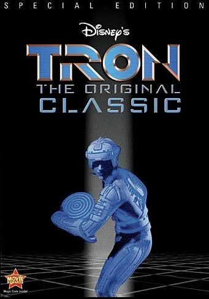

# 图形学的数学基础（三十一）：噪声-上

未经允许禁止转载，如需转载请注明出处！

本章将介绍噪声的基础内容，包括噪声是什么，它的属性以及可以用来做什么。噪声不是一个难以理解的复杂概念，但它有许多微妙之处。 正确使用它需要了解它的工作原理和制作方式。 为了创建一些图像并使用各种参数进行实验，我们将实现一个简单（但功能齐全）的噪声版本，称为$Value Noise$。 本章我们将忽略许多过于复杂而无法在此处全面研究的技术，只是对噪声及其一些应用的初步介绍。 

## 历史背景

噪声是在80年代中期发明的，起初是作为图像纹理的替代方法。主要原因在于80年代中期的电脑内存有限，无法容纳用于纹理的图片，于是人们开始寻找替代解决方案。用纯色渲染物体看起来太干净了，需要通过调整物体的表面材质属性来打破这种干净的外观。在编程中，我们通常在需要创建随机数时使用随机数生成器。然后使用$RNG(Random\;number\;generator)$是远远不够的。我们在自然界中观察到的随机模式通常是很自然的，物体表面上距离很近的两个点通常看起来也是很相似的。但是同一物体上相距很远的两个点却有很大不同。换句话说：**局部变化是细微的，是渐进的，而全局变化则是很大的。**$RNG$无法满足这个要求，因为每次调用随机数生成器它会返回和其它数值完全不相干的随机数。因此调用这个函数很可能产生两个完全不同的数字，这将不适合对空间上两个接近点的视觉引入轻微渐进的变化。下面是一个例子：让我们观察一块真实岩石的图像，假设我们的让你无是创建一个再现该物体外观的CG图像。这个例子很有趣，因为我们可以看到岩石图案由三种颜色组成：绿色，粉色和灰色。这些颜色或多或少分布在岩石表面上。我们首先使用随机数生成器的版本：

```c++
void GenerateRandPattern() 
{ 
    unsigned imageWidth, imageHeight; 
    imageWidth = imageHeight = 512; 
    static const unsigned kNumColors = 3; 
    Color3f rockColors[ kNumColors ] = { 
        { 0.4078, 0.4078, 0.3764 }, 
        { 0.7606, 0.6274, 0.6313 }, 
        { 0.8980, 0.9372, 0.9725 } }; 
    std::ofstream ofs( "./rockpattern.ppm" ); 
    ofs << "P6\n" << imageWidth << " " << imageHeight << "\n255\n"; 
    for ( int j = 0; j < imageWidth; ++j ) 
    { 
        for ( int i = 0; i < imageHeight; ++i ) 
        { 
            unsigned colorIndex = std::min( unsigned( drand48 () * kNumColors ), kNumColors - 1 ); 
            ofs << uchar( rockColors[ colorIndex ][ 0 ] * 255 ) << 
                   uchar( rockColors[ colorIndex ][ 1 ] * 255 ) << 
                   uchar( rockColors[ colorIndex ][ 2 ] * 255 ); 
        } 
    } 
    ofs.close(); 
} 
```


上图中间的图像是程序生成的，结果并不理想，实际上这个模式有个名字，白噪声（$white\;Noise$）（稍后会解释什么是白噪声）。使用$RNG$为程序生成的纹理的每个像素选择一种颜色，使得结果中每个像素的颜色值变化很大。为了改进结果，我们复制了纹理的一小块区域（10x10限速），将其调整到原始图像的尺寸（256x256），进行高斯模糊处理，生成的图像如上右所示，局部有了较小的变化，而全局变化比较明显。

这个实验的结论告诉我们，为了创建平滑的随机图案，需要在网格的固定位置上使用$RNG$分配随机数，然后使用高斯模糊来模糊这些值。下章将详细介绍如何对随机数做模糊，现在只需要记住：**噪声（在图形学上下文）是一个用于模糊在网格上生成的随机数的函数。**

目前应用最广泛的噪声版本是由$Ken\;Perlin$在1983年实现的，称为柏林噪声（$Perlin\;Noise$）当时他正在制作1982年版本的电影 Tron（© Walt Disney Pictures）。 如果访问他的网站（或在搜索引擎中搜索 Ken Perlin），会很容易找到对$Ken\;Perlin$本人给出其噪声模式历史的页面的引用。 肯·柏林 (Ken Perlin) 于1997年获得美国电影艺术与科学学院颁发的奥斯卡技术成就奖，以表彰他对这部电影的贡献。 他于1984年在Siggraph展示了他的工作，并于1985年发表了一篇论文“An Image Synthesiser”，这是纹理合成领域的开创性成果。Perlin噪声会在后续章节中进行解释。



## 程序纹理的世界

噪声的发展引领了计算机图形学研究的一个全新领域，噪声可以被视为一个基本的构件模块，从中可以生成许多有趣的程序纹理。
在程序纹理的世界中，可以生成许多类型的纹理，它们不一定都是模仿自然中的图案，可以是规则的，不规则的或随机的。


