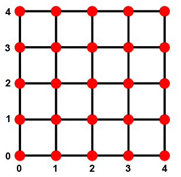
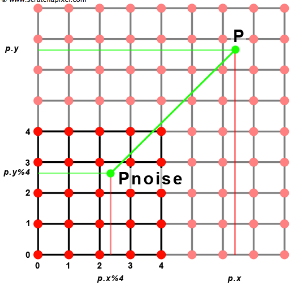
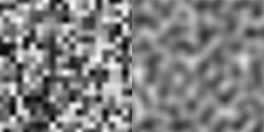
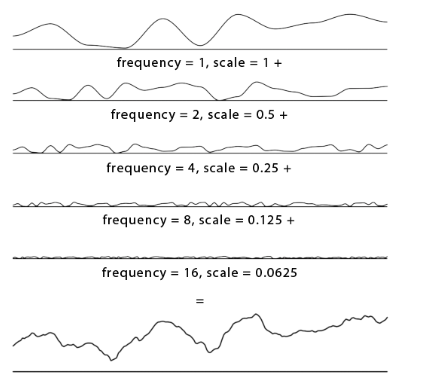

# 图形学的数学基础（三十三）：噪声-下

## $2D\;Noise$

在上一章中，我们介绍并解释了实现一维噪声函数的大部分技术和方法。创建更高维度的噪声和一维噪声并没有本质上的区别，因为它们都是基于同样的方法和技术。之前提到过，所有的噪声函数都会返回一个浮点数，无论输入参数是浮点数，二维点还是三维点，至于一维噪声 二维或三维噪声仅与其输入值有关。二维噪声是将二维点作为输入参数的噪声函数。
对于二维噪声，我们会在网格顶点处分布随机值。噪声函数的2D版本以2D点作为输入，假设当前要求的点为$p$。与一维版本类似，我们先得找到点$p$在网格中的位置，如果点在网格之外，可以通过相同的取模技巧重新映射$p$点的位置，得到网格上点$p$的新坐标，记作$Pnoise$。
之前的章节中讲过插值相关的很多内容。



如下图所示：点$Pnoise$被一个单元上的四个顶点所包围。使用之前学到过的双线性插值技术可以轻松得到点$Pnoise$的值（周围四个点的加权平均）：



为此我们首先计算$s和t$，它们是一维噪声中t的对应物：


代码实现如下：

```typescript
    function lerp(min:number, max: nmber, t: number) {
        return min * (1-t) + max * t;
    }

    function smoothStep(t: number) {
        return t * t * (3- 2 * t);
    }

    class vec2 {
        public x: number;
        public y: number;
        constructor(x: number,y: number) {
            this.x = x;
            this.y = y;
        }
    }

    class ValueNoise {
        public K_MAX_TABLE_SIZE: number;
        public K_MAX_TABLE_SIZE_MASK: number;
        public vertices: number[];
        constructor(){
            this.K_MAX_TABLE_SIZE = 256;
            this.K_MAX_TABLE_SIZE_MASK = this.K_MAX_TABLE_SIZE - 1;
            this.vertices = [];
            for (let i = 0; i < this.K_MAX_TABLE_SIZE * this.K_MAX_TABLE_SIZE; i++) {
               this.vertices[i] = Math.random();
            }
        }

        computeX(p: vec2) {
            const xi = Math.floor(p.x);
            const yi = Math.floor(p.y);
            const s = p.x - xi;
            const t = p.y - yi;

            const rx0 = xi & this.K_MAX_TABLE_SIZE_MASK;
            const rx1 = (rx0 + 1) & this.K_MAX_TABLE_SIZE_MASK;
            const ry0 = yi & this.K_MAX_TABLE_SIZE_MASK;
            const ry1 = (ry0 + 1) & this.K_MAX_TABLE_SIZE_MASK;

            //通过置换表查找四个顶点处的随机值
            const c00 = this.vertices[ry0 * this.K_MAX_TABLE_SIZE_MASK + rx0];
            const c10 = this.vertices[ry0 * this.K_MAX_TABLE_SIZE_MASK + rx1];
            const c01 = this.vertices[ry1 * this.K_MAX_TABLE_SIZE_MASK + rx0];
            const c11 = this.vertices[ry1 * this.K_MAX_TABLE_SIZE_MASK + rx1];

            //对得到的s和t做平滑处理
            const ss = smoothStep(s);
            const st = smoothStep(t);

            const a = lerp(c00, c10, ss);
            const b = lerp(c01, c11, ss);

            return lerp(a, b, st);
        }
    }
```

## 简单的模式示例
本小节将介绍使用噪声函数创建的模式示例。当$Ken\;Perlin$最初发明他的噪声函数时，他还提出了一些简单的算法来使用这个函数作为构建模块来生成有趣的纹理。其中一些例如流噪声（$turbulence $），现在仍然被广泛使用。他在1985年的Siggraph上描述了这些模式中的大部分。



之前我们实现的基础版噪声看起来有很多的“块状”,如上图所示，左侧是基于当前版本噪声函数生成的纹理，右侧是$Perlin\;Noise$生成的。本章不会讲解$Perlin\;Noise$，而是了解该技术的工作原理和函数特性。基于目前说了解到的噪声函数特性，实现一些略微复杂的纹理效果。

### $1D\;Noise$示例
首先介绍的一种技术叫做分形叠加（$Fractal\;Sum$），其背后思想是叠加几种频率和振幅不同的噪声，每一个噪声称为一个$Layer$，层与层之间的频率和振幅不一样，却是有关联的。
如下图所示，第一条噪声曲线是原始噪声函数生成的（频率和振幅均为1），其他各层的频率为上一层的两倍，振幅为1/2，通过这种方式创造一系列的噪声并将它们叠加起来会得到下图底部的函数图像：



可以看到，这条曲线比单条噪声函数有更丰富的局部细节，这也正是分形叠加所要达到的目的，通过高频低振幅的噪声填充原始曲线的局部细节。将分形叠加推广到二维，生成的二维纹理应用于平面的纹理贴图（displaceMapping），可以生成类似于地形的东西。
代码实现：

```typescript
    const amplitude = 1;
    const frequency = 1;
    //通常被设置为 3，5 或者 7
    const layers = 5;
    let noiseSum = 0;
    for (let i = 0; i < layers; i++) {
       noiseSum += noise(p * frequency) * amplitude;
       amplitude *= 0.5;
       frequency *= 2;
    }
```

### 术语
- 分形叠加（$fractal\;Sum$）:将频率和幅度相互关联的噪声层相叠加的技术可以称为分形叠加。
- 粉红噪声（$Pink\;Noise$）:分型噪声的连续层具有与其频率成反比的振幅。
- 布朗噪声（$Brownian\;noise$）:当我们将层之间的频率加倍并且这些层的幅度与其频率成反比时，我们会获得一种特殊类型的粉红噪声，我们称之为布朗噪声（以数学家罗伯特布朗命名）。

```typescript
    let pinkNoise = 0;
    const layers = 5;
    const rateOfChange = 2;
    for (let i = 0; i < layers; i++) {
        pinkNoise += noise(p * Math.pow(rateOfChange, i)) / Math.pow(rateOfChange, i);
    }
```
- 频谱密度（$spectral densities$）:连续层之间的频率和振幅的变化几乎形成了噪声曲线的特征。 它定义了它的光谱特性。 我们使用术语频谱密度来定义产生噪声的各种频率（层）。
- 功率谱（$power spectra$）:这些层中的每一层都有一个特定的振幅，我们称之为功率谱


### $2D\;Noise$示例
#### 分形叠加（$Fractal\;Sum$）
在1D示例中已经介绍额分形叠加的技术原理，在此我们将实现其二维版本：

```typescript
    const layers = 5;
    const imageWidth = 256;
    const imageHeight = 256;
    let maxNoiseVal = 0;
    let frequency = 1;
    let amplitude = 1;
    let noiseMap = [];

    for (let i = 0; i < imageHeight; i++) {
        for (let j = 0; j < imageWidth; j++) {
            vec2 pNoise = vec2(i, j);
            frequency = 1;
            amplitude = 1;
            for (let k = 0; k < layers; k++) {
                noiseMap[i * imageWidth + j] += noise.commputeX(pNoise * frequency) * amplitude;
                frequency *= 2;
                amplitude *= 0.5;
            }
            if (noiseMap[i * imageWidth + j] > maxNoiseVal) {
                maxNoiseVal = noiseMap[i * imageWidth + j];
            }
        }
    }
```

#### 流噪声（$Turbulence$）

#### 大理石纹路（$Marble\;Texture$）

#### 木纹（$Wood\;Texture$）

## 参考

[Scratchapixel](https://www.scratchapixel.com/)