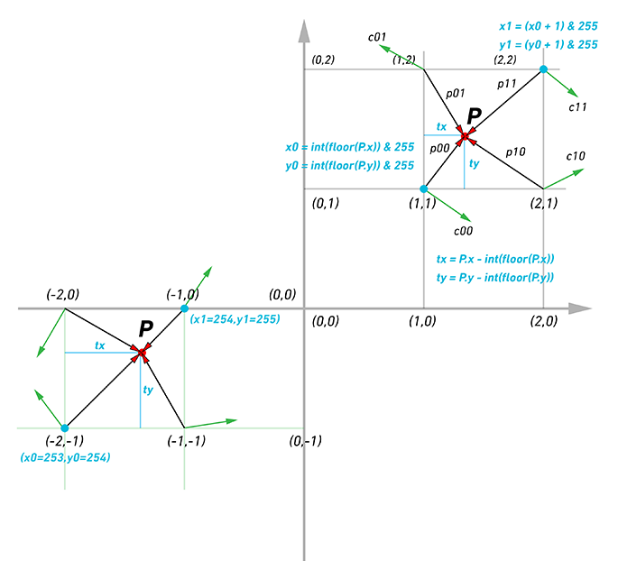

# 图形学的数学基础（三十四）：柏林噪声

## $Perlin\;Noise$
1985年，$Ken\;Perlin$发表了一篇名为“A Image Synthetizer”的Siggraph学术论文。提出了一种类似于之前介绍的噪声函数,但是表现更好。柏林噪声和我们之前学习的噪声函数很相似，于$Value\;Noise$类似，它也依赖于网格系统。在网格的每个顶点处定义随机值，然后对其进行插值以计算空间中某个位置的噪声值。之前我们详细介绍了1D和2D$Value\;Noise$的创建。本章将实现$Perlin\;Nosie$的3D版本。
那么$Perlin\;Nosie$和$Value\;Noise$有什么区别呢？在$Value\;Noise$情况下，我们只需在网格的顶点处分配随机数，并使用该点所在格子内的点的位置对这些值进行插值（双线性插值）。在$Perlin\;Nosie$中，$Ken\;Perlin$建议将网格顶点的随机值替换为梯度（归一化的三维矢量），方法是在$[0,1]$范围内生成三个随机浮点数，再将这些随机数重映射到$[-1,1]$范围内，最后对矢量进行归一化。

```typescript
    const tableSize = 10;
    const gradients = [];
    for (let i = 0; i < tableSize; i++) {
        gradients[i] = vec3(2 * Math.random() - 1, 2 * Math.random() - 1, 2 * Math.random() - 1);
        gradients[i] = gradients[i].normalize();
    }
```

## 实现

相比通过随机数插值的$Value\;Noise$，现在网格顶点分布的是三维矢量，由于噪声函数需要返回一个浮点数，如何通过三维矢量生成浮点数呢？$Ken\;Perlin$建议计算每个网格顶点到我们要计算的点$p$的方向矢量，我们可以得到8个3D向量（一个立方体有8个角或顶点）和4个2D向量（二维）。然后，在网格顶点的梯度和从该顶点到$p$点的向量之间使用点积。由于两个向量的点积给出了一个实数，因此，我们将梯度或矢量转换为了浮点数。与 2D 情况一样，为了计算点$p$在“虚构”3D 网格的局部坐标中的坐标，我们将点坐标从浮点数转换为整数值($floor$)，然后将这些整数坐标取模 N，即我们的大小随机方向的数组（在关于值噪声的课程中，我们选择了 N = 256）。。正如我们在上一章中解释的那样，我们不想生成 256x256x256 方向的晶格。因此，我们使用包含 256 个随机方向的单个 1D 数组，并使用置换表的技术通过将点的整数坐标转换为带有哈希的置换表的索引来“随机拾取”存储在该表中的方向之一功能。

代码实现如下：

```typescript
    const tableSize = 256;
    const tableSizeMask = tableSize - 1;
    const gradients = [];
    const permutationTable = [];

    class PerlinNoise {
        constructor() {
            for (let i = 0; i < tableSize; i++) {
                gradients[i] = vec3(2 * Math.random() - 1, 2 * Math.random() - 1, 2 * Math.random() - 1);
                gradients[i] = gradients[i].normalize();
                permutationTable[i] = i;
            }

            for (unsigned i = 0; i < tableSize; ++i) 
            std::swap(permutationTable[i], permutationTable[diceInt() & tableSizeMask]); 
            // extend the permutation table in the index range [256:512]
            for (unsigned i = 0; i < tableSize; ++i) { 
                permutationTable[tableSize + i] = permutationTable[i]; 
            } 
        }

        hash(x: number, y: number, z: number) {
            return this.permutationTable[this.permutationTable[this.permutationTable[x] +y ] + z]
        }

        computeX(p: vec3) {
            const xi0 = Math.floor(p.x) & tableSizeMask;
            const yi0 = Math.floor(p.y) & tableSizeMask;
            const zi0 = math.floor(p.z) & tableSizeMask;

            const xi1 = (xi0 + 1) & tableSizeMask;
            const xi1 = (xi0 + 1) & tableSizeMask;
            const xi1 = (xi0 + 1) & tableSizeMask;

            const tx = p.x - Math.floor(p.x);
            const ty = p.y - Math.floor(p.y);
            const tz = p.z - Math.floor(p.z);

            const u = smoothStep(tx);
            const v = smoothStep(tx);
            const w = smoothStep(tx);

            const c000 = gradients[hash(xi0, yi0, zi0)]; 
            const c100 = gradients[hash(xi1, yi0, zi0)]; 
            const c010 = gradients[hash(xi0, yi1, zi0)]; 
            const c110 = gradients[hash(xi1, yi1, zi0)]; 
    
            const c001 = gradients[hash(xi0, yi0, zi1)]; 
            const c101 = gradients[hash(xi1, yi0, zi1)]; 
            const c011 = gradients[hash(xi0, yi1, zi1)]; 
            const c111 = gradients[hash(xi1, yi1, zi1)]; 

            const x0 = tx, x1 = tx - 1; 
            const y0 = ty, y1 = ty - 1; 
            const z0 = tz, z1 = tz - 1; 
    
            const p000 = vec3(x0, y0, z0); 
            const p100 = vec3(x1, y0, z0); 
            const p010 = vec3(x0, y1, z0); 
            const p110 = vec3(x1, y1, z0); 
    
            const p001 = vec3(x0, y0, z1); 
            const p101 = vec3(x1, y0, z1); 
            const p011 = vec3(x0, y1, z1); 
            const p111 = vec3(x1, y1, z1); 
    
            // linear interpolation
            const a = lerp(dot(c000, p000), dot(c100, p100), u); 
            const b = lerp(dot(c010, p010), dot(c110, p110), u); 
            const c = lerp(dot(c001, p001), dot(c101, p101), u); 
            const d = lerp(dot(c011, p011), dot(c111, p111), u); 
    
            const e = lerp(a, b, v); 
            const f = lerp(c, d, v); 
    
            return lerp(e, f, w);
        }
    }
```

和上一章一样，为了平滑插值，我们在使用tx ty tz之前对其分别使用smoothStep函数重新映射为uvw。
通过代码我们可以看出，$Perlin\;Nosie$和$Value\;Noise$非常类似，唯一不同的是我们将网格顶点的随机值替换为随机的单位是向量，然后计算顶点的矢量和顶点矢量到当前点的方向的点积。



## 均匀分布梯度

生成均匀分布的随机方向看似很简单，但要正确实现还是比较麻烦的。上述代码生成的随机梯度不是均匀分布的。它们是在立方体的体积内而不是球体的体积内产生随机方向。因此，相对于球体来说分布是不均匀的。一种简单的方案是随机生成单位球坐标$\theta和\phi$，并将这些球坐标转换为笛卡尔坐标：


$d = r\sin\phi$

$x = d\cos\theta = r\sin\phi\cos\theta$

$y = d\sin\theta = r\sin\phi\sin\theta$

$z = r\cos\phi$

根据球坐标系转换笛卡尔坐标系公式：


```typescript
    const phi = 2 * Math.random() * Math.PI;
    const theta = Math.random() * Math.PI;
    const x = Math.cos(phi) * Math.sin(theta);
    const y = Math.sin(phi) * Math.sin(theta);
    const z = Math.cos(theta);
```


