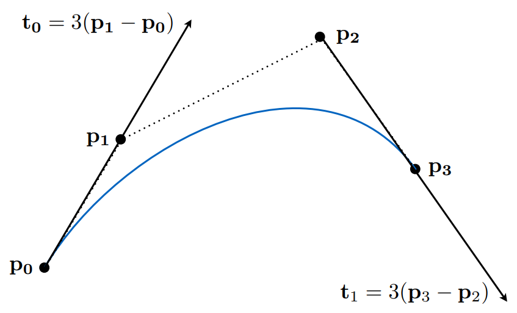
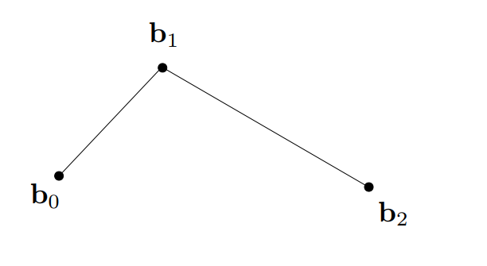
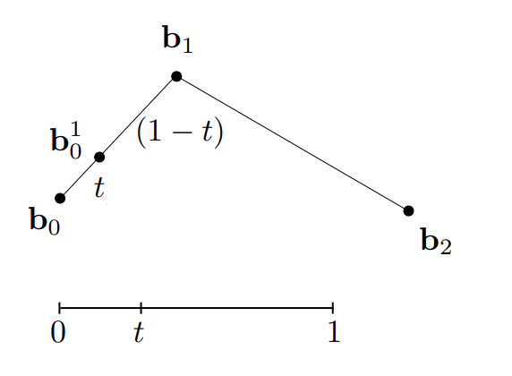
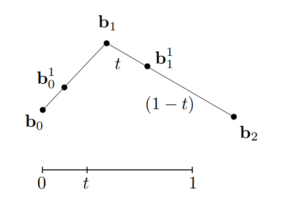
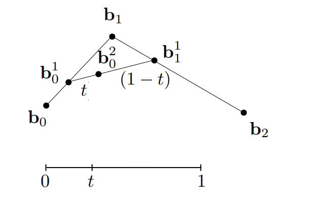
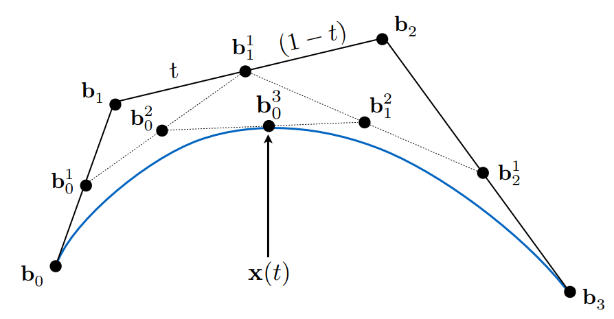
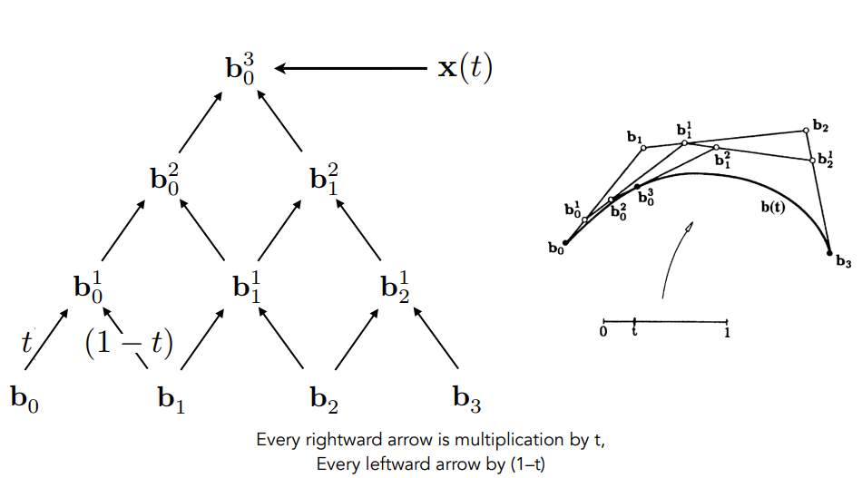
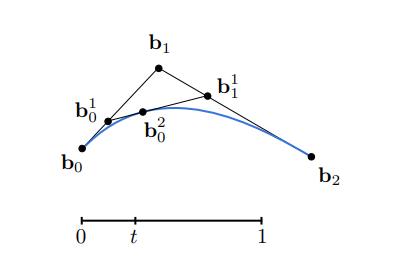
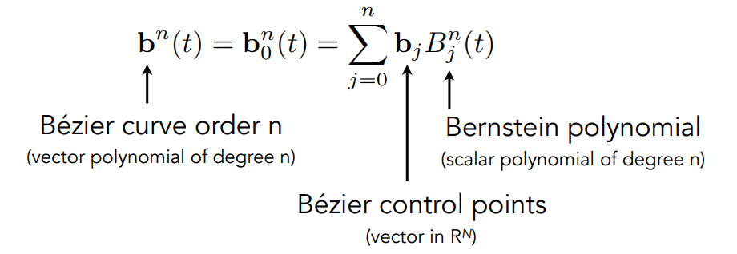

# 图形学的数学基础（三十）：贝塞尔曲线

## 贝塞尔曲线($Bézier\;curve$)
用一些列的控制点定义曲线,如下图所示:曲线由四个控制点定义(三阶贝塞尔曲线),从$P_0$开始,沿着$P_0-P_1$切线方向行进,结束时沿着
$P_2-P_3$方向,结束于$P_3$点。

## 参数方程-$de\;Casteljau\;Algorithm$

首先考虑由三个控制点组成的二维的贝塞尔曲线（ $quadratic\;Bézier$）：

假设有一颗沿着曲线运动的小球，当$t = 0$,球体在$b_0$点，当$t = 1$，球体在$b_1$点 定义曲线是关于时间$t$的参数方程，实质上就是求在任意时间$t$（$0<=t<=1$）,球体的位置。这就是$de\;Casteljau$算法的核心思想，将曲线方程转换为了求一个点位置。

求解步骤：

1>  三个控制点$b_0,b_1,b_2$组成了两条线段，假设时间为$t$,分别去计算两条线段$b_0-b_1和b_1-b_2$在时间$t$上的位置（实际上是线性插值）。得到$b^1_0和b^1_1$.

2>  将$b^1_0和b^1_1$连成一条线，在该线段上继续找$t$的位置，得到$b^2_0$ :

3> 最终收敛的点$b^2_0$即是我们要找的在时间$t$球体在曲线上的位置。

由此可见，$de\;Casteljau$算法是一个递归的线性插值的过程，每次递归将减少一个控制点，最终收敛到一个点，即是我们要寻找的答案。

### 三阶贝塞尔曲线（$cubic\;Bézier\;curve$）

套用二阶贝塞尔曲线的思路，三阶贝塞尔曲线无非是多了一个控制点而已，每次计算多了一次递归而已。

## 代数形式

从金字塔底部开始，每两个相邻的点做一次线性插值，形成新的点，对新的点继续做同样规则的线性插值，最终收敛到一个点。

拿二阶贝塞尔曲线举例：

$b^1_0(t) = (1-t)b_0 +tb_1$

$b^1_1(t) = (1-t)b_1 +tb_2$

$b^2_0(t) = (1-t)b^1_0 +tb^1_1$

$b^2_0(t) = (1-t)^2b_0 + 2t(1-t)b_1 + t^2b_2$

由此可见，二阶贝塞尔曲线在时间$t$上的点，是$b_0,b_1,b_2$和时间$t$的某种组合。类似于二项式$(a+b)^2 = a^2 + 2ab + b^2$的展开形式。

### 伯恩斯坦多项式

由$n+1$个控制点组成的$n$阶贝塞尔曲线，在时间$t$上点的位置是一个跟时间有关的多项式，由以下公式定义：

$b^n(t) = b^n_0(t) = \sum\limits_{j=0}^n{b_j}B^n_j(t)$

其中$b_j$代表第j个控制点，$B^n_j(t)$正是伯恩斯坦多项式。

$B^n_i(t) = \begin{matrix}
    n\\
    i
\end{matrix}t^i(1-t)^{n-i}$

**总结：n阶贝塞尔曲线是由伯恩斯坦多项式对每个控制点的加权。**

## 三维空间中的贝塞尔曲线

假设在三维空间中，我们有4个控制点$b_0 = (0, 2, 3), b_1 = (2, 3, 5), b_2 = (6, 7, 9), b_3 = (3, 4, 5)$

有这些控制点定义的三维贝塞尔曲线仍然满足以上定律：

## 参考

[GAMES101 -现代计算机图形学入门-闫令琪](https://www.bilibili.com/video/BV1X7411F744?p=11&vd_source=b3b87210888ec87be647603921054a36)