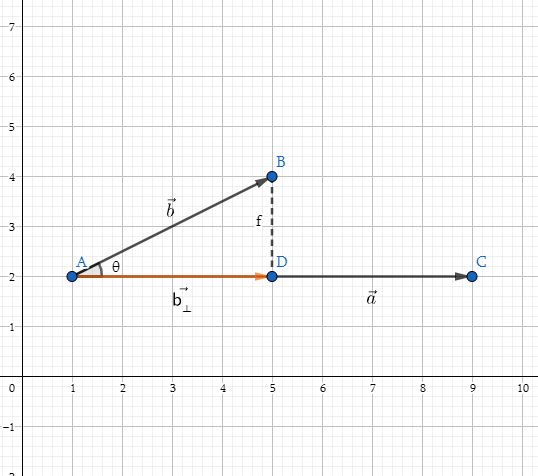
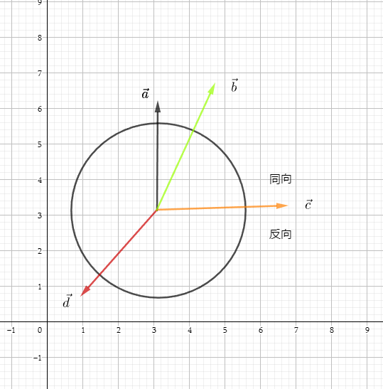

# 图形学的数学基础（三）：向量点积

## 点积
点积($Dot Product$)是向量乘法中比较简单的一种(另外一种叫做叉乘),但是点积在图形学中应用非常广泛,与许多其它运算有重要的关系,例如矩阵乘法、信号卷积、统计相关、和傅里叶变换等。

### 定义
**向量点积等于两个向量的长度相乘再乘以两向量夹角的余弦.**

$\mathbf{a}\cdot\mathbf{b} = ||\mathbf{a}|| ||\mathbf{b}||\cos{\theta}$

推导:

$\cos\theta = \dfrac{\mathbf{a}\cdot\mathbf{b}}{||\mathbf{a}|| ||\mathbf{b}||}$

对于单位向量来说
$\cos\theta = \mathbf{a}\cdot\mathbf{b}$

### 公式
**两个向量的点积是相应分量的乘积之和，得到的结果是一个标量**，因此也叫做标量乘法(Scalar Product)。

$\mathbf{a}.\mathbf{b} = \sum\limits_{i=1}^na_ib_i$

二维和三维向量点积

$\mathbf{a}.\mathbf{b} = a_xb_x + a_yb_y$

$\mathbf{a}.\mathbf{b} = a_xb_x + a_yb_y + a_zb_z$

### 性质
- 交换律

    $\mathbf{a}.\mathbf{b} = \mathbf{b}.\mathbf{a}$

- 结合律
    
    $(k\mathbf{a}).\mathbf{b} = \mathbf{a}.(k\mathbf{b}) = k(\mathbf{a}.\mathbf{b})$
   
    
- 分配律
    
     $\mathbf{a}.(\mathbf{b} + \mathbf{c}) = \mathbf{a}.\mathbf{b} + \mathbf{a}.\mathbf{c}$
     
### 几何意义
向量点积的几何意义对于我们来说至关重要,因为涉及到图形学的方方面面,以下我们将从两个方面进行探讨.

#### 投影
**点积$\mathbf{a}.\mathbf{b}$等于$\mathbf{b}$投影到平行于$\mathbf{a}$的直线上的有符号号长度,乘以$\mathbf{a}$的长度.**
如何理解这句话呢?根据点积的定义及直角三角形余弦定理我们得知

$\mathbf{a}.\mathbf{b} = ||\mathbf{a}|| ||\mathbf{b}||\cos\theta$

->

$||\mathbf{b_⊥}|| = \cos\theta ||\mathbf{b}||$

->

$\mathbf{b_⊥} = ||\mathbf{b_⊥}||\hat{a} = \cos\theta||\mathbf{b}||\hat{a}$

->

$\mathbf{a}\cdot\mathbf{b} = ||\mathbf{a}||||\mathbf{b}|| \cos\theta = ||\mathbf{b_⊥}|| ||  \mathbf{a}||$

#### 分解向量
根据上小节向量投影的介绍我们能够得到$\mathbf{b}$向量在$\mathbf{a}$向量上的投影向量,因此我们可以将$\mathbf{b}$向量进行分解,其中一条沿着$\mathbf{a}$方向即$\mathbf{b_⊥}$,另外一条垂直于$\mathbf{a}$向量,即$\mathbf{b_∥}$,如下图所示

$\mathbf{b_⊥} = ||\mathbf{b_⊥}|| \hat{a} = \cos\theta ||\mathbf{b}|| \hat{a}$

$\mathbf{b_∥} = \mathbf{b} - \mathbf{b_⊥}$

#### 向量大小于点积的关系

$\mathbf{v}.\mathbf{v} = ||\mathbf{v}||^2$

#### 夹角
1. **点积的符号可以给予我们对两个向量相对方向的粗略分类**

2. 两个单位向量的点积等于夹角的余弦.

    $\hat{a}\cdot\hat{b} = \cos\theta$
    
4. 使用点积计算两个向量之间的角度

    $\theta = \arccos(\dfrac{\mathbf{a}\cdot\mathbf{b}}{||\mathbf{a}||||\mathbf{b}||})$

## 参考
[《3D数学基础》图形和游戏开发(第二版)](https://item.jd.com/12659881.html)

[GAMES101 -现代计算机图形学入门-闫令琪](https://www.bilibili.com/video/BV1X7411F744?p=2&vd_source=b3b87210888ec87be647603921054a36)

