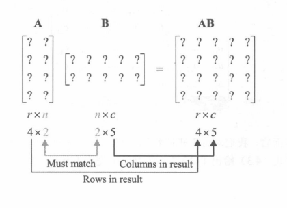

# 图形学的数学基础（三）：矩阵
> 不幸的是，没有人能够告诉我们矩阵是什么。你必须亲自去看看。

>                                               -墨菲斯《黑客帝国》

矩阵在图形学中具有重要意义，它们主要用于描述两个坐标空间之间的转换关系，通过矩阵和向量相乘，可以将向量从某一坐标空间转换到另一个坐标空间。通过矩阵和矩阵相乘，可以描述一系列的变换动作。

## 数学定义
在线性代数中，矩阵是排列成行和列的矩形数字网格。矩阵可以定义为数字的二维数组。因此向量是标量的数组，而矩阵是向量的数组。

### 矩阵维度和表示法
通过计算矩阵包含的行数和列数来定义矩阵的大小，对于具有$r$行和$c$列的矩阵，称为 $r \times c$矩阵。
当希望引用矩阵中的各个元素时，可以使用下标表示法。符号$m_{ij}$表示矩阵$Mi行j列$对应的元素。需要注意的是，矩阵初始索引为1,并不是0.

### 方阵（Square Matrice）
具有相同行数和列数的矩阵称为方形矩阵，方阵的对角元素是行和列索引相同的元素。例如 $3\times3$矩阵M的对角元素是$m_{11},m_{22},m_{33}$。
如果矩阵中所有的非对角元素都为零，则该矩阵为对角矩阵（Diagonal Matrix）。

### 单位矩阵
有一类特殊的对角矩阵叫单位矩阵（Identity Matrix）。其对角线上的值为1，其它元素均为0.单位矩阵记作$I$.单位矩阵有一个重要的性质，即它是矩阵乘法中的单位元素。如果将矩阵乘以单位矩阵，结果不变。单位矩阵对于矩阵的意义，相当于标量中的数字1.

### 作为矩阵的向量
矩阵可以包含任何正数的行和列，包括一个，维数$n$的向量可以被视为$1\times n$矩阵，或者被视为$n\times 1$矩阵。$1\times n$矩阵称为行向量（$Row Vector$），$n\times 1$矩阵被称为列向量（$Column Vector$）

$1\times 3$矩阵 $\begin{bmatrix}x&y&z\end{bmatrix}$

$3\times 1$矩阵 $\begin{bmatrix}x\\y\\z\end{bmatrix}$

### 矩阵转置（Transpose）
给定$r\times c$矩阵M，它的转置表示为$M^T$,是$c\times r$矩阵，其中列由M的行构成，即 $M^T_{ij} = M_{ji}$

$\begin{bmatrix}a&b&c\\d&e&f\\g&h&i\end{bmatrix}^T$ = $\begin{bmatrix}a&d&g\\b&e&h\\c&f&i\end{bmatrix}$

对于矢量，转置会将行矢量转换为列矢量，反之亦然。

#### 矩阵转置的性质

- 对于任意矩阵转置的转置等于其自身：$(M^T)^T = M$
- 对于任意对角矩阵D，其转置等于自身：$D^T = D$

## 矩阵乘法

### 矩阵与标量相乘
矩阵$M$与标量$k$相乘，得到与M相同维度的矩阵。结果矩阵$k\textbf{M}$中的每个元素是$k$与$\textbf{M}$中对应元素的乘积。

$k\textbf{M} = k\begin{bmatrix}m_{11}&m_{12}&m_{13}\\m_{21}&m_{22}&m_{23}\\m_{31}&m_{32}&m_{33}\end{bmatrix} = \begin{bmatrix}km_{11}&km_{12}&km_{13}\\km_{21}&km_{22}&km_{23}\\km_{31}&km_{32}&km_{33}\end{bmatrix}$

### 矩阵相乘
相较矩阵和标量乘法简单和宽松的定义，矩阵之间的相乘需要满足一定条件。具体规则如下：设矩阵$\textbf{A}为r \times m$, 矩阵$\textbf{B}为 n \times c$矩阵，只有当$m == n$时，$\textbf{A} \times \textbf{B}$才有意义。即第一个矩阵的列数等于第二个矩阵的行数，得到的结果为 $\textbf{C}为 r \times c$矩阵。

$\textbf{C}$中每个元素$\textbf{C}_{ij}$等于$\textbf{A}$的第i行与 $\textbf{B}$的第j列点乘的结果。

$\textbf{C}_{ij} = \sum\limits_{k=1}^{n} a_{ik}b_{kj}$

#### 矩阵相乘性质
- 任何矩阵和单位矩阵相乘等于自身：$\textbf{MI} = \textbf{IM} = \textbf{M}$ 
- 矩阵乘法不满足交换律：$\textbf{AB} ≠ \textbf{BA}$
- 矩阵乘法不满足结合律：$\textbf{ABC} = \textbf{A(BC)}$
- 两个矩阵乘积的转置等于两个矩阵分别转置以相反的顺序乘积：$(\textbf{AB})^T$ = $\textbf{B}^T\textbf{A}^T$

### 矩阵向量相乘
由于向量可以被认为只有一行（$Row Vector$）或者一列（$Column Vector$）的矩阵，因此可以将矩阵相乘的规则应用于向量矩阵相乘。

**当为行向量（$1 \times n$）时，可以与矩阵（$n \times m$）相乘，结果为$1 \times m$行向量。行向量与矩阵相乘时，向量位于左侧，矩阵位于右侧。**

$\begin{bmatrix}x&y&z\end{bmatrix}\begin{bmatrix}m_{11}&m_{12}&m_{13}\\m_{21}&m_{22}&m_{23}\\m_{31}&m_{32}&m_{33}\end{bmatrix} = \begin{bmatrix}xm_{11} + ym_{21} + zm_{31}&xm_{12} + ym_{22} + zm_{32}&xm_{13} + ym_{23} + zm_{33}\end{bmatrix}$

**当为列向量（$n \times 1$）时，可以与矩阵（$m \times n$）相乘，结果为$m \times 1$列向量。列向量与矩阵相乘时，向量位于右侧，矩阵位于左侧。**

$\begin{bmatrix}m_{11}&m_{12}&m_{13}\\m_{21}&m_{22}&m_{23}\\m_{31}&m_{32}&m_{33}\end{bmatrix}\begin{bmatrix}x\\y\\z\end{bmatrix} = \begin{bmatrix}xm_{11} + ym_{12} + zm_{13}\\xm_{21} + ym_{22} + zm_{23}\\xm_{31} + ym_{32} + zm_{33}\end{bmatrix}$

1. 结果向量中每个元素是原始向量与矩阵中的单个行或者列的点积。
2. 矩阵中的每个元素决定输入向量中特定元素对输出向量的元素有多大的“权重”。
3. 乘法的结果是矩阵的行或列的线性组合。

### 行向量与列向量
当对行向量应用多个变换时，可以从左到右依次对向量进行矩阵乘法。例如对向量$\vec{v}$应用变换$\textbf{A},\textbf{B},\textbf{C}$时，表示为：

$\vec{v}\textbf{ABC}$.

同理如果对列向量应用相同的变换,则相应的乘法被写为：

$\textbf{C}^T\textbf{B}^T\textbf{A}^T\vec{v}$.

## 引用
[《3D数学基础》图形和游戏开发(第二版)](https://item.jd.com/12659881.html)
