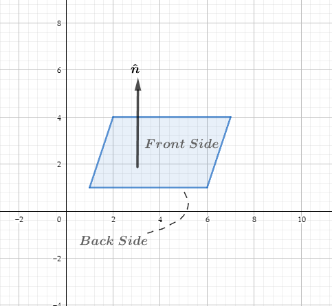

# 图形学的数学基础（九）：几何图元-球体圆形和平面

    转载请注明出处

## 球体和圆形
球体是一个三维对象，定义与给定点具有固定距离的所有点的集合。从球体中心到点的距离称为球体半径（$Radius$），球体的直接表示方式是描述其中心$\textbf{c}$和半径$r$。

### 球体的隐式表述
$||\textbf{p} - \textbf{c}|| = r$

$(x-x_c)^2 + (y-y_c)^2 + (z-z_c)^2 = r^2$

### 重要属性

- 直径 $D = 2r$
- 圆周长 $C = 2\pi{r}$
- 圆面积 $A = \pi{r^2}$
- 球体表面积 $S = 4\pi{r^2}$
- 球体体积 $S = \dfrac{4}{3}\pi{r^3}$

**圆面积对r的导数是圆周长，球体的体积对r的导数是其表面积。**

## 三维平面($Plane$)
平面是三维空间中扁平的二维子空间。平面的定义类似于二维中直线的定义。定义中的种种相似性暗示了三维中的平面与二维中的无限直线有许多共同属性的事实。

### 平面方程
三维空间的平面方程是由一个法线$\vec{n}$($normal\;vector$)和平面上的一个点$p_1$来定义的。

由于$\hat{n}$与平面垂直，所以从平面上任意一点$\textbf{P}$到$\textbf{P}_1$所形成的向量$\vec{P} - \vec{P_1}$必然与$\hat{n}$垂直。

$\vec{P} - \vec{P_1} = (x-x_1,y-y_1,z-z_1)$

$\hat{n}\cdot(\vec{P} - \vec{P_1}) = 0$

$\begin{bmatrix}
    a\\ b\\ c\\ 
\end{bmatrix}\cdot\begin{bmatrix}x-x_1\\ y-y_1\\ z-z_1\\ \end{bmatrix} = 0$

$a(x-x_1) + b(y-y_1) + c(z-z_1) = 0$

$ax + by + cz -(ax_1 + by_1 + cz_1) = 0$

假设常量项$-(ax_1 + by_1 + cz_1) = d$,则：

$ax+by+cz+d = 0$

#### 平面方程的几何解释

$\textbf{p}\cdot\hat{n} = d$

由向量点积的几何意义可知，上式说明了向量$\vec{p}$到$\hat{n}$的投影长度都为固定长度d。

向量$\vec{n}$称为平面法线（$Normal$），因为它与平面垂直，法线决定了平面的方向性，d则定义了从原点到平面的有符号垂直距离（跟直线的定义很相似，只不过拓展到了三维空间），增加d将使平面朝法线方向滑动，如果 d > 0，则原点位于平面的背面，如果d < 0则原点位于正面。

通常认为平面具有正面和背面，平面的正面就是$\hat{n}$所指的方向。

### 三个点定义平面
定义平面的另一种方式是给出位于平面的三个非共线点。三个共线的点无法定义平面，因为会有无数个包含该直线的平面，并且无法确定我们指的是其中哪一个。

假设三个非共线点$\textbf{p}_1,\textbf{p}_2,\textbf{p}_3$,要确定一个平面，必须求出$\hat{n}和d$，首先计算$\hat{n}$，$\hat{n}$会朝哪个方向呢？在左手系中执行此操作的标准方法是假设从平面的正面观察时，$\textbf{p}_1,\textbf{p}_2,\textbf{p}_3$按顺时针方向列出（右手系为逆时针方向）：

注：**按照右手系方式定义**

按照逆时针方向构造两个向量$\vec{e_1}和\vec{e_2}$,$\hat{n}$与$\textbf{p}_1,\textbf{p}_2,\textbf{p}_3$构造的平面垂直，那么必然也与$\vec{e_1}和\vec{e_2}$垂直。因此自然可以想到向量叉积.

$\vec{e_3} = \textbf{p}_2 - \textbf{p}_1$

$\vec{e_1} = \textbf{p}_3 - \textbf{p}_2$

$\hat{n} = \dfrac{\vec{e_3}\times\vec{e_1}}{||\vec{e_3}\times\vec{e_1}||}$

 计算出了$\hat{n}$，剩下的就是计算$d$，取$\textbf{p}_1,\textbf{p}_2,\textbf{p}_3$中任意一点，和$\hat{n}$做点积即可。

 完整计算过程如下：

$\vec{e_3} = \textbf{p}_2 - \textbf{p}_1$

$\vec{e_1} = \textbf{p}_3 - \textbf{p}_2$

$\hat{n} = \dfrac{\vec{e_3}\times\vec{e_1}}{||\vec{e_3}\times\vec{e_1}||}$

$d = \vec{p_1}\cdot\hat{n} = \vec{p_1}\dfrac{(\textbf{p}_2 - \textbf{p}_1)\times(\textbf{p}_3 - \textbf{p}_1)}{||(\textbf{p}_2 - \textbf{p}_1)\times(\textbf{p}_3 - \textbf{p}_1)||}$

## 平面距原点的最短（垂直）距离
如果平面的法线是单位向量,则平面方程的常数项$d$是原点到平面的有符号距离。

假设单位向量$\hat{n}$ = $\begin{bmatrix}a\\ b\\ c\\ \end{bmatrix}$,则平面上的一点$\textbf{P}_1$可以写成$\begin{bmatrix}Da\\ Db\\ Dc\end{bmatrix}$的形式，D是从原点到平面的垂直有符号距离。因此我们可以将平面方程重写如下：

$\begin{bmatrix}a\\ b\\ c\\\end{bmatrix}\cdot\begin{bmatrix}x-Da\\ y-Db\\ z-Dc\\\end{bmatrix} = 0$

$a(x-Da) + b(y-Db) + c(z-Dc) = 0$

$ax + by + cz -D(a^2 + b^2 + c^2) = 0$

$ax + by + cz -D||\vec{n}|| = 0$

因此原点到平面的垂直有符号距离 $D = \dfrac{d}{||\vec{n}||}$,其中$\textbf{d}$为平面方程的常数项。

## 任意点到平面的最短（垂直）距离
很多时候我们可能会有一个平面和一个不在平面内的点$\textbf{q}$，然后想要计算从该平面到$\textbf{q}$的距离。如果该距离为负数，则$\textbf{q}$在平面的背面，反之在正面。为此我们假设平面中的一个点$\textbf{p}$，它是该平面中与$\textbf{q}$最近的点，显然从$\textbf{p}到\textbf{q}$的向量垂直于平面，因此它是$a\vec{n}$的另外一种形式。

对于平面$ax + by + cz+d = 0$，任意一点$\textbf{q}$到平面的最短距离推导如下：

$\textbf{p} + a\vec{n} = \textbf{q}$

$(\textbf{p} + a\vec{n})\cdot\vec{n} = \textbf{q}\cdot\vec{n}$

$\textbf{p}\cdot\vec{n} + a\vec{n}\cdot\vec{n} = \textbf{q}\cdot\vec{n}$

$d||\vec{n}|| + a||\vec{n}||^2 = \textbf{q}\cdot\vec{n}$

$d||\vec{n}|| + a||\vec{n}||^2 = \textbf{q}\cdot\hat{n}||\vec{n}||$

$d + a||\vec{n}|| = \textbf{q}\cdot\hat{n}$

$a = \dfrac{\textbf{q}\cdot\hat{n} - d}{||\vec{n}||}$

对于单位向量则有：

$a = \textbf{q}\cdot\hat{n} - d$

## 求解三平面的交点
求解三平面相交交点，我们只需要解三个平面方程组成的线性方程组即可：

$\begin{cases}
    a_1x+b_1y+c_1z + d_1 = 0\\ 
    a_2x+b_2y+c_2z + d_2 = 0\\ 
    a_3x+b_3y+c_3z + d_3 = 0\\ 
\end{cases}$
可以写成矩阵的形式：

$\begin{bmatrix}
    a_1&b_1&c_1\\ 
    a_2&b_2&c_2\\ 
    a_3&b_3&c_3\\ 
\end{bmatrix}\begin{bmatrix}
    x\\ y\\ z\\ 
\end{bmatrix} = \begin{bmatrix}
    -d_1\\ 
    -d_2\\ 
    -d_3\\ 
\end{bmatrix}$

$\begin{bmatrix}
    x\\ y\\ z\\ 
\end{bmatrix} = \begin{bmatrix}
    a_1&b_1&c_1\\ 
    a_2&b_2&c_2\\ 
    a_3&b_3&c_3\\ 
\end{bmatrix}^{-1}\begin{bmatrix}
    -d_1\\ 
    -d_2\\ 
    -d_3\\ 
\end{bmatrix}$

## 平面直线相交
空间中的平面和直线可能会相较于某一点，交点可以通过平面和直线的线性方程组求解：

$\begin{cases}
    \textbf{Plane}, & ax+by+cz+d = 0\\ 
    \textbf{Line}, & \textbf{p}_1 + t\vec{v} = (x_1+tv_x,y_1+tv_y,z_1+tv_z) 
\end{cases}$

$t = \dfrac{-(ax_1+by_1+cz_1+d)}{av_x+bv_y+cv_z}=\dfrac{-(\vec{n}\cdot\textbf{p}_1+d)}{\vec{n}\cdot\vec{v}}$

### 克莱默法则（$Cramer's\;Rule$）

克莱默法则，用于求解具有n个线性方程的方程组。

$\begin{cases}
   a_{11}x_1+a_{12}x_2 +...+ a_{1n}x_n = b_1\\ 
   a_{21}x_1+a_{22}x_2 +...+ a_{2n}x_n = b_2\\ 
   .........................................\\ 
   a_{n1}x_1+a_{n2}x_2 +...+ a_{nn}x_n = b_n
\end{cases}$

若线性方程组的系数行列式不等于0，即$\det{A} =\begin{vmatrix}
    a_{11}...a_{1n}\\ 
    ............\\ 
    a_{n1}...a_{nn}\\ 
\end{vmatrix} != 0$

则线性方程组的解可以用行列式来表示：

$x_1 = \dfrac{\det{A_1}}{\det{A}}, x_2 = \dfrac{\det{A_2}}{\det{A}}, x_n = \dfrac{\det{A_n}}{\det{A}}$

其中$\det{A_n}$是把行列式$\det{A}$中第n列的所有元素，依次用方程组右端的常数项替换。

### 求解线性方程组

根据克莱默法则，可知：

$x = \dfrac{\det{A_x}}{\det{A}},y = \dfrac{\det{A_y}}{\det{A}},z = \dfrac{\det{A_z}}{\det{A}}$

$\det{A} = \begin{vmatrix}
    a_1&b_1&c_1\\ 
    a_2&b_2&c_2\\ 
    a_3&b_3&c_3\\ 
\end{vmatrix}$

$\det{A_x} = \begin{vmatrix}
    -d_1&b_1&c_1\\ 
    -d_2&b_2&c_2\\ 
    -d_3&b_3&c_3\\ 
\end{vmatrix},\det{A_y} = \begin{vmatrix}
    a_1&-d_1&c_1\\ 
    a_2&-d_2&c_2\\ 
    a_3&-d_3&c_3\\ 
\end{vmatrix},\det{A_z} = \begin{vmatrix}
    a_1&b_1&-d_1\\ 
    a_2&b_2&-d_2\\ 
    a_3&b_3&-d_3\\ 
\end{vmatrix}$

$p = \dfrac{-d_1(\vec{n_2}\times\vec{n_3}) -d_2(\vec{n_3}\times\vec{n_1})-d_3(\vec{n_1}\times\vec{n_2})}{\vec{n_1}\cdot(\vec{n_2}\times\vec{n_3})}$

## 求两平面相交的直线方程
两个非平行平面会相交与一条线，直线方程可以用一个方向向量$\vec{v}$和一个点$\textbf{p}_o$来表示：$\textbf{p}_o + t\vec{v}$,
$\vec{v}$垂直于两个平面的法线$\vec{n_1}和\vec{n_2}$，因此$\vec{v} = \vec{n_1}\times\vec{n_2}$

现在需要找到直线上的任意一点$\textbf{p}_o$,根据上节内容，三个平面相交于一点，因此我们只需要构造出第三个平面（法线为$\vec{v}$并且d = 0），因此第三个平面方程为：

$v_xx+v_yy+v_zz = 0$

根据上节三平面求交点公式：

$\textbf{p}_o = \dfrac{-d_1(\vec{n_2}\times\vec{n_3}) -d_2(\vec{n_3}\times\vec{n_1})-d_3(\vec{n_1}\times\vec{n_2})}{\vec{n_1}\cdot(\vec{n_2}\times\vec{n_3})}$

$\textbf{p}_o = \dfrac{-d_1(\vec{n_2}\times\vec{v})-d_2(\vec{v}\times\vec{n_1})}{\vec{n_1}\cdot(\vec{n_2}\times\vec{v})}$

$\textbf{p}_o =\dfrac{(-d_1\vec{n_2} + d_2\vec{n_1})\times\vec{v}}{\vec{v}\cdot\vec{v}}$

$\textbf{Line} = \textbf{p}_o + t\vec{v}\\ 
= \dfrac{(-d_1\vec{n_2} + d_2\vec{n_1})\times\vec{v}}{\vec{v}\cdot\vec{v}} + t\vec{v}$

## 参考
[《3D图形数学基础》图形和游戏开发(第二版)](https://item.jd.com/12659881.html)

[GAMES101 -现代计算机图形学入门-闫令琪](https://www.bilibili.com/video/BV1X7411F744?p=5&spm_id_from=pageDriver&vd_source=b3b87210888ec87be647603921054a36)

[songho-openGL](http://www.songho.ca/math/plane/plane.html)

[克莱默法则](https://zhuanlan.zhihu.com/p/161429987)