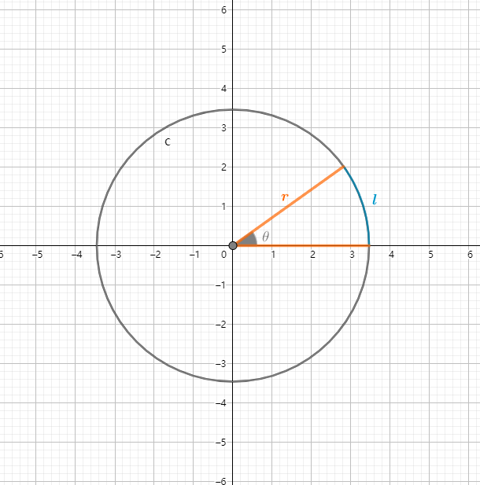
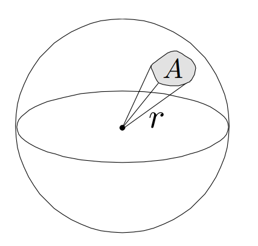
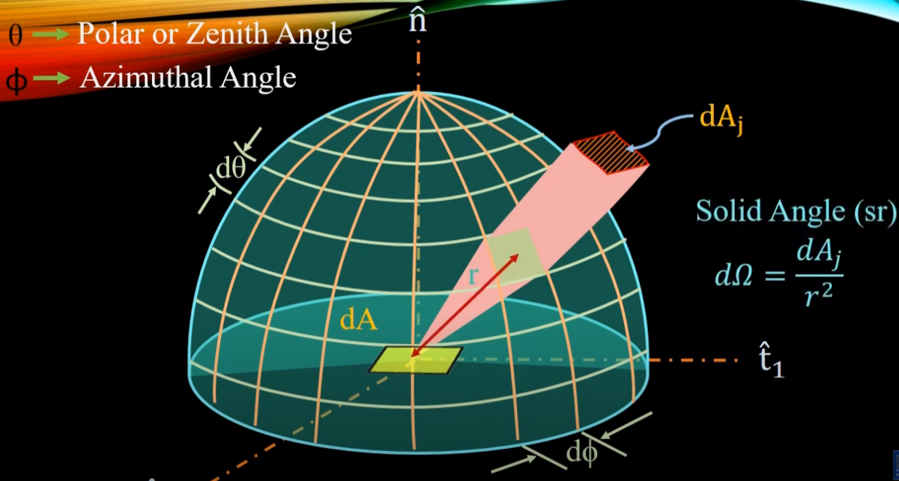
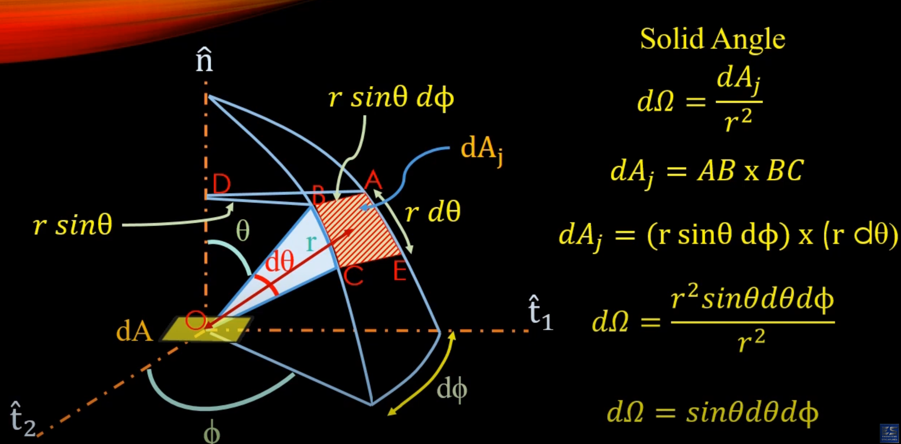

# 图形学的数学基础（二十一）：立体角

## 介绍

立体角，常用字母$\Omega$表示，是一个物体对特定点的三维空间的角度，是平面角在三维空间中的类比。因此，立体角是单位球面上的一块面积，这和“平面角是单位圆上的一段弧长”类似。

## 平面角

平面角等于张角对应圆上的弧长除以圆的半径，即：

$\theta = \dfrac{l}{r}$

而圆的周长等于$2\pi{r}$,因此完整圆
对应的角度为：

$\dfrac{2\pi{r}}{r} = 2\pi\;\;radians$

## 立体角（$Solid\;angle$）

平面角在三维空间的延申。在三维空间中某一个球体，从球心出发，形成具有一定大小的锥体，锥体会打到球面上，形成一定的面积。而立体角就是锥体形成的面积$A$除以球体半径的平方。

$\omega = \dfrac{A}{r^2}$

球体的表面积等于$4\pi{r^2}$

因此完整球体的立体角为$4\pi\;\;steradians$

### 微分立体角（$Differential\;Solid\;angles$）
由立体角的定义可知，三维空间中的某一立体角等于锥体在球面形成的面积处于半径的平方。因此微分立体角等于球体上极小面积处于半径平方，而极小面积是由球体上某一点在$\theta和\phi$两个方向上的微小移动形成的。

$d\phi$是立体角$d\omega$在底面上展开的微小平面夹角范围，$d\theta$是$d\omega$与垂直方向的微小平面夹角范围。极小面积如下图所示：

极小面积可以近似看作矩形，因此极小面积近似等于$AB\times{BC}$如下图：

$d\omega = \dfrac{dA}{r^2}$

$OBC$可以看作二维扇面，根据平面角的定义：

$d\theta = \dfrac{BC}{r}$

$BC = d\theta{r}$

BD垂直于n轴，OBD形成直角三角形，根据正弦定理：

$BD = r\sin\theta$

DAB形成二维扇面：

$d\phi = \dfrac{AB}{DB} = \dfrac{AB}{r\sin\theta}$

$AB = r\sin\theta{d}\phi$

$dA = AB\times{BC} = r\sin\theta{d}\phi\times {d\theta{r}} = \sin\theta{d}\theta{d}\phi{r^2}$

$d\omega = \dfrac{dA}{r^2} = \dfrac{\sin\theta{d}\theta{d}\phi{r^2}}{r^2} = \sin\theta{d}\theta{d}\phi$

## 参考

[GAMES101 -现代计算机图形学入门-闫令琪](https://www.bilibili.com/video/BV1X7411F744?p=2&vd_source=b3b87210888ec87be647603921054a36)

[Understanding the concept of Solid Angle](https://www.youtube.com/watch?v=VmnkkWLwVsc)

[立体角 （Solid Angle）](https://zhuanlan.zhihu.com/p/450731138)

