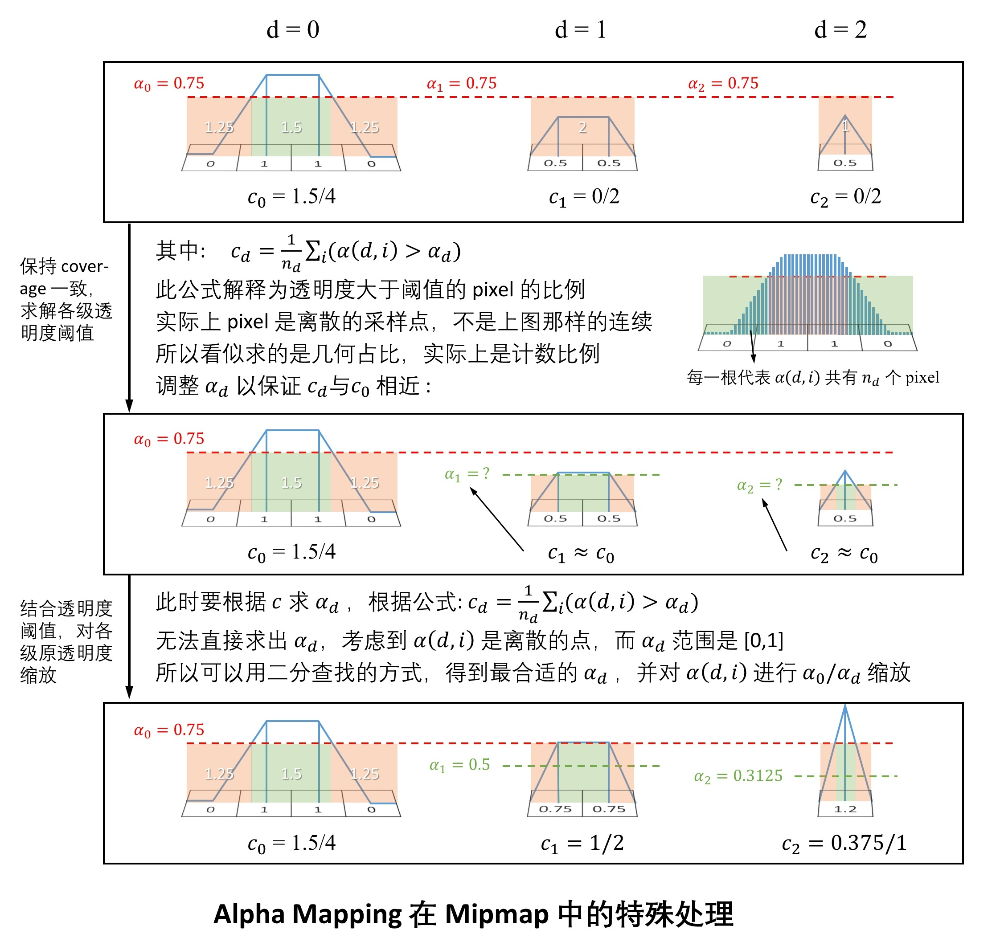
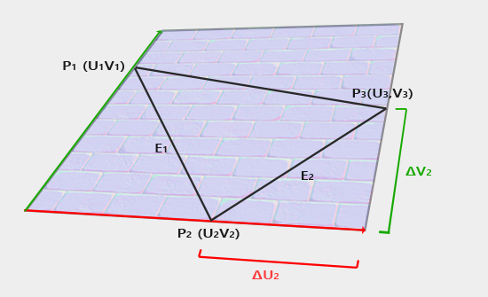
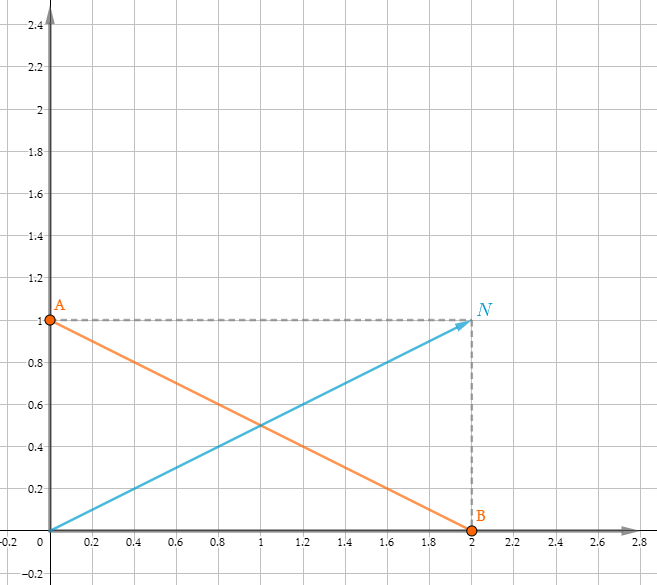

# 图形学的数学基础（二十七）：纹理应用

在计算机图形学中，纹理贴图是使用图像、函数或其他数据源来改变物体表面外观的技术。例如，可以将一幅砖墙的彩色图像应用到一个多边形上，而不用对砖墙的几何形状进行确表示。通过这种方式将图像和物体表面结合起来，可以在建模、存储空间和速度方面节省很多资源。当然纹理不仅仅用于改变物体表面漫反射颜色,**纹理本质上是一个数据集**,可以用来存储任何我们需要的顶点数据,因此在方方面面得到了广泛的应用.本文将介绍MaterialMap、AlphaMap、BumpMap、NormalMap、ReliefMap、DisplacementMap、ParallaxMap、TexturedLight、ShadowMap、EnvironmentMap。
我们将以上纹理贴图的应用划分为6个大类：

- 控制着色信息
- 控制片元透明度
- 改变顶点法线
- 改变表面结构
- 阴影贴图
- 环境贴图
  
## 控制着色信息
根据$Blinn-phong\;Model$可知，物体表面着色信息有以下因子来控制：


$L = L_a+L_d+L_s = K_aE_a + K_d\dfrac{E}{r^2}max(0, \hat{n}\cdot\hat{l}) + K_s\dfrac{E}{r^2}max(0, \hat{n}\cdot\hat{h})^p$

|符号|解释|
| ------ | ------ |
|$K_a$|物体表面环境光吸收率|
|$E_a$|环境光强度|
|$\dfrac{E}{r^2}$|到达物体表面的光线|
|$K_d$|漫反射系数|
|$\hat{n}$|着色点法线|
|$\hat{l}$|光线单位矢量|
|$K_s$|高光系数|
|$p$|高光衰减因子|

可以看到有许多可以调节的参数来控制着色点的着色表现。虽然可以赋予顶点更多的属性来改变这些参数，但是要做到亚三角形的细节，就需要使用各种纹理，**对每个片元的着色参数进行调节**，这些纹理映射方法统称为材质映射（$Material\;Map$）。

最简单的就是漫反射映射，将纹理采样得到的值直接用于$K_d$项，很直观也很简单，这里不做过多赘述。


此外还可以改变镜面反射系数，如粗糙度（决定高光衰减）和高管反射系数。


## 控制片元透明度
纹理都是矩形的，但当我们要实现各种贴画（$decal$）或者镂空（$cutout$）效果时，往往不想让纹理贴满整个表面，也就是说一些地方的透明度为0，这时候$alphaMap$就登场了。


所以不需要把片元当作半透明进行混合，而是进行透明度测试 (Alpha Test)，将透明度小于阈值的 texel 认为是完全透明，直接抛弃片元，否则为完全不透明，测试完成后，再用 z-buffer 算法进行对所有完全不透明片元进行混合。透明度测试的伪代码如下：

```
if(texture.a < alphaThreshold)  discard
```

但是透明度测试在使用$mipmap$时会存在问题：如下图，第0级纹理连续四个texel的透明度为 [0.0, 1.0, 1.0, 0.0]，第1级纹理就为 [0.5, 0.5]，假设我们设定alphaThreshold为0.75，可知第0级纹理有1.5/4通过测试，但是在第一级纹理中，所有的纹素的值都变成了0.5， 0.5 < 0.75所以，所有像素都被抛弃。


于是在不同的$mipmap$纹理等级中，经过透明度测试留下来的像素占比也不一样，因为高等级纹理是对低等级纹理的范围平均，因此随着levelD的增大，纹素值会趋于平均化，之前在阈值之上的值，被平均化以后很有可能到阈值线之下，因此被抛弃的像素就越来越多：


我们来看一个例子，如下图所示，当相机距离树较近时，看起来一切正常：


当相机拉远后，树叶消失了一部分（由于mimmap均值化后，导致被抛弃像素占比增加）：


当相机拉远到相当一段距离后，发现树叶消失的更多：


一般解决办法有两个：
1. 手动调节每级mipmap透明度，或者在shader中根据纹理等级d对透明度缩放
2. 限制d的最大值

但这两种方法都只能是近似，不能很好解决问题，出现这个 问题的关键在于：不同 $mipmap$，用同样的透明度阈值会得到不同的 Coverage(代表测试留存的像素比例)

Castano提出了一种：保证coverage一致的情况下，自适应确定透明度阈值，并对原透明度缩放调整的方法。



经过这种特殊处理后，我们发现远处的树木表现恢复正常了。


另外在对RGBA值进行线性插值时，要注意把alpha分量预乘到RGB分量，再进行插值：


比较实际的情况是：希望插值的结果偏向于不透明那边颜色的色调，所以通常而言，预乘后插值会比较合理。


## 凹凸贴图（$BumpMapping$）

用于改变表面片元法线的技术统称为凹凸贴图($BumpMapping$),凹凸贴图把各像素法线相关的信息存于一张Texture中，各像素的的法线通过这张纹理采样得到，使用采样得到的法线代替片元自身的法线进行着色光照计算，会看到凹凸不平的效果，是一种欺骗眼睛的效果。凹凸贴图思想最早由图形学大牛Jim Blinn提出，后来的Normal Mapping，Parrallax Mapping，Parallax Occulision Mapping，Relief Mapping，均是基于同样的思想，只是考虑的越来越全面，效果越来越逼真。

### 存储法线的几种方式

#### $heightMap$


$heightMap$存储的是表面的相对高度，该高度的变化实际上表现了物体表面凹凸不平的特质，但是高度值不能直接用来计算光照，必须先将其转换为法线，再通过法线计算光照，这就是$heightMap$的核心原理。但是有个问题是，我们如何通过高度值计算出法线呢?


要计算P点的法线，可以先求p点的切线，而切线正是函数曲线在p点的导数。

先拿二维的情况举例，点p的原始法线为$(0, 1)$，假设$h$为高度函数，根据差分近似求出点p的导数为：


$dp = c * (h(p + 1) - h(p))$

点p的切线矢量为：

$tangent(p) = (1, dp) = (1, c * (h(p + 1) - h(p)))$

将切线逆时针旋转90°，得到p点扰动后的法线。

$normal(p) = \begin{bmatrix}
    0&-1\\
    1&0
\end{bmatrix}tangent(p) = \begin{bmatrix}
    0&-1\\
    1&0
\end{bmatrix}\begin{bmatrix}
1\\
dp
\end{bmatrix} = \begin{bmatrix}
    -dp\\
    1
\end{bmatrix} = \begin{bmatrix}
    -(c∗(h(p+1)−h(p)))\\
    1
\end{bmatrix}$

注：上述推导中$c$为常数，表示法线被扰动影响大小的因子。

将上述推导到三维过程，只需要计算uv两个方向的梯度，剩下的和二维一致，计算切线，逆时针旋转90°计算法线。

- 原始法线$n(p) = (0,0,1)$
- 分别计算nv两个方向上的梯度：
    - $\dfrac{dp}{du} = c_1 *(h(u + 1)- h(u))$
    - $\dfrac{dp}{dv} = c_2 * (h(v + 1)- h(v))$
- 被扰动后的法线： $normal(p) = \begin{bmatrix}
    \dfrac{-d_p}{d_u}\\
    \dfrac{-d_p}{d_v}\\
    1
\end{bmatrix}.normalized()$

**注：所有计算出的法线都是在切线空间下的，需要乘以$TBN$矩阵转换到世界空间！**

#### $BumpMapping$
原始的凹凸贴图技术，由jim Blinn提出，后续的凹凸贴图技术都是基于其思想改进的。想法很简单，纹理贴图上每个像素点存储两个信息，一个是$u$方向的偏移矢量，一个是$v$方向上的偏移矢量。这样原始法线加上这两个矢量后自然得到了扰动后的法线。


#### $NormalMap$

我们知道Texture上可以存储三维的颜色作为漫反射系数，自然也可以存储法线向量的信息，利用$(u,v)$坐标查询每个点的法线向量，而不是用原始模型的法线信息，这就是$normalMap$。

明白了Normal Maps的原理之后，有一点重要的是，如何在存储这些法线信息呢？一种可选方案是存储对象空间下法线信息，这样在做完纹理查询后乘以世界空间矩阵直接就可以用了，但是不好的一点是，当对象空间发生变化时，那么该法线向量就不再正确了。更通用的做法是存储切线空间下的法线向量。

对象空间和切线空间法线贴图对比：


显然切线空间的存储方式更加灵活，不受制于种种限制，但是要付出的相应代价就是需要比较复杂的空间转换过程。

应用法线贴图后的渲染结果。


##### TBN空间


切线空间定义于每一个顶点之中，是由切线（$Tangent$），副切线（$BiTangent$），顶点法线（$Normal$）以模型顶点为中心的坐标空间。$normalMap$中的法向量在切空间中表示，其中法向量总是大致指向正z方向。切线空间是一个三角形表面的局部空间:法线相对于单个三角形的局部参考系。把它想象成法向量的局部空间;它们都是指向正z方向的不管最终变换的方向是什么。使用一个特定的矩阵，我们可以将这个局部切线空间的法向量转换为世界或视图坐标，并将它们沿最终映射曲面的方向定向。这个矩阵就是$TBN$矩阵。接下来将详细推导$TBN$矩阵的构造过程。


只需要下面两个步骤即可得到规范化的$TBN$矩阵。



$E_1 = \triangle{U_1}T + \triangle{V_1}B$

$E_2 = \triangle{U_2}T + \triangle{V_2}B$

该公式的数学意义是，如何将一个点从uv空间映射到三维空间，其中TB作为基矢量，以uv空间中u和v的增长作为控制参数，假设三角形中存在一点p，则$\vec{AP} = u(p) * \vec{B} + v(p) * \vec{B}$,**点p可以表示为以TB为基矢量的uv空间，TB轴的线性组合。**

根据以上公式可以快速的推导出TB：

$\vec{T} = \dfrac{\triangle{V_1}E_2 - \triangle{V_2}E_1}{\triangle{V_1}\triangle{U_2} - \triangle{V_2}\triangle{U_1}}$

$\vec{B} = \dfrac{-\triangle{U_1}E_2 + \triangle{U_2}E_1}{\triangle{V_1}\triangle{U_2} - \triangle{V_2}\triangle{U_1}}$

目前给出的TB还是不是真正的切线与副切线，需要正交化后得到$TBN$矩阵:

$\vec{t}_⊥ = normalized(\vec{t} - (\vec{t}\cdot\vec{n})\vec{n})$

$\vec{b}_⊥ = normalized(\vec{b} - (\vec{b}\cdot\vec{n})\vec{n} - (\vec{b}\cdot\vec{t}_⊥)\vec{t}_⊥)$

其中n是建模软件中规定的顶点法线，可以看到n在正交化过程中不会受到影响，该过程是对TB向量进行方向的调整以及长度的归一化。TB在此过程后会相互垂直，此时将不再一定与UV方向保持相同。特别的，当调整顶点法线后，TB平面甚至将与三维空间中的三角形平面不同,也就是说归正交化后的$TBN$矩阵，$TB$轴将不再与$uv$相等，$uv$是正交化前的$TB$轴。

通过正交化后的$Tangent(T),Bitangent(B),Normal(N)$可以推导出$TBN$矩阵：

$TBN = \begin{bmatrix}
    T_x&B_x&N_x\\
    T_y&B_y&N_y\\
    T_z&B_z&N_z\\
\end{bmatrix}$

$normalMap$中存储的法线信息是基于$TBN$空间的，而光照计算需要所有的参数在同一空间下，以上计算出的$TBN$矩阵就是用于实现将$TBN$空间中定义的法线转换到世界空间。

$Normal_{world} = \begin{bmatrix}
     T_x&B_x&N_x\\
    T_y&B_y&N_y\\
    T_z&B_z&N_z\\
\end{bmatrix}Normal_{tbn}$

根据矩阵的逆的性质，$TBN$矩阵的逆矩阵可以用来将矢量从世界空间转换到$TBN$空间中，而$TBN$矩阵是正交化过的，根据正交矩阵的特殊性质（正交矩阵的逆等于其转置），可以轻松求得$TBN$的逆矩阵:

$TBN^{-1} = TBN^T = \begin{bmatrix}
    T_x&B_x&N_x\\
    T_y&B_y&N_y\\
    T_z&B_z&N_z\\
\end{bmatrix}$

$Vector_{tbn} = \begin{bmatrix}
    T_x&T_y&T_z\\
    B_x&B_y&B_z\\
    N_x&N_y&N_z\\ 
\end{bmatrix}Vector_{world}$

##### 利用法线贴图的信息计算模型光照
首先是纹理采样拿到当前像素点存储的值，如果纹理贴图是经过压缩的，需要计算（补全）三个通道值，然后将每个通道的数值范围从$[0,255]$映射到$[-1, 1]$。要做基于法线的光照计算，需要保证所有的参数（法线 光照方向 观测方向等）都在同一空间下。实现方式有两种:

1. 直接使用TBN矩阵，这个矩阵可以把切线坐标空间的向量转换到世界坐标空间。因此我们把它传给片段着色器中，把通过采样得到的法线坐标左乘上TBN矩阵，转换到世界坐标空间中，这样所有法线和其他光照变量就在同一个坐标系中了。
2. 使用TBN矩阵的逆矩阵，这个矩阵可以把世界坐标空间的向量转换到切线坐标空间。因此我们使用这个矩阵左乘其他光照变量，把他们转换到切线空间，这样法线和其他光照变量再一次在一个坐标系中了。

更常用的做法是采取第二种方式，将向量从世界空间转换到切线空间有个额外好处，我们可以把所有相关向量在顶点着色器中转换到切线空间，不用在像素着色器中做这件事。这是可行的，因为lightPos和viewPos不是每个fragment运行都要改变，对于fs_in.FragPos，我们也可以在顶点着色器计算它的切线空间位置。基本上，不需要把任何向量在像素着色器中进行变换，而第一种方法中就是必须的，因为采样出来的法线向量对于每个像素着色器都不一样。

所以现在不是把TBN矩阵的逆矩阵发送给像素着色器，而是将切线空间的光源位置，观察位置以及顶点位置发送给像素着色器。这样我们就不用在像素着色器里进行矩阵乘法了。这是一个极佳的优化，因为顶点着色器通常比像素着色器运行的少。这也是为什么这种方法是一种更好的实现方式的原因。以下是shader代码；

**vertexShader**

```
#version 330 core
layout (location = 0) in vec3 aPos;
layout (location = 1) in vec3 aNormal;
layout (location = 2) in vec2 aTexCoords;
layout (location = 3) in vec3 aTangent;
layout (location = 4) in vec3 aBitangent;

out VS_OUT {
    vec3 FragPos;
    vec2 TexCoords;
    vec3 TangentLightPos;
    vec3 TangentViewPos;
    vec3 TangentFragPos;
} vs_out;

uniform mat4 projection;
uniform mat4 view;
uniform mat4 model;

uniform vec3 lightPos;
uniform vec3 viewPos;

void main()
{
    vs_out.FragPos = vec3(model * vec4(aPos, 1.0));   
    vs_out.TexCoords = aTexCoords;
    
    mat3 normalMatrix = transpose(inverse(mat3(model)));
    vec3 T = normalize(normalMatrix * aTangent);
    vec3 N = normalize(normalMatrix * aNormal);
    T = normalize(T - dot(T, N) * N);
    vec3 B = cross(N, T);
    
    mat3 TBN = transpose(mat3(T, B, N));    
    vs_out.TangentLightPos = TBN * lightPos;
    vs_out.TangentViewPos  = TBN * viewPos;
    vs_out.TangentFragPos  = TBN * vs_out.FragPos;
        
    gl_Position = projection * view * model * vec4(aPos, 1.0);
}
```

**fragmentShader**

```
#version 330 core
out vec4 FragColor;

in VS_OUT {
    vec3 FragPos;
    vec2 TexCoords;
    vec3 TangentLightPos;
    vec3 TangentViewPos;
    vec3 TangentFragPos;
} fs_in;

uniform sampler2D diffuseMap;
uniform sampler2D normalMap;

uniform vec3 lightPos;
uniform vec3 viewPos;

void main()
{           
     // obtain normal from normal map in range [0,1]
    vec3 normal = texture(normalMap, fs_in.TexCoords).rgb;
    // transform normal vector to range [-1,1]
    normal = normalize(normal * 2.0 - 1.0);  // this normal is in tangent space
   
    // get diffuse color
    vec3 color = texture(diffuseMap, fs_in.TexCoords).rgb;
    // ambient
    vec3 ambient = 0.1 * color;
    // diffuse
    vec3 lightDir = normalize(fs_in.TangentLightPos - fs_in.TangentFragPos);
    float diff = max(dot(lightDir, normal), 0.0);
    vec3 diffuse = diff * color;
    // specular
    vec3 viewDir = normalize(fs_in.TangentViewPos - fs_in.TangentFragPos);
    vec3 reflectDir = reflect(-lightDir, normal);
    vec3 halfwayDir = normalize(lightDir + viewDir);  
    float spec = pow(max(dot(normal, halfwayDir), 0.0), 32.0);

    vec3 specular = vec3(0.2) * spec;
    FragColor = vec4(ambient + diffuse + specular, 1.0);
}
```

$normalMap$为什么都是偏蓝色的？

法线贴图是增加细节用的，因此在以原顶点法线为z轴的切线空间中，其（r，g，b）中肯定仍然是以b分量为重，故法线向量的值基本在（0，0，1）左右，经过-1到1映射到0-1在贴图存储的过程，贴图颜色变为（0.5，0.5，1），反映到颜色上自然是常见的法线贴图颜色了。

$normalMap$压缩

 我们通常会把法线贴图归一化成一个3元向量n（x,y,z）来表示，常识上来看，因为这个n是归一化的，所以用两个向量（x,y）已经可以表示这个3元向量了，可以减少数据存储，压缩我们的贴图量。
- 只保留两个颜色通道
  - 因为normal是归一化向量，其大小为1；又因为切线空间的法线z方向总是正方向，所以可以只存x和y就可以用勾股定理计算出z值（因为正方向所以取正值）。所以只保存rg两个通道。
  - 但是如果只有一个通道那贴图压缩质量更好。所以只用g通道，并将r通道的值存入alpha透明通道。

##### 法线变换

你可能会问为什么不简单地把法线看作向量。为什么要将他们区别对待呢?在前几章中，我们已经学习了使用矩阵乘法来变换点和向量。法线的问题是，当矩阵对法线进行均匀缩放时，这样做没问题。但是现在让我们考虑一下将非均匀缩放应用到一个物体上的情况。让我们(在2D中)画一条经过点a =(0,1,0)和点B=(1,0,0)的直线，然后从原点到坐标(1,1,0)再画一条直线，你会发现这条直线垂直于我们的平面。假设(1,1,0)是$AB$的法线.


现在假设我们使用以下矩阵对平面应用非均匀缩放:

$\textbf{M} = \begin{bmatrix}
    2&0&0&0\\
    0&1&0&0\\
    0&0&1&0\\
    0&0&0&1\\
\end{bmatrix}$



在对$AB$和$\vec{N}$应用同样的变换矩阵$M$后,我们发现之前垂直的两条线不再垂直了,这也从侧面说明,对法线直接应用Model矩阵结果是错误的。**实际上变换法线不能直接应用和变换顶点相同的矩阵M，而需要应用其逆矩阵的转置。**

$\vec{N^丶} = \textbf{M}^{-1T}\vec{N}$


在进行数学推导之前，先让我们从直觉上进行解释。首先法线代表方向，是一个矢量，因此平移矩阵不会对其产生影响，因为矢量的w分量为0，换句话说对于一个4x4的矩阵M，我们可以忽略第四行和第四列，只考虑左上角3x3的部分（缩放和旋转）。我们将3x3的矩阵分解为两部分看待，分别为旋转和缩放。我们都知道旋转矩阵是正交矩阵，而正交矩阵的逆等于其转置，因此对于旋转矩阵$R$来说：

$R^T =R^{-1}$

$R = R^{-1T}$

**旋转矩阵逆矩阵的转置等于其自身。**

对于缩放的部分，缩放矩阵的转置等于其自身，缩放矩阵的逆可以很容易的通过其缩放因子计算：

$M^{-1T} = \begin{bmatrix}
    1/2&0&0&0\\
    0&1&0&0\\
    0&0&1&0\\
    0&0&0&1\\
\end{bmatrix}$

对上图中的$\vec{N}$应用该矩阵：


数学推导：
首先澄清几个概念，
- 两个正交向量的点积等于0
- 两个向量的点积可以写成1x3和3x1矩阵乘积的形式
- 如果两个向量点乘结果为0，则对应的矩阵乘积形式结果也为0
  
$\textbf{v}\cdot\textbf{n} = \begin{bmatrix}
    v_x&v_y&v_z
\end{bmatrix}\begin{bmatrix}
    n_x\\
    n_y\\
    n_z\\
\end{bmatrix} = \textbf{v} * \textbf{n}^T = 0$

$\textbf{v}\cdot\textbf{n} = \textbf{v} * \textbf{n}^T = v_x*n_x + v_y*n_y + v_z*n_z$


$\textbf{v}*\textbf{n}^T = \textbf{v}* M * M^{-1} * \textbf{n}^T$

根据矩阵转置的性质：$(AB)^T = B^TA^T$可以推导出：

$\textbf{v}*\textbf{n}^T = (\textbf{v}* M)*(\textbf{n}*M^{-1T})^T$

注意观察以上表达式，我们注意到等号右侧第一个括号内的$\textbf{v}*M$,实际上是原始顶点$v$在经过矩阵M变换后得到的$v^丶$:

$\textbf{v}^丶 = \textbf{v}*M$


我们知道两个向量在经过变换后仍然得保持垂直，因此：

$\textbf{v}*\textbf{n}^T = \textbf{v}^丶*\textbf{n}^{丶T} = 0$

因此，等号右侧的第二部分$(\textbf{n}*M^{-1T})^T$可以重写为：

$\textbf{n}^{丶T} = (\textbf{n}*M^{-1T})^T$

$\textbf{n}^丶 = \textbf{n}*M^{-1T}$

也就是说$\textbf{n}$只有经过$M^{-1T}$变换后才能**成为**$\textbf{n}^丶$，才能做到变换后依然和$v^丶$垂直。至此变换法线需要逆矩阵的转置推导完毕。


## 参考

[用一篇文章理解法线变换、切线空间、法线贴图](https://zhuanlan.zhihu.com/p/261667233)

[切线空间（Tangent Space）完全解析](https://zhuanlan.zhihu.com/p/139593847)

[RealTime Rendering]()

[learningOpenGL](https://learnopengl-cn.github.io/05%20Advanced%20Lighting/04%20Normal%20Mapping/)

[GAMES101](https://sites.cs.ucsb.edu/~lingqi/teaching/games101.html)

[scratchapixel](https://www.scratchapixel.com/lessons/mathematics-physics-for-computer-graphics/geometry/transforming-normals)

一张图解释三种凹凸贴图的区别：

