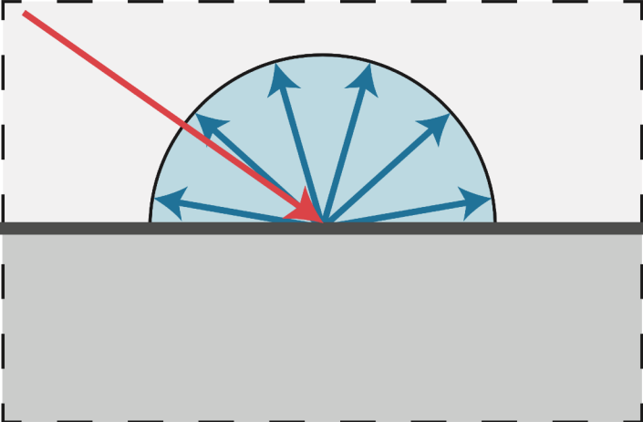
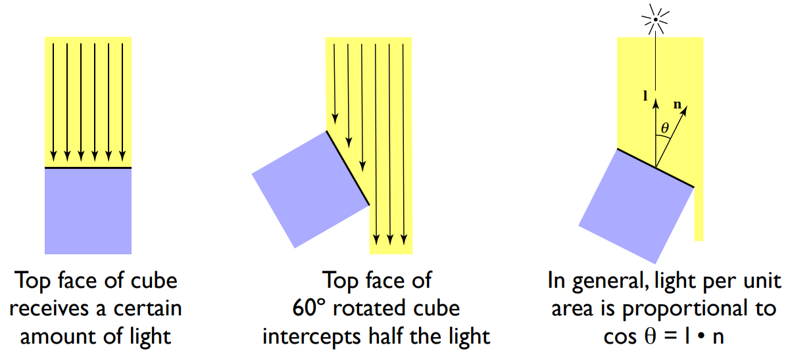

# 图形学的数学基础（二十五）：着色
渲染过程本质可以上分解为两个步骤:可见性测试和着色。光栅化和射线追踪都是用于解决可见性问题。本章我们将介绍渲染过程的第二部分:着色。着色是一个庞大的主题。一些用于着色的技术在数学上也很复杂。本章我们将学习最基本的着色模型: $Blinn-Phong\;Reflectance\;Model$

## $blinn-Phong\;Reflectance\;Model$
当我们观察一个物体时，可以明显的将物体的视觉表现分为三类：
- 高光：表现很亮的部分，并且会随着视角的变化而变化
- 漫反射部分：颜色变化不明显，表示物体本身的颜色或者diffuseTexture颜色。（物体表面吸收了部分光线，反射出的未被吸收的部分）
- 环境光：未被光照直接照亮的部分，**模拟间接光照**。在布林冯模型中简化为常量。这也是为什么布林冯模型被称为经验模型的原因。计算精确的间接光照需要$RayTracing$。

布林冯光照模型是一个经验模型。整体思想就是按照这三部分来建模的。布林冯光照模型是一个直接光照模型（或者叫局部光照/局部性），不考虑间接光照，即不考虑周围物体反射的光线对其产生的影响。着色权重仅考虑光源。（阴影及SSAO需要多个pass处理）

### 定义光照参数

要计算物体表面着色点光照结果，需要定义一些基本的参数。

- 观测方向（$view direction$）$\hat{v}$:着色点到观测点（相机）的单位矢量
- 光照方向（$light direction$）$\hat{l}$：着色点到光源的单位矢量
- 着色点法线（$normal$）$\hat{n}$：垂直于表面的矢量，用于描述表面（或着色点）的方向。
- 物体表面本身着色参数（漫反射颜色 高光颜色 粗糙度...）

### 漫反射（$Diffuse\;Reflection$）
当一根光线打到物体表面后，光线会被均匀的反射到不同的方向（其实这也是一种近似）。

#### $Lambert's\;cosine\;law$
当一束光到达物体表面时，物体朝向（法线方向）与光照方向的角度不同，得到的明暗也是不一样的，着色点法线与光线夹角越大，表面实际接收到的光线越少，**物体表面接收到的光照能量与着色点法线和光照夹角余弦成正比。**由于法线和光照方向均为单位向量。因此表面着色点接收到的能量正比于$\hat{n}\cdot\hat{l}$

#### $Lambert\;Shading$
我们知道球体表面积公式:$A = 4\pi{r^2}$对于点光源来说，假设点光源辐射的能量是均匀的。那么随着着色点和光源距离的增加，着色点接收到的能量就越少（距离增加导致球体表面积增大，而单位时间点光源辐射的能量是一样的，因此单位面积接收到的能量减少）。着色点接收到的能量与距离平方成反比。

漫反射分量$L_d = K_d\dfrac{E}{r^2}max(0, \hat{n}\cdot\hat{l})$
- Kd（漫反射系数）：光到达物体表面后，能量会被吸收一部分（不同材质的物体对不同波长的光线吸收率是不一样的），剩下的会被反射出来，漫反射系数即定义了不被物体所吸收的光照颜色（$diffuseColor$），即物体表现出的颜色。
- $\dfrac{E}{r^2}$：光照能量衰减系数，抵达物体表面的能量与光源和着色点距离平方成反比。
- $max(0,\hat{n}\cdot\hat{l})$:  $Lambert's\;cosine\;law$，表面着色点接收到的能量正比于$\hat{n}\cdot\hat{l}$。为了避免负值情况使用max做了最小值的限定。

$K_d$系数对漫反射表现得影响：

随着$K_d$的增加（吸收光线减少，反射光线增加），物体表现越来越明亮。

## 参考
[GAMES101 -现代计算机图形学入门-闫令琪](https://www.bilibili.com/video/BV1X7411F744?p=7&vd_source=b3b87210888ec87be647603921054a36)