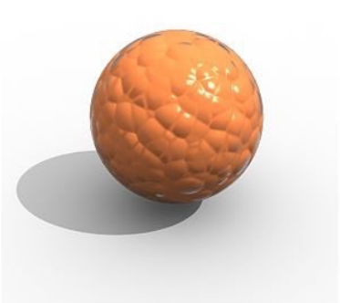
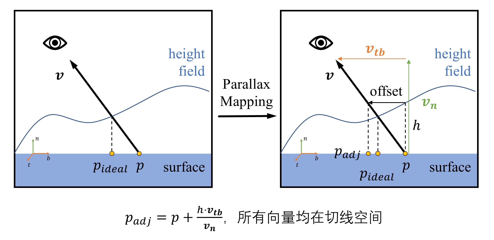
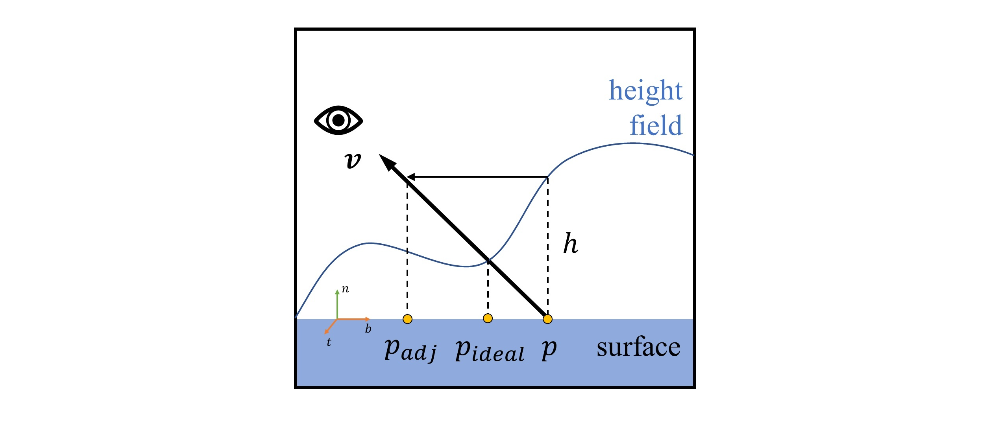
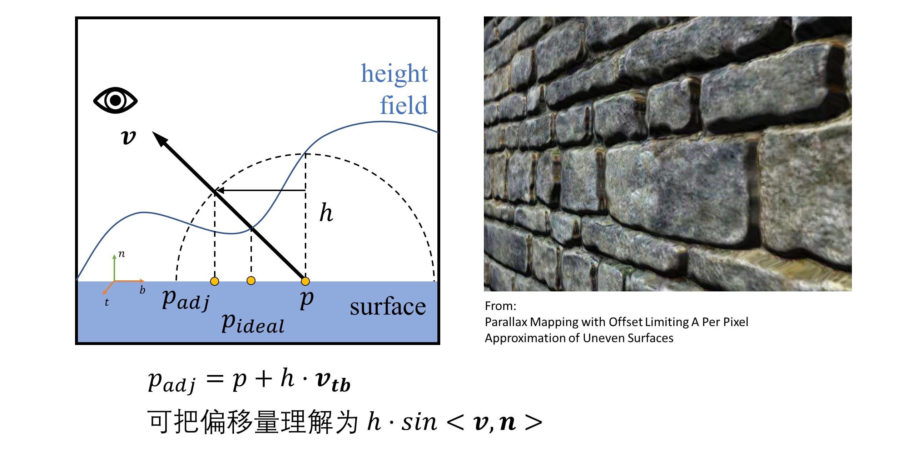
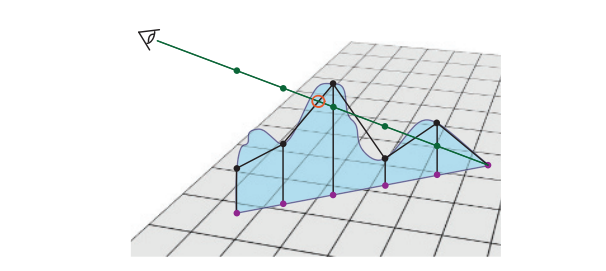
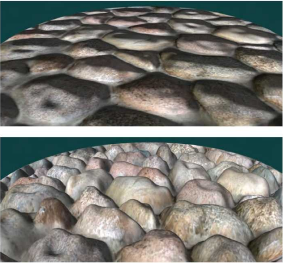
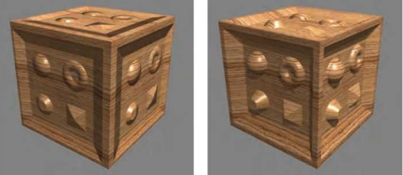
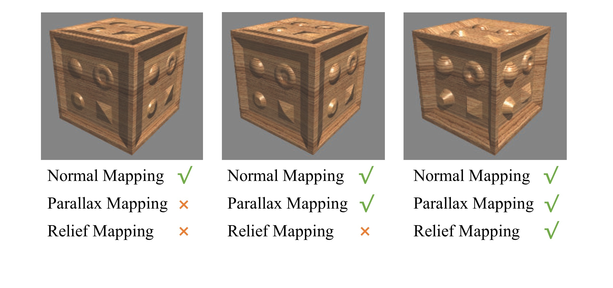
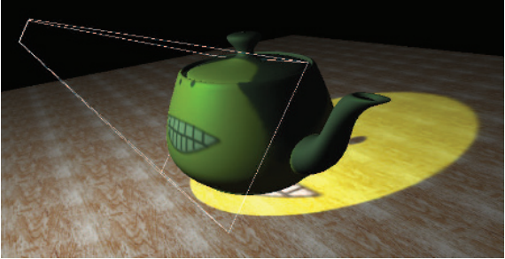

# 图形学的数学基础（二十七）：纹理应用(下)

上一章介绍了凹凸贴图,凹凸贴图可以用比较粗糙的mesh结构表达充满细节的几何体结构,凹凸贴图其实没有改变表面的几何结构,仅仅是通过法线的扰动影响了着色结果,因此产生的问题就是,在特定角度观察或者观察物体边缘或阴影时,问题就暴露出来了,这是因为没有考虑高程带来的视差和遮挡。因为mesh信息没有提供对应的深度变化，在$z-buffer$深度测试时，不会对被遮挡的顶点做
深度测试，因此不会产生应有的自遮挡现象。

## 视差贴图 （$Parallax\;Mapping$）
视差贴图解决了凹凸贴图带来的问题(凹凸贴图没有考虑自遮挡问题)，如下图当我们从相机观察到P点时，由于高程的存在，我们应该看到的是$p_ideal$处的着色，但实际上在凹凸贴图用的是p点的着色信息，所以看起来不够真实：

2001年，$Kaneko$引入了视差贴图的概念，并对其进行了改进并由$Welsh$普及。 视差是指
当观察者移动时，对象彼此相对移动。 随着观察者的移动，凹凸应该看起来有高度。 视差映射的关键思想是采用通过实时检查像素的高度来有根据地猜测应该在像素中看到什么（遮蔽现象）。

$Parallax\;Mapping$所需要的信息通常存储在一张高度场纹理($heightfield\;Texture$)中。当观察物体表面某一着色点时，首先会根据纹理查询该点对应的高度值，然后基于这个高度值和观察角度计算出一个偏移量$offset$，这个偏移量实际上就是$p$点的偏移量，即我们实际上应该看到的像素点$p_{adj}$，而不是$p$点。如上右图所示，所做的事情就是：根据$p$点的高程，以及 $v$的方向，对$p$点偏移一段距离到达$p_{adj}$，以接近$p_{ideal}$

$p_{adj} = p + \dfrac{h*v_{tb}}{v_n}$

当高程变化平缓时，这个方法表现很好，但当高程在p点出变化剧烈或者$v$与表面法线的角度很大时，就有可能导致$p_{adj}与p_{ideal}$相差很远，如下图所示：

为了解决这个问题，$Welsh$对此进行了改进：为了防止$p$点偏移的过于厉害， $Welsh$将偏移量限制在$h$范围内，此方法对于这种局部高程变化剧烈的撞墙图表现的很好：

如下图所示，光线有时会被更高的其他点的高程所遮挡，但是上面并没有考虑这一点：

一种类似于$Ray\;Marching$的思想，从$p$点出发，向前检查有限数量的点，看这些点的高程是否与光线相交，如果相交取交点最近的像素点，如$p_adj$，并用此处的光照去代替$p$点的光照信息。

## 浮雕贴图（$Relief\;Mapping$）
关于浮雕贴图，有人把它誉为凹凸贴图的极致，$Parallax\;Mapping$是针对$Normal\;Mapping$的改进，利用HeightMap进行了近似的TextureOffset，而$Relief\;Mapping$是精确的TextureOffset,所以表现上比较完美。

- 法线贴图和浮雕贴图的对比，法线贴图不发生子遮挡。

- 视差贴图和浮雕贴图的对比，浮雕贴可以实现更深的凹凸深度：

- 法线贴图，视差贴图 ，浮雕贴图三种效果对比：

## 改变表面结构
之前介绍的凹凸贴图，视差贴图，浮雕贴图，都只是在计算光照时对法线进行了扰乱，并没有修改表面结构。此处介绍的位移贴图（$Displacement\;Mapping$）则实际性地修改了表面结构，主要依赖于渲染管线的曲面细分。根据贴图中对三角形进行曲面细分，生成足够多更小的三角形，并对每个三角形的顶点位置都进行位移，实际上得到了更为精细的几何体。这种方法类似于法线贴图，位移贴图的每一个纹素中存储了一个向量，这个向量代表了对应顶点的位移。注意，此处的纹素并不是与像素一一对应，而是与顶点一一对应，因此，纹理的纹素个数与网格的顶点个数是相等的。在$vertexShader$阶段，获取每个顶点对应的纹素中的位移向量，施加到局部坐标系下的顶点上，然后进行世界视点投影变换即可。

## 改变光源($Textured\;Light$)
纹理还可以被用于增加光源的细节表现（图案等），允许改变复杂的光照分布。最简单的二维光源，类似投影仪的工作原理：把一张纹理放在聚光灯下投射过来，那么光照就带有各种图案：

## 参考

[图形学基础 - 纹理 - 纹理映射盘点](https://zhuanlan.zhihu.com/p/370927083)

[Real-Time Rendering]()

[《Real-Time Rendering 3rd》 提炼总结](https://github.com/QianMo/Game-Programmer-Study-Notes/blob/master/Content/%E3%80%8AReal-Time%20Rendering%203rd%E3%80%8B%E8%AF%BB%E4%B9%A6%E7%AC%94%E8%AE%B0/Content/BlogPost05/README.md)