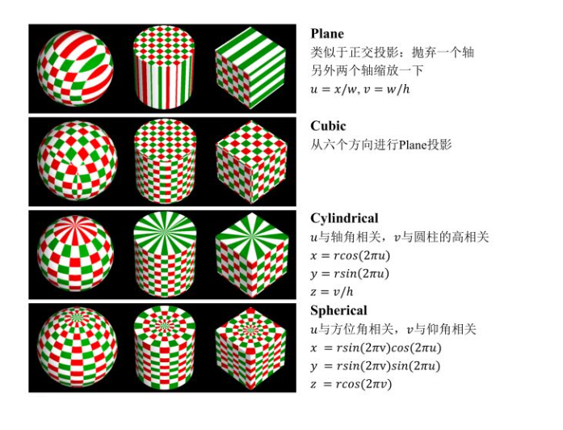
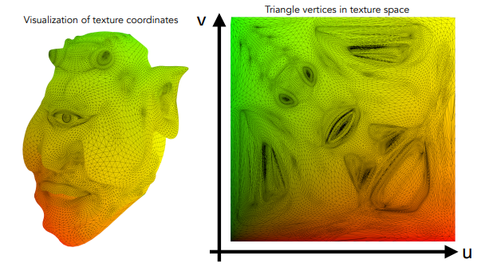
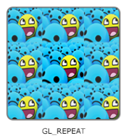
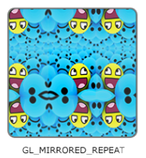
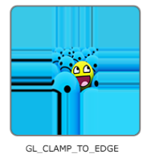

# 图形学的数学基础（二十六）：纹理映射

纹理映射 ($Texture Mapping$) 是一种将物体空间坐标点转化为纹理坐标，进而从纹理上获取对应点的值，以增强着色细节的方法。

纹理映射有以下四个步骤，但并不是每个都要使用，只是体现纹理映射可以被灵活操控，以获得我们想要的效果。

假设拥有三维模型空间到二维纹理空间的映射关系,只需要将每个顶点得颜色信息(漫反射系数)存储在二维得纹理(图片)上,在进行光照计算时根据**映射关系**查询每个顶点的漫反射系数。所有点计算完后，就好像整个纹理被贴到了物体表面一样。但是如何建立这种映射关系呢？接下来介绍两种方式。

## 投影映射-从物体坐标系到参数空间（$Projector\;and\;Mapping$）

### $Projector$
对于简单规则的几何体，通常用投影的方式。

这种将矩形地图纹理均匀贴到球面的投影函数称为：$Spherical$

此外还有Plane，Cubic，Cylindrical：

### $UV\;Mapping$
对于更复杂的物体，往往需要建模师精心制作，将三维顶点与二维纹理坐标一一对应。
在实时渲染中，通常将uv信息保存在顶点中，在三角形光栅化时，通过重心坐标插值的方式计算每个片元的uv坐标。再从纹理中采样获得对应值。把这个颜色信息作为该点的漫反射系数$K_d$。

## $纹理坐标（uv）$
在纹理空间之内任意一个二维坐标都在$[0,1]$之内（其实本质上表示的是百分比）。如下图右侧可视化纹理空间空间所示。u对应x轴（r），v对应y轴（g），因此我们看到的纹理空间是红绿色的样子。

## 变换函数-从参数空间到纹理空间（$Corresponder\;Function$）

在上一步中，我们将三维空间坐标映射到了**二维参数空间uv**。在此阶段可以做三件事：坐标范围处理、坐标自由变换、转到纹理空间。

### 坐标范围处理
通常拿到的uv都是在$[0, 1]$范围内的，但也有可能超出了范围。针对超出范围的值，有几种不同的处理方式，拿openGl举例来说，有以下四种方式来处理uv在$[0,1]$范围外的情况：

1. $Repeat$：纹理环绕默认行为，超出范围将重复纹理。

    

    $uv = mod(uv,vec2(1.0, 1.0))$

2. $Mirror$: 和$Repeat$相同，但是每次重复都会做镜像反转。

    

    $uv = abs(mod(uv,vec2(1.0, 1.0)) - 1.0)$

3. $Clamp\;To\;Edge$:将坐标限制在0和1之间。所有超出1的uv将被设置为1.造成边缘图案被拉伸的效果。
    
    

    $uv = clamp(uv,vec2(0.0, 0.0), vec2(1.0, 1.0))$

4. $Clamp\;To\;Border$:超出$[0,1]$范围uv坐标对应的片元使用用户自定义的颜色填充。

    

### 坐标自由变换
除了对这些超出范围的uv值处理，还可以对其施加“变换”，比如旋转，平移，缩放，比如想让纹理随着时间运动起来，那么就可以逐帧变换 uv值
但要注意的是：对uv坐标施加的变换矩阵，往往是实际想要变换的逆矩阵。
如：若想让纹理向右偏移 0.5 单位，那么则应该是 u – 0.5 而不是 u + 0.5。就好比是一个窗口去看这张纹理，uv 就是窗口，窗口向左移动，看起来就是纹理向右移动

### 变换到纹理空间
在对uv进行变换后，其值都落到了$[0, 1]$之间，这时只需要分别乘以纹理的宽高，就可以得到实际的纹理坐标。

## 纹理采样（$Texture\;Sampling$）
屏幕上每个单元我们称之为像素($Pixel$),与之相对应，纹理上的一个单元我们称为纹素($Texel$)。理想情况下，我们都希望每个像素和每个纹素是一一对应的。即纹理图片分辨率和屏幕分辨率一致，这样渲染的结果不会失真。只需要每个texel逐个读取即可。

