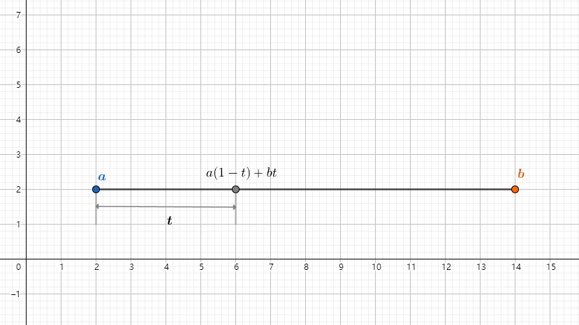
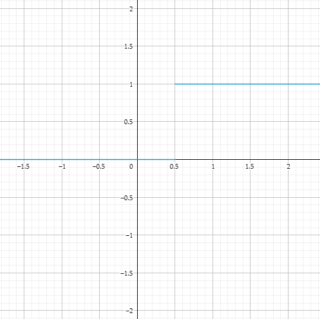
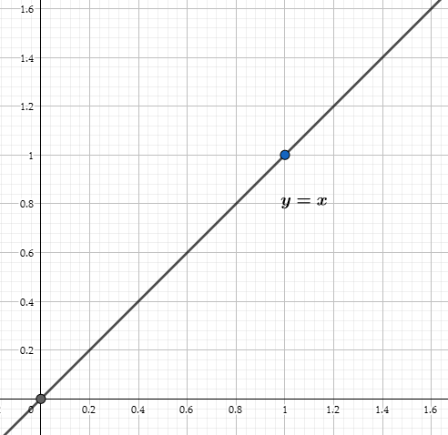
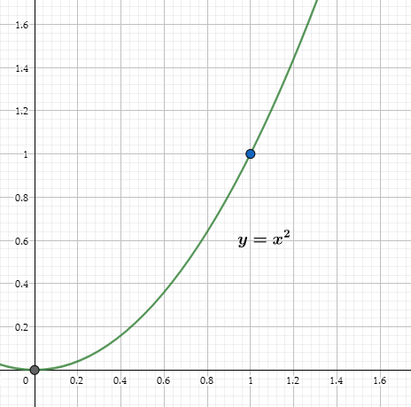
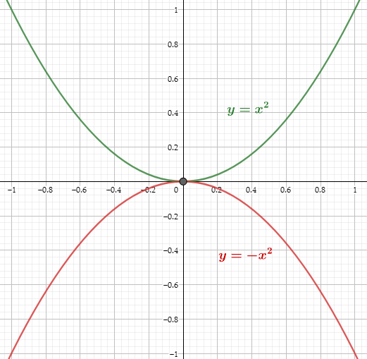
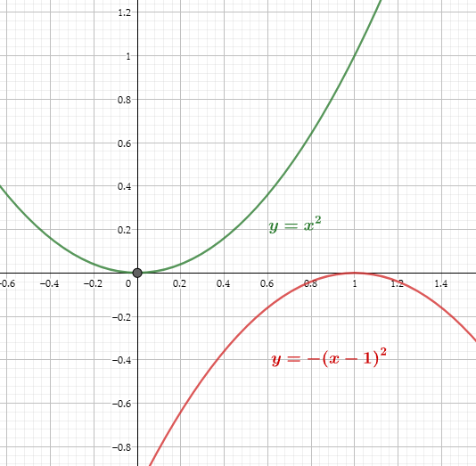
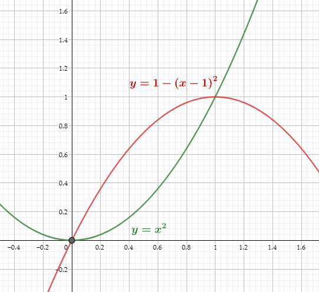

# 图形学的数学基础（二十四）：插值

## 线性插值（$Linear\;Interpolation$）
在图形学领域插值是一项广泛应用的技术，很多时候，数据是在规则网格上指定的（值写在 2D 或 3D 网格的顶点位置）或在一条线上（在 1D 情况下），但是程序需要计算任意一点的值。如果采样点刚好落在网格顶点处，那么可以读取数值直接使用，但是如果采样点落在其他地方，考虑到那里并没有存储数值，我们需要基于周围顶点计算数值。这种技术称为插值，因为其关键思想是“插值”，通过固定网格顶点的现有值计算网格上其他任意位置的值。

在二维中这种技术叫双线性插值，与之对应的三维插值称为三线性插值。“线性插值”是一种类似于以下形式的方程：

$a(1-t) +bt\;\;\;with\; 0 <=t\;<=\;1$

其他种种形式的线性插值都是以此为基础的。

插值技术通常用于图像处理（例如调整图像大小）。但是 3D 技术也可以使用 3D 或 2D 网格（纹理可以看作 2D 网格），例如流体模拟、体积渲染、纹理映射和辐照度缓存等等，无论何时涉及网格，通常也需要插值技术。

## 双线性插值（$Bilinear\;Interpolation$）
双线性插值是一种用于在二维规则网格中计算任意值的方法。此网格也可以是图像或纹理贴图。思路是取二维平面上周围最近的四个网格顶点作为参照，首先水平方向做两次线性插值，得到两个查之后的结果，根据这两个值，再垂直方向再做一次线性插值。即可拿到p点的值。

线性插值基本公式：

$lerp(t, v_0, v_1) = v_0 + t(v_1-v_0)$

计算x方向两次线性插值，得到a和b：

$a = C_{00} + s(C_{10} - C_{00})$

$b = C_{01} + s(C_{01} - C_{11})$

根据ab的值，再进行一次线性插值，计算p的值：

$p = a + t(b - a)$

这也是名称双线性插值的由来，总共做了两轮线性插值，水平方向上一轮，垂直方向上一轮。

## 双三次线性插值（$Bicubic\;Interpolation$）
双线性插值是采用周围临近4个点作为参照，而双三次线性插值是采用周围16个点。也被称为双三次插值算法。

$W(x) = \begin{cases}
    (a+2)|x|^3 - (a+3)|x|^2 +1 \;for\;|x| <= 1\\ 
    a|x|^3 - 5a|x|^2 + 8a|x|-4a\;for 1< |x| < 2\\ 
    0\;otherwise    
\end{cases}$

其中$a = -0.5$

## 三线性插值（$Trilinear\; Interpolation$）
三线性插值是双线性插值在三维空间的扩展。可以看作是两个双线性插值的“线性插值”。三线性插值双线性插值具有相同的有点和缺点，首先它非常简单，实现容易，速度也很快。但是它产生的结果不是非常平滑。然后对于体积渲染或流体模拟，需要在三维网格中处理大量插值时，它仍然是一个非常好的选择。

step1:

$a = C_{010}+t(C_{110} - C_{010})$

$b = C_{000}+t(C_{100} - C_{000})$

$c = C_{011}+t(C_{111} - C_{011})$

$d = C_{001}+t(C_{101} - C_{001})$

step2:

$e = b + s(a - b)$

$f = d + s(c - d)$

step3:

$p = e + w(f-e)$
## 阶梯函数($Step$)
$step$函数接受两个参数,一个边界值$edge$,一个输入变量$x$,当$x >= edge$时,返回1, 否则返回0。

函数图像如下:

## 平滑阶梯函数($SmoothStep$)

### 定义
$smoothStep$函数用来生成0到1的平滑过渡值.先看smoothStep函数实现:

### 数学推导
通过$smoothStep$函数定义,我们知道:

- $res = 3t^2 - 2t^3$
- $t = \dfrac{(x-a)}{(b-a)}$

接下来我们一步步通过函数图像来解释$smoothStep$背后的数学原理.
<1> 对于函数$y = x$这个函数,其实就是一条直线:

<2>对于函数$y = x^2$,可以看到它比$y = x$有一个更平滑的过渡:

但是我们发现$y = x^2$的函数图像仍然是不够“平滑的”，为什么呢？我们知道曲线的切线表示了这条曲线的变化率。通过观察我们明显发现，在0附近的变化率要低于1附近的变化率。

<3> $y = 1 - (x-1)^2$我们在$y = x^2$的基础上构造另外一条曲线.首先先将$下^2$反转.得到:

将$y = -x^2$向右移动一个单位得到:

然后再向上移动一个单位得到以下函数图像:

此时$y = 1- (x-1)^2$

可以看到我们构造的第二条曲线在接近1的部分开始变缓,和$y = x^2$从0开始变缓一样.因此我们将这两条曲线混合到一起即可以得到理想情况下的“平滑过渡”：

利用线性插值混合两条曲线：

$y = xf(x) + (1-x)g(x) = x(1-(x-1)^2) + (1-x)x^2 = 3x^2 - 2x^3$

最终形成的函数图像如下:

## 参考

[Scratchapixel](https://www.scratchapixel.com/lessons/mathematics-physics-for-computer-graphics/interpolation)

[GAMES101 -现代计算机图形学入门-闫令琪](https://www.bilibili.com/video/BV1X7411F744?p=15&vd_source=b3b87210888ec87be647603921054a36)

[SmoothStep函数/节点到底做了什么？](https://zhuanlan.zhihu.com/p/424589478)

