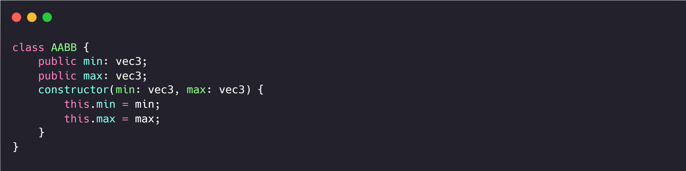
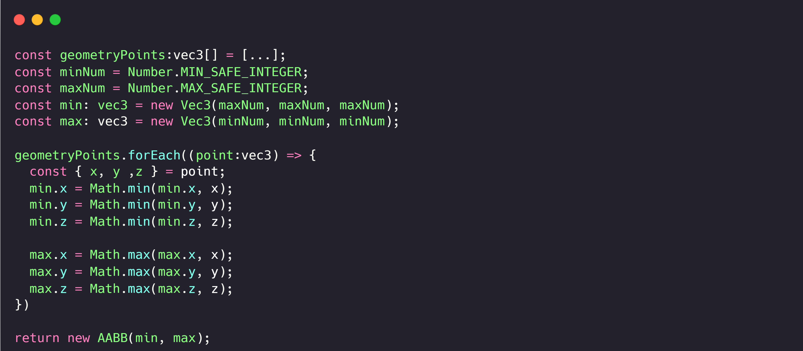

# 图形学的数学基础（二十）：包围盒($Bounding Box$)
包围盒是一种求解离散点集最优包围空间的算法,基本思想是用体积稍大且特性简单的集合体来近似代替复杂的几何对象。包围盒常用于几何物体的碰撞检测，ray-tracing中光线求交等。常用的包围盒有两种，$AABB与OBB$，AABB包围盒是轴对齐的，而$OBB$是任意定向的。

## $AABB$
$AABB$是$Axially\;Aligned\;Bounding\;Box$的缩写，三维$AABB$是一个简单的6面盒子，每一面都与一个主要平面平行，这个盒子不一定是立方体，盒子的长度宽度高度可以各自不同。

### 重要属性

几何体$AABB$包围盒内的点满足以下不等式：

$x_{min} <= x <= x_{max}$

$y_{min} <= y <= y_{max}$

$z_{min} <= z <= z_{max}$

两个具有特殊意义的点：

- 最小值：$\textbf{P}_{min} = [x_{min}, y_{min}, z_{min}]$

- 最大值：$\textbf{P}_{max} = [x_{max}, y_{max}, z_{max}]$

中心点可以通过最小值和最大值的中点计算得出：

$\textbf{c} = \dfrac{(\textbf{P}_{min} + \textbf{P}_{max})}{2}$

大小矢量($Size\;Vector$)$s$是从$\textbf{P}_{min}$到$\textbf{P}_{max}$的矢量，该矢量的三个分量分别代表了包围盒的长宽高信息。

### 表示法
一般情况下会使用$\textbf{P}_{min}$和$\textbf{P}_{max}$表示包围盒。

### 计算$AABB$
针对一组点计算$AABB$是一个很简单的过程，首先初始化min和max两个值，初始值分别设置为最大值和最小值，遍历点位集合，分别比较判断$min,max$的三个分量，将当前最小值赋给$min$最大值赋给$max$。

### 变换$AABB$
有时候我们需要将$AABB$从一个坐标空间转换为另一个坐标空间。假设在对象空间中有$AABB$,现在希望在世界空间中获得$AABB$,其中一种做法就是，可以基于变换后的几何体顶点，重新计算包围盒，但是针对复杂的几何体，顶点数量特别多，这种计算是相对昂贵的，因此在世界空间中获得$AABB$，就需要考虑变换对象空间的$AABB$。

### 光线与$AABB$求交

## $OBB$

