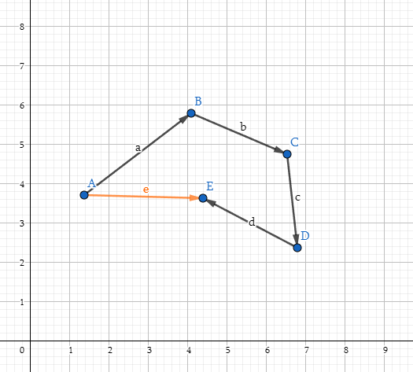
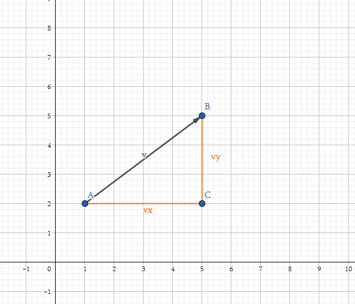
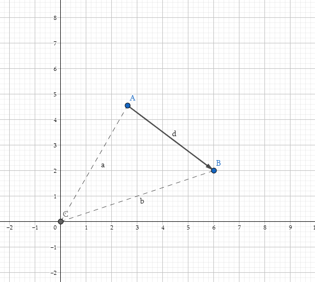

# 图形学的数学基础（二）：向量运算

## 标量和向量的乘法

### 公式
标量与向量的乘法，只需要用标量乘以矢量的每个分量即可。

$k\begin{bmatrix}x\\ y\\ z\end{bmatrix} = \begin{bmatrix}x\\ y\\ z\end{bmatrix}k = \begin{bmatrix}kx\\ ky\\ kz\end{bmatrix}$

### 几何意义
将向量乘以标量k具有将向量的长度按照因数|k|缩放的效果.例如为了使向量长度加倍,可以将向量乘以2;如果k < 0,则翻转向量的方向.

## 向量加法

### 公式
两个向量相加等于它们相应的分量相加得到的向量.向量不能和标量相加或者相减, 也不能和不同维度的向量进行加减运算.向量的减法可以理解为加一个负向量.

### 几何意义
我们可以按照几何形式将向量相加,方法是定位向量使得各向量的头尾相连, 然后绘制一条从第一条向量尾部到最后一条向量头部的向量,即为相加的结果向量.如下图:

$\vec{e} = \vec{a} + \vec{b} + \vec{c} + \vec{d}$

## 向量大小
向量的大小也成为向量的长度(Length)或范数(Norm),在数学中通常使用围绕向量的双垂直直线来表示.$||\mathbf{v}||$

### 公式
**向量的大小是向量分量的平方和的平方根.**

$||\mathbf{v}|| = \sqrt{\sum\limits_{i=1}^n{v_i}^2}$

### 几何意义
以二维向量为例, 任何向量v(除去0向量)可以形成一个直角三角形,其中v作为斜边,v向量的两个分量作为直角边.根据毕达哥拉斯定理,对于任何直角三角形,斜边的长度的平方等于另外两边长度的平方和.

$||\mathbf{v}|| = \sqrt{ {v_x}^2 + {v_y}^2}$

## 单位向量
对于许多向量,我们只关心其方向性,使用单位向量通常会很方便(点乘),单位向量是大小(Norm)为1的向量,单位向量也被称为归一化的向量($Normalized Vector$).

### 公式
对于任何非零向量,可以计算出指向v相同方向的单位向量,此过程称为向量的归一化(normalize).为了归一化向量,可以将向量除以其大小:

${v_i} = \dfrac{\mathbf{v}}{||\mathbf{v}||}$

### 几何意义
以二维向量为例,将单位向量尾部固定在原点,则向量头部将接触到以原点为中心的单位圆(半径为1).三维中,单位向量接触到的是单位球面(半径为1).

## 两点距离
两点之间的距离本质上是求从一点到另外一点向量的长度,根据向量的三角形法则.可以得到:

$\mathbf{d} = \mathbf{b} - \mathbf{a}$

$\mathbf{d} = \begin{bmatrix}b_x - a_x\\b_y - a_y\end{bmatrix}$

$\textbf{distance}(\mathbf{a},\mathbf{b}) = ||\mathbf{d}|| = \sqrt{ {d_x}^2 + {d_y}^2 }$
