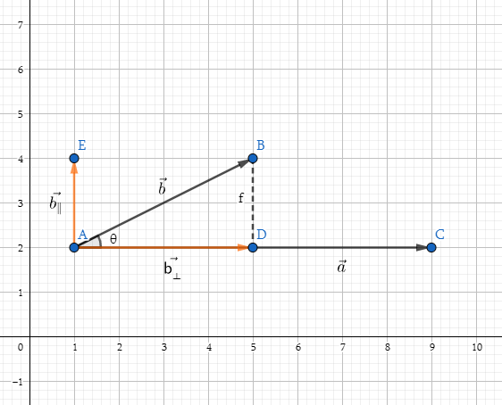
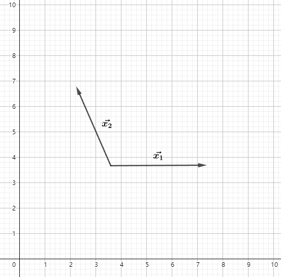

# 图形学的数学基础（二）：标准正交基/坐标系

## 标准正交基

对于三维空间任意三个向量,如果它们满足

- $||\vec{u}|| = ||\vec{v}|| = ||\vec{w}|| = 1$
- $\vec{u}.\vec{v} = \vec{v}.\vec{w} = \vec{u}.\vec{w} = 0$
- $\vec{w} = \vec{u} \times \vec{v}$ (右手系)

即向量长度都为1,相互垂直, 这样的三个向量构成的坐标系称为**标准正交基**,$\vec{u} ,\vec{v},\vec{w}$称为标准正交基的**基矢量**.

## 为什么需要标准正交基

定义这样的坐标系,带来的一点好处就是, 空间中任意一矢量,都可以分解到标准正交基的三个轴上,需要用到前边向量投影的相关知识. 即**矢量可以表示为基矢量的线性组合**.

$||\vec{b_⊥}|| = ||\vec{b}|| \cos\theta$

此时的$\vec{a}$为单位向量,即$||\vec{a}|| = 1$

因此 $||\vec{b_⊥}|| = ||\vec{b}||||\vec{a}|| \cos\theta = \mathbf{b}.\mathbf{a}$

重要结论:

$\vec{p} = (\vec{p}.\vec{u})\vec{u} + (\vec{p}.\vec{v})\vec{v} + (\vec{p}.\vec{w})\vec{w}$

$x = \vec{p}.\vec{u}$ 

$y = \vec{p}.\vec{v}$

$z = \vec{p}.\vec{w}$

**将三维矢量表示为基矢量的线性组合**

$\vec{p} = x\vec{u} + y\vec{v} + z\vec{w}$

## 多个坐标空间
在图形学中,我们经常发现需要使用多个坐标空间,例如世界空间, 对象空间, 相机空间等,定义多个坐标空间有什么意义?毕竟坐标系可以无限延伸,可以表达我们想要的任何东西.原因就在于,某些信息仅在特定的上下文环境(坐标系)中才是有意义的.这样做可以为开发提供很多便利.

### 世界空间
世界坐标系($World Coordinate System$)是一个特殊的坐标系,它为所有其它要指定的坐标系建立了一个"全局"参考系.换句话说,我们可以用世界坐标空间来表达其它坐标空间的位置,但是我们不能用更大的外部坐标空间来表示世界坐标空间.
**非技术意义上, 世界坐标系建立了我们关心的"最大"坐标系,大多数情况下,它实际上并不是整个世界,而是由我们定义的.**

### 对象空间
对象空间($Object Space$)是与特定对象关联的坐标空间,每个对象都有自己独立的对象空间.当一个对象移动或者改变方向,与该对象关联的对象坐标空间被随之携带.因此它也会移动或改变方向.
在图形学中,对象空间也被称为模型空间, 因为模型顶点的坐标是相对于模型空间来表示.

### 相机空间
相机空间($Camera Space$)中, 相机位于原点, +x指向右侧, +z指向前方(指向屏幕),+y指向"向上"(此处按照左手系约定),如果右手系,则-z指向屏幕方向.

### 直立空间
对象的直立空间是是世界空间与其对象空间之间的"过渡",因为直立空间的轴线与世界空间的轴线平行,而直立空间的原点则于与对象空间的原点重合.

图片来源《3D Math Primer for Graphics and Game Development, 2nd Edition》

**因此通过旋转可以实现直立空间和对象空间的转换,通过平移可以实现世界空间和直立空间的转换(lookAt矩阵)**

## 标准正交基
在很多情况下，例如在计算相机的lookAt矩阵中，由于传入的$\mathbf{direction}$ $\mathbf{up}$ $\mathbf{right}$三个基向量不一定是归一化的，需要对三个向量进行正交化处理，这样才能组成标准正交基。
本文将介绍两种常见的矢量正交化方法。施密特正交化和矢量叉积。

## 施密特正交化

施密特正交化是求欧几里得空间正交基的一种方法.从欧式空间任意线性无关的向量组$\mathbf{\alpha_1},\mathbf{\alpha_2},...,\mathbf{\alpha_m}$出发，求得正交向量组 $\mathbf{\beta_1},\mathbf{\beta_2},...,\mathbf{\beta_m}$,再将正交向量组中每个向量归一化，得到一个标准正交向量组，这种方法称为施密特正交化。

### 计算方法
如果$\vec{x_1},\vec{x_2},...\vec{x_n}$是某向量空间的基，那么可以通过以下公式找到该向量空间中的n个两两正交的向量$\vec{v_1},\vec{v_2},...\vec{v_n}$

### 推导
施密特正交化主要利用了矢量点积的投影性质，可以将矢量分解为平行和垂直两个矢量。以下我们分别以二维向量空间和三维向量空间为例详细介绍施密特正交化的推导过程。

#### 二维向量空间的推导
1. 假设二维空间的任意向量$\vec{x_1}$ $\vec{x_2}$

2. 任选其一作为$\vec{v_1}$,比如$\vec{x_1}$.利用向量点积，将$\vec{x_2}$在$\vec{v_1}$上投影。得到$\vec{x_⊥}$，根据向量的三角形法则，$\vec{x_∥} = \vec{x_2} - \vec{x_⊥}$即为要求的$\vec{v_2}$

$\vec{v_1} = \vec{x_1}$

$\vec{x_⊥} = \dfrac{\vec{x_2}.\vec{v_1}}{||\vec{v_1}||} \hat{v_1} = \dfrac{\vec{x_2}.\vec{v_1}}{\vec{v_1}.\vec{v_1}} \hat{v_1}||\vec{v_1}|| = \dfrac{\vec{x_2}.\vec{v_1}}{\vec{v_1}.\vec{v_1}}\vec{v_1}$

$\vec{v_2} = \vec{v_∥} = \vec{x_2} - \vec{x_⊥} = \vec{x_2} - \dfrac{\vec{x_2}.\vec{v_1}}{\vec{v_1}.\vec{v_1}}\vec{v_1}$

$\hat{v_1} = \dfrac{\vec{v_1}}{||\vec{v_1}||}$

$\hat{v_2} = \dfrac{\vec{v_2}}{||\vec{v_2}||}$

#### 三维向量空间的推导
三维向量空间的正交化推导与二维空间类似，假设三维空间的任意向量 $\vec{x_1}$ $\vec{x_2}$ $\vec{x_3}$.
先任选两个向量做二维空间的正交化，例如$\vec{x_1}$ $\vec{x_2}$,得到$\hat{v_1}$,$\hat{v_2}$.
将 $\vec{x_3}$在$\hat{v_1}$,$\hat{v_2}$所张成的二维平面上投影，得到$\vec{x_3⊥}$，由于$\vec{x_3⊥}$在$\hat{v_1}$,$\hat{v_2}$的张成平面上，所以$\vec{x_3⊥}$是$\hat{v_1}$,$\hat{v_2}$的线性组合。

$\vec{x_3⊥} = k_1\hat{v_1} + k_2\hat{v_2}$

$\vec{v_3} = \vec{x_3} - \vec{x_3⊥}$

$\vec{v_3} = \vec{x_3} - k_1\hat{v_1} - k_2\hat{v_2}$

由于$\vec{v_3}$垂直于$\hat{v_1}$和${\hat{v_2}}$, $\hat{v_1}$,${\hat{v_2}}$正交，因此：

$ \vec{v_3}.\hat{v_1} = 0$

$\vec{v_3}.\hat{v_2} = 0$

$\hat{v_2}.\hat{v_1} = 0$

由此可以推导出：

$\vec{v_3}.\hat{v_1} = (\vec{x_3} - k_1\hat{v_1} - k_2\hat{v_2}).\hat{v_1} = 0$

$\vec{x_3}.\hat{v_1} - k_1\hat{v_1}.\hat{v_1} - k_2\hat{v_2}.\hat{v_1} = 0 $

$\vec{x_3}.\hat{v_1} - k_1\hat{v_1}.\hat{v_1} = 0 $

$k_1 = \dfrac{\vec{x_3}.\hat{v_1}}{\hat{v_1}.\hat{v_1}}$

同理可得出： $k_2 = \dfrac{\vec{x_3}.\hat{v_2}}{\hat{v_2}.\hat{v_2}}$

$\vec{v_3} = \vec{x_3} - k_1\hat{v_1} - k_2\hat{v_2} = \vec{x_3} - \dfrac{\vec{x_3}.\hat{v_1}}{\hat{v_1}.\hat{v_1}}\hat{v_1} - \dfrac{\vec{x_3}.\hat{v_2}}{\hat{v_2}.\hat{v_2}}\hat{v_2}$

## 向量叉乘
假设三维空间中的三个向量$\vec{x_1}$ $\vec{x_2}$ $\vec{x_3}$.下边我们使用向量叉乘的方法对对其正交化。

- 任选其一作为$\vec{v_1}$,例如$\vec{x_1}$ 

    $\vec{v_1} = \vec{x_1}$
- 任选另外两个向量其一和$\vec{v_1}$叉乘例如$\vec{v_1} \times \vec{x_2}$ 得到$\vec{v_3}$
 
     $\vec{v_3} = \vec{v_1} \times \vec{x_2}$
     
- 用$\vec{v_3}和\vec{v_1}$叉乘得到$\vec{v_2}$

    $\vec{v_2} = \vec{v_3} \times \vec{x_1}$
    
- $\hat{v_1} = \dfrac{\vec{v_1}}{||\vec{v_1}||}$  $\hat{v_2} = \dfrac{\vec{v_2}}{||\vec{v_2}||}$  $\hat{v_3} = \dfrac{\vec{v_3}}{||\vec{v_3}||}$

至此通过以上几个步骤，完成了矢量的正交化。

## 引用
[如何理解施密特正交化](https://zhuanlan.zhihu.com/p/485838766)
      
