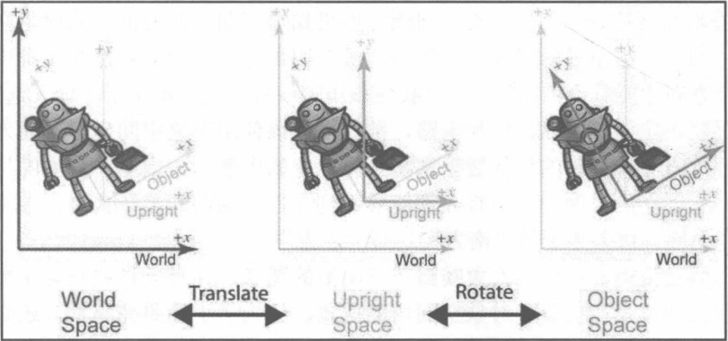

# 图形学的数学基础（五）：标准正交基/坐标系

## 标准正交基

对于三维空间任意的三个矢量,如果它们满足

- $||\vec{u}|| = ||\vec{v}|| = ||\vec{w}|| = 1$
- $\vec{u}.\vec{v} = \vec{v}.\vec{w} = \vec{u}.\vec{w} = 0$
- $\vec{w} = \vec{u} \times \vec{v}$ (右手系)

即矢量的长度都为1,相互垂直, 这样的三个矢量构成的坐标系称为**标准正交基**,$\vec{u} ,\vec{v},\vec{w}$称为标准正交基的**基矢量**.

## 为什么需要标准正交基

定义这样的坐标系,带来的一点好处就是, 空间中任意一矢量,都可以分解到标准正交基的三个轴上,需要用到前边向量投影的相关知识. 即**矢量可以表示为基矢量的线性组合**.

$||\vec{b_⊥}|| = ||\vec{b}|| \cos\theta$

此时的$\vec{a}$为单位向量,即$||\vec{a}|| = 1$

因此 $||\vec{b_⊥}|| = ||\vec{b}||||\vec{a}|| \cos\theta = \mathbf{b}.\mathbf{a}$

重要结论:

$\vec{p} = (\vec{p}.\vec{u})\vec{u} + (\vec{p}.\vec{v})\vec{v} + (\vec{p}.\vec{w})\vec{w}$

$x = \vec{p}.\vec{u}$ 

$y = \vec{p}.\vec{v}$

$z = \vec{p}.\vec{w}$

**将三维矢量表示为基矢量的线性组合**

$\vec{p} = x\vec{u} + y\vec{v} + z\vec{w}$

## 多个坐标空间
在图形学中,我们经常发现需要使用多个坐标空间,例如世界空间, 对象空间, 相机空间等等,为什么需要很繁琐地定义多个坐标空间?毕竟坐标系可以无限延伸,可以表达我们想要的任何信息.原因就在于,某些信息仅在特定的上下文环境(坐标系)中才是有意义的或者说可以用的.这样做,可以为开发提供很多便利.

### 世界空间
世界坐标系(World Coordinate System)是一个特殊的坐标系,它为所有其它要指定的坐标系建立了一个"全局"参考系.换句话说,我们可以用世界坐标空间来表达其它坐标空间的位置,但是我们不能用更待的外部坐标空间来表示世界坐标空间.
**非技术意义上, 世界坐标系建立了我们关心的"最大"坐标系,大多数情况下,它实际上并不是整个世界,而是由我们定义的.**

### 对象空间
对象空间(Object Space)是与特定对象关联的坐标空间,每个对象都有自己独立的对象空间.当一个对象移动或者改变方向,与该对象关联的对象坐标空间被随之携带.因此它也会移动或改变方向.
在图形学中,对象空间也被称为模型空间, 因为模型顶点的坐标以模型空间表示.

### 相机空间
相机空间中, 相机位于原点, +x指向右侧, +z指向前方(指向屏幕),+y指向"向上"(此处按照左手系约定),如果右手系,则-z指向屏幕方向.

### 直立空间
对象的直立空间是是世界空间与其对象空间之间的"过渡",因为直立空间的轴线与世界空间的轴线平行,而直立空间的原点则于与对象空间的原点重合.

图片来源《3D Math Primer for Graphics and Game Development, 2nd Edition》

**因此通过旋转可以实现直立空间和对象空间的转换,通过平移可以实现世界空间和直立空间的转换(lookAt矩阵)**
      
