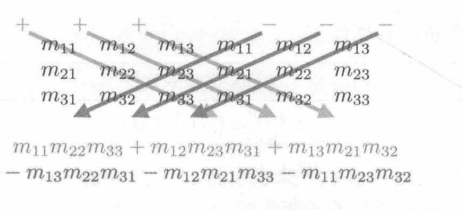
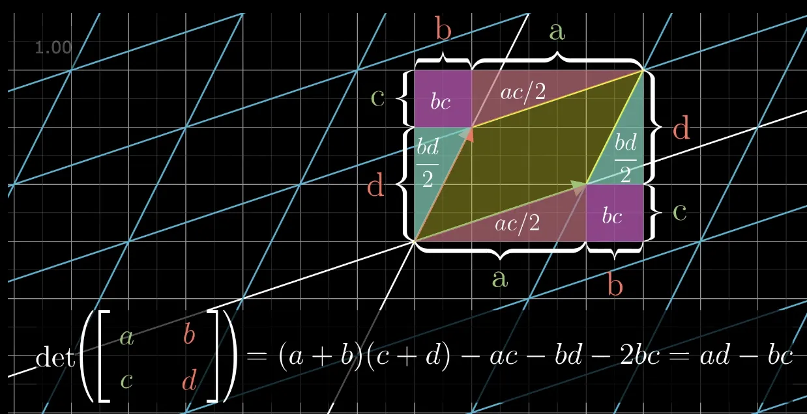

# 图形学的数学基础（五）：矩阵进阶

## 行列式

对于方形矩阵，有一个特殊的标量称为矩阵的行列式（$Determinant$。方形矩阵$\textbf{M}$的行列式表示为$|\textbf{M}|$,也表示为“det M”。非方形矩阵的行列式是未定义的。

### $2\times 2$和$3\times 3$矩阵的行列式

$2\times 2$矩阵行列式：

$\begin{vmatrix}M\end{vmatrix} = \begin{vmatrix}m_{11}&m_{12}\\ m_{21}&m_{22}\end{vmatrix} = m_{11}m_{22} - m_{12}m_{21}$

$3\times 3$矩阵行列式：

$\begin{vmatrix}M\end{vmatrix} = \begin{vmatrix}m_{11}&m_{12}&m_{13}\\ m_{21}&m_{22}&m_{23}\\ m_{31}&m_{32}&m_{33}\end{vmatrix} = m_{11}m_{22} - m_{12}m_{21} = m_{11}m_{22}m_{33} + m_{12}m_{23}m_{31} + m_{13}m_{21}m_{32} - m_{13}m_{22}m_{31} - m_{12}m_{21}m_{33} - m_{11}m_{23}m_{32} = m_{11}(m_{22}m_{33} - m_{23}m_{32}) + m_{12}(m_{23}m_{31} - m_{21}m_{33}) + m_{13}(m_{21}m_{32} - m_{22}m_{31})$

如果将$X\times 3$矩阵的行解释为3个向量，那么该矩阵的行列式等价于3个向量的三重积。

$\begin{vmatrix}
    a_x&a_y&a_z\\ b_x&b_y&b_z\\ c_x&c_y&c_z
\end{vmatrix}$ = $(a_yb_z -a_zb_y)c_x + (a_zb_x - a_xb_z)c_y + (a_xb_y - a_yb_x)c_z = (\mathbf{a}\times \mathbf{b})\cdot \mathbf{c}$

### 子矩阵行列式($Minor$)和余子式($Cofactor$)

### 子矩阵行列式
假设$\textbf{M}$具有$r$行和$c$列的矩阵，考虑通过$\textbf{M}$中删除行i和列j而获得的矩阵。该矩阵具有r-1行和c-1列。这个矩阵的行列式表示为$\textbf{M}^{ij}$,被称为$\textbf{M}$的子矩阵行列式。

#### 余子式
给定行和列的方形矩阵$\textbf{M}$的余子式与相应的子矩阵行列式相同，但余子式会交替变负，正负取决于因子$(-1)^{i + j}$.矩阵的余子式用来计算$n\times n$任意维度矩阵的行列式。

$C^{ij} = (-1)^{i+j}M^{ij}$

我们使用$C^{ij}$表示行i列j中的$\textbf{M}$的余子式。
+&-&+&-&...\\ 
$\begin{bmatrix}
    +&-&+&-&...\\ -&+&-&+&...\\ +&-&+&-&...\\  -&+&-&+&...\\ ...&...&...&...&...
\end{bmatrix}$

### 行列式的数学定义
对于任意维度$n\times n$矩阵的行列式，可以通过它的余子式计算。这个定义是递归的，因为**余子式本质上是有符号的行列式**。首先从矩阵中任意选择一行或一列。对于行或列中的每个元素，将此元素乘以相应的余子式，对这些乘积求和可得出最终的行列式：

$\begin{vmatrix}
    \textbf{M}
\end{vmatrix} = \sum\limits_{j=1}^n{m_{ij}C^{ij}} = \sum\limits_{j=1}^n{m_{ij}(-1)^{i + j}M^{ij}}$

### 性质

．任何维度的单位矩阵行列式为1：$\begin{vmatrix}I\end{vmatrix} = 1$

．矩阵乘积的行列式等于矩阵行列式的乘积：　$\begin{vmatrix}AB\end{vmatrix} = \begin{vmatrix}A\end{vmatrix}\begin{vmatrix}B\end{vmatrix}$

. 矩阵转置的行列式等于原始矩阵行列式：$\begin{vmatrix}M^T\end{vmatrix} = \begin{vmatrix}M\end{vmatrix}$
. 如果矩阵中的任何行或者列包含全0元素，则该矩阵的行列式为0
. 交换任意行会让行列式变负

### 几何解释
**在几何上行列式表示了当前变换矩阵对空间的压缩或者拉伸程度。**。即经过一次变换后，空间被压缩或者拉伸了多少。二维中，行列式等于具有基向量作为两条边的平行四边形的有符号面积。三维中，行列式是平行六面体的体积。

## 逆矩阵（Inverse）

对于方形矩阵来说，另一个重要运算是逆矩阵。方形矩阵$\textbf{M}$的逆矩阵表示为$\textbf{M}^{-1}$.

并非所有矩阵都有逆矩阵。如果某个矩阵有逆矩阵，则称其为可逆或者非奇异（$Nonsingular$）矩阵。没有逆的矩阵被认为是不可逆或奇异矩阵。**可逆矩阵的列是先行独立的，列也如此。奇异矩阵的行和列是线性相关的。**

奇异矩阵的行列式为零。非奇异矩阵的行列式为非零。一般情况下检查行列式的大小是最常用的可逆性测试。但是也有极端情况，本文对此暂不讨论。

### 数学定义

#### 经典伴随矩阵（$Classical\;Adjoint$）
本小节会实用经典伴随矩阵的方法，计算矩阵的逆。
**矩阵$\textbf{M}$的经典伴随矩阵，表示为“adj M”,被定义为$\textbf{M}$的余子式的矩阵的转置**

$adj M(3\times 3) = \begin{bmatrix}
    C^{11}&C^{12}&C^{13}\\ 
    C^{21}&C^{22}&C^{23}\\ 
    C^{31}&C^{32}&C^{33}
\end{bmatrix}^T$

**矩阵的逆等于经典伴随矩阵除以行列式**

$\textbf{M}^{-1} = \dfrac{adj\;M}{\begin{vmatrix}
    \textbf{M}
\end{vmatrix}}$

注：上式同时也证明了，矩阵行列式为0，则不可逆，其实也可以从几何角度做出解释，行列式为0，表示空间至少被压缩了一个维度,因此无法从低维度恢复到高纬度，因为不是1对1的关系。

### 性质
1. 矩阵逆矩阵的逆等于原始矩阵：$(\textbf{M}^{-1})^{-1} = \textbf{M}$
2. 矩阵转置的逆等于矩阵逆的转置：$(\textbf{M}^T)^{-1} = (\textbf{M}^{-1})^T$
3. 矩阵乘积的逆等于矩阵逆的乘积：$(\textbf{AB})^{-1} = \textbf{B}^{-1}\textbf{A}^{-1}$
4. 逆矩阵的行列式是原矩阵行列式的倒数：$\begin{vmatrix}M^{-1}\end{vmatrix} = \dfrac{1}{\begin{bmatrix}M\end{bmatrix}}$

### 几何解释
从几何视角来看，逆矩阵通常代表了“反向”或“撤销”操作。

## 正交矩阵（$Orthogonal\;Matrix$）

### 数学定义

当且仅当矩阵及其转置乘积是单位矩阵时，方形矩阵$\textbf{M}$才是正交的。定义如下：

$M是正交矩阵  <=>  \textbf{M}\textbf{M}^T = \textbf{I}$

根据逆矩阵的定义，矩阵与其逆相乘等于单位矩阵（$\textbf{M}\textbf{M}^{-1} = \textbf{I}$）,因此，**如果矩阵是正交的，则其转置矩阵等于其逆矩阵**

$M是正交矩阵  <=>  \textbf{M}^T = \textbf{M}^{-1}$

利用正交矩阵的这一特性,可以轻易得到矩阵的逆,只要证明其是正交矩阵即可,这样就避免了复杂的的逆矩阵计算过程(使用转置矩阵即可)。图形学中有很多正交矩阵，例如旋转矩阵和反射矩阵都是正交的。

### 几何解释
在很多情况下，我们可能会获得矩阵构造方式的信息，因此可以先验地知道矩阵仅包含旋转或反射。但如果事先对矩阵一无所知，如何判断矩阵的正交性呢？

根据正交矩阵的定义可知：

$M是正交矩阵  <=>  \textbf{M}\textbf{M}^T = \textbf{I}$

$\begin{bmatrix}m_{11}&m_{12}&m_{13}\\ m_{21}&m_{22}&m_{23}\\ m_{31}&m_{32}&m_{33}\end{bmatrix}\begin{bmatrix}m_{11}&m_{21}&m_{31}\\ m_{12}&m_{22}&m_{32}\\ m_{13}&m_{23}&m_{33}\end{bmatrix} = \begin{bmatrix}1&0&0\\ 0&1&0\\ 0&0&1\end{bmatrix}$

设以下向量$\mathbf{r_1},\mathbf{r_2},\mathbf{r_3}$代表$\textbf{M}$的行：

$\textbf{M} = \begin{bmatrix}-&r_1&-\\ -&r_2&-\\ -&r_3&-\\ \end{bmatrix}$

简化上述矩阵和转置相乘的表达式可得：

$\mathbf{r_1}\cdot\mathbf{r_1} = 1\;\;\;\;\;\;\mathbf{r_1}\cdot\mathbf{r_2} = 0\;\;\;\;\;\;\mathbf{r_1}\cdot\mathbf{r_3} = 0$

$\mathbf{r_2}\cdot\mathbf{r_1} = 0\;\;\;\;\;\;\mathbf{r_2}\cdot\mathbf{r_2} = 1\;\;\;\;\;\;\mathbf{r_2}\cdot\mathbf{r_3} = 0$

$\mathbf{r_3}\cdot\mathbf{r_1} = 0\;\;\;\;\;\;\mathbf{r_3}\cdot\mathbf{r_2} = 0\;\;\;\;\;\;\mathbf{r_3}\cdot\mathbf{r_3} = 1$

通过上述式子我们推导出正交矩阵需要满足以下几个条件：

1. 当且仅当向量为单位向量时，向量与自身的点积才为1。 因此$\mathbf{r_1},\mathbf{r_2},\mathbf{r_3}$为单位向量。即矩阵的每一行必须是单位向量。
2. 当且仅当两个向量相互垂直时，点积才为0， 因此$\mathbf{r_1},\mathbf{r_2},\mathbf{r_3}$相互垂直，即矩阵的行相互垂直。

**结论： 当且仅当矩阵每一行都为单位向量且相互垂直的矩阵才是正交矩阵。可以对矩阵的列做同样的描述。因为如果$\textbf{M}$是正交的，$\textbf{M}^T$必然也是正交的。**

### 矩阵的正交化

用于构造一组标准正交基向量的算法是$Gram-Schmidt$正交化。基本思想是按顺序遍历基向量。对每个基向量，减去与基向量平行的向量，这必然会产生垂直向量，具体推导细节可以参考之前的文章。

$\textbf{Gram-Schmidt}\begin{cases}
    \vec{v_1} = \vec{x_1}\\ 
    \vec{v_2} = \vec{v_∥} = \vec{x_2} - \vec{x_⊥} = \vec{x_2} - \dfrac{\vec{x_2}.\vec{v_1}}{\vec{v_1}.\vec{v_1}}\vec{v_1}\\ 
    \vec{v_3} = \vec{x_3} - k_1\hat{v_1} - k_2\hat{v_2} = \vec{x_3} - \dfrac{\vec{x_3}.\hat{v_1}}{\hat{v_1}.\hat{v_1}}\hat{v_1} - \dfrac{\vec{x_3}.\hat{v_2}}{\hat{v_2}.\hat{v_2}}\hat{v_2}
\end{cases}$
